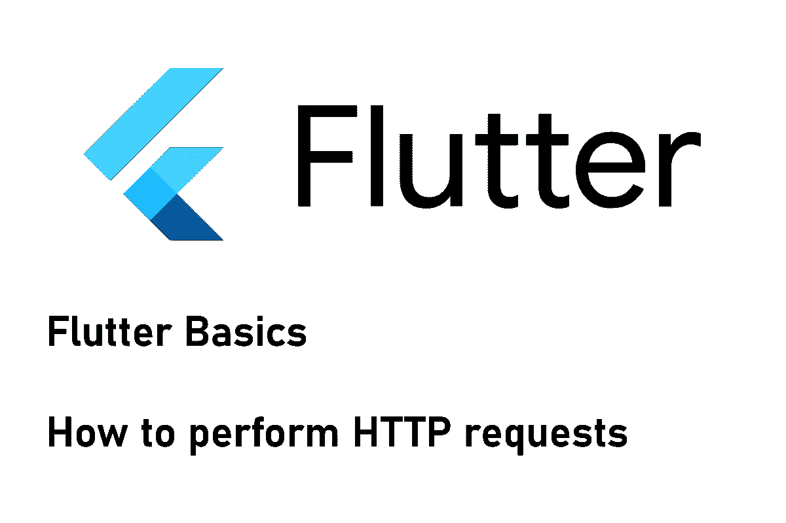

# 如何用 Flutter 发出 HTTP 请求并解析 JSON 结果数据

> 原文：<https://levelup.gitconnected.com/how-to-make-http-requests-with-flutter-and-parse-json-result-data-ae1f5794f53>

## 利用 REST APIs

## 这篇短文展示了如何从 Flutter 应用程序中执行 HTTP 请求。我们来看看最常见的请求类型 GET、POST、PUT 和 DELETE。

执行 HTTP 请求是现在每个 app 的必备。在本文中，我将向您展示如何将这一功能添加到您的 Flutter 应用程序中。我们将看一下完成这个任务的两个包:http 包和 dio 包。它们非常相似，你可以使用你更喜欢的任何东西。最后，我们将重点放在解析来自请求的 JSON 结果，以便数据可以在我们的应用程序中使用。

如果你对安装第三方软件包不熟悉，可以看看我写的关于这个主题的文章。

 [## 如何在你的 Flutter 应用中安装包

### 这篇短文展示了如何将包添加到一个 Flutter 应用程序中，这样你就可以使用现有的代码并加速…

xeladu.medium.com](https://xeladu.medium.com/how-to-install-packages-in-your-flutter-app-e7f7e62711ee) 

## HTTP 包

使用 http 包非常简单。通过在顶部添加
`import 'package:http/http.dart'`将其导入到您的文件中。然后您可以访问所有需要的 http 函数。参见下面的用法示例。

您可以看到方法`GET`、`POST`、`PUT`和`DELETE`的例子。这些是最常见的，所以我们将重点放在他们身上。

每个调用都返回一个包含请求执行细节的`Response`对象。它包含类似`statusCode`、`contentLength,`或`reasonPhrase`的属性，以防出现故障。关于状态代码的细节将在下一节讨论。

`response.body`包含一个带有请求返回值的字符串。要用它做一个镖`Map<String, dynamic>`，使用`jsonDecode`功能。

## DIO 套餐

Dio 非常类似于 http 包。首先用`import 'package:dio/dio.dart'`导入。然后你可以访问

每个调用都返回一个带有请求执行细节的`Response`对象。包含`statusCode`、`headers,`或`statusMessage`等属性，以备故障时使用。关于状态代码的细节将在下一节讨论。

`response.data`包含一个带有请求返回值的动态对象。要用它做一个飞镖`Map<String, dynamic>`，你只需要用`as`操作符把它转换成那个类型。

## HTTP 状态代码

为了验证请求的正确执行，您可以评估返回响应的状态代码。在调试应用程序时，这给了你一个很好的提示(有时甚至是确切的错误)。所有状态代码的完整列表可以在 [Mozilla 开发者网络](https://developer.mozilla.org/en-US/docs/Web/HTTP/Status)找到。我来介绍一下最常见的。

简单规则:200–299✅，其他都是❌

**200 OK**请求成功。任何方法都可以返回这个代码。

**201 创建**
请求成功，新的资源被创建。通常由`POST`或`PUT`请求返回。

**204 无内容** 请求未返回数据，但表示执行成功。

**400 错误请求** 服务器无法处理客户端数据。如果数据以错误的格式发送或者所需的数据丢失，这种情况通常会发生。有关详细信息，请查看错误消息。

**401 未授权**
在服务器处理请求之前，客户端需要对自己进行身份验证。请求中可能缺少带有标识符的头字段。

**403 禁止**
客户端无权执行此操作。

**404 找不到**
服务器找不到请求的资源。

**500 内部服务器错误**
出现一种情况，服务器无法处理。这通常是由于服务器端的编程错误造成的。

## 解析 JSON 结果

如果您想使用定制对象而不是`Map<String, dynamic>`，您可以用一种快速简单的方式转换 JSON。让我们假设，被查询的 API 返回以下 JSON:

成功映射数据需要创建的类如下所示:

这可能非常讨厌和无聊，当然，还有更复杂的场景，如对象列表或嵌套对象。如果您想深入解析这个主题，可以查看这篇详细解释了所有内容的文章。

 [## 在 Flutter 中解析复杂的 JSON

### 在 Flutter 中使用内置的 dart:convert 库解析不同类型的简单和复杂 JSON 结构

medium.com](https://medium.com/flutter-community/parsing-complex-json-in-flutter-747c46655f51) 

💡但是，快速的方法是使用 [quicktype](https://app.quicktype.io/) 。这是一个从 JSON 输入自动创建数据类的在线工具。只需将 JSON 结果粘贴到编辑器中，选择 Dart 作为语言，并复制创建的代码。不需要手动编写数据类！

## 结论

有了这个指南，您应该能够从您的 Flutter 应用程序执行 HTTP 请求并解析响应数据。

如果你喜欢这篇文章，我会很高兴得到掌声👏(你知道可以拍几次吗？😎)另外，如果你还没有跟上我，我也很感激。

🌲 [linktr.ee](https://linktr.ee/xeladu) |☕ [咖啡](https://www.buymeacoffee.com/xeladu)🎁[捐赠](https://www.paypal.com/donate/?hosted_button_id=JPWK39GGPAAFQ) |💻GitHub |🔔[订阅](https://xeladu.medium.com/subscribe)

顺便说一句:如果你还没有 Medium 会员，我推荐你使用[│我的推荐链接◀](https://medium.com/@xeladu/membership) ，因为它会让你访问 Medium 上的所有内容，并以一小部分费用支持我，而不会为你带来任何额外费用。谢谢大家！✨

## 相关故事

 [## 颤振单元测试基础

### 我们涵盖了一个基本的例子，单元测试在一个颤振项目中会是什么样子。包括解释的代码示例。

xeladu.medium.com](https://xeladu.medium.com/flutter-unit-test-basics-a8c6815f7712)  [## 用三种不同的方式创建一个新的颤振项目

### 这篇短文展示了如何创建一个新的 Flutter 项目，这样您就可以开始开发您的应用程序了。

xeladu.medium.com](https://xeladu.medium.com/create-a-new-flutter-project-in-three-different-ways-a5ace80195b9)  [## Flutter app 从零开始第 1 部分—规划的功能、应用设计、应用框架

### 本文涵盖了计划中的应用程序特性、环境设置以及一个新的 Flutter 应用程序的第一个应用程序框架。

levelup.gitconnected.com](/flutter-app-from-scratch-part-1-planned-features-app-design-app-skeleton-c87f2c21f47a)