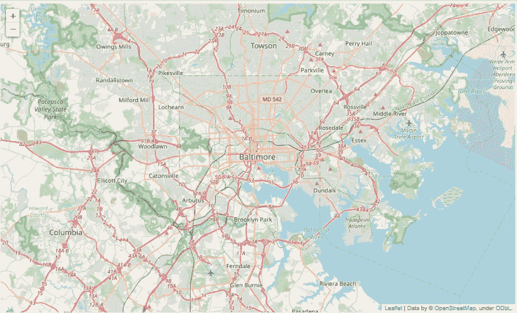

# 如何用 leav 制作交互式地图

> 原文：<https://levelup.gitconnected.com/how-to-make-interactive-maps-with-folium-f0b66f157737>

## 如何用叶子和熊猫制作交互式地图的教程

[](https://jorgepit-14189.medium.com/membership) [## 用我的推荐链接加入媒体-乔治皮皮斯

### 阅读乔治·皮皮斯(以及媒体上成千上万的其他作家)的每一个故事。您的会员费直接支持…

jorgepit-14189.medium.com](https://jorgepit-14189.medium.com/membership) 

follow 为 fleet . js 提供了一个 python 接口。fleet . js 是一个用于交互式地图的 Javascript 库，了解它本身会很有用。通过 yellow 使用这个库的好处是，yellow 使得在 Jupyter 笔记本中使用和访问 python 数据结构(例如 Pandas DataFrames)变得非常容易。可以在其[官方网站](https://python-visualization.github.io/folium/)上找到关于 leav 的文档。在本教程中，我们将使用[巴尔的摩的逮捕数据](https://data.baltimorecity.gov/datasets/arrests/explore?location=38.978750%2C-76.515650%2C9.86&showTable=true)。

# 带有巴尔的摩逮捕数据的交互式地图

该地图将包括以下维度:

*   年龄:以`isAdult`的形式，在每一次观察中都会有一个`pop-up`
*   种族:每个种族都有不同的颜色点
*   坐标
*   热图形式的事件频率。

```
import folium
from folium.plugins import HeatMap
import pandas as pd
import numpy as np# load the data
arrest_table = pd.read_csv("Arrests.csv")# create the isAdult variable
arrest_table['isAdult'] = np.where(arrest_table['Age']>=20,"Adult","Teenager")# start the map of Baltimore
map_osm = folium.Map(location=[39.29, -76.61], zoom_start=11)
map_osm
```



现在，我们将处理比赛，最后，我们将对 **1K** 的观察结果进行取样。

```
arrest_table = arrest_table.sample(n=1000, replace=False, random_state=1)arrest_table.dropna(subset=['Race'],inplace=True)def race_col(x):
  if x=='B':
    return 'black'
  if x=='W':
    return 'blue'
  if x=='A':
    return 'yellow'
  if x=='H':
    return 'red'
  else:
    return 'green'arrest_table['color_race'] = arrest_table['Race'].apply(lambda x:race_col(x) )# Create the Heat Map
#Make the list of Lat an Long
lat = arrest_table.Latitude.tolist()
lng = arrest_table.Longitude.tolist()
HeatMap(list(zip(lat, lng))).add_to(map_osm)# Add the Circles with the corresponding races based on the color
arrest_table.apply(lambda x:folium.Circle(location=[x['Latitude'], x['Longitude']], radius=50, fill=True, color=x['color_race'], popup=x['isAdult']).add_to(map_osm), axis=1)
```


最初发布于[预测黑客](https://predictivehacks.com/how-to-make-interactive-maps-with-folium/)