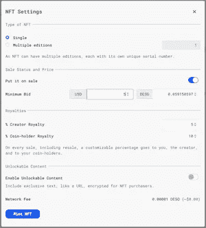
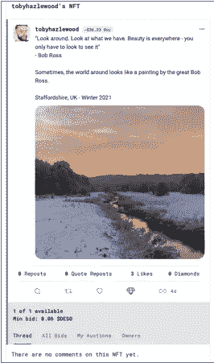
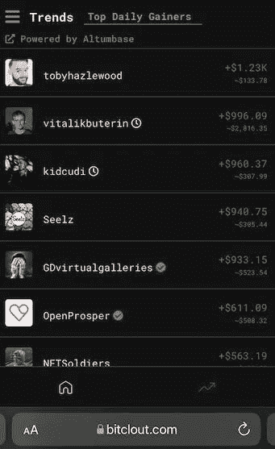
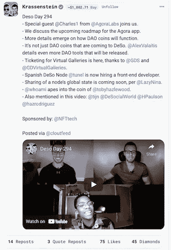

# 如何在 BitClout——一个去中心化的 Web3 社交媒体平台上赚钱

> 原文：<https://levelup.gitconnected.com/how-to-make-money-on-bitclout-a-decentralized-web3-social-media-platform-a97a887069bc>

## 终于有了一个除了自拍或猫咪视频之外的理由

图片来自 [Shutterstock](https://www.shutterstock.com/image-photo/future-digital-technology-cyber-virtual-game-2028990734)

术语“Web3”已经代表了基于网络技术的下一个时代。

它的出现似乎恰逢对脸书和推特等社交媒体平台的集体反弹，这些平台垄断了我们的注意力，并将我们的数据货币化了太长时间。Web3 是否不负众望，解决了这个问题，还有待观察。

但是 Web3 不仅仅是对高科技的反叛。它是人工智能发展和区块链技术崛起的同义词。这是关于元宇宙的出现，不是作为马克·扎克伯格和其他科技领袖意愿的表达，而是在更广泛的公众手中。

随着技术的成熟和正式定义的达成，许多人正在 Web3 领域进行试验，并直接学习如何利用它来获得自己的优势。

反正我就是这么做的；做实验。另一个更准确的词可能是“玩”。

在这篇文章中，我想分享我最近使用 Web3 社交媒体平台的经历——[BitClout](http://www.bitclout.com/)——来说明新的在线模式可能带来的一些最大的潜在好处:

*   通过有价值的信息和深思熟虑的内容的交流，重新关注相互丰富的在线关系。
*   我们所有人都有大量的机会来货币化我们的人力资本——我们的技能、知识和专业知识，前所未有地轻松，使用网络 3 创新，如 NFTs 和 creator coins，作为标记我们自己和我们产出的手段。

通过我的实验，我了解到，如果普通社交媒体用户愿意将他们的注意力和时间转移到 Web3 生态系统上，这些已经在他们的能力范围之内。

# 网络的演变

Web1 是一个包含大量静态信息的在线世界。网页被发布给其他人阅读和消费，人们在网上的交易基本上是单向的；一条*推送*的信息。如果你不同意我在网上发表的东西，你可以给我发一封讨厌的电子邮件或者在你自己的网站上发表来表达你的不同意见。总的来说，缺乏深思熟虑的对话和真正有意义的在线互动。

Web2 是现代社交媒体和众多在线社区和平台的代名词，用户每天都在这些社区和平台上进行互动和交流。

在 Web2 的世界里，群体不仅仅是推送信息。我们传播、讨论、辩论，并且经常不同意。虽然这无疑是在建立一个人们可以互动的在线世界方面向前迈出了一步，但我们也目睹了民事讨论可以相对容易地迅速退化为争论、愤怒、钓鱼、勒索和其他有毒形式的互动。

Web2 的另一个潜在的负面影响是平台利用、支配并货币化我们的注意力和个人数据的方式。这种有价值的见解可以卖给出价最高的人，分享我们[根深蒂固的偏好和偏见](https://www.theguardian.com/news/2018/mar/17/cambridge-analytica-facebook-influence-us-election)供以后利用。

Web3 有望解决 Web2 目前面临的许多问题。

实际上，它表现为一个分散的、未经许可的、不可信的 Web2 版本，没有中央管理机构或公司来监督技术的使用，或者收集和出售我们的数据。当然，在区块链，我们有很多东西在概念上是赤裸裸的——这本账本可以被那些有相关技能的人审问和解读。但是没有一个人、公司或实体负责，相反，用户是平台。

这些用户被更大的隐私、自主权和个人数据所有权的承诺所吸引。Web3 是由去中心化的区块链支撑的，它随着时间的推移而成长和发展，但却兑现了这些承诺。

批评家指出，许多最初的 Web3 平台是由风险投资公司支持的(本质上意味着它们*是*集中所有，至少在技术上是这样)。杰克·多西和埃隆·马斯克都表达了这样的观点。

然而，它们建立在区块链的基础上，就其性质而言，超出了一个单一实体或个人的控制。

# NFTs 和 Web3

2021 年，围绕不可替代代币(NFT)的炒作呈指数级增长。2022 年也以同样的方式开始。

术语“NFT”已经成为无聊卡通猿类和像素化朋克的数码插图的同义词。保护数字图像的原创性并出售此类艺术收藏品只是 NFTs 的一个应用案例。许多其他可能有更广泛用途的产品正在出现。

[无聊猿#6797](https://opensea.io/assets/0xbc4ca0eda7647a8ab7c2061c2e118a18a936f13d/6797)

NFT 使用最初为支持加密货币而构建的区块链网络。同样的技术支撑着分散的社交网络平台，这些平台最终可能取代 Twitter 和脸书，成为人们在线交流内容的地方。

通过在 Web3 社交平台上的试验，我了解到，根据社交媒体上的帖子制作和销售 NFT 很容易，这是创作者和消费者之间公平交换价值的一种手段。

以这种方式使用的 NFT 可能会改变我们对在社交平台上发帖的看法。这项技术可以帮助我们丰富那些与我们在线互动的人的生活，让我们专注于通过我们在社交媒体上发布和分享的内容来传递价值，而不仅仅是为了分享而分享。

Web3 和 NFTs 之间有很大的协同作用——两者都支持点对点世界的概念，在这种世界中，控制权是分散的，创作者和购买者直接交易，无需中央中介或控制机构的许可或监督。我可以和你交换我的作品来换钱——在这个过程的任何阶段，我们都不需要市场、画廊或银行的帮助。

# 卑微的出身

比特币网络最初是由运行节点的创新者组成的，这些节点只不过是重新改造过的笔记本电脑，专门用于挖掘比特币和维护区块链账本的副本。随着规模的增长，今天的网络拥有巨大的处理能力，这利用了比特币的批评者[错误地抱怨](https://medium.com/gitconnected/is-bitcoin-an-environmental-disaster-waiting-to-happen-d770e4bea5e9)的能力。

对于去中心化的 Web3 平台和支撑它们的区块链来说，同样的情况也是可以预期的。

# BitClout 简介

BitClout 是一个建立在 [*分散社交*](https://coinmarketcap.com/currencies/deso/) 区块链之上的社交媒体平台。它的本地加密货币代币是$DESO，等值于美元，在比特币基地等加密交易所交易。

每位 BitClout 用户都有自己的创造者币，其交易价值为$DESO。几周前，我的创造者硬币价值 36.24 美元，但随后在几个小时内飙升至 100 多美元(稍后将详细介绍)。平台上最有价值的创造者硬币是埃隆·马斯克的，当$DESO 的价格很高时，这已经被估价超过 20，000 美元。

## 激励价值创造

每个用户的价值取决于市场对用户为生态系统增加的价值的感知。如果他们定期发布有价值的内容，他们的创造者硬币的价格就会上涨，因为买家会被引诱去投资他们的未来。每个创造者都变成了可交易的商品，那些不断增加价值的人可以期望增加他们的价值。

任何人都可以买卖另一个创作者的硬币(或他们自己的单位)，投资于他们相信其作品的创作者的未来。这种价值交换是完全对等的。

*   发表机智、有趣或信息丰富的帖子的作家可能会在某个阶段写一本可能成为畅销书的书。他们的股票未来可能会升值，投资者也会因此受到吸引。
*   制作视频并免费发布的人最终可能会制作付费视频甚至故事片。到那时，他们的硬币也会升值。
*   发布通常的陈词滥调垃圾的用户——自拍、他们吃饭的照片、猫视频或错误的引用——不太可能获得太多的关注。他们的创造者硬币的价值将会减少。

去中心化的社交区块链有许多基于它的应用程序，这些应用程序集成到 BitClout。例如，CloutPub 允许作家在区块链上发表文章，这些文章可以通过 BitClout 分享——作家可以免费提供他们的作品，也可以按阅读次数付费(以 DESO 美元支付)。

除了“喜欢”帖子可能会提高收件人的创造者硬币的价格，用户还可以给创造者少量的$DESO 小费。帖子可以被喜欢(提供社交验证的传统 Web2 方法)。用户还可以向其他创作者发送“钻石”,以表彰他们为话语增加的价值。

通过这些奖励机制，创作者被激励张贴高质量、合意和有价值的内容。

现在 DESO 美元可以在像比特币基地这样的交易所交易，创作者可以从比特币中提取他们的收入，并将其转换成比特币或美元等其他货币。

# 从社交媒体帖子中铸造 NFT

BitClout 允许用户在 DeSo 区块链网站上直接发表他们的每一篇帖子。该过程简单、快速、直观，并提供各种配置选项。

一个帖子可以变成一个单独的 NFT 或编号，限量版的一套。

创作者可以选择在未来转售时收取版税，也可以将所有销售所得的版税奖励给创作者的硬币持有者。这不仅有利于创造者，也有利于那些为创造者的未来投资的人。

BitClout NFT 配置选项作者截图

还可以创建 NFTs 来包含只有最终购买者才能访问的加密内容。这可能是一个文本文件或一个私人 URL，买家可以通过它访问一个额外的图像、一段音乐、一部电影、一个应用程序或创作者想要的任何东西。

与在其他区块链上铸造 NFT 一样，需要支付少量的网络费用，但这只是一分钱的零头，而不是以太坊上经常发生的数百美元。

# 我是如何铸造我的

我在以太坊的第一个实验性 NFT 是根据我拍的一张照片铸造的。我在 BitClout 上贴了一张类似的照片和一段适当的引用，并决定将其作为 NFT 造币厂。这是:

BitClout 上[我的 NFT](https://bitclout.com/nft/acca15fe09beecae4142d457ea678ee9a38abae4120434b68cdb2b9e17fe2799?feedTab=Following&tab=posts&nftTab=my_gallery)截图

我出价 5 美元(0.05 美元 DESO)买了我的 NFT。这些年来，我在脸书上贴了很多照片，但从未从中赚过一分钱，唯一的回报就是几个赞的空洞的社交认可。在网上发布一张照片只需 5 美元，这看起来非常划算！

我设定我的创造者版税为 5%，硬币持有者版税为 10%。出售时，我的费用的 10%将在我的创造者硬币的持有者之间分配(其中一部分将归我，因为我也持有一些我自己的硬币)。如果最终买家再次出售，我还将获得未来销售收入的 5%。

# 卖掉它

在 OpenSea 这样的市场上卖一个 NFT 要几百美元或者更多，如果你还不是一个有着饥渴追随者的既定创作者，就需要一个勤奋专注的营销努力。相反，BitClout 上的销售过程相对容易。

社交贴子的非功能性定价通常会比以太坊(Ethereum)等区块链上出售的产品便宜得多，这有助于说服买家。作为一名创作者，你还与一群追随者和关系密切的受众联系在一起，他们通过追随你来表明他们欣赏你的内容。这让向他们销售变得不那么令人畏惧。

仅仅通过创建我的 NFT 并把它发布到我的 BitClout feed 上，我就立刻从我的追随者中吸引了一个买家，原来他们也持有一些我的 creator coin。因此，对他们来说，我的名义价值增加是一种直接的经济激励。

# 表征人的价值的 NFTs

由社交媒体帖子创建的 NFT 是一种将社交产出货币化的有用手段。

也许更重要的是，它是将这些帖子快速廉价地制作成非功能性帖子的工具，这激励了有价值和有用的内容的产生。

这似乎比社交媒体平台上常见的情绪化、意识流内容更丰富、更有价值。发布这些内容的目的通常是通过唤起情感反应来获得关注，而不是真正让消费者受益。

有许多例子可以说明在平台上发帖的人是如何利用这一点的，这些例子展示了这一技术是如何使内容创作者和消费者都受益的:

*   私人教练可以将这些照片转换成 NFT，包括一个可下载锻炼计划的加密链接，而不仅仅是发布一张展示他们粉碎的腹肌的自拍照。《邮报》制作的一系列 NFT 可以出售，以填补在线培训项目的名额。
*   作家可以张贴他们新小说的摘录作为引子，根据帖子创建的 NFT 可以让买家访问第一个完整的章节。这位作家最忠实的粉丝能够在这位作家未来的成功中拥有股份。
*   即使是上传美味营养午餐照片的人也可以把它变成 NFT，包括食谱链接和如何制作这顿饭的教学视频。
*   一个音乐家演奏他们的作品的视频可以包括一个可下载乐谱的加密链接，或者一张观看他们现场演奏的门票(在线或现场)。

这些只是几个例子，其中低成本的 NFT 可以在 BitClout 上铸造，以货币化社会产出，为内容创作者赚钱，并为消费者提供更大的价值。

可能性是无穷无尽的，可能会重新定义我们如何更普遍地使用社交平台。

# 激励价值创造

NFTs 的前提是创造者和销售者提供对他人有吸引力和价值的东西。购买者意识到作品所有权的价值和地位。这些原则同样适用于社交媒体内容的非功能性传播，就像它们适用于变异猿的数字图像的非功能性传播一样！

这只是 Web3 的一个新兴用例。但它说明了如何利用这项技术来实现真正的利益，无论是对那些希望将其产品货币化的内容创作者，还是对那些消费信息并愿意为质量付费的人。

如果你像我一样正在考虑尝试，我希望你会为我这么做是多么容易而感到振奋。

# 附言:我在 BitClout 上的价值如何在一天内增加了 1200 美元

我最近为内幕杂志写了一篇[文章，讨论了在 BitClout 上制造和销售 NFT 的过程。这篇文章发表后不久，另一位 BitClout 用户将它分享到平台上，这立即激发了人们的兴趣。](https://www.businessinsider.com/how-to-make-nfts-mint-bitclout-web3-platform-2022-1)

各种投资者在我的创造者硬币中持有股份，其中似乎包括一位名叫“WhoAmI”的用户。

在做了一些在线调查后，我似乎已经吸引了该平台的一位创始人的注意，用加密的话说，他“模仿”了我的硬币——在我身上投资了大约 1000 美元的$DESO。我不知道这是对你通过主流技术媒体为平台带来一些宣传的感谢，还是他们只是随机选择了我。

不过，这种影响是显著的，它提升了我在当天价值增长最多的创作者的每日排行榜。事实上，在那一天，我获得的名义价值超过了以太坊创始人维塔利克·布特林和说唱歌手卡迪小子的账户！

BitClout 每日涨幅居前的作者截图——2022 年 1 月 14 日

这在货币方面的意义非常重大。如果有一天我兑现了我持有的所有硬币，我会从最初的 200 美元投资中获得 2500 美元的利润来资助我的实验。

这也让我在 Krassenstein 双胞胎的每日视频中被提及——最有价值的创作者账户之一(BitClout 自己版本的[文克莱沃斯双胞胎](https://www.fool.com/the-ascent/buying-stocks/articles/how-the-winklevoss-twins-amassed-a-6-billion-bitcoin-fortune/)？)他们每天都会在这个平台上发布一段视频，报道区块链发生的事件。

不管是什么原因让我在 BitClout 上短暂成名，我都很感激。如果我能在这里成功，我就能在任何地方成功(你也可以！)

这是帖子:

作者截图来自 [BitClout](https://bitclout.com/posts/3e6fcd83eb71530e301318cb7f6d0bcd978a5042af8004ba2c4506854896e1f5?feedTab=Following&tab=posts)

如果你还没有注册 BitClout，下面是 YouTube 上的视频(快进到 11:31，看看我的 15 秒成名时间！):

来源: [YouTube](https://youtu.be/6BJvV0mVd1A)

如果你有兴趣了解更多关于非功能性测试和它们的各种使用方式，你可能会对我关于这个主题的电子书感兴趣。

如果你喜欢阅读这样的故事，并愿意支持媒体上的作家，可以考虑注册**成为媒体会员。一个月 5 美元，给你无限的故事。如果你* [*用我的*](https://tobyhazlewood.medium.com/membership) *链接注册，我会赚一小笔佣金。**

* [## 通过我的推荐链接加入灵媒——托比·黑兹伍德

### 作为一个媒体会员，你的会员费的一部分会给你阅读的作家，你可以完全接触到每一个故事…

tobyhazlewood.medium.com](https://tobyhazlewood.medium.com/membership) 

注意:*本文仅供参考。不应将其视为财务或法律建议。在做任何重大财务决定之前，先咨询财务专家。**