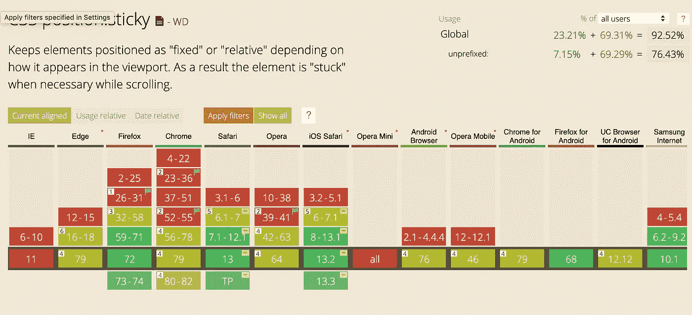
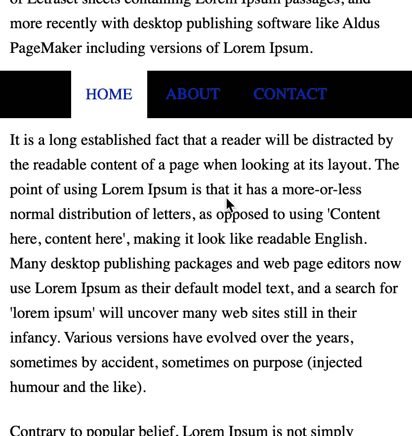

# 如何在 IE 中使用 Position Sticky:用 JavaScript 构建自己的 CSS Polyfill

> 原文：<https://levelup.gitconnected.com/how-to-make-position-sticky-work-in-ie-build-your-own-css-polyfill-with-javascript-f42f0a3cc9ef>

## 半铸钢ˌ钢性铸铁(Cast Semi-Steel)

## 位置粘滞在 IE 中不起作用，但有一个解决方案


[Pankaj Patel](https://unsplash.com/@pankajpatel?utm_source=medium&utm_medium=referral) 在 [Unsplash](https://unsplash.com?utm_source=medium&utm_medium=referral) 上拍摄的照片

当你创建一个网页时，它非常有用，但是并不是每个浏览器都支持它。



在这篇文章中，我将向你展示如何在 IE 中使用它。

# 阅读前

我很确定会有比我准备的更聪明的解决方案。所以，随时欢迎你和我分享你的想法！

# 位置粘性是如何工作的？

在开始之前，我将向您展示示例中 sticky 元素是如何工作的。

如果你继续滚动页面，你可以看到`.navigation`元素粘在`main`的顶部。由于`top: 0`，在元素从顶部偏移 0px 后，它将表现为一个`fixed`元素。

# 解决方案 1 —改变用户需求

如果可能，更改应用程序的规范。不支持 IE。职位`sticky`在 IE 不起作用，只能。如果你不支持他们，你会更快乐。

# 解决方案 2 —粘性比特

[StickyBits](https://github.com/dollarshaveclub/stickybits) 是一个 Github 库，让你的元素像`sticky`一样执行。它有超过 2K 颗星星，这可能是这个功能非常受欢迎。

# 解决方案 3 —使用 JavaScript

您可以使用 JavaScript 创建聚合填充。

首先去掉`.navigation`的风格。

```
.navigation {
  position: sticky;
  top: 0;
}
```

它似乎起作用了。我先解释一下代码。

```
const nav = document.querySelector('.navigation');
```

你应该首先使用`.navigation`元素来处理粘性多孔填料。`querySelector`允许您使用 CSS 选择器语法来获取 DOM 元素。相反，你可以使用`document.getElementsByClassName`。但是它总是返回一个数组，所以你应该从返回的数组中选择正确的一个。

```
const offset = nav.getBoundingClientRect();
```

然后你需要得到`.navigation`元素从视窗顶部偏移了多远。`getBoundingClientRect`从视窗中给出相对位置。

```
window.addEventListener('scroll', function() {});
```

然后，向滚动事件注册回调函数。

```
if (window.pageYOffset > offset.top) {
  ...
} else {
  ... 
}
```

`pageYOffset`是当你想知道`window`沿着纵轴从顶部滚动多远时你可以得到的。

所以`this.pageYOffset > offset.top`的意思是“当前`window`的 y 位置是否高于`.navigation`的 y 位置？”如果是，执行`if`条件块中的代码。

```
nav.style.position = 'fixed';
nav.style.top = 0
```

一旦元素到达阈值点，`sticky`就像`fixed`元素一样工作。在这个例子中，是`top: 0px`。所以如果你将`window`滚动到`.navigation`之外，那么`.navigation`元素将会是`fixed`。

```
nav.style.position = 'relative';
nav.style.top = '';
```

如果您还没有滚动到这一点，让`.navigation`作为一个`relative`元素工作。

然而，它的工作方式有点奇怪。



当`.navigation`开始像`fixed`元素一样工作时，文本内容跳转到顶部。

我们如何解决这个问题？

这是因为`position: fixed`的原生特性。一个`fixed`元素不包含在普通的 DOM 流中，所以一旦该元素被更改为`fixed`，它就会脱离 DOM 流。那么文本内容显然会向上移动以填补空白。因此，你应该为那种空虚创造一个时间元素。

现在它工作正常。

那么魔咒是什么呢？

```
const tmp = nav.cloneNode(true);
```

`tmp`是`.navigation`的克隆 DOM 元素。创建一个 DOM 节点的克隆，如果你把`true`传递给它，它会复制每个后代元素。之所以要把`true`传入`cloneNode`，是因为如果它里面没有任何子体或者内容，那么高度就会是 0。

```
tmp.style.visibility = 'hidden';
```

默认情况下应该是隐藏的。

```
if (...) {
  nav.parentNode.appendChild(tmp);
} else {
  nav.parentNode.removeChild(tmp);
}
```

你所需要做的就是根据情况添加和删除`tmp`。

# 使用 jQuery (+ ES5)

```
var offset = $('.navigation').offset();
var navParent = $('.navigation');
var nav = navParent.find('nav');
var tmp = navParent.find('nav').clone().attr('class', 'tmp').css('visibility', 'hidden'); 

window.addEventListener('scroll', function() {
  if (window.pageYOffset > offset.top) {
    navParent.append(tmp);
    nav.css({'position': 'fixed', 'top': 0});
  } else {
    navParent.find('.tmp').remove();
    nav.css({'position': 'static', 'top': ''});
  }
});
```

如果您正在使用 jQuery，这可能会对您有所帮助。

# 结论

本文为`position: sticky`提供了一个简单的聚合填充。当然，为这个特性使用一个考虑其他因素的库会更明智。但是，这次经历让我对 CSS Sticky 有了更好的理解。

# 资源

*   [定位粘性浏览器支持—我可以使用吗？](https://caniuse.com/#feat=css-sticky&search=position%3Arelative)
*   [StickyBits — Github](https://github.com/dollarshaveclub/stickybits)
*   [getBoundingClientRects—MDN](https://developer.mozilla.org/en-US/docs/Web/API/Element/getBoundingClientRect)
*   [页面偏移— MDN](https://developer.mozilla.org/en-US/docs/Web/API/Window/pageYOffset)
*   [Node.cloneNode — MDN](https://developer.mozilla.org/en-US/docs/Web/API/Node/cloneNode)