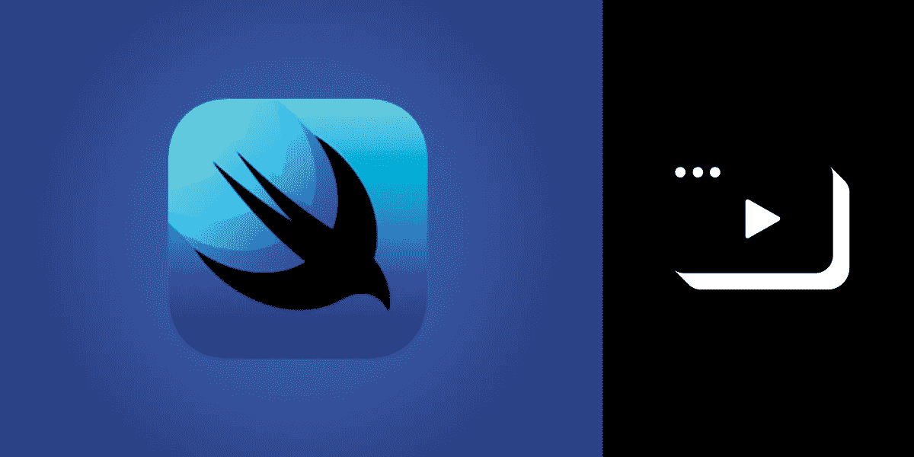
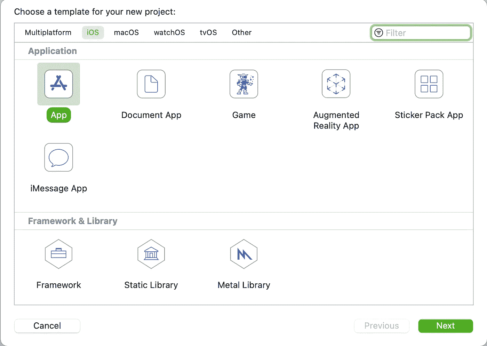
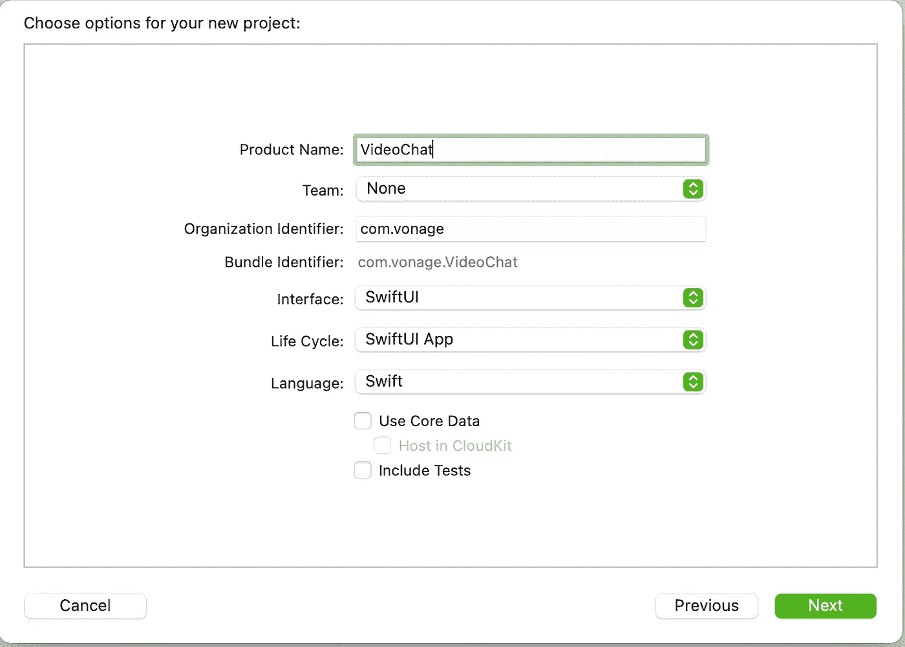
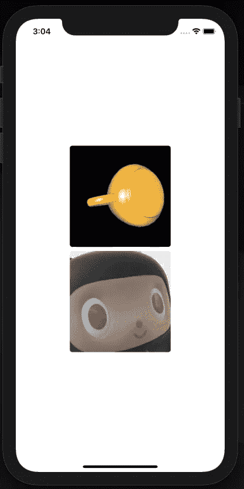

# 如何使用 SwiftUI 进行视频通话

> 原文：<https://levelup.gitconnected.com/how-to-make-video-calls-with-swiftui-8e93ce71fbb1>

在本教程中，您将使用 iOS 版 Vonage [视频客户端 SDK](https://tokbox.com/developer/sdks/ios/) 在 SwiftUI 中构建一对一的视频聊天。

# 先决条件

*   一个 [Vonage 视频 API 账号](https://tokbox.com/account/user/signup)。
*   Xcode 12 和 Swift 5 或更高版本。

# 创建一个 Vonage 视频 API 项目

打开您的 [Vonage 视频 API 仪表板](https://tokbox.com/account/#/)并创建一个新的 API 项目。你可以把它叫做任何你想叫的名字，但是把编解码器保持为 VP8。在项目工具部分下，创建一个路由的[会话](https://tokbox.com/developer/guides/create-session/) ID。您可以将会话想象成参与者会面和聊天的房间。就在下面，使用会话 ID 创建一个[令牌](https://tokbox.com/developer/guides/create-token/)；您可以将其余字段保留为默认值。令牌是一种用于验证用户身份的方法。记下您的会话 ID、令牌和项目 API 密钥，以备将来使用。

# 创建 iOS 应用程序

下一步是安装 iOS 应用程序。一旦您创建了应用程序，您需要安装视频客户端 SDK 并请求麦克风和摄像机权限。

## 创建 Xcode 项目

若要开始，请打开 Xcode，然后通过前往“文件”>“新建”>“项目”来创建一个新项目。选择 iOS 作为模板的平台和应用程序，并为其命名。

为界面选择 SwiftUI，为生命周期选择 SwiftUI App，为语言选择 Swift。最后，保存项目的位置。

## 安装客户端 SDK

现在您已经创建了项目，您可以添加视频客户端 SDK 作为依赖项。关闭 Xcode 项目，导航到您在终端中保存项目的位置，然后运行以下命令:

1.  运行 pod init 命令为您的项目创建一个新的 Podfile。
2.  使用 open -a Xcode Podfile 在 Xcode 中打开 Podfile。
3.  更新 Podfile，将`OpenTok`作为依赖项。

1.  使用`pod install`安装 SDK。
2.  使用`open VideoChat.xcworkspace`在 Xcode 中打开新的 *xcworkspace* 文件。

## 许可

由于应用程序将使用麦克风和摄像头进行视频聊天，您需要添加说明，说明您需要权限的原因，这将在运行应用程序时显示在提示中。

编辑`Info.plist`文件。`Info.plist`是一个包含应用程序所需的所有元数据的文件。将鼠标悬停在列表中的最后一个条目上，然后单击出现的小`+`按钮，向文件中添加一个新条目。从下拉列表中，选择`Privacy - Microphone Usage Description`并添加`Microphone access required to video chat`作为其值。重复`Privacy - Camera Usage Description`的步骤。

# 视频客户端 SDK

视频客户端 SDK 使用您在视频 API 仪表板中创建的凭据连接到 Vonage 服务器。

## 连接客户端 SDK

转到*文件>新文件(CMD + N)* 创建一个名为`OpenTokManager.swift`的新文件，并添加以下内容，用您的凭证替换空字符串:

除了凭证之外，还有用于[会话](https://tokbox.com/developer/guides/basics/#session)、[发布者](https://tokbox.com/developer/guides/basics/#publish)和[订阅者](https://tokbox.com/developer/guides/basics/#subscribe)的变量。如前所述，您可以将会话视为客户端连接到的房间；SDK 为此提供了`OTSession`类。发布者`OTPublisher`允许客户端在连接到会话时发布音频和视频。订户`OTSubscriber`允许客户端从会话中的其他客户端订阅音频和视频。还有使用`@Published`属性包装器的变量，这是`OpenTokManager`类稍后与视图代码通信的方式。

现在属性已经就绪，向`OpenTokManager`类添加以下函数:

`doConnect`函数将客户端连接到会话，`doPublish`开始发布，`doSubscribe`开始订阅。然后，当客户端与订阅者(`cleanupSubscriber`)和发布者(`cleanupPublisher`)断开连接时，会有一些函数来清理订阅者和发布者，然后是一个处理错误的函数(`processError`)。

## `OTSessionDelegate`

`OTSessionDelegate`是视频客户端 SDK 通过会话向您反馈更改的方式。在同一文件中添加扩展名:

当会话连接时，`doPublish`被调用，当流被创建时，`doSubscribe`被调用，当流被销毁时，`cleanupSubscriber`被调用。

## `OTPublisherDelegate`

`OTPublisherDelegate`是视频客户端 SDK 将发布到会话的更改传达给您的方式。在同一文件中添加扩展名:

与`OTSessionDelegate`类似，当流被销毁时，调用`cleanupPublisher`，如果存在对流的活动订阅，则调用`cleanupSubscriber`。

## `OTSubscriberDelegate`

`OTSubscriberDelegate`是视频客户端 SDK 通过订阅会话向您反馈更改的方式。在同一文件中添加扩展名:

类似于何时发布到会话，如果订阅成功，您将返回一个`UIView`对象。在`subscriberDidConnect`的情况下，返回的视图对象是针对订户的。

# 构建视频聊天用户界面

随着`OpenTokManager`类的完成，您现在可以构建 UI 了。视频客户端 SDK 为您提供了不能在 SwiftUI 中直接使用的发布者和订阅者视图的`UIView`对象。`[UIViewRepresentable](https://developer.apple.com/documentation/swiftui/uiviewrepresentable)`协议允许 SwiftUI 从`UIView`对象桥接到`View`对象。在`ContentView.swift`文件中，添加以下结构:

符合`UIViewRepresentable`的`OTView`结构有一个`UIView`对象作为属性。当系统调用`makeUIView`时，返回该视图。因为 SwiftUI 中视图的生命周期是由系统控制的，所以您还需要实现`updateUIView`来处理这个问题。`OTErrorWrapper`结构允许错误符合`Identifiable`，这是使用 SwiftUI 警报所需要的。

接下来，用以下内容替换`ContentView`结构:

这段代码为前面的`OpenTokManager`类的一个实例添加了一个属性。因为`OpenTokManager`发布的视图是可选的，所以使用了`.flatmap`。所以当视图为零时，它们被忽略，当有值时，它们被展开。如果`OpenTokManager`发布一个错误，警报将自动显示，因为它正在观察发布的`.error`值的变化。

如果您构建并运行了项目，您现在应该能够开始视频聊天了！您可以使用另一个设备或 [OpenTok Playground](https://tokbox.com/developer/tools/playground/) 从笔记本电脑连接到会话。

完成的项目可以在 [GitHub](https://github.com/opentok/opentok-swiftui-basic-video-chat) 上获得，你可以通过我们的[文档](https://tokbox.com/developer/guides/)阅读更多关于 Vonage 视频 API 的内容。

*最初发布于*[*https://learn . vonage . com/blog/2021/05/26/how-to-make-video-calls-with-swift ui/*](https://learn.vonage.com/blog/2021/05/26/how-to-make-video-calls-with-swiftui/)