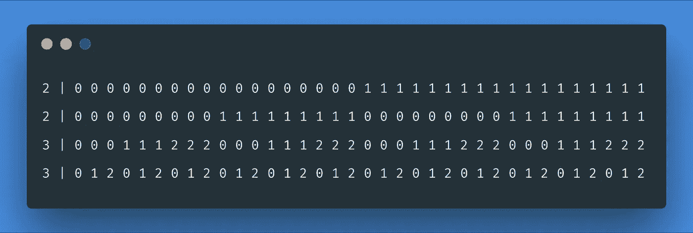
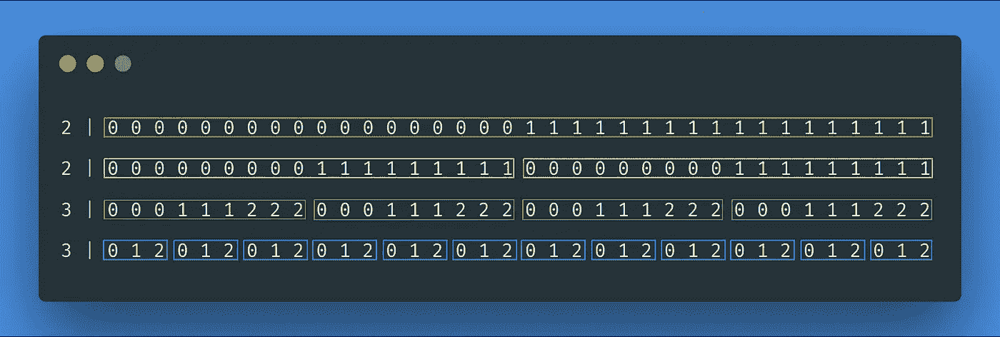
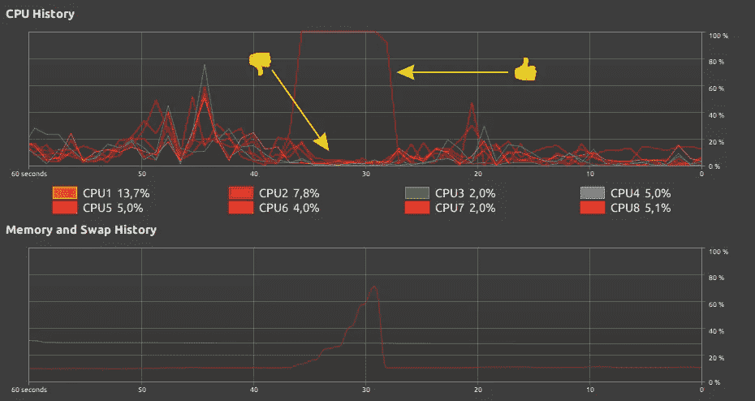
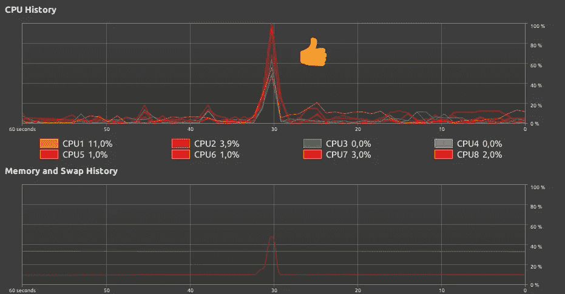

# 如何利用数据并行和 std::async 让您的代码运行得更快

> 原文：<https://levelup.gitconnected.com/how-to-make-your-code-run-faster-with-data-parallelism-and-std-async-1f76e7befb50>


在本系列的第二部分，我们实现了一种生成给定张量的所有索引的方法。如果你还没看过《T2》第一部和《T4》第二部，那就看看吧。

以前的方法是迭代输入张量，为每个元素生成完整的索引，并将这些索引逐维添加到输出缓冲区。这意味着在每次迭代中(对于每个输入张量的元素),输出缓冲区的所有行都被修改。有一种不同的方法来解决这个问题，但在深入研究之前，让我们看看我们正在研究的算法的一些简单输出，并尝试找出一些模式。

让我们考虑一个带有`Shape{2,2,3,3}`的 4D 张量。对于这样一个张量，包含一个完整指标集的非零算子的输出是:



第一列包含输入形状的维度，其余部分是实际输出。一些需要注意的事项:

*   每行对应于输入形状的一个维度
*   如果给定维度的值是 ***N*** ，对应的输出行包含以下范围内的值:`0, 1, 2, ..., N-1` —姑且称之为*允许值*
*   每行包含一个或多个子范围，跨越该行的所有允许值

*给定这 3 个观察值，我们可以尝试以逐行方式实现非零输出生成。换句话说，我们不会生成输出的垂直切片。相反，我们可以逐行生成它们，看看这对算法的性能是否有任何影响。*

*为了做到这一点，我们应该再看一下示例输出，并弄清楚这些值是如何变化的。让我们看看每一行。*

*第一行只包含 0 和 1，它们是维等于 2 的允许值。50%的行包含 0，50%的行包含 1，所有这些值形成一个子范围，其长度等于第一个输出行的长度。第二行也可以只包含 0 和 1，但是这次有两个子范围，每个子范围跨越输出行的一半。第三行由 4 个子范围组成，每个包含 0、1 和 2。最后一行类似，但它包含 12 个子范围。*

**

*张量形状{2，2，3，3}的非零输出的子范围*

*一句话中的行方式是:为给定的行生成子范围，然后重复它 *K* 次，其中 *K =行长度/子范围长度*。但是我们可以用不同的方法计算 K。对于第一个输出行，它总是 1。对于所有其他行，它是与前面的行匹配的输入形状尺寸的乘积。STL 中有一个理想的函数(C++17 中添加的)我们可以用来计算它——[STD::exclusive _ scan](https://en.cppreference.com/w/cpp/algorithm/exclusive_scan)。在我们的示例中，输出行的 *K* 的值将是:`1, 2, 4, 12`并且这些值匹配子范围在每行中重复的次数。有了这些数字，我们可以计算子区间的长度:`36, 18, 9, 3`。*

*最后要搞清楚的是子范围生成方案的方式。事实上，我们只需要为子范围创建一个 vector，并为其添加值。附加值最初等于零，经过几次迭代后增加。多久一次？经过`row_length / (dimension * K)`的反复。*

*大部分代码与本系列的第 2 部分相同，所以我将向您展示使用新的`generate_rows()`方法的非零类的新实现:*

# *测试*

*我还准备了一个脚本，可以自动化性能测量，运行测试 1 次以上，并计算平均值和标准偏差。它是用 JavaScript 编写的，所以您需要安装 node.js 才能使用它:*

*要对我们之前处理的 7D 形状执行 10 次“a.out”二进制:*

```
*node tester.js a.out 10 "10 10 10 10 10 10 10"*
```

*我首先对前一篇文章中的代码执行了它。对于最不理想的情况(没有预分配)，我得到:*

```
*Number of iterations: 10
Average time: **764 ms**
Standard dev: 6.04 ms*
```

*使用预分配:*

```
*Number of iterations: 10
Average time: **325 ms**
Standard dev: 6.21 ms*
```

*现在，对于本文中描述的行方式:*

```
*Number of iterations: 10
Average time: **333 ms**
Standard dev: 3.05 ms*
```

*这其实是一个令人惊讶的结果。我希望逐行方法提供更多的缓存局部性，并且这个版本会更快。我决定使用另一种数据类型来表示维度(在两种实现中)并重复测试。我已经从`uint64_t`换到`uint32_t`了。预分配的旧方法给了我这个:*

```
*Number of iterations: 10
Average time: **219 ms**
Standard dev: 4.50 ms*
```

*行方式:*

```
*Number of iterations: 10
Average time: **207 ms**
Standard dev: 1.36 ms*
```

*使用这种数据类型，速度更快，但差别只有 8%。我没有放弃，又进行了一次比较——多了一个等于 10 的维度。这为我们提供了 10 倍多的索引生成量:*

```
*node tester.js a.out 10 "10 10 10 10 10 10 10 10"*
```

*旧方法:*

```
*Number of iterations: 10
Average time: **2732 ms**
Standard dev: 81.84 ms*
```

*行方式:*

```
*Number of iterations: 10
Average time: **2209 ms**
Standard dev: 5.60 ms*
```

*那就**好 19%** 了。两种方法之间的标准偏差也相差 10 倍。这意味着逐行算法在更均匀、更可预测的时间间隔内产生结果。*

*这让我想到，当输入张量的秩足够大时，我所考虑的缓存局部性可能会有所不同。这是因为在输出中有更多的输出行，因此在将结果添加到输出时从一行跳到另一行的前一种方法中有更多的缓存未命中。我做的最后一个测试是这样的:*

```
*node tester.js 10 a.out "5 2 5 2 5 2 5 2 5 2 5 2 5 2"*
```

*在这里，我测试了一个与之前的 7D 张量具有相同元素数量的 14D 输入张量:`Shape{10,10,10,10,10,10,10}` —元素的数量是张量形状中所有维度的乘积。传递给旧方法的 14D 输入的结果是:*

```
*Number of iterations: 10
Average time: **19671 ms**
Standard dev: 22.31 ms*
```

*这一次，行方式显示了它的优越性，产生了一个好 80%的结果(换句话说，快了 5 倍):*

```
*Number of iterations: 10
Average time: **3899 ms**
Standard dev: 1.58 ms*
```

# *数据并行性和标准::异步*

*我们还可以采取一个步骤来加速执行。给你一个提示，我将展示我的系统监视器在一次运行中记录的内容:*

**

*单核非零指数生成*

*这真是浪费资源。通过行方式，我们可以非常轻松地应用数据并行性概念。在这种新方法中，我们逐行生成非零输出。输出行是独立的，可以在没有任何重叠的情况下进行处理。这是数据并行性的完美应用——我们可以在可用的 CPU 之间分配工作(另外——没有任何同步)。*

*这里，我们还将在生成开始之前预分配内存。我们将计算生成给定行所需的所有必要数据，然后将其封装在 lambda 中，并简单地异步执行它。没有线程或线程池，没有互斥，没有任务系统。STL 中的一个简单函数。*

*在循环之前，我们为`std::future`对象创建一个容器。这些表示将填充各个输出行的任务。`std::future`是由`std::async`返回的类型。它是一种句柄，允许我们监控异步操作的状态并访问值(当它可用时)。在这种情况下，我们不会返回任何东西，而是将缓冲区的句柄传递给异步操作，并直接填充它。这就是为什么期货被`void`参数化。*

*lambda 捕获列表现在包含了我们需要捕获的对象的副本。这是因为它们是只在 for 循环迭代结束之前存在的局部变量。最后一个元素通过引用捕获——这是属于非零类`_results`成员的输出行。*

*最后，在 for 循环之后，我们必须创建一个同步点，在那里我们等待所有任务完成。`std::future::wait()`方法正在阻塞，这将使代码“冻结”,直到整个异步生成完成。仅此而已。让我们运行 7D 测试:*

```
*Number of iterations: 10
Average time: **109 ms**
Standard dev: 2.36 ms*
```

# *性能比较*

*这是我实验的最终结果。我已经收集了尺寸表示为`int32_t`的数字。首先是 7D 张量比较:*

```
*$ node tester.js a.out 10 "10 10 10 10 10 10 10"// the old approach without pre-allocation
Average time: **434 ms**
// the old approach with pre-allocation
Average time: **219 ms** // the row-wise approachAverage time: **207 ms** // the row-wise approach + std::async
Average time: **109 ms***
```

*8D 张量:*

```
*$ node tester.js a.out 10 "10 10 10 10 10 10 10 10"// the old approach without pre-allocation
Average time: **4873 ms**
// the old approach with pre-allocation
Average time: **2805 ms** // the row-wise approachAverage time: **2225 ms** // the row-wise approach + std::async
Average time: **1087 ms***
```

*与 7D 示例具有相同元素计数的 14D 张量:*

```
*$ node tester.js a.out 10 "5 2 5 2 5 2 5 2 5 2 5 2 5 2 5 2"// the old approach without pre-allocation
Average time: **23785 ms**
// the old approach with pre-allocation
Average time: **19671 ms** // the row-wise approachAverage time: **3899 ms** // the row-wise approach + std::async
Average time: **1412 ms***
```

*1.4 秒对 19.7 秒，快了 14 倍！另外，所有内核都很忙:*

**

*标准::异步 CPU 利用率*

# *摘要*

*看到那些结果后我得出了一个结论。有时候重新审视你对问题的解决方案是值得的。我认为从您考虑将要处理的数据的角度来考虑您的问题是一个好主意。要弄清楚的是元素之间是否有任何关系。如果没有，你就有机会实现数量级的加速。只是不要太兴奋，记住阿姆达尔定律。*

*非常感谢您的阅读！*

# *资源*

*您可以在我的 github gists 中找到完整的代码:*

*[](https://gist.github.com/tomdol) [## 汤姆多尔的要点

### 此时您不能执行该操作。您已使用另一个标签页或窗口登录。您已在另一个选项卡中注销，或者…

gist.github.com](https://gist.github.com/tomdol)*