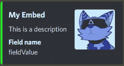
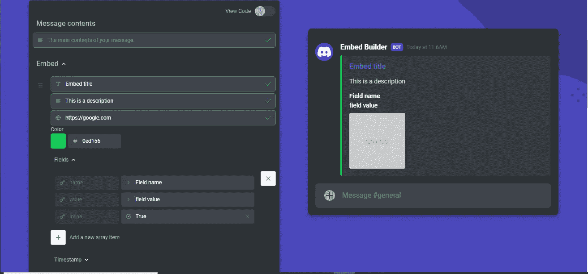
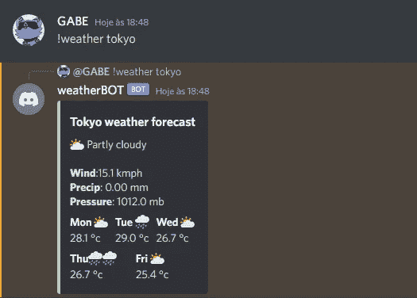
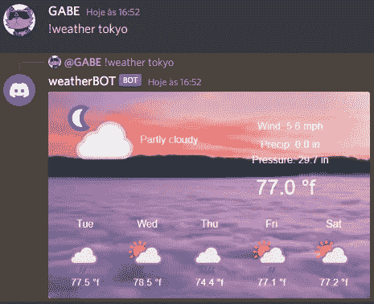

# 如何停止使用文本，让你的不和谐机器人看起来更好

> 原文：<https://levelup.gitconnected.com/how-to-make-your-discord-bots-ui-more-interesting-77a807e0baa4>


如果你的 discord 机器人是一个个人机器人或者只有几个功能，那么它的纯文本用户界面就很好。但是如果你计划扩大规模，拥有更多用户，你需要一个更好的用户界面。

## 那么你是怎么做到的呢？

有很多方法可以让你的机器人看起来更好。以下是一些例子:

*   自定义表情符号
*   使...嵌入
*   图像处理

## 自定义表情符号

图像比文字更能表达感情——这就是表情符号如今如此流行的原因。积极使用表情符号可以让你更讨人喜欢，给你更多的可信度。

关于 Discord 机器人，有一件事你可能不知道:他们可以访问他们所在的每一台服务器的每一个自定义表情符号，而且是免费的。在这一部分，我将解释如何给你的机器人添加自定义表情符号。

你可以从两个地方获得表情符号:客户端和公会。`client.emojis.cache`是客户端可以访问的每个表情符号的集合，而`guild.emojis.cache`是特定公会的表情符号的集合。

```
client.emojis.cache.get("<emoji_id>"); //Get emoji from the client
guild.emojis.cache.get("<emoji_id>"); //Get emoji from a guild
```

要输出表情符号，你必须使用`<emoji>.toString()`方法，将它转换成正确的格式。您还可以使用连接和模板文字来稍微简化您的工作:

```
client.on("message", message => {
    if(message.content !== "vibe") return;
    const emoji = client.emojis.cache.find(e => e.name === "vibefish"); // Get emoji with the name "vibefish"
    message.reply(`${emoji}`); // Reply with emoji
    message.react(emoji.id); // React with emoji(Must use ID)
});
```

请注意，您需要启用`GUILD_EMOJIS_AND_STICKERS`意图，这样才能工作。

## 使...嵌入

你可能以前见过它们——它们很流行，是有原因的。

嵌入是使你的输出看起来比简单的文本更好的一种好方法。通过嵌入，您可以显示标题、缩略图、时间戳等等。

在这一节中，我将向您展示如何轻松地设计嵌入消息并将它们附加到您的 bot。

你可以使用 Discord.js `MessageEmbed()`类创建新的嵌入:

```
const discord = require(“discord.js”);const embed = new discord.MessageEmbed();
```

您可以使用以下方法向嵌入内容添加信息:

```
const embed = new MessageEmbed().setTitle("My Embed").setDescription("This is a description").addField("Field name", "fieldValue").setColor("#00ff00").setThumbnail(message.author.avatarURL());message.reply({embeds: [embed]}); //Send an embed
```



如果你发现使用代码很难嵌入，你可以使用[这个很棒的嵌入构建工具](https://autocode.com/tools/discord/embed-builder/)。有了它，你可以实时创建和查看你的嵌入！



完成后，只需点击页面底部的“复制代码”按钮即可复制代码！

## 图像处理

不要误解我的意思，嵌入是很酷的，但是它们有一点局限性。除了添加文本和图像，你不能对它们做太多。

如果你想要的不仅仅是文本，我建议使用图像处理。这有点困难，需要更多的编码经验，但这是完全值得的。

假设我有一个输出给定位置天气的机器人:



这很好，但是可能有成千上万个这样的命令。我想要不同的东西。

第一步是为你的语言找到一个图像处理库。在我的例子中，我将使用 [sharp](https://sharp.pixelplumbing.com) :

```
**npm** install sharp
```

之后，我将创建一个命令，该命令创建我想要的图像并将其发送给用户。不幸的是，Discord 不支持 SVGs，所以我必须将图像转换为 PNG 或 JPEG:

```
const sharp = require("sharp");let image = `<svg>...</svg>`; //Template too big//Write svg file with the image template string above
fs.writeFileSync(`${process.cwd()}/image.svg`, image);//Convert created image into a PNG and save it to "image.png"
await sharp(`${process.cwd()}/image.svg`).png().toFile(`${process.cwd()}/image.png`);
```

准备好图像后，我现在要做的就是将它发送给用户:

```
const {MessageAttachment} = require("discord.js");const attachment = new MessageAttachment("image.png");message.reply({files: [attachment]});
```

机器人会回复一张图片:



因为我缺乏创造力，我只是从 API 网站上拿了模板，添加了用户数据和一个很酷的背景😅

这是一个简单的例子，但是你可以用它来创造。天空才是极限！