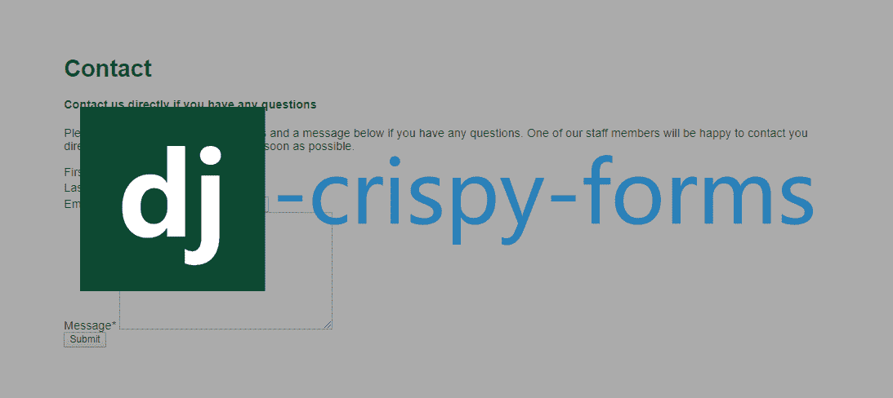
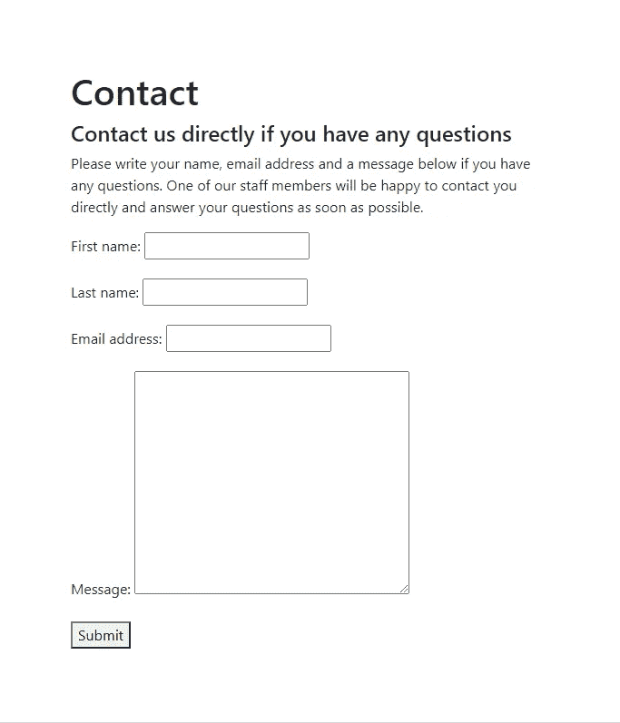

# 如何让你的 Django 表单看起来脆脆的🥓

> 原文：<https://levelup.gitconnected.com/how-to-make-your-django-forms-look-crispy-78a68000bc3f>



Django 的内置表单功能很棒，但是缺乏风格化的外观。幸运的是，有一个名为 django crispy forms 的 Python 包，它使用内置的模板包为您设计 Django forms CSS。



如果您是使用 Django 表单的新手，那么在开始样式化之前，先学习如何[构建 Django 表单](https://www.ordinarycoders.com/../../../blog/article/build-a-django-contact-form-with-email-backend)。

**如何使用 Django 脆皮形式**

1.  在你的 Django 项目中
2.  将`crispy_forms`添加到设置中已安装的应用程序列表
3.  将`crispy_template_pack`添加到设置中
4.  加载 HTML 模板中的 Django `crispy_forms_tags`
5.  向 Django 表单变量添加`|crispy`或`|as_crispy_field`过滤器

# **如何安装 Django crisp forms**

要使用这个包，您需要首先 pip 安装 django crispy forms，然后将其添加到您的 django 项目设置中。

## **Pip 安装 django-crisp-forms**

*macOS 终端*

```
(env)User-Macbook:mysite user$ pip install django-crispy-forms
```

*Windows 命令提示符*

```
(env) C:\Users\Owner\desktop\code\env\mysite>pip install django-crispy-forms
```

首先在您激活的虚拟环境中运行命令`pip install django-crispy-forms`。这个包允许您控制 Django 表单 CSS 的呈现行为，而无需添加任何自定义 CSS 声明。

## **将姜戈脆皮蛋糕添加到姜戈设置中**

```
#*env > mysite > main > settings.py*INSTALLED_APPS = [
    'main.apps.MainConfig',
    'django.contrib.admin',
    'django.contrib.auth',
    'django.contrib.contenttypes',
    'django.contrib.sessions',
    'django.contrib.messages',
    'django.contrib.staticfiles',
    'crispy_forms',
]
```

确保不要将 django-crisp-forms 或 django _ crispy _ forms 添加到安装应用程序中。正确的拼法只是`'crispy_forms'`。

## **将 crispy _ template _ pack 添加到 settings.py**

```
#*env > mysite > main > settings.py*INSTALLED_APPS = [
    'main.apps.MainConfig',
    'django.contrib.admin',
    'django.contrib.auth',
    'django.contrib.contenttypes',
    'django.contrib.sessions',
    'django.contrib.messages',
    'django.contrib.staticfiles',
    'crispy_forms',
]

CRISPY_TEMPLATE_PACK = 'uni_form'
```

接下来，在已安装应用列表下方，添加脆皮模板包。如果你没有使用 CSS 框架，使用默认的`crispy_template_pack ='uni_form'`。

如果您正在使用的 CSS 框架还没有创建，crisp forms 包还提供了创建[Django crisp forms 定制模板包](https://django-crispy-forms.readthedocs.io/en/latest/template_packs.html#template-packs)的能力。

如果你正在使用 Bootstrap 或者希望使用 Bootstrap 创建一个 Django 联系表单，学习如何使用 Django crispy 表单和 Django Bootstrap 表单。

# **在 Django 中使用酥脆的形式**

安装应用程序并在设置中列出后，您就可以学习如何使用 Django crispy forms 的标签和过滤器来设计 Django 表单了。

## **在姜戈**加载 crispy _ forms _ tags

```
#*env > mysite > main > templates > main > contact.html*
```

接下来，打开并在文件顶部添加*contact.html*，或者你选择的模板文件`load crispy_forms_tags`。这个脆表单标签代码将允许你调用下面表单中的脆表单过滤器。

## **使用 Django 形式的脆皮过滤器**

```
#*env > mysite > main > templates > main > contact.html*

<!--Contact form-->
<div style="margin:80px">
	<h1>Contact</h1>
	<h4>Contact us directly if you have any questions</h4>
		<p>Please write your name, email address and a message below if you have any questions. One of our staff members will be happy to contact you directly and answer your questions as soon as possible. </p>
	<form method="post">
        
            {{form|crispy}}
        </form>
</div>
```

## **使用 Django 格式的 as _ crispy _ field 过滤器**

```
#*env > mysite > main > templates > main > contact.html*

<!--Contact form-->
<div style="margin:80px">
        <h1>Contact</h1>
	<h4>Contact us directly if you have any questions</h4>
	<p>Please write your name, email address and a message below if you have any questions.One of our staff members will be happy to contact you directly and answer your questions as soon as possible. 
	</p>
	<form method="post">
        
	         {{form.first_name|as_crispy_field}}
	         {{form.last_name|as_crispy_field}}
	         {{form.email_address|as_crispy_field}}
	         {{form.comment|as_crispy_field}}
        </form>
 </div>
```

如果你想重新排列 Django 表单字段的顺序，单独调用每个字段，然后将`|as_crispy_field`添加到`{{form.name_of_field}}`。

## **Django 中的 Crispy 表单提交按钮**

```
#*env > mysite > main > templates > main > contact.html*

<!--Contact form-->
<div style="margin:80px">
        <h1>Contact</h1>
	<h4>Contact us directly if you have any questions</h4>
	<p>Please write your name, email address and a message below if you have any questions.One of our staff members will be happy to contact you directly and answer your questions as soon as possible. 
	</p>
	<form method="post">
        
            {{form|crispy}}
            <button type="submit">Submit</button>
        </form>
</div>
```

最后需要的是表单元素中的提交按钮。确保添加这个 button 元素，其 type 属性值为 submit，这样表单就可以在用户单击时作为 post 请求提交。这不需要一个清晰的表单过滤器，因为没有自定义的清晰表单提交按钮。

现在，当您运行服务器时，表单应该有很好的格式和间距。

*原载于*[*https://www.ordinarycoders.com*](https://www.ordinarycoders.com/blog/article/render-forms-with-django-crispy-forms)*。*