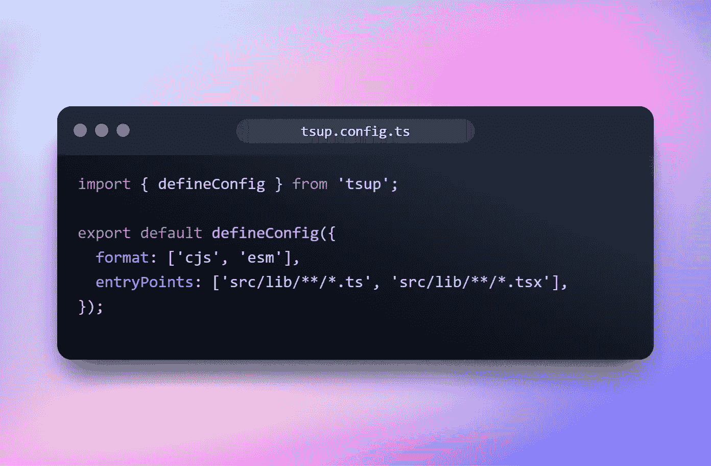

# 如何让你的图书馆树摇动

> 原文：<https://levelup.gitconnected.com/how-to-make-your-library-tree-shakable-20b5a446c1e2>

# 树摇晃

*树摇动*是 JavaScript 上下文中常用的术语，用于消除死代码。虽然现在许多捆绑器支持像 Rollup 或 Webpack 这样的树抖动，但树抖动不仅仅是一个开/关特性。要使摇树变得有价值，有许多因素影响质量

基本上，树抖动是在捆绑时检测哪些导出在我们的应用程序中没有使用，并且不会将它包含到我们的捆绑器中。

# 实现摇树

从树抖动的基本定义来看，许多捆绑器默认支持它，你可能不需要做任何事情。看看我下面的例子:

这是我的库，名为`common-ui`，我将我的代码分割成小模块，并将其全部导出到根`index.ts`文件中。这是我的 bundler 配置(tsup)和我建立后的`dist`文件夹

这是最基本的配置。我只设置了`entry`指向`index.ts`。因此，该文件未导出和使用的每一行代码都不会包含在我们的`dist`文件夹中。这样，你就实现了*死代码消除*对吗*？*

# 但是事情比这更复杂

如果没有使用它的应用程序，库就什么都不是，因为我的例子是 monorepo(你可以在这里看到如何创建一个)。我将创建一个包来使用这个库

`web`包将安装`common-ui`包并使用其组件:

您可以看到我从`common-ui`库中导入了 9 个组件，让我们看看我的`web`应用程序的包大小是多少

258kb，挺重的。因此，让我们看看我是否从`common-ui`库中删除了一些导入来减小包的大小

嗯…我试图删除一半的进口，但包的大小仍然相同。所以我上面做的`tree-shaking`的事情绝对没有帮助。

## 为什么？

这是因为**普通 JS 模块 VS ES6 模块**

**显著区别在于无害环境管理进口是静态的，而 CJS 进口是动态的**

TSup 使用`esbuild`作为它的捆绑器，它支持两种格式

树摇依赖于静态代码分析。它检测哪些模块是代码运行所必需的，并在编译时从最终包中删除其他模块。

**所以 ESM 是摇树功能的一个要求。**

让我们稍微修改一下配置文件

通过为 CommonJS 模块和 ES6 模块以及多个入口点设置格式，我们的包将如下所示

对于我们文件中的每个模块，CommonJS 和 ES6 模块分别有`.cjs`文件和`.js`文件。在我们的`package.json`文件中:

我们映射`.cjs`、`.js`和`.d.ts`文件，设置副作用优化，使我们的库副作用免费。现在让我们回到我们的`web`应用程序，看看当我删除导入时，包的大小是否变小了

您可以看到我移除了`CodeEditor`组件，并运行构建

捆绑的大小比上面的 260kb 要小，因为捆绑器检测到我们只使用了部分库，所以它不会将整个库包含到捆绑文件中。

# 结论

树摇图书馆不简单。它的质量取决于多种因素，本文介绍了基本要素。理解什么是捆绑输出和格式是使我们的库不可动摇的基础

你可以在这里查看我的源代码

# 遗言

虽然我的内容对每个人都是免费的，但是如果你觉得这篇文章有帮助，[你可以在这里给我买杯咖啡](https://www.buymeacoffee.com/kylele19)