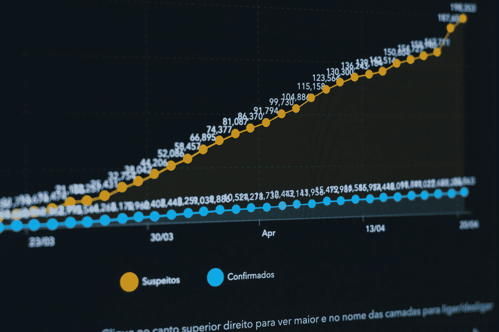
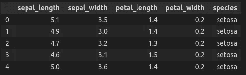
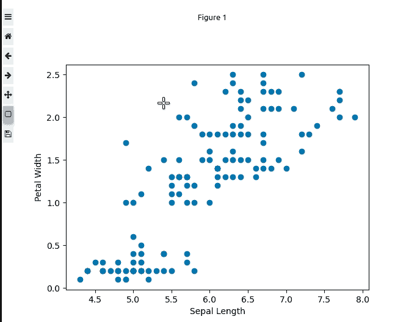
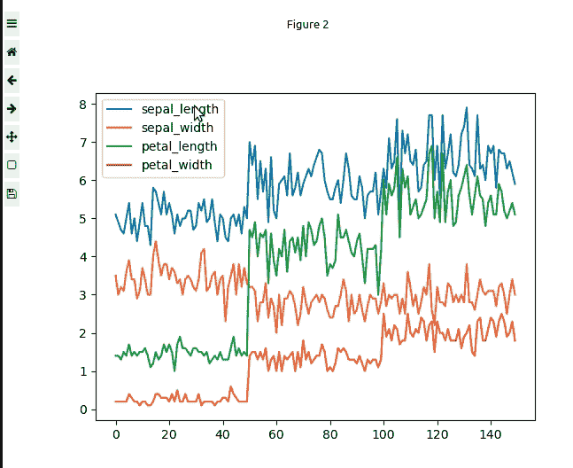
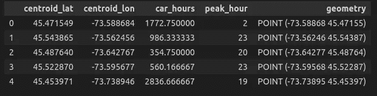
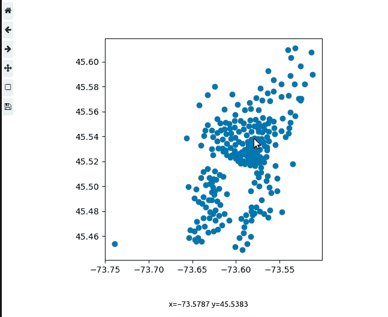

# 如何使你的 Matplotlib 图具有交互性

> 原文：<https://levelup.gitconnected.com/how-to-make-your-matplotlib-plots-interactive-587f5a0db293>

## 利用 Matplotlib 小部件扩展使您的绘图具有交互性、动态性和信息性

Matplotlib 已经成为许多数据科学家的主要可视化库。它被一些更受欢迎的库广泛用作后端可视化引擎，比如 seaborn 和 pandas。因此，在这一领域有许多进展也就不足为奇了，尤其是在努力使 Matplotlib 具有交互性和更加用户友好性方面。介绍`ipympl`，一个 Matplotlib 的 Jupyter 扩展，它为你的静态绘图添加了小部件和交互功能！



由 [KOBU 机构](https://unsplash.com/@kobuagency?utm_source=medium&utm_medium=referral)在 [Unsplash](https://unsplash.com?utm_source=medium&utm_medium=referral) 上拍摄的照片

在这篇文章中，我们将学习如何使用 Matplotlib 的小部件功能和一些基本功能来简化我们的可视化任务。

```
**Table of Content** 1\. Setup
2\. Interaction with Pandas
3\. Interaction with Geopandas
```

> 请订阅我的 [**电子邮件简讯**](https://tinyurl.com/2npw2fnz) ，在那里我会定期用简单的英语和漂亮的可视化语言总结编程技巧和人工智能研究论文。

# 设置

我们首先需要通过`conda`或`pip`安装`ipympl`。我总是建议使用`conda`来防止任何依赖冲突。

*   使用`conda`

```
conda install -c conda-forge ipympl
```

*   使用`pip`

```
pip install ipympl
```

为了能够激活 matplotlib 的小部件功能，我们需要这样启用它:

```
jupyter nbextension enable --py widgetsnbextension
```

安装完成后，我们可以通过打开一个新笔记本来导入本教程所需的库:

```
import pandas as pd
import geopandas as gpd
import matplotlib.pyplot as plt
```

而在笔记本本身，我们可以用下面的命令来修饰它:

```
%matplotlib widget
```

现在一切都完成了，我们可以开始教程了。

# 与熊猫的互动

我们将学习如何与熊猫互动，以建立我们的 matplotlib 互动情节。

首先，我们需要从在线源加载数据集。在这种情况下，我们将使用流行的`Iris`数据集来描述不同种类鸢尾花的特征。

```
iris = pd.read_csv('https://raw.githubusercontent.com/mwaskom/seaborn-data/master/iris.csv')iris.head()
```



我们的虹膜数据集(图片来自作者)

我们能够检查描述一种特殊鸢尾花的不同特征，包括它的`sepal_length`或`petal_width`。

现在让我们使用 Matplotlib 按常规绘制上面的数据帧。如果你不太熟悉这个库，我已经为你创建了一个简单的 cheatsheet 开始！

[](/matplotlib-ultimate-cheat-sheet-2021-2bcd1646f41e) [## Matplotlib 终极备忘单(2021)

### Python 中 Matplotlib 的完整指南，满足您的绘图需求

levelup.gitconnected.com](/matplotlib-ultimate-cheat-sheet-2021-2bcd1646f41e) 

```
plt.scatter('sepal_length', 'petal_width', data=iris)
plt.xlabel('Sepal Length')
plt.ylabel('Petal Width')
plt.show()
```



与熊猫的互动(图片来自作者)

做得好！我们可以放大并与之前使用小部件功能生成的图进行交互。

您还可以通过隐藏工具栏、标题或具有调整画布大小的功能来自定义如何查看交互式绘图。

```
fig.canvas.toolbar_visible = True
fig.canvas.header_visible = Falsefig.canvas.resizable = False
```

**不同的地块类型**

关于`ipympl`的强大之处在于它能够很好地与`pandas`底层的其他绘图功能协同工作。

我们将通过一些同行，包括线阴谋！

```
iris.plot()
```



线图交互(图片来自作者)

如果现在我们想使用`geopandas`绘制地理空间位置呢？下一节将处理这个问题！

# 与地质公园的互动

Geopandas 类似于 pandas，但它是专门为地理空间数据集构建的。该库还支持 matplotlib 作为其可视化引擎，因此，绘制交互式地理空间图表应该同样容易。

在本教程中，我们将使用区域平均汽车共享使用的开源数据集。

```
car = pd.read_csv("https://raw.githubusercontent.com/plotly/datasets/master/carshare.csv")
```

我们可以通过简单地调用`GeoDataframe()`方法将我们的 pandas 数据帧转换成 geopandas，在这里我们指定包含`geometry`信息和投影`crs`的列。

```
gdf = gpd.GeoDataFrame(car,geometry=gpd.points_from_xy(car.centroid_lon, car.centroid_lat), crs="EPSG:4326")
```

一个简短的数据子集将会给我们

```
gdf.head()
```



我们的 geopandas 数据集(图片来自作者)

然后，我们将能够轻松地绘制我们的`GeoDataframe`数据。

```
gdf.plot()
```



地理数据框架交互式可视化(图片来自作者)

如果您想添加底图，请在此处使用`mpl_toolkits`查看如何添加。

# **结论**

我们已经学习了如何在 Jupyter 笔记本环境中设置并激活`ipympl`库。此外，我们还演示了如何使用`pandas`和`geopandas`数据帧生成交互式图形。这种交互非常有用，尤其是当我们必须对某些数据进行子集划分或者以更深入的方式对特定的子群进行诊断时。我希望你和我学得一样多！一如既往，如果您有任何反馈，请随时留下回应！