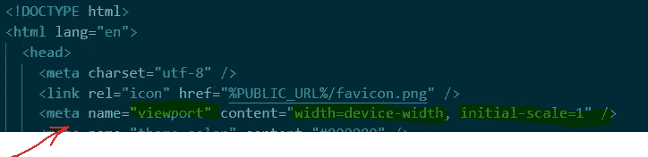
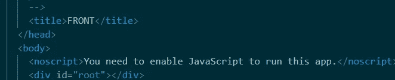
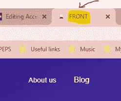
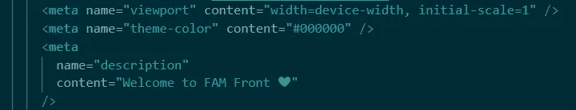
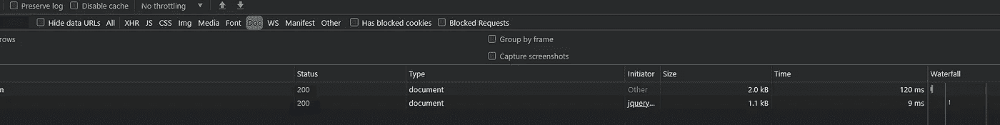
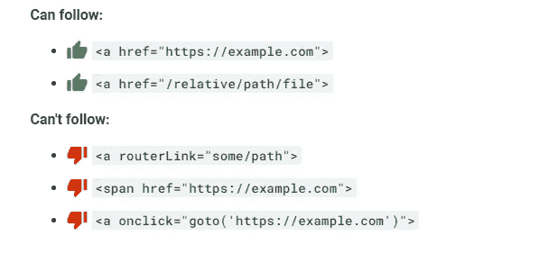
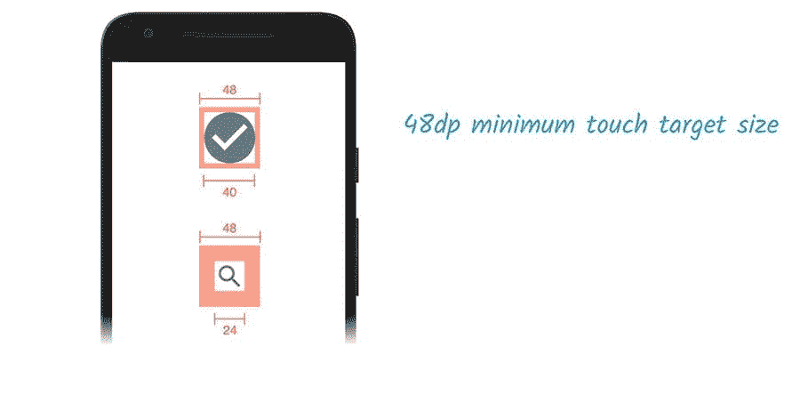

# 如何让你的网站在可访问性上排名 100%

> 原文：<https://levelup.gitconnected.com/how-to-make-your-website-rank-100-on-its-accessibility-83036422ae9a>

## 网站可访问性的 10 条终极规则

## 一个好的网站应该是每个人都可以访问的！


由 [FAM](http://www.fam-front.com)

**# 0-结构化数据应该有效**

> 搜索引擎使用结构化数据来了解页面上的内容。例如，您可以告诉搜索引擎您的页面是一篇文章、一个招聘启事或一个 FAQ。
> 
> 用结构化数据标记内容使其更有可能包含在丰富的搜索结果中。例如，标记为文章的内容可能会出现在与用户搜索的内容相关的热门故事列表中。— web.dev

要验证您的应用程序是否遵守此规则，您可以使用下面的谷歌搜索工具:

 [## 结构化数据测试工具

### 编辑描述

search.google.com](https://search.google.com/structured-data/testing-tool/u/0/) 

**# 1——一个网站应该有一个** `**<meta name="viewport">**` **标签，带** `**width**` **或** `**initial-scale**`

> 许多搜索引擎根据网页对移动设备的友好程度对其进行排名。没有[视口元标签](https://developer.mozilla.org/en-US/docs/Mozilla/Mobile/Viewport_meta_tag)，移动设备以典型的桌面屏幕宽度呈现页面，然后缩小页面，使其难以阅读。
> 
> 设置视口元标签可以控制视口的宽度和缩放比例，以便在所有设备上正确调整其大小。— web.dev

*   添加`<meta name="viewport">`标签，针对移动屏幕优化您的应用:



视口示例

你的应用程序的 DOM 应该有 `**<title>**` **元素**

标题很重要，因为它出现在最上面的图标旁边。标题为屏幕阅读器用户提供了页面的概览，搜索引擎用户非常依赖它来确定页面是否与他们的搜索相关。

*   将`<title>**Welcome to my beautiful website**</title>`添加到您的`index.html`中:



*   结果:



多姆的头衔

**# 3——你的应用程序的 DOM 应该有一个** `**meta**` **描述**

> 元素提供了搜索引擎在搜索结果中包含的页面内容的摘要。一个高质量的，独特的元描述使你的页面看起来更相关，可以增加你的搜索流量。— web.dev

*   可以在搜索结果中包括元描述来概括页面的内容:



DOM 的元描述

**# 4-您网站的页面应该返回一个成功的 HTTP 状态**

> 服务器为它们收到的每个资源请求提供一个三位数的 HTTP 状态码。400s 和 500s 中的状态代码[表示请求的资源存在错误](https://developer.mozilla.org/en-US/docs/Web/HTTP/Status#Client_error_responses)。如果搜索引擎在搜索网页时遇到状态代码错误，它可能无法正确索引该页面。— web.dev

*   具有不成功 HTTP 状态代码的页面可能无法被正确索引。



HTTP 状态

**# 5-链接应该有描述性文本**

> 链接文本是超链接中可点击的单词或短语。当链接文本清楚地传达了超链接的目标时，用户和搜索引擎都能更容易地理解你的内容以及它与其他页面的关系。— web.dev

*   描述性链接文本有助于搜索引擎理解你的内容。避免对一个环节进行以下描述:`click here`、`click this`、`go`、`here`、`this`、`more`。
*   好例子:

```
<p>To see all of our basketball videos, <a href="videos.html">**See basketball video**</a>.</p> 
```

你的网站链接不应该被抓取

> 只有当链接是一个带有 *href* 属性的`<a>`标签时，谷歌才能跟踪它们。使用其他格式的链接不会被谷歌爬虫跟踪。由于脚本事件，如果没有一个 *href* 标签或其他执行链接的标签，Google 就无法跟踪`<a>`链接。—谷歌搜索中心

*   搜索引擎可能使用链接上的`href`属性来抓取网站。确保锚元素的`href`属性链接到一个适当的目的地，这样你的网站就可以安全。
*   以下是一些谷歌可以关注和不可以关注的链接示例:



谷歌搜索中心

**# 7-您的** `robots.txt` **文件应该是有效的**

> 文件告诉搜索引擎他们可以抓取你网站的哪些页面。无效的`robots.txt`配置会导致两种类型的问题:
> 
> 它可以阻止搜索引擎抓取公共页面，导致您的内容在搜索结果中出现的频率降低。
> 
> 它可能会导致搜索引擎抓取您可能不想在搜索结果中显示的页面。— web.dev

*   如果你的`robots.txt`文件格式不正确。爬网程序可能无法理解您希望如何对您的网站进行爬网或索引。
*   如果您的文件无效，请检查以下常见错误:

该文件不包括:

*   `No user-agent specified`
*   `Pattern should either be empty, start with "/" or "*"`
*   `Unknown directive`
*   `Invalid sitemap URL`
*   `$ should only be used at the end of the pattern`

**有效的** `**robots.txt**` **文件示例:**

robots.txt

**# 8-图像元素应该有** `**[alt]**` **属性**

*   信息元素应该以简短的描述性替代文本为目标。

```

```

*   如果只是装饰性的，就用空的 alt 属性。

```

```

**# 9——你的 DOM 应该使用清晰的字体大小**

*   小于`**12px**` 的字体太小，难以辨认，需要移动访问者“捏放大”才能阅读。力争页面文字的`**>60%**`≥`**12px**`**。**

**#10 抽头目标的尺寸应适当**

*   像按钮和链接这样的交互元素应该足够大(`48x48` px)，并且在它们周围有足够的空间，足够容易点击而不会重叠到其他元素上。
*   增加太小的点击目标的大小。
*   如果需要，使用`margin`之类的属性增加太靠近的点击目标之间的间距。



网络开发

就这些，谢谢。❤

# 亲爱的读者，我希望这是明确和有用的。

我希望你和你的家人无论在哪里都平安无事！坚持住。明天会更好！

**联系一下** [**中**](https://medium.com/@famzil/)**[**Linkedin**](https://www.linkedin.com/in/fatima-amzil-9031ba95/)**[**脸书**](https://www.facebook.com/The-Front-End-World)**[**insta gram**](https://www.instagram.com/the_frontend_world/)**，或者**[**Twitter**](https://twitter.com/FatimaAMZIL9)**。********

****🔗[www.fam-front.com](http://www.fam-front.com/)****

******FAM******