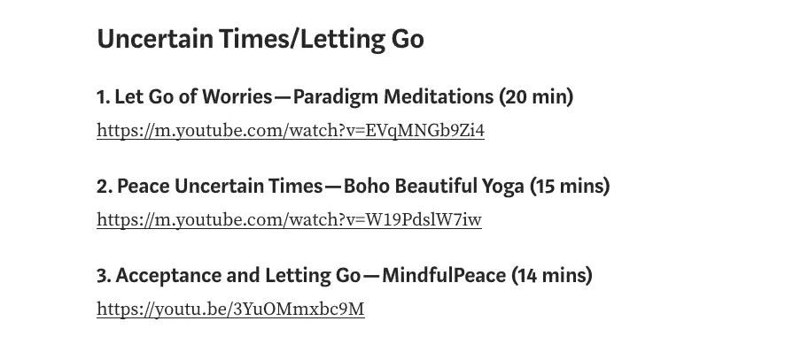
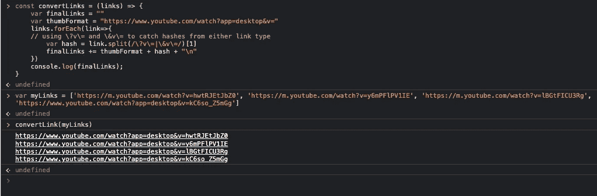
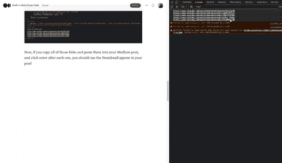
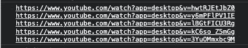
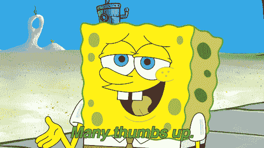

# 如何用 JavaScript 让 YouTube 链接在媒体上显示为缩略图

> 原文：<https://levelup.gitconnected.com/how-to-make-youtube-links-show-up-as-a-thumbnail-on-medium-with-javascript-1b6c966a4bca>

## 一个快速简单的功能，确保所有链接显示为缩略图！


[Eyestetix 工作室](https://unsplash.com/@eyestetix?utm_source=unsplash&utm_medium=referral&utm_content=creditCopyText)在 [Unsplash](https://unsplash.com/s/photos/YouTube?utm_source=unsplash&utm_medium=referral&utm_content=creditCopyText) 拍摄的照片

我最近在写一篇关于各种冥想的博客文章，当我意识到我保存在手机上的 Notes 应用程序中的所有链接都不会出现在我的文章中时，我在过去几年里真的喜欢上了这篇文章。



通常，当我在一个链接后按回车键时，如果缩略图可用，它会在几秒钟内出现。但出于某种原因，这些链接只显示为链接本身——没有缩略图格式。

我注意到的是，如果我将帖子中的链接复制/粘贴到我笔记本电脑的浏览器中，链接会发生变化。现在，在将浏览器中的新链接复制/粘贴到我的博客文章中后，缩略图几乎会在点击 Enter 后立即出现。

我决定在我的控制台中创建一个函数来处理转换，而不是为我的所有链接(我有超过 30 个链接)做整个复制/粘贴。现在你也可以用它了！

下面是您将用来转换链接的函数。

```
const convertLinks = (links) => {
  var finalLinks = ""
  var thumbFormat = "https://www.youtube.com/watch?app=desktop&v="
    links.forEach(link=>{
      var hash = link.split(/v\=/)[1]  
      finalLinks += thumbFormat + hash + "\n"   
    })
  console.log(finalLinks);
}
```

我们来分解一下。首先，该函数将接受一个字符串数组——这些字符串将是您已经拥有的 URL。

接下来，我们遍历提供的链接数组，分离出视频哈希(在`v=`之后)。我们可以通过使用`split`方法来分离散列。因为`=`是一个保留字符，为了在我们的 regex 语句中使用它，我们必须在它前面添加一个反斜杠。

之后，我们构建新的链接，它将在我们的媒体文章中显示缩略图。我们通过将`hash`附加到`thumbFormat`来实现这一点。为了方便用户，我在末尾添加了一个换行符(`\n`)。这样，当我们执行函数的最后一部分时，每个新链接将出现在字符串中它自己的行上。

函数的最后一部分只是为了`console.log`结果。让我们看看它的实际效果吧！首先，声明一个链接数组变量。

```
var myLinks = [
  "https://m.youtube.com/watch?v=hwtRJEtJbZ0", 
  "https://m.youtube.com/watch?v=y6mPFlPV1IE", 
  "https://m.youtube.com/watch?v=lBGtFICU3Rg", 
  "https://www.youtube.com/watch?app=desktop&v=kC6so_Z5mGg"
]

// the last one is a test to ensure the function 
// works with different link formats
```

将上述变量复制/粘贴到您的控制台中。完成后，在你的控制台中复制粘贴`convertLinks`功能。一旦你完成了，复制粘贴下面一行。

```
convertLink(myLinks)
```

您应该会看到下面的结果。



现在，如果你复制所有的链接并粘贴到你的文章中，然后点击回车，你会看到缩略图出现在你的文章中。



抱歉，闷闷不乐

## 奖金

你可能已经注意到了最后一个警告。看看这篇文章第一张图中的链接。最后一个，里面没有`v=`。它也有不同的域名。见下面两个网址对比。

```
// First link in myLinks
"https://m.youtube.com/watch?v=hwtRJEtJbZ0"

// Last link in first picture
"https://youtu.be/3YuOMmxbc9M"
```

我们如何在我们的函数中考虑像第二个这样的链接呢？我们可以做两个独立的`split`语句，如下所示。

```
var hash = link.split(/v\=/)[1] ?? link.split(/youtu.be\//)[1]
```

或者，我们实际上可以在我们的*原始正则表达式*中包含**两个条件**。见下文。

```
var hash = link.split(/v\=|youtu.be\//)[1]
```

我喜欢第二个，因为它更简洁一些。将它添加到您的函数中。

```
const convertLinks = (links) => {
  var finalLinks = ""
  var thumbFormat = "https://www.youtube.com/watch?app=desktop&v="
    links.forEach(link=>{
      var hash = link.split(/v\=|youtu.be\//)[1]  // added it here
      finalLinks += thumbFormat + hash + "\n"   
    })
  console.log(finalLinks);
}
```

现在更新您的`myLinks`值，以包含一个新格式的链接。

```
var myLinks = [
  "https://m.youtube.com/watch?v=hwtRJEtJbZ0", 
  "https://m.youtube.com/watch?v=y6mPFlPV1IE", 
  "https://m.youtube.com/watch?v=lBGtFICU3Rg", 
  "https://www.youtube.com/watch?app=desktop&v=kC6so_Z5mGg",
  "https://youtu.be/3YuOMmxbc9M"
]
```

现在，在您的控制台上测试一下吧！



维奥拉。你的功能现在可以处理一些不同种类的链接，你现在应该只能看到缩略图了！



你知道为什么原始链接不能显示缩略图吗？你现在了解 YouTube 视频网址吗？请在评论中告诉我！

[***升级您的免费 Medium 会员资格***](https://matt-croak.medium.com/membership) *并接收各种出版物上数千名作家的无限量、无广告的故事。这是一个附属链接，你的会员资格的一部分帮助我为我创造的内容获得奖励。*

*您也可以通过电子邮件* *订阅，每当我发布新内容时，您都会收到通知！*