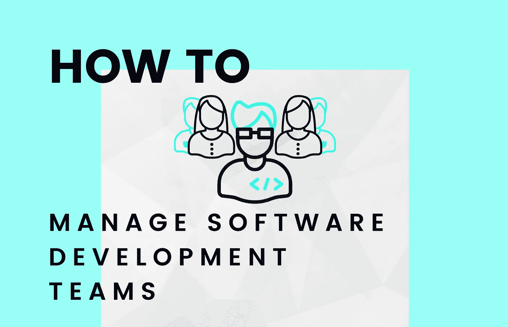

# 如何管理软件开发团队

> 原文：<https://levelup.gitconnected.com/how-to-manage-a-software-development-team-4661cea0d421>

## 要遵循的最佳实践和要避免的常见错误

确保一个快乐、投入和高效的开发团队对于每个软件公司的成长和成功都是至关重要的。因此，成功地管理软件团队将对商业成功产生直接影响。

虽然在软件开发中成功的团队管理并不只有一种方法——团队的具体需求会根据您的业务和行业的成熟阶段而有所不同——但是有一些最佳实践可以借鉴，也有一些常见的错误需要注意。

我们收集了来自工程领导的反馈，并整合了我们在 10 多个国家开展高增长、远程优先软件咨询业务的经验。

# 如何管理软件团队——该做什么，不该做什么

我们挑选了 Zartis 的一些顶级开发人员，他们告诉我们什么可行，什么不可行——这些都是基于他们在扩展开发团队中工作的真实经历。然后，我们将他们的关键见解提炼为几个简单可行的步骤，您可以从今天开始实施，从根本上改善您的业务。

让我们来看看最重要的发现。

## 1-对产品路线图进行包容性决策

虽然您不能忽视业务方面的考虑，但是在为新产品和新功能集思广益或设定上市期限时，一定要寻求技术部门的意见。设计讨论和白板必须是决策过程的关键方面，并且必须有工程团队的参与。

此外，销售和营销部门应与工程团队密切合作，分享他们对客户需求和市场发展方向的见解。这样，每个人都会在同一个页面上，你最终会得到一个客户喜欢的产品。

也不要忘记你的产品经理。记住:工程师和营销人员说的是完全不同的语言。因此，你需要既懂商业又懂技术的人来帮助你在开发部门和销售部门之间架起桥梁——而这正是一个伟大的产品经理应该做的。因此，确保你至少有一个技术高超的产品经理，以一种有利于销售并且从工程角度来看也是现实的方式来推动产品路线图

## 需要注意的事项:

*   销售和营销部门决定应该构建什么样的新功能，并为工程团队设定严格的(通常是不合理的)期限。
*   对新特性的需求很少考虑非功能性的需求，比如性能、可伸缩性或者测试覆盖率。
*   开发人员被期望一个接一个地生产额外的特性，没有时间讨论不同的解决方案和方法。

## 2-鼓励投入和讨论

当你团队中的每个人都相处融洽，步调一致时，这种感觉真好。然而，问题是它几乎…太可爱了。作为一名经理，你可能会注意到，有时你周围都是唯唯诺诺的人。这不仅扼杀了健康的辩论和建设性的批评，还切断了你和你的开发人员之间的交流。

坚持门户开放政策。确保开发团队中的每个人都知道你总是可以亲自或在线回答问题或讨论他们可能关心的任何问题。在做出关键技术决策时，不要忘记积极征求他们的意见。

## 需要注意的事项:

*   中层管理人员似乎总是同意你的观点，并且没有提出技术团队提出的问题。
*   中层管理人员可能会将积极的发展归功于自己，而将错误和失败归咎于工程团队。

## 根除任何指责文化

责备文化创造了一个有毒的环境，你的工程师避免承担创造性的风险，因为害怕最轻微的错误会给他们带来麻烦而建议改变。团队将满足于承担更少的责任，以保持尽可能小的误差幅度。因此，创新将停滞不前，你的公司将失去竞争优势。

不要对别人指指点点，也让公司里的其他人也这样做。目标是**将每一个错误或所谓的失败转化为一个学习的机会**和一个获得新观点的机会。组织如何解决常见问题的培训，并鼓励您的工程师和其他团队成员分享他们所犯错误的信息以及他们是如何解决这些问题的。

最后但同样重要的是，让公司的 KPI 测量**关注结果而不是产出**。这将使整个垂直公司对不良结果负责。实现这一点的一个方法是实施 OKR 系统——一个被众多技术领导者使用的工具，包括谷歌、脸书、网飞、Eventbrite 和许多其他公司。

## 需要注意的事项:

*   当遇到错误时，重点是找到责任方并让他们解决问题。
*   团队倾向于掩盖他们的错误，未能提前解决问题，并且不与他们的同事分享故障排除知识。

## 4-授权并避免微观管理

深呼吸，让你的开发者做他们的工作。你雇他们是有原因的。作为经理，你的角色不是控制，而是**启用**、**指导**、**支持**你的软件开发团队。大多数时候，管理软件团队取得成功需要授权。委派责任会给你的工程师授权，激励他们尽可能地负起责任并证明自己。

在 Zartis，我们不相信微观管理。我们所相信的是建立一个支持性和包容性的工作环境，同时鼓励我们的工程师不断发展新技能，成长为专业人士。

> ***“他们说‘如果你想走得快，就一个人走。如果你想去很远的地方，就一起去。作为经理，我们的工作是建立信任，提供适当的环境，并帮助我们的团队实现他们的目标。现实是我们不可能无处不在，但公司文化可以。”—安吉尔·贝尼托，zart is*T3 的首席技术官**

## 需要注意的事项:

*   经理们处理详细的电子表格，这些表格过于紧密地跟踪时间和其他资源的使用。
*   工程团队被视为一种资源，而不是创造性的思考者。
*   经理不信任他们的工程团队，要求知道每个人在做什么，在任务上花了多少时间。

## 5-平衡您的高级和初级开发人员

雇佣新的人才没有错。然而，初级开发人员需要持续的指导和训练。因此，如果您的团队中有经验较少的工程师，请确保分配足够的资源，以保证全面的入职流程和持续的后续培训。

这里的挑战是在指导新员工和微观管理他们(或者根本不投资他们的职业发展)之间找到微妙的平衡。

一旦最初的入职和培训过程结束，给工程师下达任务，告诉他们做什么而不是怎么做。这不是管理软件团队的问题。鼓励独立研究和持续学习，并考虑实施一个导师项目，让年轻的开发人员和有经验的工程师配对**。**

## **需要注意的事项:**

*   **团队中有太多初级开发人员，他们似乎既没有进步，也没有学习。**
*   **工程师们满足于没有创新空间的相对简单的任务。**
*   **任务分配有详细的操作说明，不鼓励开发人员进行独立研究和批判性思考。**
*   **初级工程师从更有经验的同事那里寻求指导和辅导的机会有限或没有。**

## **6-正确实施敏捷文化**

**敏捷已经风靡全球。它彻底改变了软件公司的结构、开发软件的方式，并通过快速的持续改进过程来适应不断变化的市场和客户需求。**

**变得敏捷伴随着一种特定的心态，这种心态改变了你对软件开发的思考方式。**

**花时间以最适合团队需求的方式正确地实现敏捷过程。以富有成效的方式计划和领导会议。将更多的注意力放在回顾结果上,并且总是准确地概述下一步需要采取什么行动——以及由谁来采取。**

**此外，如果某些会议或会议变得多余，要对修改旧的做法持开放态度。目标是变得敏捷，而不是创建更多的过程来“确保”敏捷。垂直敏捷过程和以软件为中心的方法也很关键。**

**下面是我们如何在内部流程中实施敏捷的方法——来自 Ignacio Lopez，团队领导:**

> **良好的敏捷流程有四个支柱:**
> 
> ****团队协议。**确保整个团队步调一致。**
> 
> ****通敌。向他人提供帮助。****
> 
> ****信任。没有微观管理，诚实地尽快提出你的问题。****
> 
> **任何失败都是改进的机会。回顾可能是敏捷的关键部分。**

## **需要注意的事项:**

*   **没用的单口相声。**
*   **没时间回顾，也不是所有人都跳进去。**
*   **从一个会话到下一个会话，追溯结果被忽略，并且不采取任何后续行动。**
*   **没有真正的白板或设计解决方案的无用的软件整理和改进。**
*   **敏捷过程不是垂直的，这导致优先考虑销售和营销，而不是交付优秀的软件和客户协作。**

# **结论**

**如果您想:**

*   ***留住技术人才***
*   ***开发畅销软件产品***
*   ***让您的工程师满意，进而让您的客户满意***

***专注于建立积极的企业文化，鼓励增长、创新和卓越，同时保持健康的工作生活平衡。***