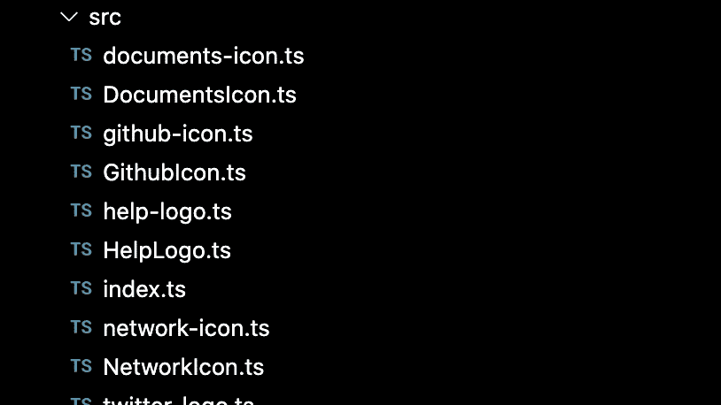

# 如何管理用户界面库中的图标(第 1 部分)

> 原文：<https://levelup.gitconnected.com/how-to-manage-icons-in-your-ui-library-part-1-49c6f875fb5d>

## 为你的图标创建一个有弹性的 Web 组件


# 介绍

在过去的几个月里，我一直在开发一个名为 [A2k](https://a2000.netlify.app/) 的小型 UI 库。

当我有时间的时候，我已经逐渐地做了一些改变，但是还没有考虑到图书馆架构的某些方面。

对于一些小而杂乱的东西，比如原型或概念验证，快速测试一个想法比完美地编码要好。对于其他项目，重要的是要考虑项目的架构如何随着时间的推移对项目产生积极或消极的影响。

很多小项目，比如 A2k，都是有机增长的。随着一个有机项目变得越来越大，一些不想要的模式开始出现。对于 A2k 处理图标的方式，我发现了一种不可取的模式。

对于添加的每个图标，我会用 web 组件样板 SVG 的内容创建一个文件。我还需要创建另一个文件来注册组件。这相当于每个图标有两个文件和大量共享代码。

以下是将首批 SVG 图标添加到 A2k 后的文件夹结构:



只有半打图标，这种方法已经变得笨拙。此外，[命名惯例](https://backlight.dev/blog/naming-conventions-for-design-systems) (Logo vs Icon 有人知道吗？).第三，添加一个新图标需要一堆样板文件。

这种方法不仅会影响开发体验和代码复杂性，还会影响那些使用 A2k 的人。因为每个图标都是一个组件，所以消费者需要注册他们打算使用的所有图标。如果没有显式导入图标，它将不会呈现。

这种方法不适合 A2k。我想要:

*   一个简单的 API，一个自定义元素来管理它们。
*   最终用户不必明确注册他们想要使用的图标。
*   我们所有的 SVG 图标都来自一个文件，这意味着我们只发出一个网络请求。
*   保证所有图标的约束，因为单个图标增加了熵的可能性。

我的方法？重构库，以便最终用户只需注册一个 web 组件。他们想要使用的图标将被指定为该组件的一个属性。

我也有兴趣了解其他库和作者是如何解决这个问题的。这些库中的大多数都有不同的需求和约束，因此理解不同的观点将有助于我们批判性地思考哪种选择最适合我们给定的情况。

因此，我将把这个系列文章分成两部分。

第 1 部分将遵循 A2k 的重构，涵盖如下概念:

*   使用 SVG 的`use`元素
*   使用`em` s 调整图标大小
*   使用`import.meta`导入资产

第 2 部分将分享更多已建立的组件库和作者使用的可选图标策略。

# 第 1 部分:图标剖析和重构

我在介绍中提到，每个组件都需要标准的 web 组件样板文件。当我使用 Lit 编写 web 组件时，每个图标组件看起来都像这样:

```
import { LitElement, svg } from 'lit';export class HelpIcon extends LitElement {
  render() {
    return svg`
      <svg
	      viewBox="0 0 24 24"
	      fill="none"
    >
      {all the child SVG elements}
    </svg>
    `;
  }
}
```

这在浏览器中表现得非常好:


它看起来不错，代码足够简单。主要问题是样板文件与其他图标组件相同。所以，让我们开始把我们的图标整合成一个单一的组件。

要做到这一点，我们需要了解我们所掌握的实现这一目标的工具。

# SVG 使用

为了将图标 web 组件从 SVG 图像中分离出来，我们需要引用一个外部文件中的 SVG 图像。我们可以通过使用 SVG 的 [use](https://developer.mozilla.org/en-US/docs/Web/SVG/Element/use) 元素来实现这一点。

`use`元素允许我们引用一个 SVG 图像，并在使用`use`元素的地方克隆它。如果同一个图像在几个地方使用，这是减少重复 SVG 逻辑的极好方法。

对于我们的用例来说，`use`是一种方便的分离关注点的方法。我们的图标组件只关心渲染，而一个外部的`.svg`文件存放了我们所有的图标。

我们重构后的代码看起来有点像这样:

```
*// More on this statement later*
const url = new URL('../../a2k-icons.svg', import.meta.url).href;export class A2kIcon extends LitElement {
  *// More on these styles later*
  static styles = css`
    :host {
      display: flex;
      align-items: center;
      justify-content: center;
      font-size: 2em;
    }
  `; @property({ type: String })
  icon = ''; render() {
    if (!this.icon) {
      console.warn(
        "This icon is a missing a 'name', please specify the 'name' of the icon you want to display"
      );
    } return svg`
			// More on these styles later
      <svg height="1em" width="1em">
        <use href="${url}#${this.icon}"></use>
      </svg>
    `;
  }
}
```

你可以看到我们仍然用顶级的`svg`元素包装我们的标记。

然后我们使用`use`来克隆位于`href`路径的 SVG 映像。传递给`href`的值是文件的绝对路径和对特定图标`id`的引用的组合。

我们现在需要移到 SVG 图标所在的`a2k-icons.svg`。这是我们在 SVG 上迁移后的`a2k-icons.svg`的样子:

```
<svg >
  <symbol id="help" width="1em" height="1em" viewBox="0 0 24 24">
    {/**<!-- SVG nodes like <rect /> -->**/}
  </symbol> <symbol id="documents" width="1em" height="1em" viewBox="0 0 24 24">
    {/**<!-- SVG nodes like <rect /> -->**/}
  </symbol> {/**<!-- Other SVG icons -->**/}
</svg>
```

这个文件有一个顶级的`svg`元素，但是我们的单个图标被包装在一个[符号](https://developer.mozilla.org/en-US/docs/Web/SVG/Element/symbol)元素中。元素用于定义一个可以通过元素`use`克隆的元素。幸运的是，`symbol`接受像`viewBox`、`height`、`width`等属性。，让我们可以轻松地将图片从 web 组件转移到`a2k-icons`文件中。

此时，我们的最终用户将能够显示图标，通过属性提供图标的名称，如下所示:

`<a2k-icon icon="help"></a2k-icon>`

现在，我们可以将所有的 SVG 从其他单独的图标组件迁移到`a2k-icons.svg`文件中。一旦我们这样做了，我们可以删除所有未使用的组件(这非常令人满意)。这是我们的文件夹结构现在的样子:


这种方法并不是没有警告，通过将所有的 SVG 捆绑到一个文件中，我们通过一个网络请求将所有的 SVG 提供给我们的最终用户。对于导出 1000 个以上图标的库，这将导致更长的加载时间和更差的用户体验。正如我们将在第 2 部分中看到的，不同的方法都有其优点和缺点。

# 等等艾米。你是说莱姆斯吗？！

web 开发界的共识是我们通常应该选择使用`rem`单元而不是`em`单元。我百分之百同意。基本原理超出了本文的范围，但是如果你有兴趣了解何时使用最常见的 CSS 单元，那么我不能推荐 Josh Comeau 的精彩文章“[关于像素和可访问性的惊人真相](https://www.joshwcomeau.com/css/surprising-truth-about-pixels-and-accessibility/)”。

这些是我们在这里将要讨论的单位:

*   em —相对 CSS 单位，其值基于元素的字体大小
*   rem 相对 CSS 单位，其值基于根的字体大小

以下列元素为例:

```
<div style="font-size: 21px">
  <p style="font-size: 1rem">This is rem text</p>
  <p style="font-size: 1em">This is em text</p>
</div>
```

假设文档的根的字体大小为 16px，那么我们的第一段将以 16px 显示，而我们的第二段将以 21px 显示。

上面的标记将在浏览器中呈现如下:那么为什么我选择使用`em` s 来调整图标大小呢？


这是我从 [Every Layout](https://every-layout.dev/layouts/icon/) 电子书中学到的东西。如果你打算给你的图标配上文字，使用`em`会是一个特别方便的技巧。正如我们在上面的例子中看到的，第二个段落的字体大小是相对于从其父段落继承的字体大小的。这是确保两个紧密联系的元素同步增长和收缩的简便方法。

通过编写以下组件，您可以看到这一点:

```
export class A2kTextIcon extends LitElement {
  static styles = css`
    :host {
      font-size: 24px;
    }
  `; render() {
    return html`
      <div>
        <a2k-icon icon="help"></a2k-icon>
        <p>Help</p>
      </div>
    `;
  }
}
```

我们所做的只是创建一个新的组件，该组件呈现我们先前存在的图标组件，但添加了一些伴随的文本。在`a2k-icon`组件中使用`em`和在`A2kTextIcon`的样式属性中使用显式的`font-size: 24px`，意味着段落和图标都将相对于其父级的大小进行缩放。

如果您对将图标与文本结合起来不感兴趣，那么您可以显式地设置图标的大小，或者让图标占据其容器的整个宽度。对于某些用例来说，这两种方法都是有效的选择，但是超出了本文的范围。

如果你想了解更多关于构建弹性图标布局的知识，那么 [Every Layout](https://every-layout.dev/) 这本书是一个很好的资源。它涵盖了很多有趣的领域，比如垂直对齐你的图标，感知匹配文本的高度，以及使用逻辑属性来应用间距。

# import.meta

所以现在我们已经创建了`a2k-icons.svg`文件，重要的是我们可以正确地引用它。

你会发现通过相对 URL 引用一个静态文件就像这样…

```
<use href="../../svg-icons.svg" />
```

…行不通。

这是因为 web 组件中的路径是相对于根文档的，所以您需要创建一个直接指向静态文件的绝对路径。


现代 Web 的优秀人员对这种行为进行了更深入的研究，他们建议用`import.meta.url`引用可重用资产。

下面是我们如何在我们的`A2kIcon`组件中使用它:

```
const url = new URL('../../a2k-icons.svg', import.meta.url).href;
```

为了理解这里发生的事情，让我们将这个声明分成三个部分:

*   `import.meta.url`
*   `../../a2k-icons.svg`
*   `new URL(...).href`

首先，`import.meta.url`返回当前 ES 模块的绝对 URL，本例中为`A2kIcon.ts`。

如果您运行一个开发服务器，并记录`import.meta.url`，您将看到如下内容:

`[http://localhost:3000/@fs/Users/Repos/andricos-2000/packages/icons/lib/src/A2kIcon.js](http://localhost:3000/@fs/Users/Repos/andricos-2000/packages/icons/lib/src/A2kIcon.js)`

其次，我们有`../../a2k-icons.svg`，它是我们想要访问的文件的相对路径。这个路径相对于`A2kIcon`在文件系统中的位置。

最后，我们可以使用`URL()`构造函数来生成目标文件`a2k-icons.svg`的绝对路径。

我们将传递给`URL()`的第一个参数是目标文件的相对路径。第二个参数是我们的基本 URL，它是从`import.meta.url`获得的。

下面的表达式:

```
const url = new URL('../../a2k-icons.svg', import.meta.url).href;
```

…为我们提供了`a2k-icons.svg`的绝对 URL:

`[http://localhost:3000/@fs/Users/Repos/andricos-2000/packages/icons/a2k-icons.svg](http://localhost:3000/@fs/Users/Repos/andricos-2000/packages/icons/a2k-icons.svg)`

因此，当在本地服务器上运行我们的站点时，这很好，但是一旦包被捆绑，它还能工作吗？

我不能代表所有捆绑商发言，但 Vite 支持我们对`URL()`开箱即用的呼吁。它将确保 URL 指向正确的位置，即使在捆绑和资产散列之后。不幸的是，这种方法不适用于在服务器上呈现的组件，也不适用于在运行时生成 URL。要了解关于这些限制的更多信息，请查看 [Vite 文档](https://vitejs.dev/guide/assets.html#new-url-url-import-meta-url)。

Vite 使用`import.meta`有一个[已知问题](https://github.com/vitejs/vite/issues/7287)，会让消耗你的图标库的开发者头疼。Vite 优化依赖关系的方式在运行开发服务器时会导致问题，组件不再能够访问它的`import.meta.url`值。这将破坏使用`new URL()`生成的任何 URL。如果您遇到这个问题，您需要将以下内容添加到您的`vite.config.js`

```
export default {
  optimizeDeps: {
    exclude: ['@a2000/icons'], *// or whatever dependency you're having trouble with*
  },
};
```

# 这是一个合适的方法吗？

在文章的开始，我分享了转向这种方法的基本原理。概括来说，它们是:

*   针对单个组件的简单 API。
*   最终用户只需要注册一个图标。
*   所有图标都通过一个文件提供。
*   改进了 DX，因为我们可以保证所有图标都有相同的约束。

我们通过使用一些有趣的浏览器概念实现了这一点，例如:

*   SVG 的`use`元素
*   何时使用`ems`而非`rems`
*   使用`import.meta`构建绝对 URL

我们的方法也有缺点，包括:

*   最终用户将会下载他们不使用的图标。
*   根据我们库中图标的数量，包的大小可能会变大。正如我们将在第 2 部分中讨论的，一些库的图标总数超过 1000 个。
*   最终用户不能通过我们的图标组件使用他们的图标库。

根据您的库，这些缺点可能是微不足道的，也可能会导致最终用户体验的降低。那么，其他图书馆是如何处理这个问题的，有什么缺点呢？我们将在第 2 部分中讨论这个问题。敬请关注。

如果你有一个图标库，采用一种新颖的方法来管理你不同的图标，那么请留下评论，或者在 Twitter 上联系我。我正在为第 2 部分构建一个图标库列表进行比较，并且很乐意了解任何在野外使用的有趣方法。

*原载于*[*https://back light . dev*](https://backlight.dev/blog/how-to-manage-icons-in-your-UI-library-part-1)*撰写于 2022 年 7 月 7 日*[@ AndricoKaroulla](https://twitter.com/AndricoKaroulla)*。*

# 分级编码

感谢您成为我们社区的一员！在你离开之前:

*   👏为故事鼓掌，跟着作者走👉
*   📰查看[升级编码出版物](https://levelup.gitconnected.com/)中的更多内容
*   🔔关注我们:[Twitter](https://twitter.com/gitconnected)|[LinkedIn](https://www.linkedin.com/company/gitconnected)|[时事通讯](https://newsletter.levelup.dev)
*   🚀👉 [**软件工程师的顶级工作**](https://jobs.levelup.dev/)