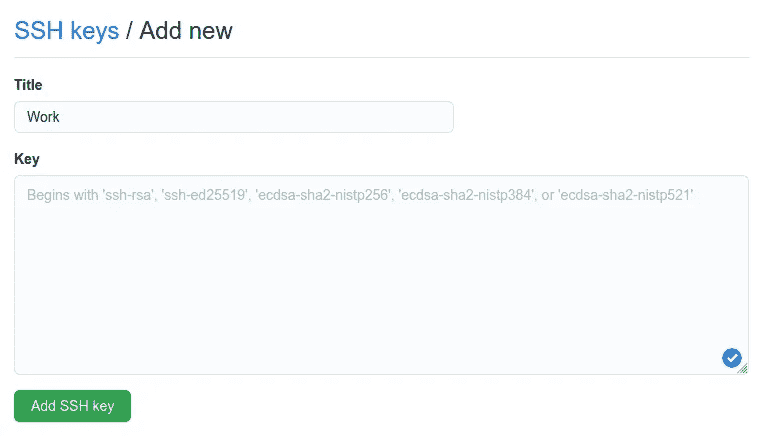

# 如何使用 SSH 密钥管理多个 GitHub/GitLab/Bitbucket 帐户

> 原文：<https://levelup.gitconnected.com/how-to-manage-multiple-github-gitlab-bitbucket-accounts-using-ssh-keys-1c5d75ab3345>


如果您使用过 Git 命令行实用程序，您可能已经注意到 Git 经常需要用户凭证来通过 HTTP 执行操作，尤其是当存储库是私有的时候。可以将用户凭证永久存储在 Git 凭证存储中，以避免反复输入，但是如果您必须在另一个帐户上的远程存储库上工作，这种方法就行不通了。对于采用双因素身份验证的系统来说，这变得更加复杂，因为您用于密码的令牌是随机生成的，并且无法发音。

我们可以通过使用 SSH(安全外壳)来解决这个问题。SSH 使用一对密钥来启动远程方之间的安全握手。此外，它比基于密码的认证更安全。

在本文中，我将解释在一台机器上设置多个基于 Git 的代码托管平台帐户的步骤——GitHub、GitLab、Bitbucket 等。我将要描述的方法依赖于将属于不同帐户的工作分离到不同的目录中，并编辑`~/.gitconfig`文件，这样 Git 可以自动识别哪个目录属于哪个帐户。所以，让我们开始吧！

# 1.生成新的 SSH 密钥对

您可以在 macOS、Linux 和 Windows 上使用以下命令生成新的 SSH 密钥对:

```
$ ssh-keygen -t rsa -b 4096 -C "[your_email@example.com](mailto:your_email2@example.com)" -f ~/.ssh/id_rsa_github_personal
```

如果你在 Windows 上，你必须在 *Git Bash* 中运行这个命令。并且记住在生成密钥时提供一个有意义的文件名。如果你不使用`-f`选项，程序会提示你输入一个文件名。上述命令将生成两个密钥:

*   公钥:`~/.ssh/id_rsa_github_personal.pub`
*   私钥:`~/.ssh/id_rsa_github_personal`

公钥类似于物理锁，您与远程服务器共享它来加密您的数据，而私钥存储在您的文件系统中的一个安全位置，稍后将用于“解锁”受保护的数据。唯一的区别是 SSH 使用公钥加密算法(RSA、DSA)来执行这些任务。

# **2。将 SSH 公钥添加到您的帐户**

与远程服务器共享公钥(以`.pub`结尾)。通过在文本编辑器中打开文件，将公钥的内容复制到剪贴板。或者您可以像这样直接从终端将其复制到剪贴板:

*   **macOS** : `pbcopy < ~/.ssh/id_rsa_github_personal.pub`
*   **Linux** : `xclip -sel clip < ~/.ssh/id_rsa_github_personal.pub`
*   **Windows (Git Bash)** : `cat ~/.ssh/id_rsa_github_personal.pub | clip`

现在将您的 SSH 公钥粘贴到您的帐户中。在 GitHub 上，用户界面是这样的:



在 GitHub 上添加新的 SSH 密钥

将您的公钥粘贴到上面的文本框后，单击“添加 SSH 密钥”。您可以通过这些直接链接向您的帐户添加新的 SSH 密钥:

*   **GitHub** : [给你的 GitHub 账号添加一个 SSH 密钥](https://github.com/settings/ssh/new)
*   **GitLab** : [向您的 GitLab 帐户添加 SSH 密钥](https://docs.gitlab.com/ee/ssh/README.html#adding-an-ssh-key-to-your-gitlab-account)
*   **Bitbucket** : [给你的 Bitbucket 账户添加一个 SSH 密钥](https://support.atlassian.com/bitbucket-cloud/docs/set-up-an-ssh-key/)

***对于你所有的个人和专业账户，按照前两步操作，记得给你的密钥使用有意义的文件名(这样你就能认出哪个密钥属于哪个账户/网站)。***

# 3.编辑 gitconfig 文件

在这一步，你必须编辑`.gitconfig`文件。您可以在以下位置找到该文件:

*   **Linux 和 macOS** : `~/.gitconfig`
*   **视窗** : `C:\Users\<username>\.gitconfig`

在文本编辑器中打开该文件，以定义目录和 Git 配置文件之间的多个一对一映射。Git 有一个`[includeIf]`指令，允许您在指定的条件评估为`True`时使用不同的配置文件。这个指令是在 Git 版本 2.13.0 中引入的，所以在继续之前请检查您的版本:`git --version`。如果需要，升级您的 Git 客户端。

这是我的`.gitconfig`文件的样子:

用于管理多个账户的示例`.gitconfig`文件

在文件的开头定义全局(默认)配置。使用`sshCommand`变量设置 SSH 私有密钥的路径。设置该变量后，`git fetch`和`git push`需要连接到远程系统时将使用指定的命令。全局配置将在执行 Git 操作的任何地方使用，除非您位于与`[includeIf]`指令匹配的目录中。

为其他帐户创建一个单独的 Git 配置文件，并在`[includeIf]`指令中指定它们的文件系统路径。只有当您当前的工作目录与在`gitdir:`之后指定的 glob 模式匹配时，才会使用这个文件中的配置。阅读 [git-config 文档](https://git-scm.com/docs/git-config#_includes)了解更多细节。

下面是一个`~/.gitconfig_github_work` 文件的例子:

为您的所有帐户创建配置文件。

现在，您可以通过克隆一个私有存储库，或者在现有存储库中调用`git config user.email`来验证这个设置。

**注意:** `[includeIf]`条件配置只适用于 git 仓库。它不会反映普通目录中的任何更改，并使用全局配置作为后备。

# 结论

伙计们，这就是了！这没什么太复杂的，在执行 Git 操作时，您不再需要手动修改任何配置文件。希望你觉得这有用！请在下面的评论区分享你的观点和建议。