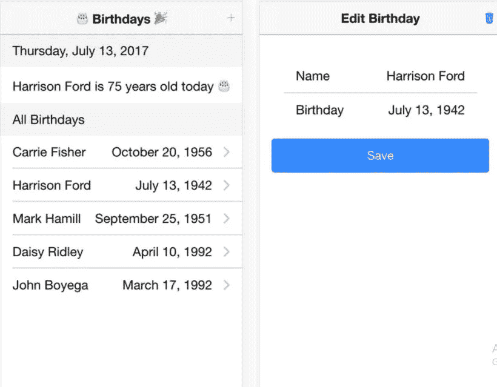

# 面向角度和离子应用的 MobX

> 原文：<https://levelup.gitconnected.com/how-to-manage-state-in-ionic-2-apps-with-mobx-df659de6a8aa>

## 本教程涵盖了在 Angular 和 Ionic 3 (v2+)应用程序中使用 MobX 管理状态

我们在本教程中创建的 Ionic 应用程序是一个简单的生日追踪器。你可以`add` / `update` / `delete`生日，它还会显示当天人的生日。

# MobX 是什么？

MobX 是一个帮助您管理应用程序状态的库，重点是简单性。与 Redux 相比，MobX 的一个优势是它不需要那么多样板代码。

MobX 和 Redux 都是由 React 社区的成员开发的，用于管理 React 应用程序中的状态，但两者都可以在用其他框架(如 Angular 或 Vue)构建的应用程序中使用。

为了理解 MobX，在阅读本教程时最好记住它的理念:

> ***任何可以从应用程序状态中派生出来的东西，都应该被派生出来。自动地。***

# 商店

使用 MobX 时的一个[良好实践](https://mobx.js.org/best/store.html)是将任何管理状态的逻辑移出组件，并移入一个**存储库**。例如，在我们的应用程序中，商店将包含生日数组。这不是必需的——您仍然可以在组件中管理状态，但是在商店中这样做更具可伸缩性。

为了让 MobX 检测状态的变化，我们需要告诉它要跟踪哪些属性。我们可以通过使用以下装饰器来做到这一点:`@observable`和`@computed`。

## @可观察

`@observable`应该用于可以改变的属性。例如，在这个应用程序中，我们将在商店中有一个生日对象数组，我们可以在数组中添加/更新/删除项目。

通过用`@observable`修饰数组，MobX 将自动检测数组中发生的变化，并提醒组件应该更新它们的视图。正因为如此，我们可以将`ChangeDetectionStrategy`设置为`OnPush`，这样会提高 app 的性能。

> *为了更好地理解变化检测* [*阅读本*](http://blog.angular-university.io/how-does-angular-2-change-detection-really-work/) *。*

## @computed

`@computed`用于可以从`@observable`属性派生的属性。

例如，今天的生日列表可以从所有生日列表中导出。我们可以为`birthdaysToday`属性编写一个 getter 方法，它将包含过滤所有生日列表所需的逻辑。

MobX 将检测 getter 中使用了哪些`@observable`属性，当这些属性发生变化时，它将更新计算出的值。

## TL；速度三角形定位法(dead reckoning)

综上所述，您只需要在代码中添加一些装饰器，您的应用程序就会在状态改变时神奇地自我更新。

**不相信我？让我们开始构建我们的应用程序，你会发现它真的那么简单！:)**

# 创建应用程序

我们将从创建 Ionic 3 应用程序开始

```
$ ionic start ionic3-tutorial-mobx blank
$ cd ionic3-tutorial-mobx
```

# 安装依赖项

我们需要安装`mobx`和`mobx-angular`。

```
$ npm install mobx mobx-angular --save
```

我们将使用的另一个依赖项是`angular-uuid`来生成唯一的 id。

```
$ npm install angular2-uuid --save
```

# 定义生日

我们先来定义一下什么是生日对象。

```
// location: src/models/birthday.tsimport { observable, computed } from 'mobx-angular';export class Birthday {  
    id: string;
    @observable name: string;
    @observable date: string; constructor() { } @computed get parsedDate(): Date {
        return new Date(this.date);
    }
}
```

如你所见，我用`@observable`装饰了`name`和`date`。用户可以更改这些值，因为有了`@observable`装饰器，MobX 知道它需要跟踪这些属性的变化。

`date`将包含 ISO 格式的生日，但是我们稍后需要它作为一个实际的`Date`对象，所以我为它创建了一个`@computed`属性。

我之前提到过，这意味着每次`date`的值发生变化，MobX 都会自动更新`parsedDate`的值。

# 定义生日商店

`BirthdayStore`将包含`birthdays`数组和在该数组中添加/更新/删除项的方法。

```
// location: src/stores/birthday.store.tsimport { observable, action, computed } from 'mobx-angular';  
import { Injectable } from "@angular/core";  
import { Birthday } from '../models/birthday';  
import { UUID } from 'angular2-uuid';@Injectable()
export class BirthdayStore {  
    @observable birthdays: Birthday[] = []; @action addBirthday(birthday: Birthday) {
        birthday.id = UUID.UUID();
        this.birthdays.push(birthday);
    } @action deleteBirthday(birthday: Birthday) {
        let index = this.birthdays.findIndex(b => b.id == birthday.id);
        this.birthdays.splice(index, 1);
    } @action updateBirthday(birthday: Birthday) {
        let index = this.birthdays.findIndex(b => b.id == birthday.id);
        this.birthdays[index] = birthday;
    }
}
```

您可能注意到我们正在使用另一个 MobX 装饰器:`@action`。您不需要使用这个装饰器，没有它 MobX 仍然可以工作，但是使用这个装饰器明确定义可观察属性的突变发生在哪里是一个好的实践。

> *如果要强制使用* `*@action*` *，可以告诉 MobX 到* [*使用严格模式*](https://mobx.js.org/refguide/action.html) *。*

我们的应用程序还需要今天的生日列表。由于这可以从`birthdays`数组中导出，我们将使它成为一个`@computed`属性，并将其添加到`BirthdayStore`。

```
@computed get birthdaysToday() {
    let today = new Date(); return this.birthdays
        .filter(b => b.parsedDate.getMonth() == today.getMonth() &&
                     b.parsedDate.getDate() == today.getDate())
        .map(b => ({
            name: b.name,
            age: today.getFullYear() - b.parsedDate.getFullYear()
        }));
}
```

MobX 将知道 getter 使用了`birthdays`数组，因此每当该数组发生变化时，它将为`birthdaysToday`重新运行 getter。

# 构建用户界面

我们将为我们的应用程序创建 2 个页面，一个显示生日列表(主页)，一个添加/编辑/删除生日(详细信息页面)。

# 主页

我们将首先实现模板**home.html**，它将显示两个列表:今天的生日和来自`BirthdayStore`的所有生日。

为了让 MobX 自动更新页面，我们需要使用`*mobxAutorun`指令(由 mobx-angular 提供)。

```
<ion-header>  
  <ion-navbar>
    <ion-title>
      🎂 Birthdays 🎉
    </ion-title>
    <ion-buttons end>
      <button ion-button (click)="showDetail()">
          <ion-icon name="add"></ion-icon>
      </button>
    </ion-buttons>
  </ion-navbar>
</ion-header><ion-content class="home" *mobxAutorun>  
  <ion-item-group>
    <ion-item-divider color="light">{{ today | date:'fullDate' }}</ion-item-divider>
    <ion-item *ngIf="store.birthdaysToday.length == 0">
      <div>No cake 🎂 today...</div>
    </ion-item>
    <ion-item *ngFor="let birthday of store.birthdaysToday">
      {{ birthday.name }} is {{ birthday.age}} years old today 🎂
    </ion-item>
  </ion-item-group> <ion-item-group>
    <ion-item-divider color="light">All Birthdays</ion-item-divider>
    <button ion-item *ngFor="let birthday of store.birthdays" (click)="showDetail(birthday)">
        <div>{{ birthday.name }}</div>
        <div item-end>{{ birthday.date | date:'yMMMMd' }}</div>
    </button>
  </ion-item-group>
</ion-content>
```

在 **home.ts** 中，我们需要注入`BirthdayStore`以便能够在模板中使用它。

如前所述，我们现在可以将变化检测策略设置为`OnPush`，这将提高我们应用程序的性能。

```
import { Component, ChangeDetectionStrategy } from "@angular/core";  
import { ModalController, NavController } from 'ionic-angular'; import { Birthday } from '../../models/birthday';  
import { BirthdayStore } from '../../stores/birthday.store';  
import { DetailsPage } from '../details/details'; @Component({
  selector: 'page-home',
  templateUrl: 'home.html',
  changeDetection: ChangeDetectionStrategy.OnPush
})
export class HomePage {  
    public today = new Date(); constructor(
        public nav: NavController,
        public modalCtrl: ModalController,
        public store: BirthdayStore) {
    } showDetail(birthday: Birthday) {  
        let modal = this.modalCtrl.create(DetailsPage, { birthday: birthday });
        modal.present();
    }
}
```

# 详细信息页面

使用以下命令添加新页面:

```
$ ionic g page details
```

为**details.html**中的模板添加以下代码。

```
<ion-header>  
  <ion-navbar>
    <ion-title>{{ action }} Birthday</ion-title>
    <ion-buttons end *ngIf="!isNew">
      <button ion-button (click)="delete()">
          <ion-icon name="trash"></ion-icon>
      </button>
    </ion-buttons>
  </ion-navbar>
</ion-header><ion-content padding class="details">  
  <ion-list inset>
    <ion-item>
      <ion-label>Name</ion-label>
      <ion-input text-right type="text" [(ngModel)]="birthday.name"></ion-input>
    </ion-item>
    <ion-item>
      <ion-label>Birthday</ion-label>
      <ion-datetime displayFormat="MMMM D, YYYY" pickerFormat="MMMM D YYYY" [(ngModel)]="birthday.date"></ion-datetime>
    </ion-item>
  </ion-list>
  <button ion-button block (click)="save()">Save</button>
</ion-content>
```

将以下代码添加到`details.ts`。我们在这里再次注入了`BirthdayStore`，这样我们就可以调用添加/更新/删除方法。

```
import { Component } from '@angular/core';  
import { NavController, NavParams, ViewController } from 'ionic-angular';  
import { Birthday } from '../../models/birthday';  
import { BirthdayStore } from '../../stores/birthday.store';@Component({
    selector: 'page-details',
    templateUrl: 'details.html',
})
export class DetailsPage { public birthday: Birthday = new Birthday();
    public isNew: boolean;
    public action: string; constructor(public navCtrl: NavController,
        public viewCtrl: ViewController,
        public navParams: NavParams,
        public store: BirthdayStore) {
    } ionViewWillEnter() {
        let selectedBirthday = this.navParams.get('birthday'); if (selectedBirthday) {
            this.birthday = Object.assign(new Birthday(), selectedBirthday);
            this.isNew = false;
            this.action = 'Edit';
        }
        else {
            this.isNew = true;
            this.action = 'Add';
        }
    } save() {
        if (this.isNew) {
            this.store.addBirthday(this.birthday);
        }
        else {
            this.store.updateBirthday(this.birthday);
        } this.dismiss();
    } delete() {
        this.store.deleteBirthday(this.birthday);
        this.dismiss();
    } dismiss() {
        this.viewCtrl.dismiss(this.birthday);
    }
}
```

# 配置所有依赖关系

不要忘记修改 **app.module.ts** 来导入`MobxAngularModule`并将`BirthdayStore`添加到提供者中。

```
import { BrowserModule } from '@angular/platform-browser';  
import { ErrorHandler, NgModule } from '@angular/core';  
import { IonicApp, IonicErrorHandler, IonicModule } from 'ionic-angular';  
import { SplashScreen } from '@ionic-native/splash-screen';  
import { StatusBar } from '@ionic-native/status-bar';import { MyApp } from './app.component';  
import { HomePage } from '../pages/home/home';  
import { DetailsPage } from './../pages/details/details';import { MobxAngularModule } from 'mobx-angular';  
import { BirthdayStore } from '../stores/birthday.store';@NgModule({
  declarations: [
    MyApp,
    HomePage,
    DetailsPage
  ],
  imports: [
    BrowserModule,
    IonicModule.forRoot(MyApp),
    MobxAngularModule
  ],
  bootstrap: [IonicApp],
  entryComponents: [
    MyApp,
    HomePage,
    DetailsPage
  ],
  providers: [
    StatusBar,
    SplashScreen,
    {provide: ErrorHandler, useClass: IonicErrorHandler},
    BirthdayStore
  ]
})
export class AppModule {}
```

# 我们完了！

现在，您可以在浏览器中测试该应用程序。

```
$ ionic serve
```

# MobX vs Redux

当您将本教程中的代码与 [ngrx (Redux)教程](https://gonehybrid.com/a-beginners-guide-to-using-ngrx-in-an-ionic-2-app-part-1/)中的代码进行比较时，您会发现使用 MobX 的代码要简单得多。

我真正做的只是在代码中添加一些装饰器和一个指令，仅此而已。神奇！:)你真的不需要学习很多新的东西，你仍然可以按照你想的方式编写你的代码。

我提到过几次，MobX 并不真的关心你如何构建你的代码，而 Redux 有非常清晰的定义规则，包括它的动作、reducers 等等。

实际上，我并不介意 Redux，即使这意味着你最终会得到所有的样板代码。一旦您理解了 Redux 模式，您总是知道数据的任何更改发生在哪里。因此，如果其他开发人员需要开发你的应用程序，并且他们知道 Redux，他们理解代码不会有任何问题。

使用 MobX，代码可以分散在整个应用程序中，它仍然可以工作，但可能不容易维护。完全由应用程序的开发者决定他们如何构建代码。



MobX 和 Redux 的另一个很大的区别是 MobX 使用可变对象，而 Redux 则完全是关于不变性的。

我认为对于复杂的应用程序，考虑使用 Redux 而不是 MobX 是一个好主意，但这真的取决于你自己在应用程序中使用哪一个的偏好。

我希望你们喜欢，并想分享一杯咖啡，然后请成为我的 Patreon 如下:

[](https://www.patreon.com/touqeeraslamkhan) [## Touqeer Aslam 正在创建博客，从事开源工作，并为社区服务

### 今天就成为 Touqeer Aslam 的赞助人:在世界上最大的…

www.patreon.com](https://www.patreon.com/touqeeraslamkhan) [](https://levelup.gitconnected.com)[](https://gitconnected.com/learn/ionic) [## 学习离子-最佳离子教程(2019) | gitconnected

### 6 大离子教程-免费学习离子。课程由开发人员提交并投票，使您能够…

gitconnected.com](https://gitconnected.com/learn/ionic) [](https://gitconnected.com/learn/angular) [## 学习角度-最佳角度教程(2019) | gitconnected

### 前 47 角教程-免费学习角。课程由开发人员提交和投票，使您能够…

gitconnected.com](https://gitconnected.com/learn/angular)