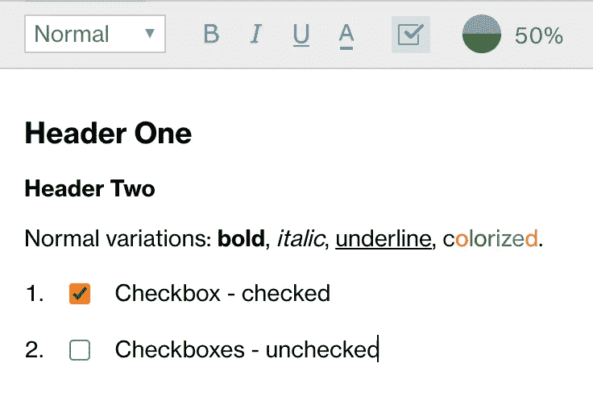
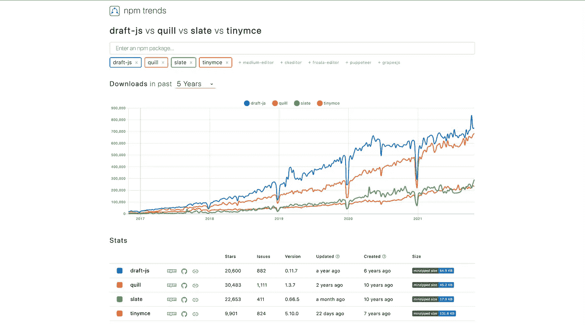
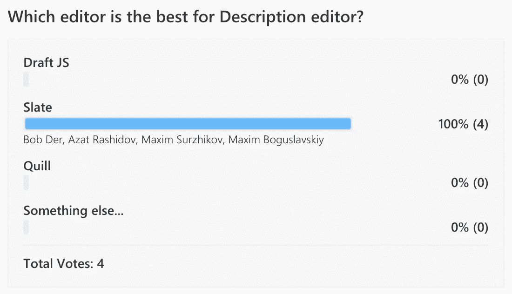
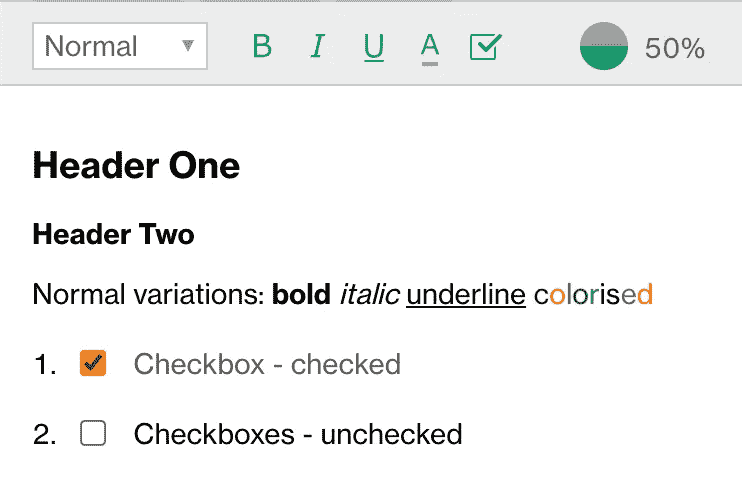

# 如何管理技术变更

> 原文：<https://levelup.gitconnected.com/how-to-manage-technical-changes-fd74c3f647d6>

基于富文本编辑器选择

## 业务任务的描述:

为了支持我们的一个业务流程，我们选择了一个富文本编辑器。这应满足基本要求:

*   线条格式(标题、段落)
*   符号格式(斜体、粗体、下划线、彩色)
*   在后端保存状态

和两个具体要求:

*   它必须有端到端的编号，每个项目必须有它的复选框；
*   编辑器应该在编辑器的工具栏中指示完成的进度。

我们的前端堆栈是:

*   反应
*   Redux
*   以打字打的文件

这个编辑器的第一个版本是基于 Draft.JS 的。我们以前的开发者(弗拉基米尔·伊万诺夫)在一年多前实现了它。这似乎是一个很好的选择:

*   脸书对此表示支持
*   它与我们的堆栈很好地配合:React 和 Typescript
*   它有我们需要的所有格式选项

这一年它表现出色。

草稿。JS 实施

## 直到我们发现它有三个缺陷:

*   脸书开发者一年没更新；
*   它的支持者不允许引入 pr；
*   它有一个小问题，当用户点击文本末尾后面最右边的部分时，锚的位置不正确。它把锚放在钓线的起点。不是最后。

这对我们的利益相关者至关重要，所以我被指派解决这个问题。经过研究，我找到了两个解决方案:

*   检查用户是否点击了行尾后面的。然后在线路末端用力抛锚。它工作得很好，但前提是文本块不是多行的。如果它是多行的，那么它把锚放在最后一行的末尾；
*   另一个解决方案是计算光标的位置，计算文本块的高度，计算行数，计算同一行，然后计算其宽度。然后检查用户是将点击放在线尾之前还是之后。它工作得很好，但是有明显的延迟。

这两个决定看起来都像拐杖。

## 可供选择的事物

我们决定寻找替代者。如您所知，有大量的富文本编辑器。我将只列举最受欢迎的几个:

*   刺
*   石板
*   TinyMCE
*   Draft.js

所以我决定认真调查此事。首先，我浏览了各种评论和文章。

在此之后，我决定检查 [npm 趋势](https://www.npmtrends.com/quill-vs-slate-vs-tinymce-vs-draft-js)。

国家预防机制趋势比较

在我看来，我的发现促使我选择了一个我已经扔掉的编辑器。

经过长时间的研究，我决定制作两个版本的编辑器原型:Quill 和 Slate。我决定放弃 TinyMCE 和草案。因为我们的一些团队成员有这方面的专业知识。我实现了一个概念证明，但经过一番思考后，我认为这还不足以让我下定决心。

## 通过民主和团队合作做出决定

我的怀疑是基于我不是单干的事实。我和专业团队一起工作，他们也会处理这些代码。它将修复错误，维护它们，并添加新功能。所以我不能一个人做这个决定。

我决定做一个实验。我收集了一份剩余工作的清单，创建了 JIRA 任务，并要求我的同事们平均分担这项工作。因此，他们将从每个编辑那里获得专业知识，然后我会请他们为编辑投票。

1.  如何从参与者那里了解产品的专业知识？我做了一个调查，分数降到了知道/不知道。
2.  在这种情况下，我们只限于解决一个问题:“我们在替换什么？”
3.  任务的分配是民主的。团队成员承担了对他们来说方便的工作。唯一的限制是每个人都必须使用未知的产品/方法/库。
4.  分解工作需要深入项目。

## 投票

经过一周的工作，我创建了一个民意测验。在其中，我要求选择任意数量的编辑。我们在羽毛笔，石板，草稿之间选择。JS，还有别的。

## 对此方法的主观评估:

*优点:*

1.  这种做法在将来会引起一些小的争议，因为它实施了集体负责的原则；
2.  这种方法增加了团队的专业知识，减少了总线因素。
3.  因为所有参与者都有相似的参与度，所以讨论最有成效。

*缺点:*

1.  就实验而言，这条路是最昂贵的；
2.  它不太适合需要做出紧急决策的情况。

*总结:*

1.  在我看来，这种方法在进一步的生产力和协议比实验成本更有价值的情况下是有益的，例如，为一个项目选择一个框架或一个存储系统。
2.  这种方法的基础是找到一个互利的立场。这叫做双赢。你可以在这里阅读更多

## 团队的反馈

以下是他们的想法:

> 以下是为 Slate 投票的一些利弊:
> 
> 另外:
> 
> -开箱即用—挂钩、组件，易于使用/熟悉使用
> 
> -编程灵活、可定制
> 
> -文档—好的、容易理解的、好的例子
> 
> 负的
> 
> -还是测试版

> 奎尔——乍一看，这似乎是一个非常方便的图书馆；当我打开文档时，一切似乎都合乎逻辑，可以理解。然而，我遇到的第一个问题是与反应物的弱连接；例如，在定制工具栏时，开发人员无法传递 react 组件，需要直接使用 DOM 树。此外，虽然文档描述得非常清楚，但许多不同的选项并没有在其中标出，并且在阅读之后，您将无法理解如何解决一个稍微超出默认范围的特定问题。你必须寻找 git 中的问题，并查看其他项目中的 quill 实现，以了解如何正确地实现它。例如，在创建进度条时，开发人员花费了大量精力来寻找 quill 支持的数据格式。原来你可以写出很多与文档不同的东西；它没有反映在里面。
> 
> Slate——与 quill 相比，它是为 React 量身定制的，文档涵盖了更多不同的用例，slate 在 slack 中还有一个实时社区，您可以在那里寻求建议。然而，slate 本身的代码看起来更复杂。以标准的进度条为例，这是他们已经提供的代码——你可以自己写很长时间；不完整的类型覆盖有点误导，有时 ts 告诉你没有属性，尽管它们是。总的来说，由于 slate 与 react、大量工作示例和 live 社区的工作非常和谐，为了方便起见，slate 绕过了 quill

> Draft.js 是一个相当受欢迎的编辑器。但是，对于自定义格式来说，它不是很灵活。但是如果需要将它用作常规的文本编辑器，它非常适合。它有一个复杂的数据结构来保存来自编辑器的数据。单独的格式间隔(例如粗体文本)存储在数字中(从哪个字符开始应用以及间隔的长度)。如果通过 JS 函数替换文本，即自动替换，会严重更新格式。
> 
> 奎尔。在我看来，最直白的编辑器写代码。不太灵活，但作为一个没有自定义格式的编辑器非常方便。对我来说，不方便的是没有单独的格式化按钮组件(文本颜色、文本格式等等)。但另一方面，它加快了代码的编写速度。Quill 有一种保存数据的便捷形式。每个片段都有它的格式，片段之间没有转移，哪个文本他给了他；他会展示这个。断字必须用特殊字符书写。
> 
> 石板。你必须在一个可定制的编辑器中写很多代码，即使你需要一个功能最少的简短版本。数据存储对象和 Quill 很像，我觉得挺方便的。Slate 框架是一个很好的选择，因为我们控制所有的编辑器功能，并且可以创建我们自己的功能。

## 履行

最终候选实施

## 结论:

1.  不要把你的决定仅仅建立在数字的基础上。
2.  如果我选择了通常的方式(通过趋势和文章)，我会选择一个不适合我的编辑器。
3.  如果我停下来，不与团队分享我的选择，我会选择 Quill，一个更容易设置但最终由于定制问题而不喜欢的编辑器。
4.  在我看来，经理不应该强迫自己做出决定。团队应该从可能的变体中选择工作工具。
5.  这个决定会来得容易，不会引起任何抗议，还会放大领导人的形象。
6.  对你的团队成员友好和善。良好的关系是双赢的长期投资。