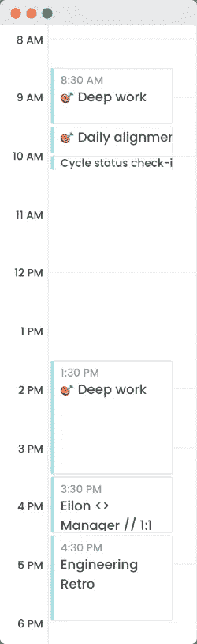

# 作为一名软件工程师，如何有效地管理时间

> 原文：<https://levelup.gitconnected.com/how-to-manage-your-time-effectively-as-a-software-engineer-a778c5421966>

作为软件工程师，我们努力工作来丰富我们的技术技能。我们学习新的编程语言和框架、设计模式、面向对象、架构、云计算等等。这对成为一名优秀的软件工程师来说足够了吗？也许吧，但毫无疑问，最好的软件工程师，那些能比一般开发人员表现好 10 倍的人，已经承认技术工具是不够的。

10x 工程师有几个特征技能和属性。你可以在这本书中找到其中的一些。我将在本文中重点介绍的技能是时间管理。我描述了我用来管理日常生活的实际做法，这样我就能成为最有效率的自己。

## 先决条件——拥抱你的日历

普通的软件工程师并不热衷于使用日历，这可能是因为我们没有花太多时间在会议上。

但是这里有一个误解——如果你仅仅用日历来管理你的会议，你就错过了一些东西。日历是通往地球上最稀缺资源——你的时间——的大门。这是一个界面，人们可以与你的时间互动，并从中获取一些东西。如果你把它扔掉，你就让别人随心所欲地偷走了你最宝贵的资源。

这就是为什么我很高兴向你介绍时间管理最重要的工具——你的日历。

## 1.焦点块

> 根据加州大学欧文分校[的一项研究](https://www.ics.uci.edu/~gmark/chi08-mark.pdf)，回到任务上平均需要 23 分 15 秒。

在我的公司[[神奇的](https://magicalhq.com/)]，我们都知道有一条人人都必须遵守的经验法则。如果一个开发人员在他的日历中为自己设定了一个焦点会议，没有人可以打扰它。这个时间段是“神圣的”他的这段时间只属于他，除了紧急情况。

以下是你如何在团队中激发时间管理文化的方法:

1.  教育他们[给他们发这篇文章]
2.  将您的日历整合到 Slack 中，让您的同事知道您正在进行专题讨论。另一个选项是设置自定义状态。
3.  在焦点会话中暂停时差通知
4.  根据经验，只有在紧急情况下才允许在重点时段打电话。
5.  如果你是同处一地的团队的一员，选择一个物理指示器，让人们知道你目前是有线的。它可以是耳机，一些独特的玩具，或任何文字符号。

## 2.**找出哪些时间对你来说最有效率**

每个个体贡献者通常都有效率最高的时候。在目前的情况下，我们很多人在家工作，工作和家庭责任之间的界限已经变得模糊。我们经常发现自己在一天中的特定时间经历了许多情境转换。除此之外，我们中的一些人只是在特定的时间更专注、更有效率——我们中的一些人是夜猫子，另一些人是早起的鸟儿。意识到哪些时间是属于你的，并使用聚焦块不惜一切代价保护它们。你通常效率较低的几个小时呢？什么都不做。这样，对于你的同事来说，你仍然是平易近人的，但你是在时间窗口内与他们打交道，而此时环境转换要便宜得多。

## 3.日常校准程序

软件工程师喜欢写代码。如果我们可以选择整天这样做，我们可能会去做。然而，伟大的软件工程师知道这都是关于平衡的。走出我们的舒适区，弄清楚我们周围发生了什么是至关重要的:

*   我团队中的其他人在做什么？他们需要我的帮助吗？
*   我们当前的冲刺/周期进展如何？我们准时到达吗？
*   是否有任何挂起的拉请求已经闲置太久了？
*   公司当前的目标/KPI 是什么？
*   有什么我需要知道的消息吗？
*   我需要填写那张休假表格吗？

不要活在你的 ide 泡泡里！给自己留出时间来适应你周围发生的事情。通常，做这件事的最佳时间是早上，此时你的大脑已经清除了开环，认知负荷较低。我鼓励你建立一个 30 分钟的时间段，预先设定好你需要完成的事情清单:

## 4.公关审查需要时间

对你的工作效率来说，最糟糕的事情之一就是临时的公关评估。公关审查需要时间，即使是一个范围很广的工作单元。深入到小的(但重要的)细节的有效公关审查需要更多的时间。与每日调整会议一样，当您思路清晰，并且没有关于您无法解决的围绕您正在处理的功能的随机边缘情况的开放循环时，PR 审查会更加有效。如果没有必要，你不应该让自己自然而然地被拉进公关审查会议。相反，试着把这些会议推到早上，在你的日常工作之后或者午饭之后，当你让你的大脑有时间休息的时候。

根据经验，对于正常大小的拉请求(30-40 个中等大小的更改文件)，我会在日历中分配一个小时的时间段，如果我不熟悉该特性或代码库的该部分，时间会更多。

## 5.时间阻塞——对抗无效的时间窗口

普通人每天不能承受超过四个小时的深度工作。对我来说，我需要至少两个小时不受干扰的时间来使我当前的功能/项目取得有意义的进展。根据这些观察和我之前提到的 23 分钟规则，你会明白一天结束时什么都没有是多么容易——只是又一天没有有意义的进展。我们都有那些日子；有时候是不可避免的，但大多数时候，是可以避免的。其他人通常不关心你的时间和会议安排，这些会破坏你的深度工作窗口。

下面是一个你无法完成任何有意义的工作的例子:

如何解决这个问题？请你的经理更加尊重你的时间。为了团队的生产力，会议，像工程规划，应该安排在一天的早些时候或晚些时候。确保您的经理将一对一会议安排在其他会议的时间附近，并且不影响您的深度工作时间窗口。上面的例子有一个更优化的版本:

## 关键要点

掌握时间管理是成为伟大软件工程师的重要一步。关键要素是专注和一致性。更好地了解你自己，找出你的限制，并围绕这些限制建立健康的时间管理习惯。教育你周围的人，帮助他们尊重你团队的时间。永远不要忘记，时间是我们最宝贵的不可再生资源，我们需要尊重它。