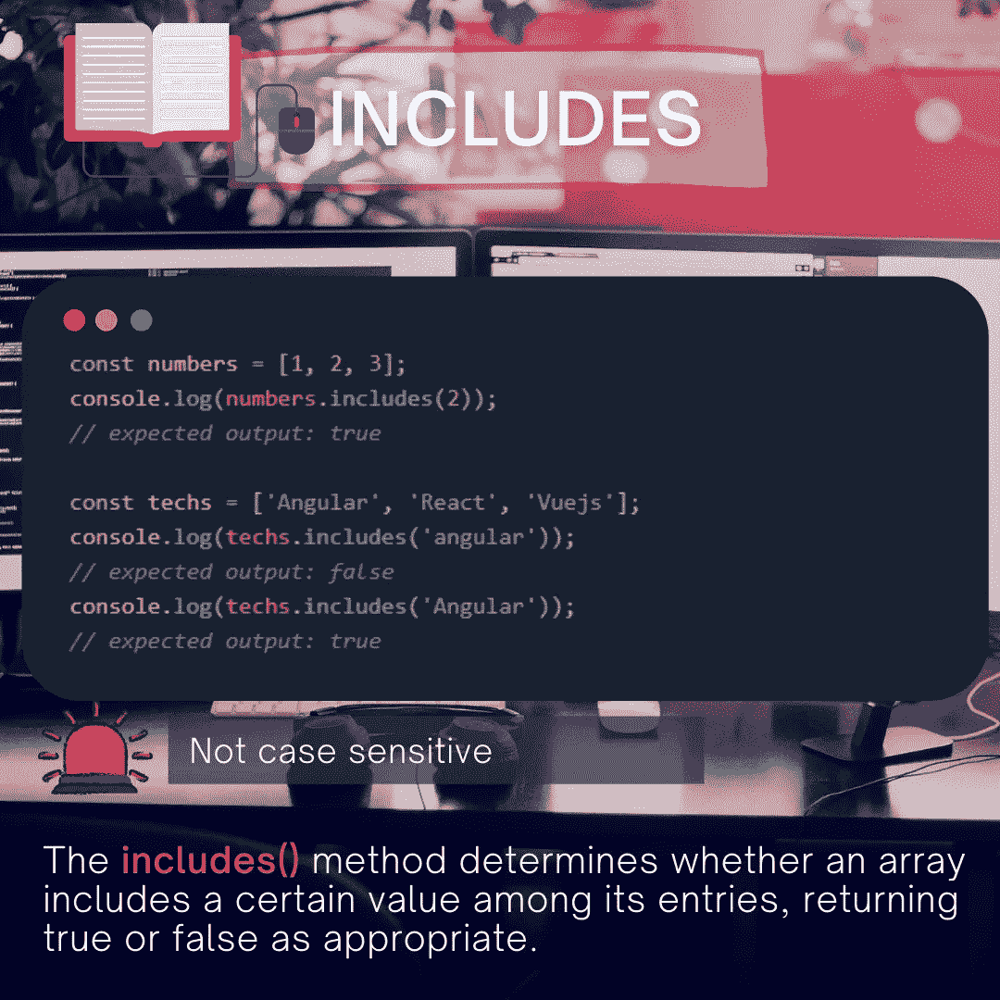

# 如何像专业人士一样操作 JS 中的数组

> 原文：<https://levelup.gitconnected.com/how-to-manipulate-arrays-in-js-like-a-pro-b8f6f5cff5ac>

## JS 中数组的 12 个必知方法


作者:FAM

在关于在 JavaScript 中操作字符串的文章之后:

[](https://medium.com/geekculture/how-to-manipulate-strings-in-javascript-like-a-professional-developer-6bec15b08cba) [## 如何像专业开发人员一样操作 JavaScript 中的字符串

### 在 JS 中操作字符串要记住的 10 个主要方法

medium.com](https://medium.com/geekculture/how-to-manipulate-strings-in-javascript-like-a-professional-developer-6bec15b08cba) 

数组也不例外！每个开发人员都在日常任务需求中操纵它们。学习如何专业地操作它们可以让你的生活变得更轻松，让你变得非常有效率！

本文涵盖了您作为开发人员完成日常任务可能需要的最重要的方法。

> 最后，您会发现一个真实的用例，它会让您了解这些方法有多么强大。

准备好了吗？开始吧！

# 单片式()

`**slice()**`方法将数组的一部分的浅拷贝返回到从`start`到`end`中选择的新数组对象中。`start`和`end`表示该数组中项目的索引。不用担心原数组。不会碰也不会修改。

## 它是如何工作的？

切片方法示例

## 语法:

```
slice()
slice(start)
slice(start, end)
```


作者:FAM

# 2- Filter⁣⁣()

我觉得这是我最常用的 JS `Array`方法之一，用`map()`方法聚集。`filter()`方法**创建一个新的数组**，其中包含所有通过由`callback`函数实现的测试的元素。

## 它是如何工作的？

过滤方法示例

## 句法

```
// Arrow function
filter((currentValue) => { ... } )
filter((currentValue, index) => { ... } )
filter((currentValue, index, array) => { ... } )

// Callback function
filter(callbackFn)
filter(callbackFn, thisArg)

// Inline callback function
filter(function callbackFn(currentValue) { ... })
filter(function callbackFn(currentValue, index) { ... })
filter(function callbackFn(currentValue, index, array){ ... })
filter(function callbackFn(currentValue, index, array) { ... }, thisArg)
```


作者:FAM

# 3-查找()

这个方法也很重要。它返回所提供数组中满足的第一个元素的值。

## 它是如何工作的？

查找方法示例

## 语法:

```
// Arrow function
find((element) => { ... } )
find((element, index) => { ... } )
find((element, index, array) => { ... } )

// Callback function
find(callbackFn)
find(callbackFn, thisArg)

// Inline callback function
find(function callbackFn(element) { ... })
find(function callbackFn(element, index) { ... })
find(function callbackFn(element, index, array){ ... })
find(function callbackFn(element, index, array) { ... }, thisArg)
```


作者:FAM

# 4- FindIndex()

以防你需要元素的索引而不是元素本身。`**findIndex()**`方法返回满足提供的测试函数的数组**中第一个元素的**索引**。否则，它返回`-1`,表明没有元素通过测试。**

## 它是如何工作的？

findIndex 方法示例

## 语法:

```
// Arrow function
findIndex((element) => { ... } )
findIndex((element, index) => { ... } )
findIndex((element, index, array) => { ... } )

// Callback function
findIndex(callbackFn)
findIndex(callbackFn, thisArg)

// Inline callback function
findIndex(function callbackFn(element) { ... })
findIndex(function callbackFn(element, index) { ... })
findIndex(function callbackFn(element, index, array){ ... })
findIndex(function callbackFn(element, index, array) { ... }, thisArg)
```


作者:FAM

# 5-排序()

`**sort()**`方法将数组 [*中的元素在*](https://en.wikipedia.org/wiki/In-place_algorithm) 中排序，并返回排序后的数组。默认的排序顺序是升序。对于像按字母顺序呈现某些类别这样的情况，以及更多的用例来说，这是非常重要的。

## 它是如何工作的？

排序方法示例

## 语法:

```
// Functionless
sort()

// Arrow function
sort((firstEl, secondEl) => { ... } )

// Compare function
sort(compareFn)

// Inline compare function
sort(function compareFn(firstEl, secondEl) { ... })
```


作者:FAM

# 6-地图()

`**map()**`方法**创建一个新的数组**,其中填充了调用数组中每个元素的函数的结果。这个功能超级受欢迎。在审查 JS 或 TypeScript 项目的代码时，您肯定会看到它。

## 它是如何工作的？

映射方法示例

## 语法:

```
// Arrow function
map((currentValue) => { ... } )
map((currentValue, index) => { ... } )
map((currentValue, index, array) => { ... } )

// Callback function
map(callbackFn)
map(callbackFn, thisArg)

// Inline callback function
map(function callbackFn(currentValue) { ... })
map(function callbackFn(currentValue, index) { ... })
map(function callbackFn(currentValue, index, array){ ... })
map(function callbackFn(currentValue, index, array) { ... }, thisArg)
```


作者:FAM

# 7-减少()

`**reduce()**`方法对每个数组元素执行一个 **reducer** 函数(您提供的),产生一个输出值。

## 它是如何工作的？

reduce 方法示例

## 语法:

```
// Arrow function
reduce((accumulator, currentValue) => { ... } )
reduce((accumulator, currentValue, index) => { ... } )
reduce((accumulator, currentValue, index, array) => { ... } )
reduce((accumulator, currentValue, index, array) => { ... }, initialValue)

// Reducer function
reduce(reducerFn)
reduce(reducerFn, initialValue)

// Inline reducer function
reduce(function reducerFn(accumulator, currentValue) { ... })
reduce(function reducerFn(accumulator, currentValue, index) { ... })
reduce(function reducerFn(accumulator, currentValue, index, array){ ... })
reduce(function reducerFn(accumulator, currentValue, index, array) { ... }, initialValue)
```


作者:FAM

# 8 档倒档()

`**reverse()**`方法在 处反转一个数组 [*。第一个数组元素成为最后一个，最后一个数组元素成为第一个。*](https://en.wikipedia.org/wiki/In-place_algorithm)

## 它是如何工作的？

反向方法示例

## 语法:

```
reverse()
```


作者:FAM

# 九点多()

`**some()**`方法测试数组中是否至少有一个元素通过了由提供的函数实现的测试。如果在数组中找到所提供的函数返回 true 的元素，则返回 true；否则，它返回 false。它不会修改数组。

## 它是如何工作的？

一些方法示例

## 语法:

```
// Arrow function
some((element) => { ... } )
some((element, index) => { ... } )
some((element, index, array) => { ... } )

// Callback function
some(callbackFn)
some(callbackFn, thisArg)

// Inline callback function
some(function callbackFn(element) { ... })
some(function callbackFn(element, index) { ... })
some(function callbackFn(element, index, array){ ... })
some(function callbackFn(element, index, array) { ... }, thisArg)
```


作者:FAM

# 10-每隔()

`every()`方法有点类似于`some()`方法，但是它测试的是**数组中的所有**元素是否都通过了由`callback`函数实现的测试。

## 它是如何工作的？

每个方法示例

## 语法:

```
// Arrow function
every((element) => { ... } )
every((element, index) => { ... } )
every((element, index, array) => { ... } )

// Callback function
every(callbackFn)
every(callbackFn, thisArg)

// Inline callback function
every(function callbackFn(element) { ... })
every(function callbackFn(element, index) { ... })
every(function callbackFn(element, index, array){ ... })
every(function callbackFn(element, index, array) { ... }, thisArg)
```


# 11- Concat()

`**concat()**`方法用于合并两个或多个数组。此方法不会更改现有数组，而是返回一个新数组。

## 它是如何工作的？

concat 方法示例

## 语法:

```
concat()
concat(value0)
concat(value0, value1)
concat(value0, value1, ... , valueN)
```


作者:FAM

# 12-包括()

`**includes()**`方法确定数组的条目中是否包含某个值，根据情况返回`true`或`false`。

## 它是如何工作的？

包括方法示例

## 语法:

```
includes(valueToFind)
includes(valueToFind, fromIndex)
```



作者:FAM

# 回顾一下？

上面的例子被简化了，以便让你快速简单地了解它是如何工作的。但是在现实生活的项目中，我们通常在对象上使用这些方法，这时你就会看到这些方法的真正力量，以及它们让你的生活变得多么轻松。

## 想了解一下它在现实项目中的样子吗？

*   **用例示例:我想根据用户输入的术语过滤列表(复选框列表的自动完成)**

需要一些可视化？这是:


真实用例示例

我在这里使用的关键函数是:

*   **Slice** (每次回到初始状态时复制原始数组)
*   **过滤器**(根据输入的术语自动完成或过滤初始列表)

*这是用角度编码的组件:*

用例组件

以下是模板:

用例模板

要查看整个项目:

完成项目

尽情享受吧！

# 亲爱的读者，我希望这是明确和有用的。

无论你在哪里，我都希望你和你的家人平安。坚持住。明天会更好！

**我们来接触一下** [**中**](https://medium.com/@famzil/)**[**Linkedin**](https://www.linkedin.com/in/fatima-amzil-9031ba95/)**[**脸书**](https://www.facebook.com/The-Front-End-World)**[**insta gram**](https://www.instagram.com/the_frontend_world/)**，或者**[**Twitter**](https://twitter.com/FatimaAMZIL9)**。********

******FAM******

****【www.fam-front.com ****