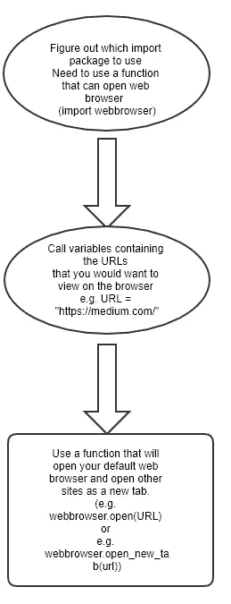
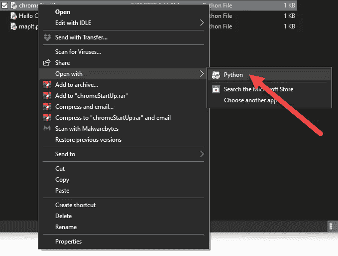
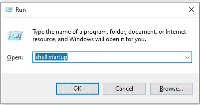
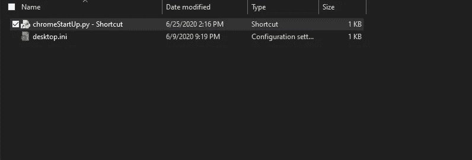
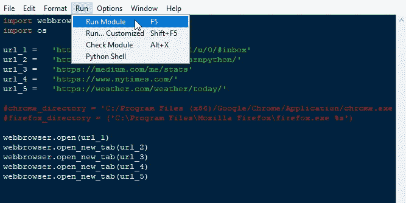
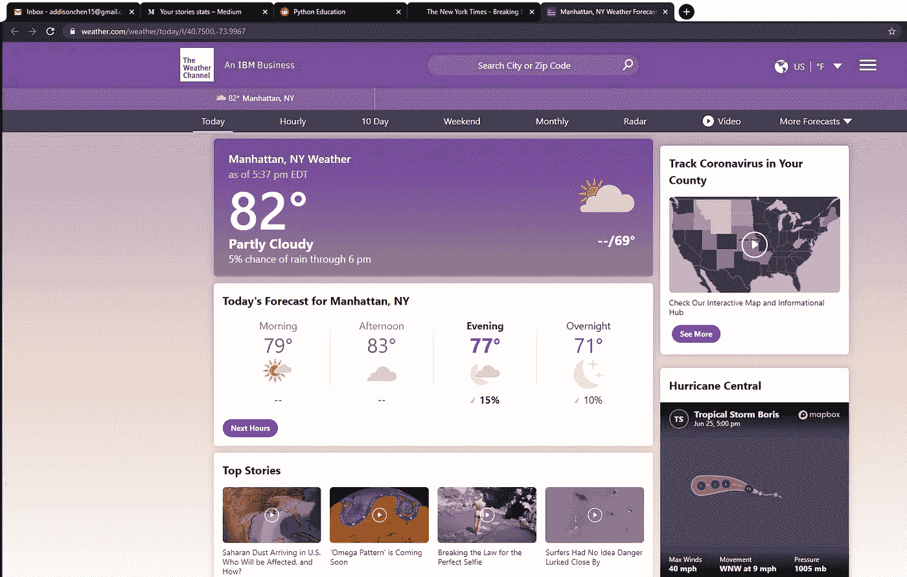
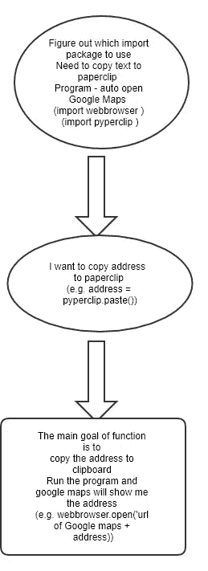
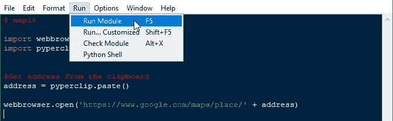
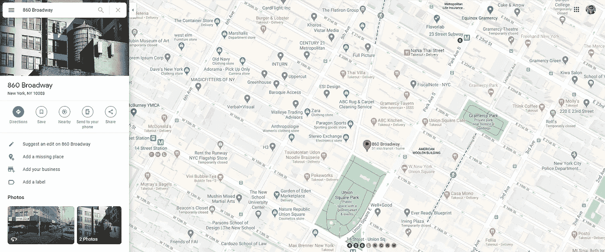

# 如何使用 Python 操作 Web 浏览器来提高生产率

> 原文：<https://levelup.gitconnected.com/how-to-manipulate-web-browsers-using-python-21a69a17fe46>


布鲁克·卡吉尔在 [Unsplash](/s/photos/person-computer?utm_source=unsplash&utm_medium=referral&utm_content=creditCopyText) 上的照片

许多网络浏览器，比如谷歌 Chrome，都有[功能](https://support.google.com/chrome/answer/95314?co=GENIE.Platform%3DDesktop&hl=en)，允许用户在启动时打开他们想要的网站。然而，当相同的五个网站一遍又一遍地打开时，它会变得令人讨厌——我只是想要新的标签页！我已经决定建立一个简单的脚本，可以打开你想要的网站，但只有当我的电脑启动。我的解决方案是使用 Python 中的 *webbrowser* 模块进行网络抓取。今天，我将讨论如何使用 *webbrowser* 模块来自动化任务。

# **我的问题:**

每天早上，我打开电脑，然后打开谷歌浏览器，我的启动页面就会自动打开，开始我的一天。完成后，我只想关闭浏览器，在下次计算机重新启动前不必看到启动页面。没有谷歌的功能(据我所知)可以做到这一点，所以我决定想出一个解决方案。

# 你需要做的先决条件:

*   阅读文档并尝试 [*网络浏览器*模块](https://docs.python.org/2/library/webbrowser.html)功能。
*   对[变量](https://www.w3schools.com/python/python_variables.asp)有一个基本的了解，学会想出简单的命名约定(这个主要是给你的！).
*   弄清楚当你启动电脑的时候你想打开什么网站(想想那些你打开浏览器直接去的网站)。
*   阅读 p [*上的文档。*](https://pypi.org/project/pyperclip/)

# 概念:

Python 脚本将在您的电脑每次启动时运行，因此代码将打开您的默认网络浏览器和所需的网站。主要目的是确保网站打开后，你的电脑启动，然后前进，它永远不会再次出现时，我打开浏览器在这个电脑会话。

# 简单的工作流程:



# 带解释的代码:

您需要做的第一件事是导入 *webbrowser* 模块。现在，您可以使用这些函数根据自己的喜好来操作浏览器。

```
import webbrowser
```

接下来，您需要调用包含您希望 web 浏览器打开的 URL 的变量。所以变量的数量可能取决于你的需求。

```
url_1 =   '[https://mail.google.com/mail/u/0/#inbox'](https://mail.google.com/mail/u/0/#inbox')
url_2 =   '[https://www.reddit.com/r/learnpython/'](https://www.reddit.com/r/learnpython/')
url_3 =   '[https://medium.com/me/stats'](https://medium.com/me/stats')
url_4 =   '[https://www.nytimes.com/'](https://www.nytimes.com/')
url_5 =   '[https://weather.com/weather/today/'](https://weather.com/weather/today/')
```

你将需要使用 *webbrowser* 模块中的两个函数，分别是**“webbrowser . open()”**和**“webbrowser . open _ new _ tab()”****“webbrowser . open()”**用于打开您的默认网页浏览器，并转到第一个 URL。"**webbrowser . open _ new _ tab()"**将在下一个选项卡上打开下一个 URL。

```
webbrowser.open(url_1)
webbrowser.open_new_tab(url_2)
webbrowser.open_new_tab(url_3)
webbrowser.open_new_tab(url_4)
webbrowser.open_new_tab(url_5)
```

# 如何让 Python 脚本在 Windows PC 启动时运行:

右键单击您的 Python 文件，然后单击**“打开方式”**，然后选择**“Python”**—Python 空闲环境。



注意:确保您的 Python 文件是在 Python 空闲时打开的

在开始菜单中，输入**“运行”**，应用程序将弹出，然后输入**“shell:启动”**



打开 Run，然后键入 shell:startup 打开启动文件夹。

启动文件夹将会打开，在这里你可以放置你的 Python 脚本文件。一个建议是为你的脚本创建一个快捷方式，然后将快捷方式放入文件夹中——这将使你在需要时更容易编辑脚本。一旦您的文件在文件夹中，重新启动您的计算机，看看您的默认网页浏览器是否打开指定的标签。



我已经创建了 Python 文件的快捷方式，并将其放在文件夹中。

# 最终结果:



手动运行脚本。



我重启电脑——谷歌浏览器，我想要的网站立刻打开了！

# 你还能用 Webbrowser 做什么？

你可能想知道我还能用 *webbrowser* 模块做些什么？另一个例子是打开谷歌地图，根据复制到剪贴板的地址搜索位置。这个项目来自阿尔·斯威加特的[“用 Python 自动化枯燥的东西”。代码背后的概念很吸引人，也很方便。](https://automatetheboringstuff.com/chapter11/)

# 概念:

该代码将自动从您的默认网络浏览器打开谷歌地图，并根据您复制到剪贴板的地址运行搜索栏。

# 简单的工作流程:



这个脚本应该做的简单工作流程

# 带解释的代码:

这里你需要导入三个模块，分别是 *webbrowser* 和 *pyperclip* 。

```
import webbrowser
import pyperclip
```

我们将调用一个变量名**“address”**来包含您将使用“pyperclip.paste()”复制到剪贴板的文本

```
address = pyperclip.paste()
```

现在我们将使用 *webbrowser* 函数来包含 google maps URL 和位于变量 address 中的文本。你会注意到地址会自动进入搜索栏。

```
webbrowser.open('[https://www.google.com/maps/place/'](https://www.google.com/maps/place/') + address)
```

# 最终结果:


简单地复制地址“百老汇 860 号”



运行代码。



谷歌地图会弹出来，它会立刻给你显示位置。

# 总体而言:

这个概念简单易懂。我目前正在我的电脑上使用启动脚本，它节省了我手动键入和打开新标签页的时间。我希望你能从这篇文章中学到一些独特的想法，让你的生活稍微轻松一点！