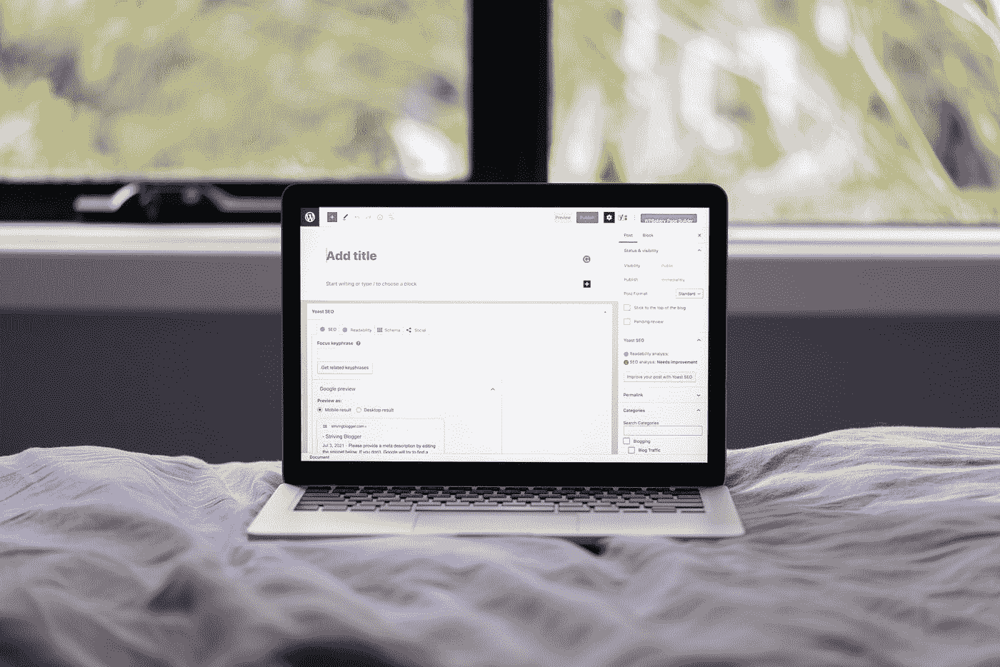
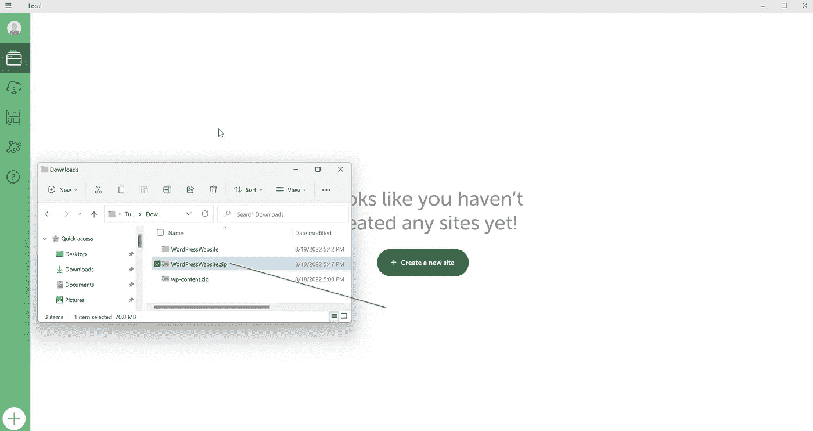

# 如何手动检索你的 WordPress 网站的备份并在本地恢复它

> 原文：<https://levelup.gitconnected.com/how-to-manually-retrieve-the-backup-of-your-wordpress-website-and-restore-it-in-local-aa0a8263fd8e>

## 如何手动检索你的 WordPress 网站的备份，并通过飞轮将其恢复到本地，以创建一个安全的暂存环境

贾斯汀·摩根在 [Unsplash](https://unsplash.com?utm_source=medium&utm_medium=referral) 上的照片

我知道 WordPress 是一个热门话题，因为它被精通技术的人和初学者所使用。我将避免使用技术术语，以使本教程易于理解。

## 我们要做什么？

在这个 How to 中我们将看到两件主要的事情:

*   在哪里可以找到备份所需的关键文件
*   把这些文件放在哪里，以便在本地恢复/重建你的 WordPress 网站

## 寻找你的备份

这一步可能会根据你的主机改变，我将以主机提供商为例，但你在这里看到的概念对你选择的任何主机服务都是一样的。

我们需要两样东西:

*   你的 WordPress 安装文件
*   你数据库里的信息

## 检索你的 WordPress 安装文件

去你的主机服务提供商那里找到你的网站在哪里，在我的情况下，我必须点击“文件”，然后“文件管理器”

霍斯汀格，文件管理员

文件管理器中的内容

要下载“wp-content”文件夹，至少在 Hostinger 中，我们需要先压缩文件夹，然后再下载。

选择“wp-content”文件夹，然后按图标压缩文件夹。

主机，压缩图标

选择“.zip”格式，然后点击“压缩”。

霍斯汀格

**在 Hostinger 中，如果之前没有压缩文件夹，下载按钮是不会显示的！**

Justin Chrn 在 [Unsplash](https://unsplash.com?utm_source=medium&utm_medium=referral) 上拍摄的照片

选择我们创建的“wp-content.zip”文件夹，然后单击下载图标。

主机，下载图标

下载完成后，点击删除图标，删除刚刚创建的“wp-content.zip”。

主机，删除图标

我们终于有了 WordPress 安装的文件，是时候检索保存在数据库中的信息了。

## 检索数据库中的信息

请记住，对于依赖于您的 DBMS 的图形部分，以下步骤是不同的。

点击你的数据库的代码，你将被重定向到你的数据库管理系统(数据库管理系统，一个很难说的程序，以显示和管理你的数据库内的信息)。

在 Hostinger 中链接到您的 DBMS

从列表中选择数据库后，单击“Export”选项卡。

PhpMyAdmin 上的导出选项卡

在“导出方法”下选择“快速”,在“格式”下选择“SQL ”,然后单击“开始”按钮。

PhpMyAdmin 上的导出选项

现在我们的下载文件夹中有两个文件。

我们笔记本电脑上的下载文件夹

“wp-content.zip”包含了所有与我们的 WordPress 安装相关的文件，以及以“.”结尾的文件。sql”包含我们数据库的信息。

## 通过飞轮安装本地

前往[https://localwp.com/](https://localwp.com/)下载本地。

单击“下载”按钮，插入所需信息，选择适合您的操作系统的安装，在我的情况下是 Windows。

飞轮控制的本地

单击安装文件，并遵循简单的安装过程。

local.exe

安装过程很简单，只需点击“下一步”，然后在过程结束时，点击“完成”。

## 为导入过程准备文件

提取“wp-content.zip”，然后选择提取的“wp-content”文件夹和。sql”文件，并将它们放在一个新文件夹中。

我将使用“WordPressWebsite”文件夹。

WP-提取的内容

WordPress 网站文件夹已创建

移动。sql 文件和 WordPressWebsite 文件夹中的 wp-content 文件夹

WP-内容和。sql 在 WordPressWebsite 文件夹中

右键单击“WordPressWebsite”文件夹，然后创建一个“.“压缩”档案与“压缩到压缩文件”。

在 Windows 11 中压缩为 Zip 文件

## 最后，我们可以导入网站

拖放文件夹到本地，所有的东西都会被本地自动导入。

在本地内部拖放

点击“继续”。

本地进口程序

点击“导入站点”, Local 将为你的 WordPress 网站创建一个本地环境。

本地进口程序

一旦你的网站被导入，你可以点击“WP 管理”登录到 WordPress 管理面板，或者点击“打开网站”观看本地网站的直播版本。

本地用户界面

用本教程中使用的文件生成的 WordPress 网站

照片由[丹尼·豪](https://unsplash.com/@dannyhowe?utm_source=medium&utm_medium=referral)在 [Unsplash](https://unsplash.com?utm_source=medium&utm_medium=referral) 上拍摄

**最后，我们做到了**

这看起来比它应该的要复杂，一旦你习惯了这些简单的操作，管理你的 WordPress 网站会变得更容易。

现在你可以在本地环境中重新创建你的网站，尝试新的插件，改变风格，等等。

感谢您花时间阅读我的文章。

## 资源

当地乘飞轮:[https://localwp.com/](https://localwp.com/)