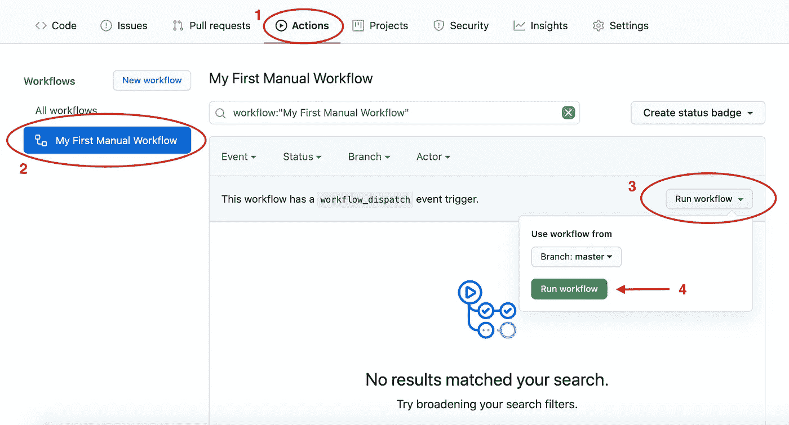
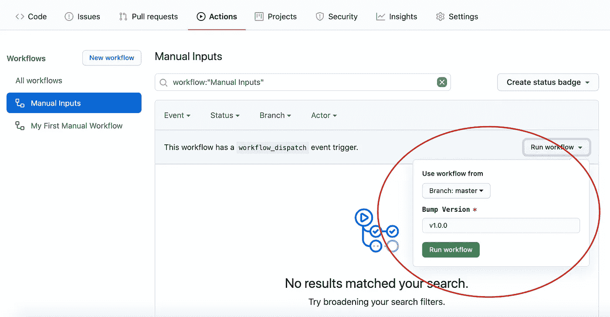
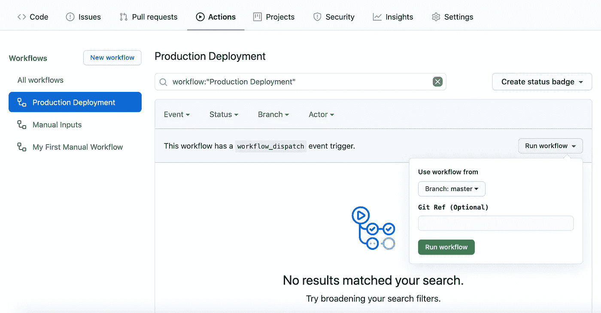

# 如何手动触发 GitHub 操作工作流

> 原文：<https://levelup.gitconnected.com/how-to-manually-trigger-a-github-actions-workflow-4712542f1960>

本周早些时候，GitHub [宣布了一个新功能](https://github.blog/changelog/2020-07-06-github-actions-manual-triggers-with-workflow_dispatch/)，它允许开发者在“动作”标签中手动触发工作流。

这是一段时间以来请求最多的功能之一，随着[官方支持线程](https://github.community/t/github-actions-manual-trigger-approvals/16233)在过去的 12 个月里吸引了数百次投票——那么它是否实现了所有承诺？

简短的回答是肯定的，但也有一些陷阱。让我们开始吧。

# 选项 1:基本设置

要创建您的第一个手动工作流，您需要使用新的`workflow_dispatch`触发器:

一个非常简单的手动工作流触发器。

一旦您将该文件添加到您的存储库中，您将能够从 GitHub 上的“Actions”选项卡中查看并手动运行该工作流:

您还会注意到，您可以定制分支来运行您的手动工作流，但是请注意，至少*工作流文件的某些*变体必须在您的默认分支(例如`master`)上，它才会出现在“Actions”选项卡中。

选择自定义分支将:

*   签出该分支的最新提交。
*   使用分支机构自己的工作流文件变体(如果已修改)。

# 选项 2:带参数的中间设置

为了更进一步，您还可以配置您的手动工作流在运行时接受变量。该功能的工作方式与[手动位桶管道](https://support.atlassian.com/bitbucket-cloud/docs/run-pipelines-manually/)非常相似。

为您的手动工作流程设置自定义输入。

现在，当单击“运行工作流”下拉菜单时，您会看到参数显示为输入文本字段:

这些输入的验证目前仅限于简单的存在检查，唯一可用的输入类型是自由文本字段(仅限字符串)。

# 选项 3:使用 Git 参考的高级设置

我们在 Ynomia 使用“手动”触发器的一个用例是，当我们准备好从阶段升级特性时，开始生产部署。虽然 99%的时间我们都是针对主分支上的最新代码运行的，但有时如果出现关键问题，我们需要回滚到以前版本的能力。

为了实现这一点，我们设置了一个可选字段来指定一个自定义的 SHA-1 提交哈希，以根据该哈希运行工作流:

以编程方式选择要对其运行操作的提交。

现在你会看到一个类似下图的下拉列表，你可以粘贴一个通过`git log`等获得的完整提交散列:

# 结束语

很高兴终于看到一个可行的、非黑客的选项，可以从存储库内部手动触发 GitHub 动作工作流。

我们过去使用“打开拉式请求”作为运行昂贵的移动测试工作流的触发器，这样它们就不会在每次提交时运行。这意味着我们必须频繁地关闭和打开拉请求，以便在合并之前重新运行测试——而现在*和*我们至少可以从一个专用的用户界面启动它们。

但是它也有缺点。

无法在标准推送工作流(像许多其他 CI 服务提供的那样)上定义“暂停步骤”仍然是一个令人沮丧的原因。在新的`workflow_dispatch`触发器中，没有从其他工作流下载工件的能力，这使得情况变得更糟。以我们的生产部署为例，我们已经从以前的工作中归档了完整的构建，但是这个限制意味着我们需要再次运行我们的构建任务。哭丧着脸。你似乎也不能从手动工作流程中上传工件🤷‍♀️.

也就是说，虽然这个特性可能还没有其他 CI 平台强大，但是核心功能应该已经到位，可以满足大多数开发人员的需求。

欢迎在下面的评论中分享你自己的使用例子或经验！

快乐手动触发:)