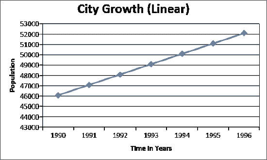

# 如何在不烧脑的情况下掌握算法和数据结构

> 原文：<https://levelup.gitconnected.com/how-to-master-algorithms-and-data-structures-without-burning-your-brain-e3d21a64ff56>

克拉克·蒂布斯在 [Unsplash](https://unsplash.com?utm_source=medium&utm_medium=referral) 上拍摄的照片

这个话题值得一本书，由一个铁杆计算机科学家写的。事实上，外面有很多。而且至少有一千篇文章/Quora 答案建议学习算法和数据结构的最佳书籍/课程。

本文更关注方法，而不是资源。

# 有进取心:

> 全球化思考(设计)；局部行动(代码)。
> 
> 匿名的

我所说的“企业家”并不是说每个编程新手都应该致力于开创新的事业。

(不要只是开始谷歌“种子投资者快速链接列表”。但是，过一段时间后，你可能会问自己:为什么不呢？！)

创业雄心意味着每天问自己一个问题:

*我能从我的电脑(可选地，还有* [*API web*](https://www.programmableweb.com/) *，*[*Kaggle*](https://www.kaggle.com/)*，*[*GitHub Explore*](https://github.com/explore)*，以及许多像 NPM JS 这样的包注册表)中提取出哪些对我、我的朋友和整个社会有益的东西？*

企业家精神打开了你的动机开关——这是学习算法和数据结构等复杂思想的最重要因素。

有一个进入 FAAMG 的目标也能激励你，但这是一个难以实现的目标。(见下文)

雄心勃勃的程序员独自编写了运行当今世界的东西:操作系统、版本控制系统、互联网、电子邮件、密码、最臭名昭著的病毒、社交网络——你能想到的都有。从这些资源中的每一个中学习(大多数是开源的)，在你的编程生涯中你将永远不会失去雄心。

这些编码员肯定不是一直孤独的。他们也不擅长算法和数据结构。但在某些时候，他们都是独自开始的，然后将事情推到一个极限，以至于其他伟大的开发人员忍不住加入他们。

如果这还不足以激励你，看看这个:软件是唯一的(现在是第一个)你可以单枪匹马创建一条完整的产品装配线的学科。在云工作流和分布式区块链时代，这比历史上任何时期都更真实。

你唯一的阻碍是你的野心。每天扩展它，用它来满足你学习更好编程的渴望。

# 尽量减少屏幕时间:

> 如果你练习 10000 小时，你可以成为任何领域的专家。
> 
> **——马尔科姆·格拉德威尔**

你在算法和数据结构方面的专业知识是你与它们相处时间的函数。

马尔科姆·格拉德威尔的书《T2 离群值》创造了著名的 10000 小时法则。这个规则最简化的版本说，如果你练习 10000 小时，你可以成为任何领域的专家。

虽然这条规则在许多专家的审视下是，但对于编程来说，它基本上是正确的。算法和数据结构更是如此。因为如果编程就像学习走路，算法和数据结构将类似于蹒跚学步的程序员爬行的膝盖骨头。

然而，许多程序员错误地将这段时间等同于他们在电脑前度过的时间。

首先，他们阅读了**破解编码面试。然后他们去 LeetCode、Codechef、Hackerrank 或 TopCoder 兄弟会网站。这些地方用他们的问题、论坛和高度游戏化的成就将他们粘在一起。**

这只是消耗能量太快。当你可以把它用于你的大脑时，为什么要把它花在紧张你的眼睛上呢？

> 你所需要的只是一个写伪代码的东西；电脑是一个很强大的设备

如果有人列出需要机器解决的问题，算法和数据结构会排在最后。故障排除第一。测试紧随其后。

爱因斯坦重写宇宙规则的唯一工具是纸和笔。牛顿的情况并没有好转。

今天最流行的算法和数据结构都是在纸上发明的。如果你有环保意识，带上白板。

> 爱因斯坦重写宇宙规则的唯一工具是纸和笔。

你所需要的只是一个写伪代码的东西；电脑是一个很强大的设备！

这里有一个建议的方法:

*   阅读你最喜欢的算法/数据结构书中的一章。或者，观看视频。
*   访问与主题相关的在线挑战。
*   把问题形象化。
*   绘制输入和输出数据结构(例如，对于字符串反转，“abcde”是输入，“edcba”是输出。).这是您的数据所在的位置。
*   **最重要的:**将状态变化绘制到数据结构中(例如对于 Fibonacci: f(n) = (n-1) + (n-2))。这是你必须协调的一系列操作。为你的元素画出合适的桶，例如链表，不要忘记节点关系。
*   使用铅笔和纸(或白板)来解决。即使你知道你的解决方案很糟糕，试着让它尽可能完美。
*   写伪代码，不写语法。
*   写下每一步的数值。如果需要，画一个状态图。
*   准备好后，在你的 PC/Mac/web 控制台上输入。
*   如果，由于失误，你没能用你的方式解决它，试试[算法可视化器](https://algorithm-visualizer.org/)，但是不要以牺牲你的眼睛为代价过度。

这个**最初的缓慢方法**会在你再次处理同样的问题时给你多倍的奖励。

当不解决问题时，阅读关于算法的书籍——纸质副本。它们最好以印刷的形式来品味。电子书只推荐给需要复制粘贴 API 示例的书籍。

# 利用空闲线程:

> 进步是由寻找更简单的做事方法的懒人取得的。
> 
> ― **罗伯特·A·海因莱因**

我们所说的 CPU 就是你的大脑。

当你下班时(在公园里随意散步，或者洗碗)，你的大脑会享受它急需的休息时间。正是在这个时候，你的大脑有机会重新连接它断开的一些神经元点，专注于你最近的直接问题。

没有课间休息，就没有机会反思你的设计。

其实这个道理不需要任何证明。除此之外，为什么尽管孩子是伟大的抓地力被允许在学校时间休息？

## 你如何利用空闲时间解决算法问题:

*   阅读代码挑战网站上的一个问题。彻底了解。
*   不久之后，离开你的办公桌。接一个不涉及其他人的随机任务。散步，做家务，准备咖啡，或者去不需要太多选择的日常购物。
*   随便想想解决办法。
*   在精神上隔离 1) *你拥有的* 2) *你能衍生的* 3) *你没有的*。写下来。
*   在纸上/白板上尝试初稿
*   对于遗漏的逻辑，问你的在线同行/老师。毕竟，编程是一门带来结构的学科。一个结构化的你产生更多结构化的代码和更多结构化的问题，让别人来帮助你。
*   回到纸上，敲定解决方案
*   打开你的电脑，然后输入/提交。

尽可能利用你大脑的休息时间来创造一个精神设计。不要把你的姿势和眼睛浪费在读屏幕或者无用的玩笑上。

# 进入状态:

> 摆脱困境的最佳方式就是迎难而上。
> 
> 罗伯特·弗罗斯特

大学毕业后不久，我曾经在 3 分钟内写完二分搜索法。我的朋友甚至比我还快。但是 2 年没有碰过之后，我就完全忘了这件事。在一次毫无准备的面试中，我没能表现出来。

我在面试中没有通过一轮算法测试的例子数不胜数。不久后，当我安排另一次面试时，我成功了，即使问题大相径庭。

为什么？

答案就在被称为 [**大脑缓存**(又名近期记忆)](/why-senior-devs-should-not-be-subject-to-whiteboard-interviews-c0de3316a000)的元素中。

大脑不会简单地忘记它学过的东西。但是如果最后一次相遇不是最近的，重建任何有用的输出就需要更长的时间。

我的软件老师说:

> 如果你练习得好，你可以在睡梦中写出最好的代码。

但是说起来容易做起来难。一个人不可能在他的职业生涯中无限期地练习算法。在你的旅途中，有些[平凡的工作](/the-16-hour-developer-workout-6a9e10afa8c2)让你疲惫不堪。

对于大多数程序员来说，算法上的优秀是连续不断的:

*   研究一个概念(例如二分搜索法)。
*   用最基本的问题练习。
*   逐步提高挑战等级。
*   重温优化理论。

但是真正的挑战是保持*的势头*。如果以上任何一项被推迟超过一周，这个记录就被打破了。卓越水平下降了。

你可能仍然不会忘记的*和 *while* 循环，但是随着复杂度的增加，你大脑的 MRU 缓存将会被其他东西填满。当您重新考虑这些问题时，您的大脑 CPU 将不得不执行磁盘 IO。它将面临更长的延迟。Stackoverflow 是不可避免的，它仍然不足以解决挑战。*

> 关键是巧妙地将你的真实生活(非办公桌)与代码交织在一起。

当然也有例外。编程天才是存在的。还有一些人擅长 hashmap 问题，但需要在图遍历方面更加努力，反之亦然。

保持激情的唯一方法是永远不要放弃算法思维。

永远不要让连胜中断。永远不要离开这个区域。

做到这一点的关键是不要不断地在**leet code**/**top coder**上竞争。

太无聊了。效率很低。如果你有家庭，这几乎是不可能的。

关键是巧妙地将你的真实生活(非办公桌)与代码交织在一起。

*   如果你在一个游泳池里享受假期，想想你能在最短的时间内拜访所有其他的游泳者吗？(图形遍历)
*   如果你乘飞机，考虑一下最有效的路线。(排序问题)
*   如果你在杂货店，考虑剔除坏苹果(二分搜索法)
*   总的来说，在空闲时，想想问题而不是解决方案，看看你的解决方案空间是如何迅速扩大的。

不过，注意不要过度，因为这可能会影响你的个人生活。缓解的一个方法是和你的伙伴(朋友或家人)谈论这个问题，忽略一些技术细节，比如**大 O 符号**。这是打开你协作解决问题渠道的好方法。在你未来的面试和发展讨论中会派上用场。

当我没有时间做挑战时，我尝试过的另一个非常成功的技巧(通常是在工作场所)是访问 StackOverflow 获得[最高投票算法问题](https://stackoverflow.com/questions/tagged/algorithm?tab=Votes)。StackOverflow 在这一领域的地位被大大低估了，它只以故障排除而闻名。你可以从经验丰富的行业老手那里得到免费的建议。它的质量是书籍作者(铁杆院士)和导师(Udemy/Youtube 教师)都无法提供的。

# 随时掌握行业诀窍:

在解决你的第一个算法/数据结构问题之前，做三个便利贴，贴在你的桌子上，在你容易看到的地方。

本文并不关注资源。无论如何，你都会在实践中深入学习这些原则(以及更多)。然而，由于它们是算法卓越的支柱，我已经将它们包括在总结中。你也可以在遇到他们的时候加上自己的。

*   **节省 CPU 周期:** O(1)永远比什么都好。O(n)比 O(n^x).好 O(n^x)是最糟糕的。在大多数面试中，你的第一个任务是将问题转化为可以用 O(1)或 O(n)方法解决的问题。
*   **节省内存:**记忆化(动态编程)比递归好。
*   **针对信息层次进行优化:**(在一棵树上)，如果想要多样化的数据，推荐 BFS(广度优先搜索)。如果需要相关数据，就需要 DFS(深度优先搜索)。

# 不要只以 FAAMG+为目标:

> "在激烈的竞争中，麻烦在于即使你赢了，你还是一只老鼠。"
> 
> — **莉莉·汤姆林**

过去，我曾强烈建议不要为[紧张的面试准备](https://betterprogramming.pub/developers-stop-that-stressful-interview-preparation-dd387d5b16fc)。我也建议不要把 FAAMG 作为你的梦想目的地。

以下是原因总结:

*   问题不在于 FAAMG(以及它的中层兄弟公司，如网飞、优步等)本身。这是一种错误的野心感，与标签而不是卓越联系在一起。
*   追逐一个大目标会加大赌注，从而增加压力。同龄人的压力会分散你对编程的热爱。
*   找工作会分散学习的注意力。追逐最高职位是一个更大的问题。有无数优秀的程序员甚至在达到就业年龄之前就达到了顶峰。他们不再追逐工作，而是工作追逐他们。
*   竞争(每年 10 万多份申请)，再加上 4-7 轮紧张的面试，使得 FAAMG 的结果更难预测。
*   有时候，尽管你尽了最大努力，你还是会成为复杂的招聘网的猎物。
*   当你面试失败时，你最终会犯下质疑自己算法能力有效性的错误。你真正应该质疑的是你与名人捆绑在一起的错位野心。

不要用虚拟的力量交换真实的力量。为了学习算法和数据结构而学习它们。如果一个大人物出现了，并且你觉得足够自信，那就试一试，无论成功还是失败都不要内疚。

不要把 famg+作为你的目的地，而是你旅途中的一个潜在点。

# 结论:

编程(尤其是算法和数据结构)是一门学习曲线很奇怪的技能。

如果你期望它是线性的(按照你在学校学到的)，你会花更多的时间才能感觉到复杂性处理技能的提高。自然，你必须保持你的动力&在**区呆那么久。**

信用: [LibreTexts](https://math.libretexts.org/Bookshelves/Applied_Mathematics/Book%3A_College_Mathematics_for_Everyday_Life_(Inigo_et_al)/04%3A_Growth/4.01%3A_Linear_Growth)

挺好的。但对许多人来说也很无聊。

相反，如果你投入同样多的初始时间来处理增加的复杂性，它将在你的动力消失之前产生指数级的回报。

雄心和耐心是实现这一目标的关键。

*   如果您想在[笔磁](https://tipsnguts.medium.com/)发布的任何时候收到电子邮件，请 [**点击此处**](https://tipsnguts.medium.com/subscribe) 。
*   如果你还不是中会员，想成为中会员， [**点击这里**](https://tipsnguts.medium.com/membership) 。(您的部分订阅费可能会支付给[笔磁铁](https://tipsnguts.medium.com/)。)