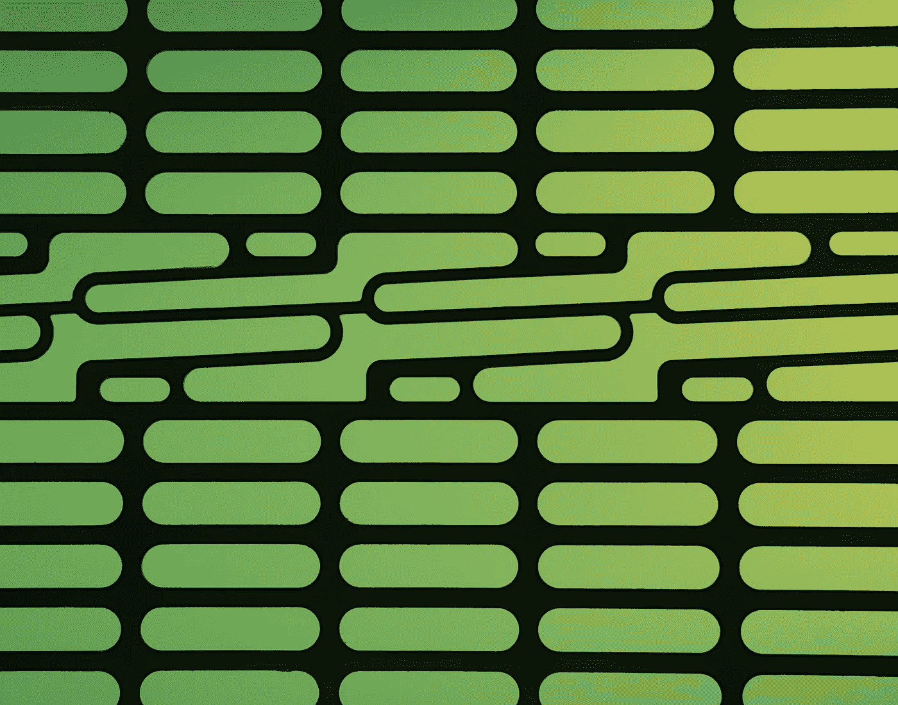
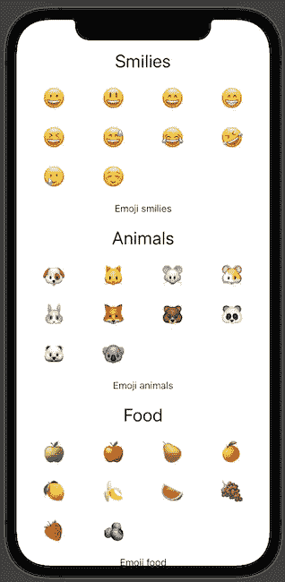
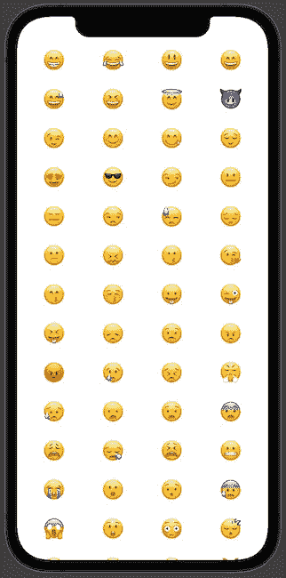
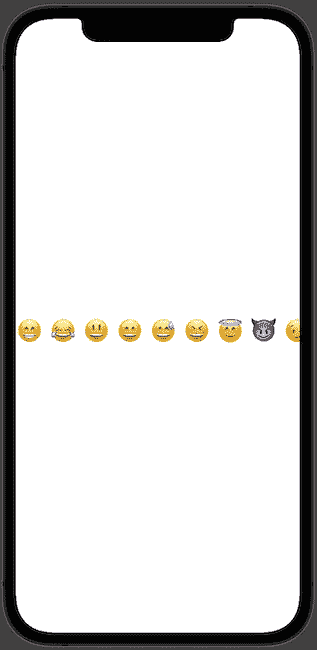
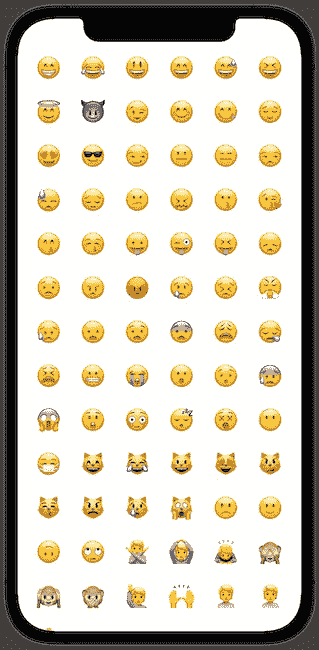
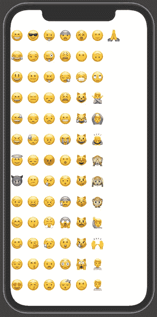
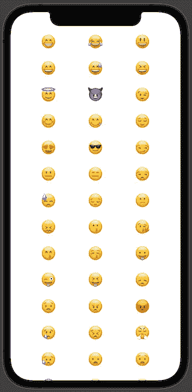
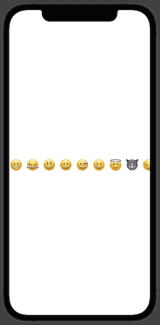

# 如何用 SwiftUI 掌握 iOS 中的网格布局

> 原文：<https://levelup.gitconnected.com/how-to-master-grid-layout-in-ios-with-swiftui-8a9de16ec7ca>

网格布局使我们能够在垂直或水平扩展的网格中显示视图。例如，我们都在 iOS 照片应用程序中看到过它。那些使用过 UIKit 的人可能会认为它是 [UICollectionView](https://developer.apple.com/documentation/uikit/uicollectionview) 。



Michael Dziedzic 在 [Unsplash](https://unsplash.com/?utm_source=medium&utm_medium=referral) 上拍摄的照片。

SwiftUI 提供了两个优秀的选项— `LazyVGrid`和`LazyHGrid`。这一次，我们将更深入地了解如何使用这些组件。这两个组件的伟大之处在于它们的用法；视图是延迟加载的，这意味着当这些视图出现在屏幕上时。

我想指出的是，`HStack`和`VStack`从 iOS 14 开始就有了。如果你打算在 iOS 13 中使用网格布局，你应该看看`HStack`和`VStack`，但缺点是那些不支持延迟加载。

# 创建网格布局

创建网格布局包括三个步骤——显示数据集、配置网格系统和初始化网格布局本身。我们将研究最后两个。如何提供数据是一个广泛的话题，超出了本文的范围。

通过提供列、项目的对齐、项目之间的间距、页脚或页眉的固定视图以及内容本身来完成`LazyVGrid`的初始化。

```
var columns = [
  GridItem(.flexible()),
  GridItem(.flexible()),
  GridItem(.flexible()),
  GridItem(.flexible())
]var body: some View {
  ScrollView {
    LazyVGrid(columns: columns, spacing: 20, pinnedViews: .sectionHeaders) {
      Section(header: Text("Smilies").font(.title),
              footer: Text("Emoji smilies").font(.subheadline)) {
        ForEach(Emoji.smilies, id: \.self) { emoji in
          Text(emoji)
            .font(.largeTitle)
        }
      }

      Section(header: Text("Animals").font(.title),
              footer: Text("Emoji animals").font(.subheadline)) {
        ForEach(Emoji.animals, id: \.self) { emoji in
          Text(emoji)
            .font(.largeTitle)
        }
      }

      Section(header: Text("Food").font(.title),
              footer: Text("Emoji food").font(.subheadline)) {
        ForEach(Emoji.food, id: \.self) { emoji in
          Text(emoji)
            .font(.largeTitle)
        }
      }

    }
    .padding(.horizontal)
  }
}
```



用了`LazyHGrid`，还挺像的。我们只需要将`columns`参数交换到`行。

# 配置网格布局

在初始化网格布局时，指定它的外观是非常重要的——垂直样式和水平样式网格布局的行。

SwiftUI 有一个描述单个网格项目的组件，`GridItem`。网格项目可以是行或列。

初始化`GridItem,`时，这三个参数至关重要:

*   `size` -项目的大小；
*   `spacing` -项目之间的间距；
*   `alignment` -放置每个网格项目时的对齐。

# 网格项目大小

我们有三个选项来指定网格项的大小:

*   `flexible(minimum: CGFloat, maximum: CGFloat)` -可用空间中的单个灵活项目，具有最小和最大尺寸的可选参数；
*   `adaptive(minimum: CGFloat, maximum: CGFloat)` -可用空间中的多个项目；
*   `fixed(CGFloat)` -可用空间中固定大小的单品。

让我们看看`LazyVGrid`和`LazyHGrid`在实践中是如何工作的。

## 灵活的

通过灵活的网格项目大小，我们可以提供最小和最大值，但即使没有它也能很好地工作。项目大小的计算方法是用可用空间除以项目数。

```
[
  GridItem(.flexible()),
  GridItem(.flexible()),
  GridItem(.flexible()),
  GridItem(.flexible())
]
```

垂直的



水平的



## 适应的

自适应网格布局大小是最合适的“GridItem”大小。我们需要提供最小和可选的最大尺寸，SwiftUI 布局指南将把所有繁重的工作从我们身边带走。

```
[
  GridItem(.adaptive(minimum: 50))
]
```

垂直的



水平的



## 固定的；不变的

固定的`GridItem`布局尺寸是在我们知道项目尺寸时使用的，它是不变的。

```
[
  GridItem(.fixed(100)),
  GridItem(.fixed(100)),
  GridItem(.fixed(100))
]
```

垂直的



水平的



# TL；速度三角形定位法(dead reckoning)

网格布局或以前从 UIKit times 获得的 UICollectionView 是在网格系统中呈现数据的重要构件。SwiftUI 为我们提供组件，以一种懒散的方式构建垂直或水平的网格布局；这意味着只有在需要时才加载项目。这两个组件是`LazyVGrid`和`LazyHGrid`。

要使用 SwiftUI 创建网格布局，我们需要提供数据集、列或行、项目之间的间距以及可选的固定视图(页眉和页脚)。

# 链接

*   [样本代码](https://github.com/fassko/SwiftUIGridView)
*   [LazyVGrid 文档](https://developer.apple.com/documentation/swiftui/lazyvgrid)
*   [lazy grid 文档](https://developer.apple.com/documentation/swiftui/lazyhgrid)
*   [GridItem 文档](https://developer.apple.com/documentation/swiftui/griditem)
*   [章节文档](https://developer.apple.com/documentation/swiftui/section)
*   [如何使用 lazy grid 和 lazy grid 在网格中定位视图](https://www.hackingwithswift.com/quick-start/swiftui/how-to-position-views-in-a-grid-using-lazyvgrid-and-lazyhgrid)
*   [在 SwiftUI 中控制网格](https://swiftwithmajid.com/2020/07/08/mastering-grids-in-swiftui/)
*   【https://swiftui-lab.com/impossible-grids/】