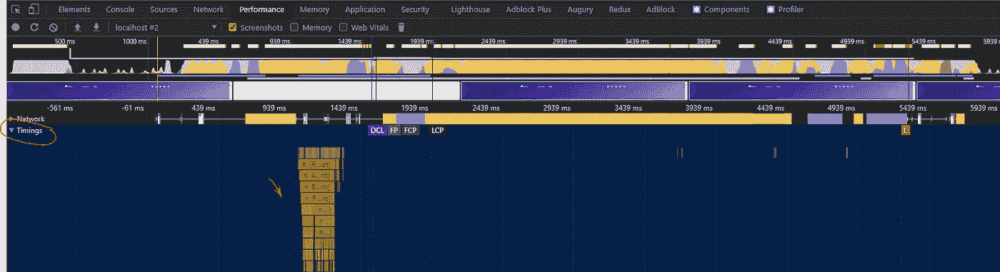
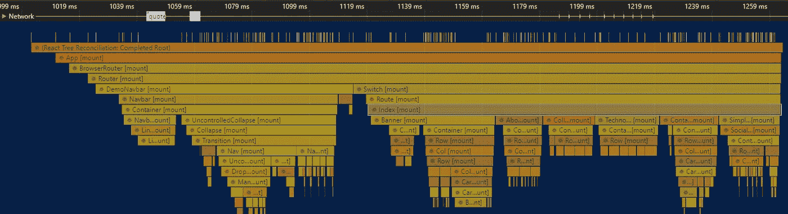
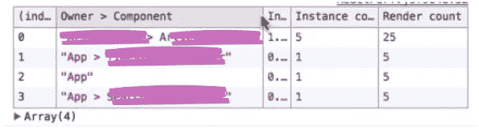

# 如何衡量 React 应用组件的性能

> 原文：<https://levelup.gitconnected.com/how-to-measure-react-apps-components-performance-6b0b9b0236db>

## 创建高性能的 React 组件！


Chrome 为我们提供了一个强大的工具来衡量我们的组件有多好，性能有多高。该工具是性能选项卡，用于记录和分析应用运行时的性能。

对于网络应用来说，最昂贵的事情就是重新渲染。一些改变会导致组件在不必要的时候重新渲染，这是一种浪费，不是吗？

我在“性能”选项卡上遇到的问题是，它不能简单直观地立即理解。

还有另一种方法可以更直观地查看概要分析，那就是在本地使用`websiteAddress/***?react_perf***` 我们可以查看`***http://localhost:3000/?react_perf***` 的 ***计时*** 部分:



“计时”部分

然后，您可以悬停或缩放每个黄色块，以检查哪些需要大量时间进行渲染。这种方式可以快速检查一个组件是否占用了过多的时间，或者是否发生了意外的事情，比如不需要的更新。



缩放后的“计时”部分

这里的问题是，有时特别是在大型应用程序中，我们需要更详细的报告。除此之外，我们需要多次检查每个组件的渲染时间，以确保每次的结果都是相同的，并且其他因素不会影响它们。

当然，渲染一个组件所需的时间是相对的。这要看环境。例如，在生产模式下，我们的应用程序进行了优化，应用程序比开发模式下更快。然而，这些数字仍然可以作为一个指标，让你的应用程序更好、更智能。

# 在这里，性能附件来拯救我们！

React 有一个非常有用的工具，那就是`react-addons-perf`。和每个包一样，我们首先需要用`yarn`或`npm`作为开发依赖来安装它:

```
yarn add --dev react-addons-perf
//Or
npm i --save-dev react-addons-perf
```

有了这个工具，我们可以通过使用`start()`和`stop()`功能开始测量我们的组件。最有趣的函数是`printWasted()`。

让我们开始行动吧:

*   首先，我们需要导入`Perf`:

```
import Perf from 'react-addons-perf'; 
```

`Perf`基本上是`window`的一种，所以我们需要确保首先有`window`并且它不是未定义的，只有在这之后我们才能使用`Perf`工具:

```
import Perf from 'react-addons-perf';
if(typeof window !== 'undefined'){
 **  window.Perf = Perf;**
}
```

*   我们需要将`Perf.start()`包装在 *setImmediate* 中，告诉编译器我们需要异步执行这段代码，但是要尽快。

```
componentDidMount(){
...setImmediate(() => {
  Perf.**start();**
});setTimeout(() => {
  Perf.**stop()**;
  Perf.**printWasted()**;
}, 5000);}
```

现在，您可以看到在不必要时重新渲染的组件并修复它:



## 最后

> 请注意，`Perf`对象只能在开发模式下与 React 一起使用。在构建用于生产的应用程序时，不应该包含这个包。

不幸的是，React v16 不支持该工具。将来会有新的版本:

> `"react-addons-perf`在 React 16 中根本不再起作用。将来我们很可能会发布这个工具的新版本。同时，您可以[使用浏览器的性能工具来分析 React 组件](https://reactjs.org/docs/optimizing-performance.html#profiling-components-with-the-chrome-performance-tab)。”React v16 发布公告。

我等不及性能反应插件回来了！

# 享受~ ᕕ(ᐛ)ᕗ

我希望你和你的家人无论在哪里都平安无事！坚持住。明天会更好！

**让我们联系上** [**中**](https://medium.com/@famzil/) **，** [**领英**](https://www.linkedin.com/in/fatima-amzil-9031ba95/) **，** [**脸书**](https://www.facebook.com/The-Front-End-World) **，或者** [**推特**](https://twitter.com/FatimaAMZIL9) **。**

**FAM**

