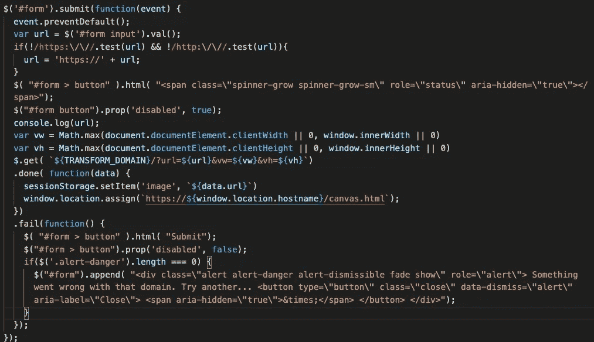
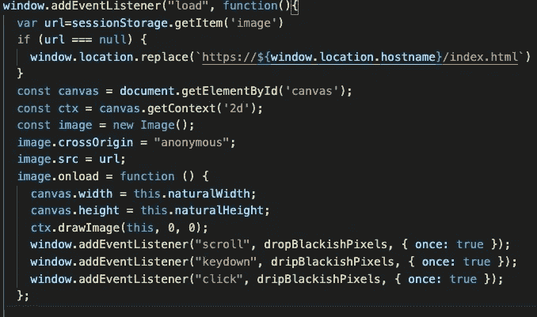
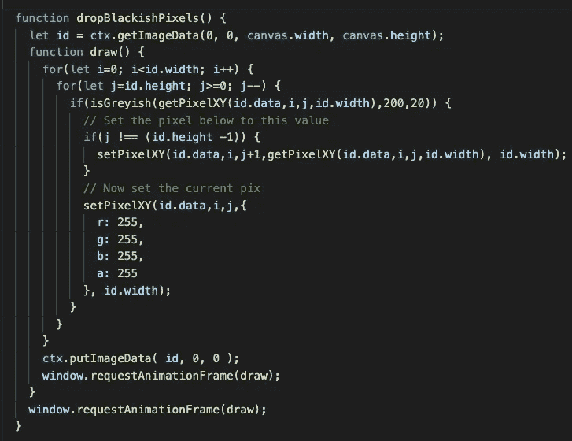
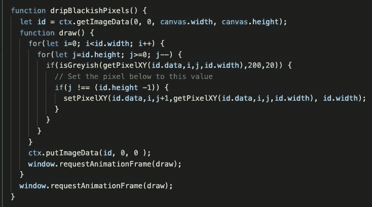
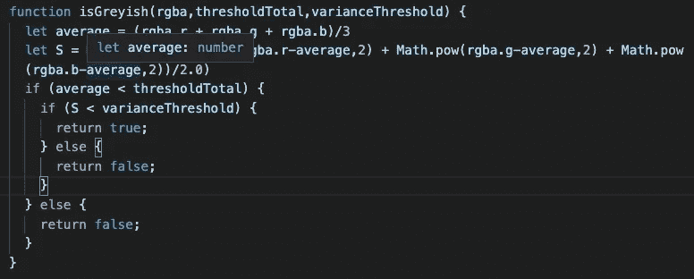
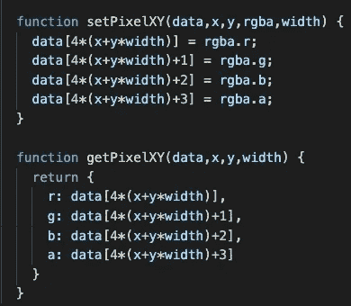

# 如何融化一个网页

> 原文：<https://levelup.gitconnected.com/how-to-melt-a-webpage-4fd6cf2cb80e>

## 使用 web-screwing 和 WebGL 来融化任何有趣的网页。

# 它的作用

所以我创建了一个网站来“融合”其他网页。

好吧，坦率地说:这不会融化网页。基本上，它找到所有的“灰色”像素，然后将它们慢慢地向下移动。因此，你可以输入任何你想要的域名，然后点击提交按钮，提交的网页就会呈现出来，当用户点击按钮或向下滚动页面时，网页似乎就“融化”了。

描述这一点的最好方式是用一个例子。

StackOverflow 网站上的 PageMelt 工作示例。来源:图片由作者提供。

下面是另一个例子，演示如何提交一个网站。

BBC 网站上 PageMelt 的一个例子。来源:图片由作者提供。

您可以访问该网站了解更多信息:

 [## 页面融化

### 它是如何工作的进入一个域，当你试图滚动或敲击键盘时，你会看到页面立即融化。它基本上…

pagemelt.alexandermorton.co.uk](https://pagemelt.alexandermorton.co.uk/) 

# 我为什么建造它

现在你可能会问自己，为什么任何正常人会做出这种事？首先，理智往往只是视角或多数法则的问题；然而，在这种情况下，我不得不证明这些论点，因为这个项目是一个特别古怪的性质。因此，让我们尝试一些其他的理由:

1.  酷科技
2.  我会用的东西

## 技术

这里使用了一些有趣的技术

*   操纵木偶的人
*   自动气象站λ
*   Chrome AWS
*   APIGW
*   无服务器框架
*   云锋
*   S3
*   WebGL
*   会话存储

这些技术中有很多我每天都在使用，或者过去在工作中使用过，所以我对它们都不感兴趣。我主要关注 WebGL 和 HTML canvas。我过去曾尝试过这些，但从未找到一个我想发布的好用例。

## 我会用的东西

这可能只是我和我认识的人，所以可能更能说明我们的幽默感，但在大学的几年里，我们确实在摆弄别人的屏幕。从来没有严重到破坏电脑，但足以摆脱他们，所以我们可以嘲笑他们的困惑。

所以最近在与某人的交谈中，我开始思考是否有一些服务可以很容易地做到这一点。我可以在网上找到网页清除器，但是没有一个能在点击按钮或移动鼠标时立即融化网页的。有人告诉我，有些应用程序做了类似的事情，但这意味着下载一个我认为很多人会反对的应用程序；我知道我会在我的机器上。

如果有类似的事情，请告诉我。

# 它是如何工作的

当你跨过最初的几个障碍时，这没什么大不了的。

我最初想在浏览器上做所有的事情，因为这样可以省去我设置任何服务器的麻烦；然而，快速思考后，我意识到这是不可能的，因为我会触犯 CORS:大多数网站服务器，至少是那些关心安全的服务器，设置“访问控制允许来源”头，告诉浏览器哪些域可以访问它的端点。这将使大多数网站呈现不正确。所以我知道我需要一个外部服务器。

## 后端

这是更昂贵的，我不愿意支付超过便士一个月的笑话网站，所以 AWS lambda 是唯一的选择。这并没有完全减轻我的担忧，因为我现在担心内存使用和大小限制。对于运行一个无头浏览器来说，内存使用量可能相当大，如果我必须将一个打包到 lambda 中，我可能会大大超过 50MB 的大小限制。

经过一番阅读，我找到了这篇文章，它减轻了我对函数整体大小的担忧。此外，它还为 headless chrome 指定了一个现有的 AWS lambda 层，因此我不再需要自己制作层，减少了我的工作量。这个例子还使用了 puppeteer，它在 nodeJS 中提供了一个 API 来控制我已经在实验中使用的 headless chrome，所以我也不需要修改它。**完胜！**

你可以看到最终的 lambda 函数，它完成了 PageMelt 网站需要的所有功能:

AWS lambda 函数抓取网页并在 s3 中存储输出。来源:图片由作者提供。

需要注意一些事情:

*   放置在 CORS 检查提供非常有限的安全检查
*   接受我们传递给木偶师的客户端浏览器大小和类型
*   将屏幕截图的输出保存到 s3 存储桶
*   生成一个签名的 URL 传递给浏览器，该 URL 仅工作 30 秒
*   保持截图的质量为 30，使用 jpg 来保持最小的存储空间
*   确保浏览器存储图像，以便在 30 秒超时后无需再次调用 s3 即可重新运行

*我将截图存储在 s3 中，但我可以直接从 lambda 函数将 jpg 推送到浏览器；然而，成本相对较小，我想看看人们拍摄的截图。*

有了这个 lambda，我们现在可以使用无服务器框架进行部署:

后端基础设施的无服务器框架设置。来源:图片由作者提供。

需要注意一些事情:

*   设置桶上的 CORS 作为一些有限的安全
*   将 API 调用限制到每秒 10 次，因为这只是一个测试站点，我们不想被一些恶意用户淹没
*   将呼叫总数限制在 10，000，以减轻恶意用户的损害
*   传入预制的“chrome-aws-lambda”层，因为没有必要重新创建它

现在我们有了后端设置，我们需要转向前端。

## 前端

我们需要从前端获取 lambda 所需的信息。这非常简单，只需要收集信息，将其传递给 lambda，并获得我们想要下载的 s3 bucket 映像的 URL。因为我们从 index.html 页面移动到 canvas.html 页面来呈现抓取的网页，所以我们将 s3 域存储在会话存储中。

在 index.html 使用的前 Javascript 代码。来源:图片由作者提供。

一旦我们在 canvas.html 页面上有了 s3 图像名称，我们就可以将其呈现为 HTML img，然后将其移动到 canvas 元素上。我们必须确保在从服务器加载 img 之前不会呈现 canvas 元素。此外，我们还必须确保所有的窗口监听器只被调用一次，否则我们会崩溃我们的浏览器调用画布更新一次又一次…

在 canvas.html 使用的 Javascript 代码的开始。来源:图片由作者提供。

接下来我们要考虑如何更新像素。作为一个开始，我想只是移动页面上的“灰色”像素。

这将从页面底部开始，一个像素一个像素地向下移动。来源:图片由作者提供。

接下来，我们再次做同样的事情，但现在像素是沿着页面往下滴，而不是往下滴。

这将从页面的底部开始，一个接一个地向下移动像素，但不会删除上面的灰色像素。来源:图片由作者提供。

术语“灰色”定义如下。基本上，如果 RGB 值相似并且低于某个阈值，则它们被定义为灰色。这是用大多数人都熟悉的方差方程来完成的。

计算哪些像素是灰色的，应该移动。来源:图片由作者提供。

将图像数据的像素从 1D 格式转换到我们熟悉的 2D 网格是在下面完成的。需要注意的是，1D 图像一个接一个地叠加每个像素的 RGBA 值；所以你可以用一个简单的公式在它们之间转换。

数据类型之间的转换公式。来源:图片由作者提供。

一旦完成所有设置，我们就用 Webpack 打包代码，并使用 Github 动作部署到 CloudFront 后面的 s3 bucket。安全报头和基本路由由 lambda edge 函数提供。

# 结论

这可能看起来完全是浪费时间，但我真的很喜欢这个项目，因为我喜欢 WebGL 在浏览器中的潜力。你可以找到很多更好的 WebGL 的例子，但是我喜欢它的奇怪之处。有人将其描述为现代艺术，但我不会说得那么远；我只是觉得它看起来很有趣。

我能想到一些事情来改善这个项目，比如使用光学字符识别来识别文本，并使其下降，但这将是另一天。