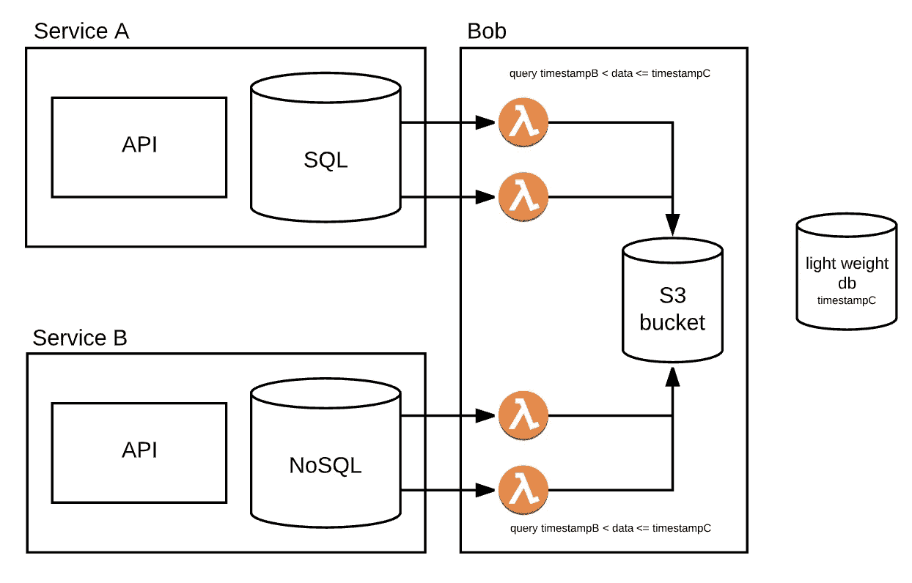

# 如何使用 AWS Glue 合并 NoSQL 和 SQL

> 原文：<https://levelup.gitconnected.com/how-to-merge-nosql-and-sql-using-aws-glue-ec83c6f02137>

## 如何同时报告来自 NoSQL 和 SQL 的数据而不至于发疯


我的一个项目涉及为一家食品配送公司创建一个生成报告的平台。它运行在微服务架构上，每个服务都有自己的数据库。大多数有一个 MySQL 数据库，但一些由实时事件驱动的(例如，驱动程序在哪里)有一个 NoSQL 蒙戈数据库，所有这些都生活在 AWS 上。

该项目是创建一个自治平台，将定期创建报告，前端用户界面可以消化和显示一些漂亮的图形业务人员。所以最终结果应该是这样的:


其中一份报告是关于系统的预计到达时间与司机到达目的地的实际时间相比有多准确。ETA 数据和用于计算它的数据(交通状况、距离和时间)存储在一个 MySQL 数据库中，而司机所走的实际时间和路线存储在一个 Mongo 数据库中。

# 第一步:获取数据

假设我们的数据存在于 Mongo 的两个文档和 MySQL 的两个表中。要解决的第一个问题是如何获得我们需要的数据来制作报告，并且仅仅是这些数据。毕竟，这些都是海量的数据库，我们读得越少，查询就越快。

我们有两种选择来获取数据:

**选项 A:** 我们可以设置触发器，在数据进来的时候创建视图，或者把数据吐到另一个 Mongo 和 MySQL 数据库里。但是，这种方法的问题是，即使它不会增加编写数据库的任何成本，它也会使处理数据库的服务有责任维护这些触发器，因此这种责任就落在了处理这些服务的团队身上。因此，考虑到业务需要独立于其他团队进行报告，这个选项就是**失败**。


**选项 B:** 如果我们不能让持续的事件从我们所追求的数据源中发出，那么我们需要自己去读取它们。我们可以设置一些对这些数据库有读取权限的外部服务，并且能够运行查询来获得报告所需的数据。该服务将需要使用某些索引来提高读取效率，而管理主要服务的团队只需要在他们的数据库中创建索引，这是一件容易得多的事情。


我们决定将这个读取服务称为 **Bob** ，我们还决定在 AWS Lambda 函数上构建 Bob，并让它将查询结果导出为 S3 桶中的 CSV 文件，因为 Bob 不会连续运行，可能每天/每周/每月运行一次。这使得企业可以灵活地决定何时运行 Bob，而不必担心在 Bob 不做任何事情时必须为 Bob 付费。

Bob 现在由四个不同的 lambda 函数组成，我们需要从 Mysql/Mongo 中读取的每个表/文档都有一个函数。每个函数都连接到数据库，并在被触发读取数据时运行查询。


现在，我们有了所需的数据，可以将它们合并在一起，形成一个大 blob，供报告服务读取和报告。

# 第二步:合并数据

棘手的部分来了。我们有来自 Mongo 的以嵌套对象表示的数据，也有来自 MySQL 的平面数据

```
// NoSQL{tripId: abc,timeFrom: 123123123,timeTo: 123123123, travelPath: [ { lat: 123123123A lng: 123123123B }, { lat: 123123123C, lng: 123123123D }, { lat: 123123123E, lng: 123123123F } ]}// SQL{ tripId: abc, driver: Mr X, deliveringFrom: Tekehashi Store}
```

为了将它们合并在一起，我们需要首先通过分解对象的嵌套对象并将它们都放在一行来展平 Mongo 数据。

从上面到:

```
// NoSQL
{ tripId: abc, timeFrom: 123123123, timeTo: 123123123, lat: 123123123A, lng: 123123123B},{ tripId: abc, timeFrom: 123123123, timeTo: 123123123, lat: 123123123C, lng: 123123123D},{ tripId: abc, timeFrom: 123123123, timeTo: 123123123, lat: 123123123E, lng: 123123123F}
```

然后，我们使用`tripId`将数据从 MySQL 映射到 Mongo，将它们放在同一行中，并存储在一个新的数据仓库中。为此，我们使用 AWS Glue 服务。

AWS Glue 是一个 ETL， *Extract-Transform -Load，*服务，用于将不同来源的数据“粘合”在一起。

我们在 AWS Glue 上编写了一个 Python 脚本，该脚本基于`tripId`进行映射，并让 Glue 将最终结果导出到 AWS Redshift 数据仓库中，在这里将会发生神奇的报告。让我们称那部分为帕特丽夏。


为了让 Bob 与 Patricia 交谈，Patricia 从 Bob 导出的 S3 存储桶中读取 CSV 文件并映射它们。

# **第三步:编排**

现在一切就绪，这应该可以工作了。但是，Bob 和 Patricia 是不通信的不同服务。S3 存储桶保存 Bob 导出和 Patricia 需要的数据。然而，我们需要另一个服务来告诉 Bob 开始，等到 Bob 完成，然后告诉 Patricia 数据准备好了，等到 Patricia 完成，然后升起一个标志，让每个人都知道数据查询和合并已经完成，可以报告了。

该服务需要知道管道(Bob 和 Patricia)何时开始运行，何时结束，以便防止数据重叠，并告诉 Bob 开始查询我们知道尚未收集的新数据。

即

1.  鲍勃开始查询从`timestampA`到现在他的`timestampB`的数据


2.`timestampB`被保存在某个地方供以后参考(这样我们就知道鲍勃在做什么)

3.后来，有人要求另一份报告。新的编排服务将要求 Bob 从`timestampB`开始查询，直到现在`timestampC`



为了让 Bob 工作，我们需要做的就是触发 Bob 拥有的每个 lambda 函数或一个“启动”函数。一旦 Bob 的所有函数都完成并将其数据导出到 S3，我们现在就可以触发 Patricia 的 AWS Glue 并让它运行。为了做到这一切，我们创建了一个 lambda 函数，并将其命名为**弗兰克叔叔**。


为了不让 Frank 一直等到 Bob 的所有 lambda 函数都完成，我们让 Bob 在一个查询或函数完成其工作时调用 Frank，我们为 Frank 创建了另一个 lambda 函数来保存每次“我完成了！”调用一个带有时间戳的轻量级 Dynamo 数据库，检查是否所有的工作都完成了，一旦所有的工作都完成了，Frank 就调用 Patricia。


如果我们只有一个文件进入 S3，我们可以用 S3 **上的触发器来代替 Frank 对 Patricia 的调用，但是因为我们有四个不同的文件可以以不同的顺序上传，所以我们需要一个外部服务来进行监控，并在四个文件都准备好被消化后采取行动**

Frank 的数据库看起来像这样:

```
{ reportType: “ETA”, jobTimestamp: <timestamp> BobMySQL: { A: <timestamp>, B: null } BobMongo: { A: <timestamp> B: <timestamp> }}
```

注意在这个例子中,`BobMysql.B`没有时间戳。因此，可以有把握地认为它还没有完成这些工作。


每次 Bob 调用 Frank 时，Frank 都会检查是否所有的表都已完成，并触发 Patricia。


我们为 Patricia 实现了相同的逻辑，并让 Frank 存储 Patricia 何时完成胶合工作。我们这样做是为了能够告诉任何其他正在等待报告的服务它已经完成了。我们用社交网络把它传达给任何一个在听的人。


最后，我们为 Frank 创建了一个基于时间的云观察触发器，因此它可以在每天午夜运行报告。我们还为 Frank 创建了一个 SSM 参数存储来保存上次运行报告的时间戳，这样当 Frank 运行时，它会将该时间戳传递给 Bob，Bob 会基于该时间戳查询所有数据。


# **第四步:缩放**

第四步也是最后一步是为我们的每一份报告重复这一过程。为此，我们为 Bob(即 Sabrina)创建了另一组函数，为 Patricia 创建了另一个 Python 脚本，其余部分可重用，同时记住 Frank 需要了解每份报告以及获取该报告所涉及的查询，以便知道何时调用 Patricia 的特定粘合函数。

因此，假设我们有另一个合并了三个 MySQL 表和一个 Mongo 表的报表，我们的流程应该是这样的


在该模型中，我们有另一个名为 Sabrina 的服务，它执行三个 MySQL 查询和一个 Mongo 查询，Patricia 有另一个胶合映射脚本，它将最终结果与第一个脚本放在同一个数据仓库中。

Frank 的架构仍然相同，但编排功能知道有一个名为 Bob 的服务在完成之前有 2 个 SQL 和 2 个 NoSQL 作业，还有一个名为 Sabrina 的服务在完成之前有 3 个 SQL 和 1 个 NoSQL 作业。它还知道每个服务/报告的合适的粘合工作。