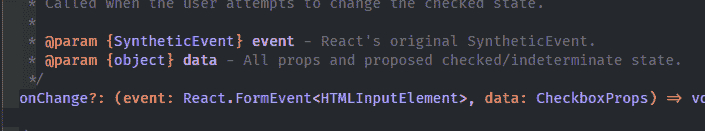
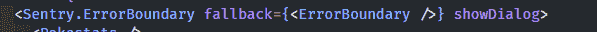

# 如何将 Create-React-App 迁移到 React 版本 18

> 原文：<https://levelup.gitconnected.com/how-to-migrate-create-react-app-to-react-version-18-6ce5060da224>


# 介绍

React 最近发布了他们库的新版本:React version 18。我有几个我已经维护了一段时间的应用程序，现在我们用 Create-React-App 进行引导。我将回顾如何迁移到版本 18，以及在此过程中我遇到的问题。

[这里](https://reactjs.org/blog/2022/03/29/react-v18.html)你可以找到 React 18 的改动列表。

我也有一个小写我的想法[在这里](https://relatablecode.substack.com/p/react-18-finally-out-and-new-css?s=w)。

# Create-React-App 迁移到 React 版本 18

实际的迁移过程非常快。让我们安装必要的依赖项:

```
yarn add react react-dom
```

create-react-app 背后的团队还推出了 5.0.1 版本，以帮助迁移过程，并使任何新应用开箱即用:

```
npm install --save --save-exact react-scripts@5.0.1 or yarn add --exact react-scripts@5.0.1
```

如果你正在使用 Typescript，不要忘记更新你的类型，不仅是为了 React，也是为了不同的第三方**库。许多人更新了他们的应用程序。**

```
yarn add @types/react @types/react-dom @types/node --dev
```

# 强制性变化

我们要做的第一件事是改变 React 呈现根节点的方式。第一个代码块是它最初的样子。

```
import ReactDOM from 'react-dom'; 
import App from './App'; ReactDOM.render( <App /> , document.getElementById('root') );
```

现在我们将使用新添加的 **createRoot** 函数:

```
import { createRoot } from 'react-dom/client'; 
import App from './App'; const container = document.getElementById('root'); 
const root = createRoot(container); root.render(<App />);
```

# Create-React-App 迁移到 React 版本 18: Typescript

如果你不使用 Typescript，你可以跳过这一部分。

首先，让我们检查一下我们需要处理多少错误。这将因项目而异，取决于您有多少不兼容的第三方库，但它们都将以类似的方式解决。

运行以下命令:

哎哟，我们有 36 个错误要解决。幸运的是，大多数都是一样的。


我在这个项目中使用了语义 UI[, UI Radio 组件有几个错误。例如，我有一个 **setView** 函数，它接受来自 **onChange** prop 的参数。由于某种原因，我丢失了对 **e** 和**数据**参数的输入。](https://react.semantic-ui.com/)

```
Parameter 'data' implicitly has an 'any' type. onChange={(e, data) => setView(data.value as number)}
```

我点击了 **F12** (Windows 用户)或者右击并前往类型定义。在 onChange 的 prop 上检查它应该返回什么，并手动设置函数的类型。



确保从库中导入类型，并在函数本身内部设置类型。

```
import type { CheckboxProps } from 'semantic-ui-react'; <Radio 
// other props 
onChange={(e: React.FormEvent<HTMLInputElement>, data: CheckboxProps) => { // whatever your function does } } 
/>
```

# 创建-反应-应用程序迁移到反应版本 18:哨兵

我还使用 Sentry 库来跟踪项目中的错误。这里有一篇关于其工作原理的快速文章。对于 sentry，我在 ErrorBoundary 组件中发现了一些错误。这可能会被修补，但我们可以提前做到这一点，直到那时。

React 版本 18 要求在 props 中显式声明子元素，因此出现错误:

```
error TS2769: No overload matches this call. Overload 1 of 2, '(props: ErrorBoundaryProps | Readonly<ErrorBoundaryProps>): ErrorBoundary', gave the following error.
```

谢天谢地，有一个叫做补丁包的库可以让我们修复这个问题。让我们安装它。

```
yarn add patch-package --dev
```

像以前一样，让我们通过进入 ErrorBoundary 来检查它的类型定义。按 F12 或右键单击并转到类型定义。



正如怀疑的类型没有儿童道具。让我们通过设置一个**反应来添加它。反应节点**。

```
export declare type ErrorBoundaryProps = { 
children: React.ReactNode;
 //...rest of the type, just ignore it
```

为了让**补丁包**识别这一变化，我们应该在终端中运行以下命令:

```
npx patch-package @sentry/react
```

这将在我们的项目中创建一个文件，指示我们在库中修补的更改。

```
diff --git a/node_modules/@sentry/react/types/errorboundary.d.ts b/node_modules/@sentry/react/types/errorboundary.d.ts index 4e1f326..779e0e7 100644 --- a/node_modules/@sentry/react/types/errorboundary.d.ts +++ b/node_modules/@sentry/react/types/errorboundary.d.ts @@ -9,6 +9,7 @@ export declare type FallbackRender = (errorData: { resetError(): void; }) => React.ReactElement; export declare type ErrorBoundaryProps = { + children: React.ReactNode; /** If a Sentry report dialog should be rendered on error */ showDialog?: boolean; /**
```

最后一步是将下面一行添加到我们的 **package.json** 中的**脚本**中。

```
"scripts": {
 // ...other scripts 
"postinstall": "patch-package" 
}
```

# 旁注

顺便说一句，如果有你不想修补的库，只想在维护人员修复它们的时候暂时忽略这些错误。(或者，您可以打开一个 PR 来修复它！😬)只需在错误之前向文件中添加一些 ts-ignore:

# 包装它

Create-React-App 仍然是最广泛使用的引导 React 应用程序的方法，因此能够迁移它对于一些用户来说非常重要。🚀

更多内容在[相关代码](https://relatablecode.com)

如果你喜欢这个，请在 LinkedIn 或 Twitter 上与我联系

在我的[时事通讯](https://relatablecode.substack.com/)中查看我的免费开发者路线图和每周科技行业新闻。

*原载于 2022 年 4 月 18 日 https://relatablecode.com**T21*[。](https://relatablecode.com/how-to-migrate-create-react-app-to-react-version-18/)