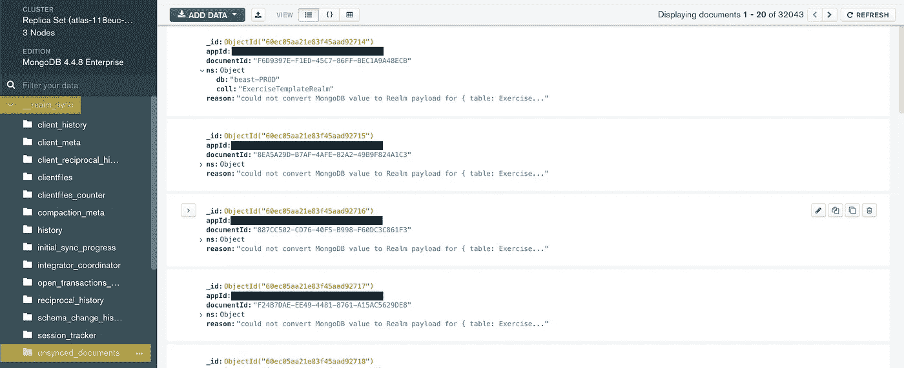

# 如何简单地将数据迁移到 MongoDB 领域

> 原文：<https://levelup.gitconnected.com/how-to-migrate-data-to-mongodb-realm-the-easy-way-d2e22d42dfbf>

## 了解将数据迁移到 MongoDB 领域时的常见挑战以及如何克服这些挑战

第一次将遗留数据导入 MongoDB 领域可能会很痛苦。标准的 MongoDB 导入机制不能开箱即用。本文将揭示一些常见的陷阱以及如何克服它们。

免责声明:每个数据迁移都由三个 ETL 步骤组成提取、转换、加载。在本文中，我们将只关注 MongoDB 领域的转换和加载部分。您的数据可能来自任何类型的数据源，因此本文不讨论提取部分。

# 先决条件

为了遵循本文中的示例，确保您已经安装了一个 [node.js](https://nodejs.org/en/) 环境和一个相应的代码编辑器。我个人比较喜欢 [Visual Studio 代码](https://code.visualstudio.com)。

不用说，您还需要访问想要迁移到 MongoDB 领域的遗留数据。这可以是 csv 文件、本地数据库或其他云存储解决方案中的任何内容。

要使用 MongoDB 导入和导出命令，您还需要安装 MongoDB 数据库工具。你可以在这里找到安装说明。

# 了解所需的输入格式

为了理解 MongoDB Realm 在导入期间期望的确切 JSON 格式，建议您直接在 MongoDB Realm 中为要导入的 Realm 对象创建一个示例记录。您可以通过 MongoDB GUI 或者通过您已经连接到 MongoDB 领域的应用程序来完成此操作。一旦数据库中有了工作记录，就可以使用以下命令下载数据:

这是在我自己的[健身应用](http://www.beastworkout.ai)中使用的示例用户配置文件对象的 MongoDB 输出。您的数据看起来会有所不同，但下面的示例涵盖了常见的数据类型，如字符串、整数、双精度、日期、列表、布尔以及如何处理它们:

一旦导出了 JSON，它就成为了您的参考模板，您需要为所有遗留数据复制它。

# 准备您的数据

我建议您编写一个小型 nodejs 应用程序(本文中的代码片段是用 JavaScript 编写的),它将从现有数据库中提取数据，然后转换数据并将其导出为所需的 JSON 文件格式。

## ID 和分区

MongoDB 领域要求每个记录都有一个惟一的 ID 和一个分区字符串。如果您的遗留数据没有这两个值，您需要生成它们。在下面的示例中，user_profile 对象根据我的旧数据中的 Firebase 用户 id 接收新属性“_id”和“_partition ”:

如果您的记录没有唯一的 _id 和分区键(例如 _partition)，导入到 MongoDB 领域将会失败。

## 日期

日期值需要特殊处理。根据我的经验，MongoDB 领域不接受 json 中存储日期的常规方式。相反，我建议您使用类似于下面的代码块来构造 Realm 可以接受的格式:

该代码片段生成一个将被 MongoDB 领域识别的日期值。

## 两倍

只要是“真正的”双精度值，如“19.2”或“25.8”，双精度值在导入过程中就没有问题。如果您的旧数据包含类似“1”的双精度值，它将在导入过程中被解释为整数。因此导入将会失败。我想到的唯一可行的解决方法是添加一个小数字，以确保那些双精度值也能被识别:

## 列表

在导入过程中，我也遇到了列表问题。在上面的例子中，属性“workoutOrder”是一个字符串列表。以下是成功导入的解决方法:

## 导出到 JSON

一旦更新了对象的所有属性，就可以将它导出到 JSON 文件中，如下所示:

到那时，您应该有一个 JSON 文件，其中包含格式良好的条目，可以很容易地导入到 MongoDB 领域中。

# 上传您的数据

重要的是要理解:MongoDB Compass 应用程序不能用于将数据导入到 MongoDB Realm 应用程序中！相反，您需要使用 mongoimport 命令。这非常简单:

在导入过程中，您会收到导入成功与否的反馈。如果您安装了 MongoDB Compass，您可以在“unsynced_documents”中的“_realm_sync”部分查看更详细的错误消息。

MongoDB 指南针领域同步错误日志

就是这样！只需几个简单的步骤，您就可以成功地将任何遗留数据迁移到 MongoDB 领域。

# 链接和参考

*   [Node.js](https://nodejs.org/en/)
*   [Visual Studio 代码](https://code.visualstudio.com)
*   [MongoDB 领域](https://www.mongodb.com)

# 放弃

本网站上的帖子是我个人的，不一定代表我的雇主的帖子、策略或观点。