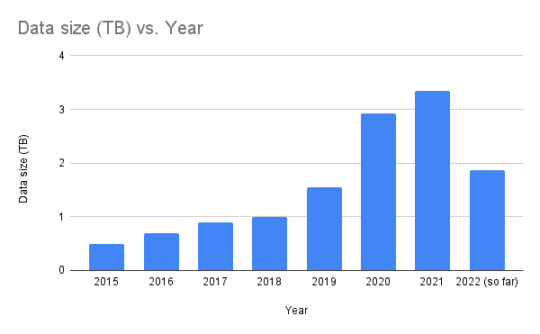
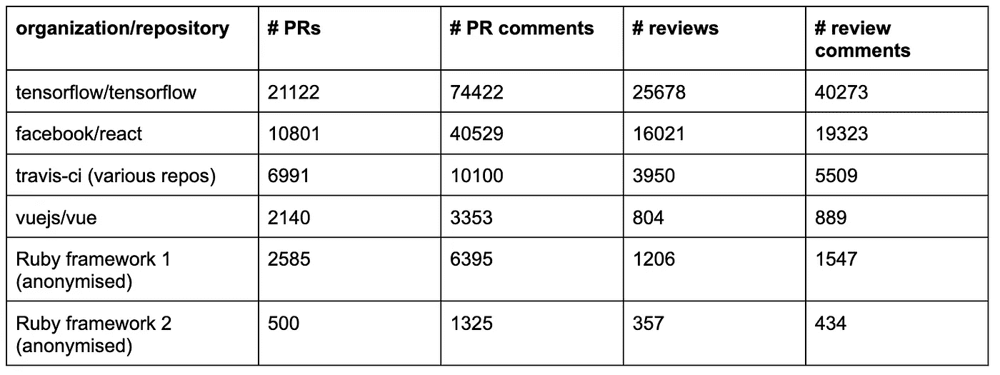

# 2022 年如何挖掘 GitHub 数据

> 原文：<https://levelup.gitconnected.com/how-to-mine-github-data-in-2022-e9c70b3f61d3>


# 从 GitHub 获取数据不像以前那么容易了

***只是想要代码片段？向下滚动到“如何构建自己的 Github 数据 ETL”一节。***

我回来了。最近，我使用从 GitHub 中挖掘的数据做了一些数据分析，以发现开源社区中的关键挑战和机遇(分为 3 部分: [1](/how-to-grow-a-sustainable-inclusive-open-source-community-ce156214cc9f) 、 [2](https://medium.com/p/d79bd0af0ea3) 、 [3](/how-to-create-a-better-first-time-contributor-experience-for-your-open-source-project-27300d6085ad) )。在这个过程中，我学到了很多关于从 GitHub 获取数据的知识，我想与大家分享，这样你就不会犯我在“对开源数据进行快速分析”时犯的错误。

当我开始这个项目时，我非常确信获取数据会很容易。我们的公司(quick plug:它叫做[multiples](http://multitudes.co/)，我们做道德团队分析)实际上是从 GitHub 收集元数据并进行分析。我几乎不知道规模很重要(哈哈，我是数据科学家吗)而且在 GitHub 上为一些最大的项目获取多年的历史数据并不简单。

我从在线论坛和采矿软件仓库社区的人那里听说，很多人现在正在构建自己的 ETL 来从 GitHub 获取数据，因为现有的解决方案如 GHTorrent 和 GHArchive 不再适合他们的目的。因此，本着分享知识的精神，这里是我从评估 GHTorrent 和 GHArchive 作为数据源，并最终使用我们自己的内部 ETL 中学到的一些东西。我希望它对任何做软件仓库分析的人都有帮助。

GitHub 仍然是一座信息的金矿，并为改善我们的技术社区的组织文化提供了很好的见解，所以起亚卡哈和我一起说，“大数据 IRL 万岁！”

# GHTorrent 将所有东西都组织在关系数据库中，但是没有最近的数据

[GHTorrent](https://ghtorrent.org/) 是来自 Github REST API 的数据的离线镜像。它从每个公共 repo (pull requests，comments，reviews，commits，issues，users)中获取除代码本身之外的大多数与 Github 上的 pull 请求相关的数据。这存储在 MongoDB 数据库的原始 JSON 中。请注意，捐赠预期用于商业用途。

## **优点**

*   数据已经被组织到表中，以备查询。

## 骗局

*   它似乎只有截至 2019-2020 年左右的数据。我需要更多最近的数据，特别是因为 covid 可能会对我的研究产生影响(开发人员福利、协作和倦怠)。此外，在软件行业，几年是一段很长的时间，而且趋势变化很快。我想确保我的见解与今天相关。
*   我听说可能会有一些丢失数据的问题。

# GHArchive 是 BigQuery 上的一个公共数据集，但它在数据上有一些缺口

[GHArchive](https://www.gharchive.org/) 存档来自 GitHub 的实时事件数据。它是 GHTorrent 的一个受欢迎的替代品，有一些很好的例子说明它被用于[各种分析](https://www.gharchive.org/#resources)。事件数据存储为 JSON，并在 BigQuery 上作为公共数据集提供。这非常有用，因为这意味着你根本不需要设置任何东西，你可以直接开始查询。注意，您将为 BigQuery 上的查询付费，每 TB 5 美元。您每月可以获得 1 TB 的免费空间，另外在首次注册时还可以获得 300 美元的免费配额，即 60 TB。相比之下，查询 2017 年至 2021 年的 5 年数据将处理大约 10 TB。



存储在 BigQuery 中的数据是列式的，因此“WHERE”过滤器对处理的数据量没有任何影响。您处理的列数确实有所不同，但是您想要的大部分内容都在大的“payload”字段中(这是来自 GitHub 的原始 JSON)，所以我们无法真正减少以这种方式处理的数据量。

另一个问题是，您可能会对 20 多种不同的事件类型感兴趣:

我对其中的四个感兴趣:

*   **PullRequestEvent:** 关于 PR 本身的事情，比如创建、关闭、合并、更新。
*   **PullRequestReviewEvent:**PR 审核自己，包括审核主体。
    ⚠️ *这些只是从 2022 年前后才开始出现(它们在 2019 年 5 月或 2020 年 5 月不会出现)。这是第一个危险信号——如果我想测量人们等待评审的时间，我肯定需要评审数据！*
*   **PullRequestReviewCommentEvent:**PR comments *，PR review inline comments，回复 inline comments。
    *请注意，该事件包括公关评论(您刚刚放在公关本身上的评论)，即使它们不与任何特定的评论相关联。
*   **PushEvent:** push 事件，详细描述了被推送到分支的提交。这将是很好的，尤其是看看人们如何回应公关反馈(他们回去做了所说的改变吗？)但为了节省加工成本，我把它留了出来。

每个事件在其“有效载荷”字段中具有不同的值(此处为[模式](https://docs.github.com/en/developers/webhooks-and-events/webhooks/webhook-events-and-payloads))。这意味着，为了只返回每个事件类型所需的数据(取消嵌套“payload”JSON 字段并挑选出我们想要的字段)，我们需要为每个日期范围运行 3 次查询。2017 年至 2021 年的数据将为 10TB，因此整个日期范围内的 3 次查询将为 30TB，即我们免费配额的一半。因此，当务之急是在 5 年的日期范围内进行大规模查询之前，对较小的数据集(例如，一天的数据，根据日期和年份的不同，大约为 3–15gb)进行微调。

我最终决定一次性包含所有的字段，尽管许多字段都是空的。这也会增加我们返回数据的大小，但是我认为这是值得的，因为大多数额外的列都是空的。你可以[在 GitHub Gist](https://gist.github.com/jennynz/88a723680d587362ae3dda101e3e2294#file-gharchive_bq_example-sql) 上看到我最后的查询。

当省略像“pr_body”和“comment_body”这样的最大字段时，查询结果的大小约为所处理数据的 0.3%。我想只返回我需要的，因为从 BigQuery 下载的数据量是有限制的。你最多只能下载 10MB 到本地 CSV，或者 1GB 到 Google Drive(然后从那里下载到你的本地——这是我用的)。您也可以将它保存到 BigQuery(对于活动存储，每 GB 0.02 美元)，但是您必须支付每 TB 5 美元才能再次查询它(另外，我必须用 SQL 进行所有的分析)。

⚠️ ️ *注意，如果您尝试保存到本地 CSV，并且结果大于 10MB，它只会保存第一个~10MB(通常像 9.6–9.7 MB)并丢弃其余的！*

一旦我有了数据，我做了一些抽查，统计了随机 PRs 上的评论和意见，以查看数据是否对齐。 **⚠️在我抽查的 5-10 份 pr 中，没有一份是正确的**——他们至少遗漏了一些评论。经过一番挖掘，我了解到 GHArchive 爬虫有时会离线或达到 API 速率限制而错过事件(问题 [1](https://github.com/igrigorik/gharchive.org/issues/225#issuecomment-772846684) 、 [2](https://github.com/igrigorik/gharchive.org/issues/171#issue-288018695) 、 [3](https://github.com/igrigorik/gharchive.org/issues/222) )，填补数据中的这些缺口超出了项目的范围/能力。没有一种简单的方法来量化这个问题的程度，所以不幸的是，我决定放弃使用 GHArchive 数据进行分析。

## 赞成的意见

*   它已经可以在 BigQuery 上作为公共数据集使用。
*   MIT 许可证，所以我们可以免费使用。
*   数据完全是最新的，直到今天。

## 骗局

*   数据中有很大的差距。
*   您必须考虑大查询的处理成本。
*   通过 Google Drive 在本地下载数据可能会有点麻烦。

# 如何构建自己的 Github 数据 ETL

我决定尝试使用我们自己的内部历史数据管道(基本上是在 ECS 上运行的 Python 脚本)，我们用它来搭载新客户。这通常会通过 GitHub 的 GraphQL API 获取他们最近 6 周的数据，以便他们在首次登录时可以获得一些有用的信息。我对它进行了修改，以获得一个个人访问令牌([关于如何在这里生成令牌的说明](https://docs.github.com/en/authentication/keeping-your-account-and-data-secure/creating-a-personal-access-token)，您只需要“public_repo”权限)，而不是依赖 Github 应用令牌，因为我们不会要求这些开源存储库安装我们的 Multitudes 应用。我在本地运行这个修改过的管道，并提取了 6 个公共项目的 5 年数据。我做了 20 多次抽查，它们都 100%准确 PRs、评论和评论上的元数据检查得非常完美。好满足。即使它确实把我可怜的笔记本电脑打得够呛。

## 赞成的意见

*   完全免费，除了运行它的服务器的成本。
*   数据有效性和您构建的一样好——您可以对您运行的查询、您如何处理速率限制、错误等尽可能地复杂。

## 骗局

*   需要时间自己去建造。
*   如果您需要许多存储库在很长的日期范围内的数据，可能需要非常长的时间。
*   获取数据的当前状态，因此如果有人删除了评论或 PRs，您将无法访问该信息。这与 GHTorrent 和 GHArchive 不同，它们存储一段时间内的历史快照——即使评论已经被删除，它仍然可以在这些档案中使用。当然，用户可能出于某种原因删除了他们的数据，并且不希望这些数据被包括在研究中，但是由于这些数据是在公共存储库中发布的，所以对于这些数据是如何被第三方记录、复制和存储的，我们几乎无能为力。

这里有一个代码的简化版本，说明如何在您自己的研究中复制它。这将从 GraphQL 查询中获取结果，并以 JSON 文件的形式保存到 S3 中。您可能还想包括一些错误处理和一些单元测试！

# 如果你只有一个 API 令牌，这将需要很长时间

为了给出一个时间框架的概念，用我的一个个人 API 令牌，**我在本地连续运行这个 ETL 一个多星期，得到了不同规模的 6 个存储库 5 年的数据。6 个样本的大小没有 GitHub 的全部有趣，但是对我第一次挖掘软件仓库来说已经足够了。以下是我为每个存储库获取的数据量:**



# 数据清理和验证技巧

一旦数据下载完毕，您将需要进行一些数据处理，以展平嵌套的 JSON、重命名列、进行一些抽查和验证等。来自 GitHub APIs 的数据有一些问题。以下是我学到的一些东西:

*   【2016 年 9 月中旬前没有公关审核数据。我预计这是 GitHub 发布 PR 评论(包括在线评论和批准/变更请求状态)的时候。在那之前，看起来都只是公关评论。如果公关评论对你的分析很重要，我会从 2017 年开始你的约会范围。
*   **2015 年之前的 GitHub 数据有一个稍微不同的模式**，你需要处理它(或者像我一样截断数据从 2015 年开始)。
*   说明机器人活动很重要。近 20%的 PR 评论是由机器人发表的，1.8%的 PR 是由机器人撰写的。如果您正在计算像审查等待时间这样的事情，那么消除这些潜在的误报是非常重要的。
*   不是所有的机器人都有' user.type == 'Bot '。
    例如，[dependent bot](https://api.github.com/users/dependabot[bot])的用户类型为“Bot”，而 [facebook-github-bot](https://api.github.com/users/facebook-github-bot) 的用户类型为“user”。
    也有名字中没有“bot”二字的机器人(如工作服)，也有名字中带有字符串“bot”的真人(如汉娜·艾博)。
    有些真人的用户名可能看起来像机器人，并且/或者他们的行为也像机器人(例如，大量活动&快速响应时间)。值得在 GitHub 上查看一下，以确保万无一失。
    [我做了一个自定义过滤器来识别机器人，你可以在这里使用](https://gist.github.com/jennynz/08e34c4cbec6d7436bc26f1647b63f5e)。
*   **被删除用户的活动只占数据的不到 0.5%**所以我只是在检查了没有对任何特定回购产生不成比例的影响后将它们过滤掉了。对于“pr_author”或“comment_author”等字段，它们将具有空值。这可能意味着像审查等待时间这样的指标对于一些 PRs 来说被稍微高估了(例如，如果他们的第一个响应是由现在已被删除的用户做出的)。

# 结论

*   GHTorrent 和 GHArchive 是挖掘软件库的流行数据源，但它们的数据存在差距，尤其是最近几年。
*   作为替代，您可以构建自己的 ETL 来查询 GitHub API(无论是 REST API 还是 graph QL API)。然而，它会慢得多，你无法获得同样多的数据(我在 1 周内获得了 6 次回购的 5 年数据)。
*   如果你在分析公关评论，从 2017 年开始你的日期范围，因为那是他们开始在 GitHub 上使用的时候。
*   近 20%的公关评论来自机器人。如果对你的分析有意义的话，小心地过滤掉它们——仅仅依靠“user.type”字段是不够的。请随意使用[我的自定义过滤器](https://gist.github.com/jennynz/08e34c4cbec6d7436bc26f1647b63f5e)。
*   被删除的用户具有空值，这会打乱您的分析。在大多数情况下，你可以把它们过滤掉，因为它们只占不到 0.5%的活动。

```
🌱 Feedback, questions, thoughts? Ping me on [Twitter](https://twitter.com/MultitudesCo), [LinkedIn](https://www.linkedin.com/company/multitudesco/), or [hello@multitudes.co](mailto:hello@multitudes.co)👉 Interested in engineering effectiveness tools & how we use this data? [Apply to join our closed beta!](http://multitudes.co/)
```