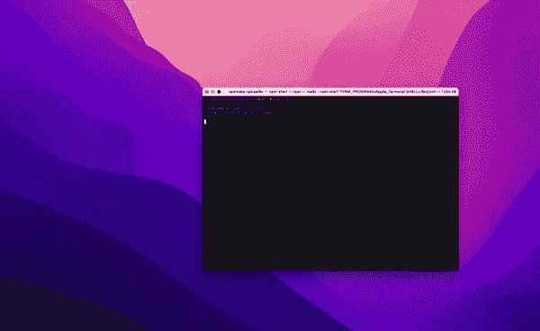

# 如何免费铸造 100，000 NFT

> 原文：<https://levelup.gitconnected.com/how-to-mint-100-000-nfts-for-free-62d83888ff6>

使用 JavaScript 以编程方式将 NFT 上传到 OpenSea.io


迪伦·卡勒伊在 [Unsplash](https://unsplash.com/s/photos/apes-yacht-club?utm_source=unsplash&utm_medium=referral&utm_content=creditCopyText) 上的照片

在接下来的文章中，我将讲述我如何使用一个简单的脚本在 [OpenSea.io](https://opensea.io/) 上以编程方式创建一组独特的 NFT。请注意，这仅仅是关于如何使用 dAppeteer/Puppeteer 和 JavaScript(更具体地说是 TypeScript)来自动化网站的概念证明。**我不鼓励使用以下任何代码与 OpenSea.io 或任何其他第三方网站进行交互**。请确保明确检查与您互动的网站的相应服务条款，以避免被永久禁止和删除您的内容。请不要用这个脚本在 OpenSea.io 上铸造 100，000 个代币——那只是一个浮华的标题，试图抓住你的注意力，\_(ツ)_/。话虽如此，使用脚本来自动化手动任务是学习 JavaScript、HTML 以及如何以编程方式与第三方网站交互的好方法。

# 为什么选择 OpenSea.io？

在精心制作了你的 NFT 图片后，你可能想发布并在市场上出售它们。通常，在这一点上，你会发现铸造大量的 NFT 实际上是最困难的部分。如果你不想创建一个[可靠性合同](https://docs.soliditylang.org/en/v0.8.11/)，用 [Pinata](https://www.pinata.cloud/) 和 [Alchemy](https://www.alchemy.com/) 建立账户，并积累数百美元的汽油费，那么 OpenSea.io 提供了一个方便、免费的替代方案，甚至不需要智能合同。是的，在 OpenSea.io 上铸造是完全免费的，而且非常容易做到！

不幸的是，OpenSea.io 不提供上传/铸造令牌的 API。使用他们的网站创建新的令牌很快，但仍然是一个手动和繁琐的过程。手动创建数百个 NFT 肯定会花费一些时间…因此，我试图找出如何自动化这些步骤。

# 先决条件

你将需要[的助记短语作为你的元掩码钱包](https://metamask.zendesk.com/hc/en-us/articles/360015290032-How-to-reveal-your-Secret-Recovery-Phrase)(又名“秘密恢复短语”)来接收新生成的 NFTs。下面的代码将使用该短语来自动设置和连接您的钱包。然而，这个短语是一个秘密，所以确保不要和任何人分享，也不要把它提交给 git。

你还需要一个 OpenSea.io 账户，连接同一个 MetaMask 钱包和[创建一个新的空收藏](https://opensea.io/collection/create)。记下收藏的名称和 URL。下面你会需要的。

最后，不言而喻，您还需要一组图像(或视频/音频文件),您希望将它们转换成一个 NFT 集合。

# 安装软件包

让我们首先创建一个新目录，它将保存我们想要转换成 NFT 的代码和图像。切换到新文件夹，安装第一套 NPM 软件包:

```
npm install esbuild esbuild-register dotenv
```

这将安装 [ESBuild](https://esbuild.github.io/) ，一个速度极快的 JS 捆绑器，内置了对 TypeScript 的支持，以及 [DotEnv](https://www.npmjs.com/package/dotenv) 来初始化环境变量，以避免硬编码任何秘密。

为了实现自动化，我们使用[木偶师](https://pptr.dev/)来“遥控”Chome 或 Chromium，并且可以在你能想象到的网站上实现几乎任何事情的自动化。dappeter 是一个基于 web3 的测试和自动化库:

```
npm install @chainsafe/dappeteer@2.3.0 puppeteer
```

请注意，我们明确指定了 dAppeteer 的 2.3.0 版本，因为在撰写本文时，最新版本与 MetaMask 存在一些兼容性问题。当涉及到 dAppeteer 和 MetaMask 版本时，您需要非常具体，以确保兼容性并避免安装潜在的不支持或不可信的版本。

# 设置您的配置

创建一个新文件`.env`并添加下面的内容。将这些值替换为您的 OpenSea 集合的名称，添加描述和 URL，以及您的元掩码秘密恢复短语:

```
METAMASK_MNEMONIC_PHRASE="add your twelve word secret metamask recovery phrase here"
COLLECTION_NAME="my-first-collection"
DESCRIPTION="My first NFT created in OpenSea"
URL=[https://example.com](https://example.com)
```

保存文件，但不要提交给 git！为了安全起见，将其添加到您的`.gitignore`中。在下面的脚本中，我们将使用恢复短语来自动设置元掩码。这是绝对安全的，它永远不会离开你的本地机器。尽管如此，我还是建议使用备用钱包，以避免在实验和测试过程中意外损坏主钱包。

# 创建脚本

为了更容易地解释逻辑，我将把脚本分成几个部分。首先，在项目文件夹中创建一个新文件，并将其命名为`index.ts`。然后，让我们创建脚本的标题:

```
import puppeteer, { Page } from "puppeteer";
import * as dappeteer from "[@chainsafe/dappeteer](http://twitter.com/chainsafe/dappeteer)";
import * as DotEnv from "dotenv";
import fs from "fs";
import path from "path";
DotEnv.config();const seed = process.env.METAMASK_MNEMONIC_PHRASE;
const collectionName = process.env.COLLECTION_NAME;
const createAssetURL = `[https://opensea.io/collection/${collectionName}/assets/create`](https://opensea.io/collection/${collectionName}/assets/create`);
const description = process.env.DESCRIPTION;
const link = process.env.URL;
const imageDir = path.join(__dirname, "images");
```

在这里，我们正在导入木偶师、dAppeteer、DotEnv 和一些文件系统助手。调用`DotEnv.config()`将自动加载`.env`文件的内容并初始化我们的环境变量。

在初始化依赖关系之后，我们设置了两个静态变量:秘密短语、集合名称、描述和一个将被添加到每个铸造的 NFT 的链接。都是基于之前创建的`.env`环境文件。`imageDir`是包含我们上传的所有图片的文件夹。

接下来，我们定义几个稍后会用到的辅助函数:

```
async function connectWallet(page: Page, metamask: dappeteer.Dappeteer) {
  // OpenSea gives us a list of different wallet options. MetaMask is the first one.
  console.log("Connecting to Metamask..."); // Force list of wallets to refresh as otherwise OpenSea sometimes doesn't detect MetaMask properly
  const moreButton = await page.$x('//button[contains(.,"Show more options")]');
  await moreButton[0].click();
  await page.waitForTimeout(1000); // Find the MetaMask button and click it
  const metaMaskButton = await page.$x(
    '//button[.//span[contains(text(),"MetaMask")]]'
  );
  await metaMaskButton[0].click();
  await page.waitForTimeout(2000); await metamask.approve();
  console.log("Wallet connected");
}
```

`connectWallet`正在寻找当前`page`上的“MetaMask”按钮，点击它，连接您的 MetaMask 钱包。我在测试中发现了一个警告:有时 OpenSea 不能正确识别元掩码插件。因此，我们首先在钱包列表上发起另一次单击，以确保它正确刷新所有选项。

```
async function uploadImage(page: Page, filepath: string) {
  const elementHandle = await page.$("#media");
  await elementHandle.uploadFile(filepath);
}
```

`uploadImage`执行实际的文件上传。它将当前图像`page`和图像`filepath`作为输入参数。

```
async function fillFields(
  page: Page,
  name: string,
  description: string,
  link: string
) {
  // Get and fill in the input name
  await page.focus("#name");
  await page.keyboard.type(name, { delay: 25 });// Get and fill in the description
  await page.focus("#description");
  await page.keyboard.type(description, { delay: 25 });await page.focus("#external_link");
  await page.keyboard.type(link, { delay: 25 });
}
```

最后`fillFields`通过填写`name`、`description`和外部`link`字段来完成 OpenSea 输入表单。

准备就绪后，现在开始主要功能:

```
async function main() {
  // Launch the browser with MetaMask
  const browser = await dappeteer.launch(puppeteer, {
    metamaskVersion: "v10.1.1",
  });
  const metamask = await dappeteer.setupMetamask(browser, { seed }); // Open OpenSea.io website in a new tab
  console.log("Launching OpenSea...");
  const page = await browser.newPage();
  await page.goto(createAssetURL, { waitUntil: "networkidle0" });
  await page.bringToFront(); // Close first empty tab
  const tabs = await browser.pages();
  await tabs[0].close(); // Connect OpenSea with MetaMask
  await connectWallet(page, metamask);
  await page.waitForTimeout(2000); // The first request will need to be signed explicitly
  console.log("Sign initial request...");
  await metamask.sign();
  await page.bringToFront();
  await page.waitForTimeout(2000); // Read the contents of the images folder
  const files = fs.readdirSync(imageDir);// Start the loop on each image of images folder
  for (const file of files) {
    if (file === ".DS_Store") {
      continue; // Skip macOS hidden file
    } // On every iteration (re-)open the asset creation page
    console.log("Creating new asset...");
    const filepath = path.join(imageDir, file);
    await page.bringToFront();
    await page.goto(createAssetURL);
    await page.waitForSelector("#media"); // wait for the upload button to be available // Upload the current image file
    await uploadImage(page, filepath); // Fill the fields using the asset name with the count
    const name = file.split(".")[0];
    await fillFields(page, name, description, link); console.log(`Minting NFT: ${name}...`);
    const createButton = await page.$x('//button[contains(., "Create")]');
    await createButton[0].click(); // Now wait for the success popup to appear
    console.log("Waiting for success popup...");
    await page.waitForSelector(
      "div.AssetSuccessModalContentreact__DivContainer-sc-1vt1rp8-1"
    );
    await page.waitForTimeout(1000); // Delete the local files to remember which ones we already uploaded
    fs.rmSync(filepath);
  } console.log("Successfully minted all NFTs");
}main();
```

让我们更详细地看看这个:

1.  首先，我们启动浏览器并设置元掩码。这里我们使用`process.env.METAMASK_MNEMONIC_PHRASE`环境变量来避免在我们的代码中硬编码它。
2.  然后，我们在一个新的浏览器窗口中打开 OpenSea.io，并将其连接到我们的 MetaMask 钱包。
3.  一旦连接了钱包，OpenSea 会自动要求我们在初始请求上签名。所以，我们也会这么做。
4.  现在我们可以读取`imageDir`的内容，然后遍历每个文件来创建各自的新 NFT 资产。
5.  对于每个资产，我们首先重新加载资产创建网站，上传本地图像文件，然后填写表单的其余部分。资产的名称基于文件名。我们只需断开文件扩展名(即`.png`或`.jpg`)并使用剩余部分作为我们的名称。你可以把这种逻辑运用到任何对你有意义的事情上。
6.  最后，我们使用 [XPath 选择器](https://www.testim.io/blog/xpath-vs-css-selector-difference-choose/)找到页面底部的“创建”按钮并点击它。这将启动铸造，可能需要几秒钟才能完成。
7.  创建资产后，我们必须等待 OpenSea 来确认我们令牌的成功铸造。我们通过等待一个特定的弹出窗口出现来做到这一点。然后我们可以继续下一个令牌。
8.  一旦在 OpenSea 中创建了一个新的资产，我们就会删除本地图像文件，以跟踪我们之前上传过的图像文件，并避免意外创建副本。

在不同的步骤之间有几个睡眠周期(`page.waitForTimeout`)，在这个周期中，我们只是等待浏览器和元掩码完成加载。

上面的代码应该相对容易跟踪和更新。如果您想对资产进行更改并添加更多信息，您可以简单地用自己的逻辑扩展`fillFields`函数。

# 利润！

有了我们的脚本，是时候最终运行它了！

在与`index.ts`文件相同的层次上创建一个新的子目录`images`。然后把你想转换成 NFTs 的所有图片的拷贝放到那个文件夹里。每个文件的名称(没有文件扩展名)将被用作 OpenSea 中的 NFT 资产名称。请为您的原始图像制作一个*副本*，因为脚本将删除`images`文件夹中的内容，以跟踪它已经处理过的图像。

然后是关键时刻...运行脚本:

```
node -r esbuild-register index.ts
```

这将使用 ESBuild 编译我们的脚本，并使用 Node.js 运行它。您将看到一个新的浏览器窗口打开，脚本发挥了它的魔力。不要手动操作任何窗口，让它不受干扰地运行。否则，您可能会中断流程或中止进程。给它一些时间，因为我们创建了一个又一个资产，给 OpenSea.io 足够的时间来加载和处理，而不会使它过载。



我们的剧本在发挥作用！

# 下一步是什么？

上面的代码可以在 GitHub 中找到:[https://github.com/arabold/opensea-uploader](https://github.com/arabold/opensea-uploader):

[](https://github.com/arabold/opensea-uploader) [## arabold/open sea-上传程序

### 此时您不能执行该操作。您已使用另一个标签页或窗口登录。您已在另一个选项卡中注销，或者…

github.com](https://github.com/arabold/opensea-uploader) 

这应该可以让你在 OpenSea 中创建一个新的 NFT 集合的最乏味的工作自动化。但是，整个脚本仍然非常简单，只能填充基本的属性。将来您可能希望扩展它来设置自定义属性和其他元数据。