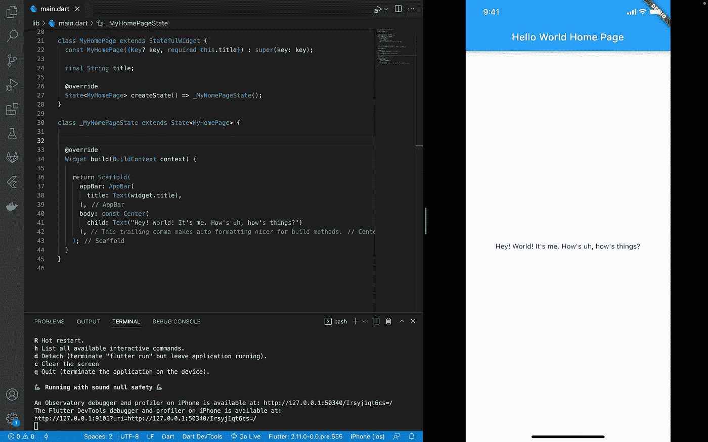

# 如何将 iOS 设备镜像到 Mac

> 原文：<https://levelup.gitconnected.com/how-to-mirror-an-ios-device-to-a-mac-c7c3185fecb9>

## 使用 QuickTime Player 快速轻松地共享屏幕

托马斯·扎戈尔斯基在 [Unsplash](https://unsplash.com/s/photos/macbook-iphone?utm_source=unsplash&utm_medium=referral&utm_content=creditCopyText) 上的照片

我最近在一个名为“如何开发一个具有集成数据捕获功能的 Flutter 应用程序”的 Socket Mobile 网络研讨会上发表了演讲。如果你没有机会加入，但想看录音，你可以在这里找到它。网上研讨会进行得很顺利，虽然我第一次演讲时有点紧张，但这是一次令人兴奋和积极的经历。

网上研讨会的一部分包括演示我们新添加的 [CaptureSDK](https://www.socketmobile.com/capturesdk) 对 Flutter 支持的代码。我讲述了如何安装和导入 [pub 包](https://pub.dev/packages/capturesdk)以及如何在你的 Flutter 应用中实现。为了有效地演示代码，我需要能够展示这个应用程序在 iOS 设备上的样子。

你可能会想，就用模拟器吧。嗯，捕获服务需要在物理 iOS 设备上使用，因为我们需要一个物理 iOS 设备让 Socket Mobile scanner 通过蓝牙连接。

这就引出了一个问题:我如何将外部 iOS 设备镜像到 Mac 上？在这篇文章中，我将向你展示一个用 QuickTime Player 实现这一点的简单快捷的方法，这样你就可以得到类似下图的结果。

## 用 QuickTime 镜像 iOS 屏幕

1.  将您的 iOS 设备连接到 Mac。
2.  打开 QuickTime Player。
3.  点击*文件*，然后选择*新电影录制。*

4.当 QuickTime Player 屏幕打开时，找到“录制”按钮旁边的下拉箭头。单击它，然后从下拉菜单中选择您的设备。

当您选择设备时，您应该能够看到设备的屏幕镜像到 Mac 上的 QuickTime Player 窗口。

## 在 Mac 上并排放置两个窗口

现在，您可以看到镜像到 Mac 的外部设备，下面是如何将 QuickTime Player 窗口放置在 IDE 旁边的方法。

1.  转到屏幕顶部，将鼠标悬停在绿色的展开按钮上。
2.  从下拉菜单中，选择屏幕右侧的*平铺窗口。*

3.接下来，您会看到 QuickTime Player 窗口出现在 Mac 屏幕的右侧。在左边，你会看到放在左手边的选项。

4.选择您的 IDE。

现在你知道了！如何使用 QuickTime Player 将外部 iOS 设备的屏幕镜像到 Mac，以及如何将两个窗口相邻放置。

[***升级您的免费 Medium 会员资格***](https://matt-croak.medium.com/membership) *并接收来自各种出版物上数千名作家的无限量、无广告的故事。这是一个附属链接，你的会员资格的一部分帮助我为我创造的内容获得奖励。*

*您还可以通过电子邮件* *订阅，每当我发布新内容时，您都会收到通知！*

*谢谢！*

# 参考

 [## 网络研讨会:集成数据采集的 Flutter

### 使用 Flutter 和与 Socket Mobile 集成的数据捕获，了解应用程序开发的来龙去脉…

www.socketmobile.com](https://www.socketmobile.com/about-us/news-room/webinars/how-to-develop-a-flutter-app-with-integrated-data-capture-functionality)  [## CaptureSDK 开发者门户 iOS、Android

### 时间:6 月 8 日上午 11:00(太平洋标准时间), Socket Mobile 的软件工程师 Matthew Croak 将主持一场在线研讨会，讨论如何行走…

www.socketmobile.com](https://www.socketmobile.com/capturesdk)  [## capturesdk |颤振包

### 这是用于 Socket Mobile 的捕获库的 Flutter CatureSDK。在安装软件包之前，您需要…

公共开发](https://pub.dev/packages/capturesdk)