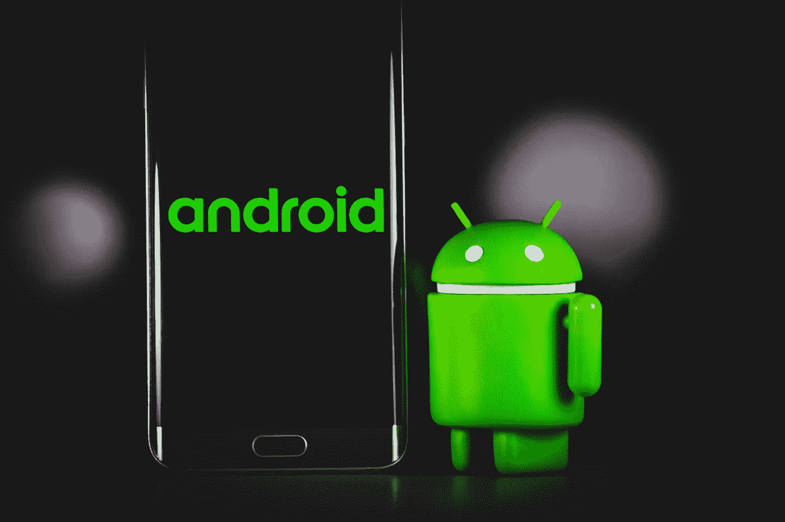
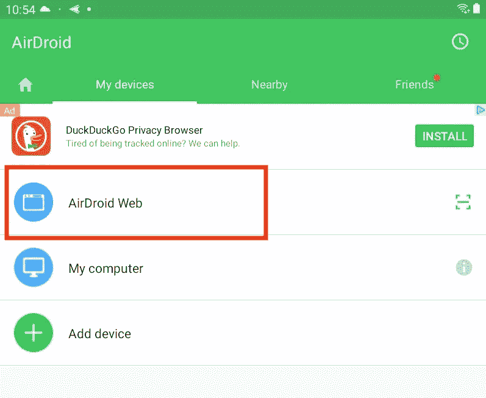
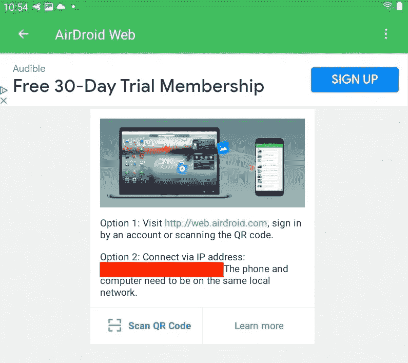
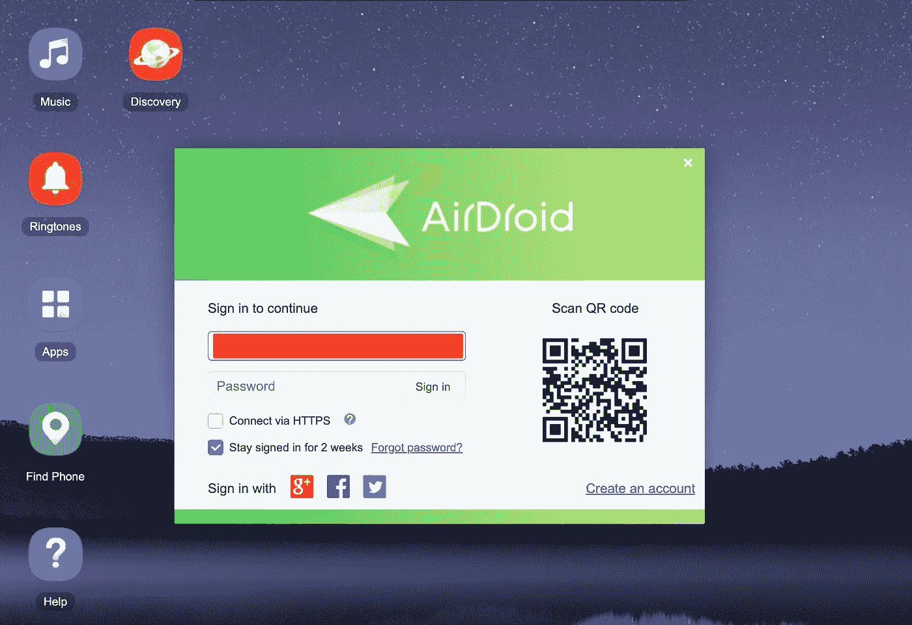
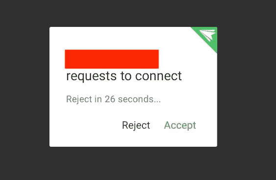
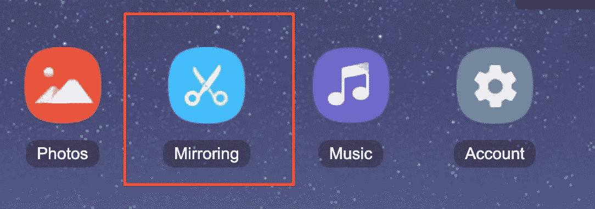
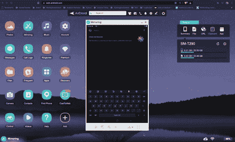

# 如何免费将 Android 设备镜像到 Mac 或 PC 上！

> 原文：<https://levelup.gitconnected.com/how-to-mirror-your-android-device-to-your-mac-or-pc-for-free-4aa13e578df0>

## 借助一个快速易用的应用程序

丹尼·米勒在 [Unsplash](https://unsplash.com/s/photos/android?utm_source=unsplash&utm_medium=referral&utm_content=creditCopyText) 上的照片

之前，我写过一篇关于[如何使用 QuicktimePlayer](/how-to-mirror-an-ios-device-to-a-mac-c7c3185fecb9) 将你的 iOS 设备镜像到 Mac 的帖子。这一次，我将向您展示一种快速简单的方法，将 Android 设备镜像到您的 Mac 或 PC 上。

最精彩的部分？完全是*免费无线*！

以下是方法。

# 第一步

首先，确保您的 Android 设备和计算机连接到同一个 WiFi 网络。这将使事情更有利的向前发展-尤其是如果你没有创建一个帐户。稍后会详细介绍。

其次，从谷歌 Play 商店下载 [AirDroid](https://play.google.com/store/search?q=airdroid&c=apps) 到你的安卓设备上。

第三，你可以注册/创建一个帐户，或者现在跳过这一步。

第四，点击屏幕左下方的*传送*按钮。然后，您应该会看到一个设备列表。进入该页面后，点击 *AirDroid Web。*

你现在应该看到一个页面，给你两个选项:*访问**web.airdroid.com***或者** *通过 IP 地址*连接。

如果您已经创建了一个帐户，请使用第一个选项。如果您尚未创建帐户，请使用选项 2。让我们来分解这两个选项。

## 有账户

如果你有账户，在你的电脑上进入[web.airdroid.com](https://web.airdroid.com/)。然后，系统会提示您使用您在设备上注册时使用的同一帐户进行登录。

登录后，您的浏览器会自动连接到您的 Android 设备。在我们进入最后一步之前，如果你没有账户，这是如何操作的。

## 没有账户

如果你没有账户，那也没关系！

你可以在电脑上找到手机应用程序上显示的 IP 地址，而不是去 web.airdroid.com。一旦到达您电脑上的 IP 地址，您的移动应用程序将请求您允许连接到您电脑上的浏览器。

点击*接受*。

一旦你点击接受，你的 Android 设备和电脑将连接到该 IP 地址。

对于这两个选项，在同一个 WiFi 网络上，您可以通过该网络进行通信，而不是与冲突或不同的网络进行通信。对于连接到两个不同网络的设备，您需要另一种连接形式，如蓝牙。

有了这个应用程序，你只需要 WiFi。

# 最后一档

现在，您的设备和浏览器已经连接，您应该能够在网页的右侧看到 Android 设备信息的摘要。很酷，对吧？

最后一步是点击*镜像*图标。

一旦你点击了*镜像*，你应该会看到你的设备的屏幕加载并被镜像到你的浏览器。见下文。

你有它！一个快速，简单， ***免费和无线*** 的方式来镜像您的 Android 设备到您的电脑！我注意到在我的平板电脑和镜像之间有一点延迟差异，但我发现这可以忽略不计。如果您的 WiFi 连接很差或不存在，您也可以通过网络共享连接。更多关于那个[这里](https://help.airdroid.com/hc/en-us/articles/360009014493-How-to-Use-AirDroid-Personal-Web-Without-Wi-Fi-or-Other-Network-Connection-)。

关于如何做到这一点的视频教程，请查看 YouTube 视频。

*注:教程是 2017 年的。虽然这些信息大多是最新的，但是教程中提到了一个* ***剪切*** *图标。如果你找不到这个图标，那么寻找我上面提到的* ***镜像*** *图标。*

[***升级您的免费 Medium 会员资格***](https://matt-croak.medium.com/membership) *并接收各种出版物上数千名作家的无限量、无广告的故事。这是一个附属链接，你的会员资格的一部分帮助我为我创造的内容获得奖励。*

*你也可以通过电子邮件* *订阅，当我发布新内容时，你会收到通知！*

*谢谢！*

# 参考

 [## 如何将 iOS 设备镜像到 Mac

### 使用 QuickTime Player 快速轻松地共享屏幕

levelup.gitconnected.com](/how-to-mirror-an-ios-device-to-a-mac-c7c3185fecb9)  [## Google Play 上的 airdroid - Android 应用程序

### 享受数百万最新的 Android 应用程序、游戏、音乐、电影、电视、书籍、杂志等。随时随地，跨越…

play.google.com](https://play.google.com/store/search?q=airdroid&c=apps)  [## AirDroid Web |在网络上管理您的手机

### 你的机器人，在网络上。通过网络浏览器以无线方式管理和远程控制您的 Android。

web.airdroid.com](https://web.airdroid.com/)  [## 在没有 Wi-Fi 或其他网络连接的情况下，如何使用 AirDroid 个人 Web？

### 有两种方法可以在没有外部网络连接的情况下使用 AirDroid Personal)在您的…

help.airdroid.com](https://help.airdroid.com/hc/en-us/articles/360009014493-How-to-Use-AirDroid-Personal-Web-Without-Wi-Fi-or-Other-Network-Connection-)