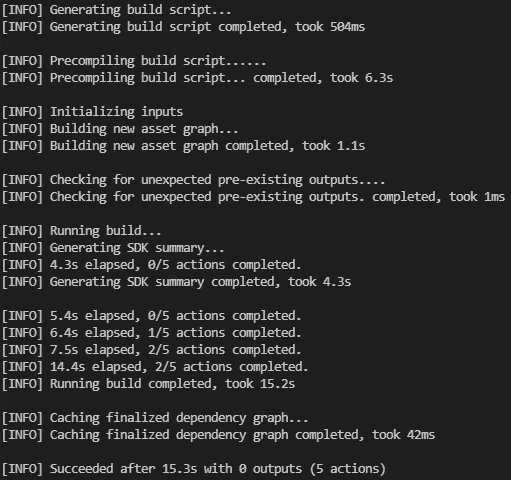
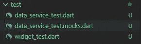

# 如何在你的 Flutter 应用中模拟依赖关系进行测试

> 原文：<https://levelup.gitconnected.com/how-to-mock-dependencies-in-your-flutter-app-for-testing-54c49251740a>

## 莫奇托做这项工作

## 这里有一个关于如何用 mocksito 包创建 mock，设置它们，并在你的 Flutter 应用程序测试中使用它们的教程。


照片由 [ThisisEngineering RAEng](https://unsplash.com/@thisisengineering?utm_source=medium&utm_medium=referral) 在 [Unsplash](https://unsplash.com?utm_source=medium&utm_medium=referral) 上拍摄

在测试过程中，总会有一个你需要模仿的地方。这个模拟将使您免于为测试设置复杂的环境，因为它允许您将注意力集中在您想要测试的部分。
假设您的应用程序中有多个地方有一个写入数据库的记录器。当然，您已经对您的日志记录器进行了测试，以确保其正确的功能。但是当你测试时，比如说，你的登录机制，你并不关心日志记录器。这就是模仿有用的地方。它处理对记录器的调用，并按照配置的方式做出反应。

> 如果您想深入测试颤振应用，请查看📙[我的免费电子书](https://xeladu.gumroad.com/l/ftg)有更多细节！

在本指南中，我们将看到用于 Flutter 应用程序的 [Mockito](https://pub.dev/packages/mockito) 包。它允许你创建模拟，这样你的类的任何依赖都不需要被测试。

## 要测试的类

这是`DataService`类，我们将为其编写测试。它接受一个`DataStore`对象作为构造函数参数。`DataStore`可以是设备本地存储上的远程数据库，也可以是存储值的简单的`Map<string, dynamic>()`对象。我们不想处理这种依赖性，所以我们将在测试中模拟它。

我们班要考试了

## 生成模拟

Dart 的 [build runner](https://pub.dev/packages/build_runner) 工具帮助我们为每个我们想要的类创建模拟。我们用命令`flutter pub add build_runner`将它添加到我们的 Flutter 应用程序中。之后，我们指定应该为其生成模拟的类。我们在空测试类的`main()`方法中添加了一个注释(参见下面的代码)。

通过构建运行器工具创建模拟的注释

最后，我们用`flutter pub run build_runner build`调用构建运行程序。它将创建一个新的类，包含在注释数组中指定的所有模仿。



构建流道输出



模拟课堂

## 在测试中使用模拟

为了测试`get()`方法，我们需要设置 mock。否则，将会抛出一个异常，因为由于 Dart 2.12/Flutter 2 和[空安全](https://dart.dev/null-safety)没有像`null`那样的公共默认值可以返回。

为了指定行为，我们使用了`when()`和`thenAnswer()`方法。你可以在下图中看到它。

用设置模拟

当 mock 的`get()`方法被调用时，它总是用一个固定的值来回答，我们可以在以后验证这个值。此外，我们可以询问 mock 是否调用了`get()`方法来增强信心。

❗以下提示不是推荐的行为，只应用于旧版应用程序。

如果您希望您的模拟在没有设置可用时返回 null，那么使用 replace 您的注释

```
@GenerateMocks([DataStore])
```

随着

```
@GenerateMocks([],customMocks: [MockSpec<DataStore>(returnNullOnMissingStub: true)])
```

那么您的测试可能看起来像这样

默认返回值为 null 的模拟

## 源代码

你可以在 [GitHub](https://github.com/xeladu/flutter_dependency_mocking) 上找到源代码。

[***用我的推荐链接加入成千上万的中会员，想看多少文章就看多少***](https://medium.com/@xeladu/membership) ！

[](https://medium.com/@xeladu/membership) [## 通过我的推荐链接加入 Medium-xela du

### 成为会员，获得 xeladu 和所有媒体作家的全部内容！您的会员资格只需 5 美元一张…

medium.com](https://medium.com/@xeladu/membership) 

点击 [**这里**](https://xeladu.medium.com/subscribe) 把我所有的新文章都发到你的邮箱里🔔如果你浏览我的口香糖商店，你可能会找到你喜欢的东西([甚至是免费的](https://xeladu.gumroad.com/l/scratch)🏬


xeladu

## 测试你的 Flutter 应用

[View list](https://xeladu.medium.com/list/test-your-flutter-app-aabad9825b7f?source=post_page-----54c49251740a--------------------------------)6 stories

xeladu

## 适合初学者的颤振文章

[View list](https://xeladu.medium.com/list/flutter-articles-for-beginners-a040ea777956?source=post_page-----54c49251740a--------------------------------)24 stories