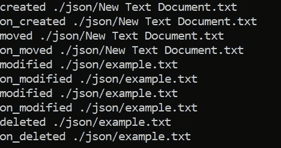

# 如何在 Python 中监控文件系统事件

> 原文：<https://levelup.gitconnected.com/how-to-monitor-file-system-events-in-python-e8e0ed6ec2c>

## 利用看门狗模块，一个跨平台的 API 来监控对文件的修改。


[都市三登](https://unsplash.com/@urre?utm_source=unsplash&utm_medium=referral&utm_content=creditCopyText)在 [Unsplash](https://unsplash.com/s/photos/watchdog?utm_source=unsplash&utm_medium=referral&utm_content=creditCopyText) 上拍摄的照片

通过阅读这篇文章，您将学会检测对 Python 应用程序中现有文件的更改。我们将使用一个维护良好的模块，名为`watchdog`。根据官方文件，`watchdog`是

> “…用于监控文件系统事件的 Python API 库和 shell 实用程序。”

它同时支持 Python 2.7 和 3.4+。但是，建议您对旧版本使用小于 0.10.0 的看门狗。在本教程中，我将只介绍 Python API 库。让我们继续下一部分，开始安装必要的模块。

# 设置

使用`pip install`进行设置非常简单明了。强烈建议您在继续之前设置一个虚拟环境。有两种方法可用

## 从 PyPI 安装

在终端中运行以下命令。

```
pip install watchdog
```

在撰写本文时，它将安装 PyPI 的最新版本 0.10.2。

## 从代码库中安装

此外，您可以在本地文件夹中克隆存储库并正常安装。首先，让我们用下面的命令克隆它。

```
git clone --recursive git://github.com/gorakhargosh/watchdog.git
```

使用以下命令更改工作目录。确保它在工作目录中包含一个名为`setup.py`的文件。

```
cd watchdog
```

通过运行以下命令来安装它。

```
pip install -e.
```

直接从存储库中克隆它的一个主要优点是，您可以获得具有附加特性的最新版本。

您可以通过在终端中运行以下命令来验证安装。

```
pip show watchdog
```

让我们进入下一节，开始编写 Python 代码。

# 履行

`watchdog`的主要构建模块基于以下几个类:

*   观察者
*   事件处理程序

因此，实现非常简单:

1.  创建一个`watchdog.observers.Observer`线程类的实例。
2.  用您自己的实现定义一个`Event handler`的子类，并从中创建一个实例。
3.  通过附加事件处理程序的`Observer`实例调用调度函数。它接受一些其他输入参数，比如要监控的目录的路径。
4.  启动`Observer`线程，等待它生成触发事件处理程序中代码的事件。

## 事件处理程序

该模块中目前有 4 种类型的事件处理程序可用:

1.  `FileSystemEventHandler` —基本文件系统事件处理程序，您可以从其覆盖方法。
2.  `PatternMatchingEventHandler` —将给定模式与和发生的事件相关联的文件路径进行匹配。
3.  `RegexMatchingEventHandler` —匹配给定的正则表达式和与发生的事件相关的文件路径。
4.  `LoggingEventHandler` —记录所有捕获的事件。

其余的类继承自`FileSystemEventHandler`，它提供了下面的函数供我们覆盖。

*   `on_any_event` —无所不包事件处理程序。
*   `on_created` —创建文件或目录时调用。
*   `on_deleted` —删除文件或目录时调用。
*   `on_modified` —当文件或目录被修改时调用。
*   `on_moved` —当文件或目录被移动或重命名时调用。

## 导入

创建一个新的 Python 文件，并添加以下导入声明。我就叫它`test.py`。

```
from watchdog.observers import Observer
from watchdog.events import FileSystemEventHandler
```

## FileSystemEventHandler 的子类

创建一个继承自`FileSystemEventHandler`的新类，并根据您的用例相应地覆盖函数。我将把它命名为`MyHandler`，但是你可以随意命名它。

用您实现的逻辑替换`print`语句。对于每个函数，它都有一个名为 event 的输入参数，该参数包含以下变量:

*   `event_type` —字符串形式的事件类型。默认为无。
*   `is_directory` —如果为目录发出事件，则为真；否则为假。
*   `src_path` —触发此事件的文件系统对象的源路径。

最有用的参数是`src_path`，在运行相应的逻辑之前，您可以使用它来确定哪个文件被修改了。

```
if(event.src_path == "./path/file.txt"):
    print("Execute your logic here!")
```

## 观察者和事件处理器

一旦创建了子类，就可以安全地创建它和`Observer`类的实例。为监控过程指定您选择的路径。我将检查一个新创建的名为`json`的文件夹。可以根据自己的喜好随意修改。

您也可以设置`recursive`参数，但强烈建议预定义层次结构并将其设置为 false，以防止权限不足或无法访问子文件夹的问题。

调用`start`将运行线程，并且当您在相应的路径中进行修改时，将会生成一个事件。

```
event_handler = MyHandler()
observer = Observer()
observer.schedule(event_handler, path='./json/', recursive=False)
observer.start()
```

## 试验

为了测试它，您必须实现一个运行循环来防止它退出。从`KeyboardInterrupt`异常中退出后，调用 stop 函数来清理资源。

```
while True:
    try:
        pass
    except KeyboardInterrupt:
        observer.stop()
```

保存 Python 文件并在您的终端中运行它。根据您设置的名称修改名称。

```
python test.py
```

您可以通过创建一个新文档、修改其中的内容并从目录中删除它来轻松测试它。以下是示例输出:



请注意，根据您使用的编辑器，行为和结果可能会有所不同。例如，已知 Vim 对于`modified`事件存在以下问题:

> “除非得到指示，否则 Vim 不会修改文件。它会创建备份文件，然后将它们换入以替换您正在磁盘上编辑的文件。这意味着如果您使用 Vim 来编辑您的文件，watchdog 将不会触发这些文件的修改事件。您可能需要适当地配置 Vim 来禁用此功能。

# 结论

让我们回顾一下今天所学的内容。

我们从通过`pip install`或直接从代码库中安装看门狗模块开始。

接下来，我们继续深入探索可用的特性，并尝试了它的一个基本实现。我们从`FileSystemEventHandler`创建了一个子类，并将其作为输入参数分配给一个`Observer`对象。当目录中的文件或文件夹被修改时，它会生成事件并调用相应的函数。

最后，我们通过创建新文件、修改文件内容和从目录中删除文件来测试我们的实现。

感谢你阅读这篇文章。希望在下一篇文章中再见到你！

# 参考

1.  [看门狗 Github](https://github.com/gorakhargosh/watchdog)
2.  [看门狗文档](https://python-watchdog.readthedocs.io/en/v0.10.2/index.html)