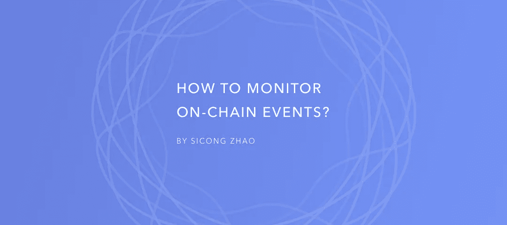

# 如何监控连锁事件

> 原文：<https://levelup.gitconnected.com/how-to-monitor-on-chain-events-dc56a501b173>

## 区块链开发教程 03



获取链上操作的状态对于各种应用程序都很重要。当用户使用您的 dApp(标记令牌、铸造 NFT 等)时，为了提供交互式用户体验，您需要监控链上事件。

在本教程中，我将介绍如何收听链上事件。你可能会对它的简单程度感到惊讶。总的来说，只有两步**来设置显示器:**

1.  在**智能契约**中定义并发出事件。
2.  在您的**前端**中定义并注册事件监听器。

## 第一步。在智能协定中定义和发出事件。

让我们假设我们正在构建一个 NFT 项目。您想知道何时铸造 NFT，并获取用户的地址和相应的 NFT 令牌 id。下面是如何定义这样的事件。

然后，您可以通过以下代码在智能协定中发出事件。您可以根据智能合约的上下文来更改变量。这里我使用`msg.sender`和`nftTokenId`只是为了说明的目的。

## 第二步。在前端定义和注册事件监听器。

我的 web 开发首选框架是 Vue。JS (Vue 3)，所以我将在本教程中使用它。但是这个概念是通用的，JavaScript 代码应该非常相似。

下面是在您的前端设置事件监听器的代码。

*   在第 3 行，它调用返回一个`ethers.contract`对象的`getContract`函数(在代码的其他地方定义，参见下面的**附录**),它的[文档在这里](https://docs.ethers.io/v5/api/contract/contract/)。
*   在第 5 行，我们使用`ethers.contract`对象的`on`方法在事件发生时订阅事件调用监听器。这里我们为这个方法提供两个输入:(1)事件名称`NFTMinted`，与智能契约中定义的相同。(2)一个回调函数，在这个函数中你可以指定当事件发生时你的前端逻辑将被触发。

现在我们有了事件监听器函数，最后要做的就是当用户连接到他们的钱包时实际调用这个函数。

## 附录

# 离别赠言

你有它！我希望这篇教程能帮助你理解网站如何收听链上事件。如果您有任何问题或建议，请随时发表评论。如果你想让我写其他关于区块链发展的话题，也请告诉我！

```
**Want to Connect?**Please feel free to reach out ([my LinkedIn](https://www.linkedin.com/in/zhaosicong/)).
```