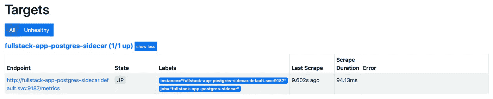
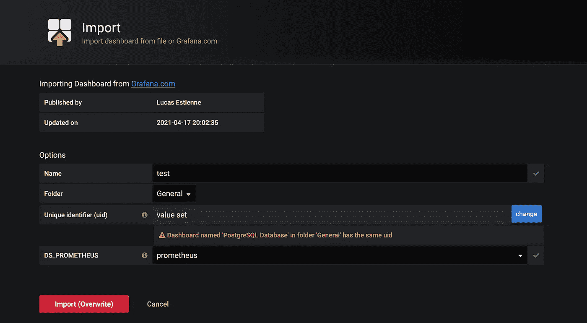
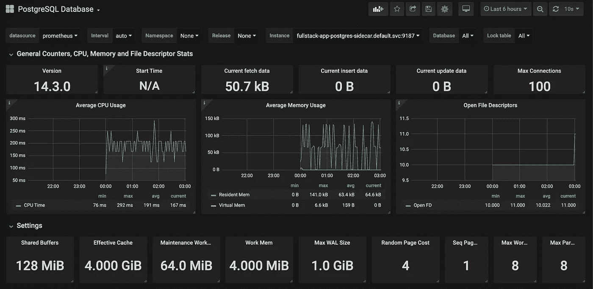
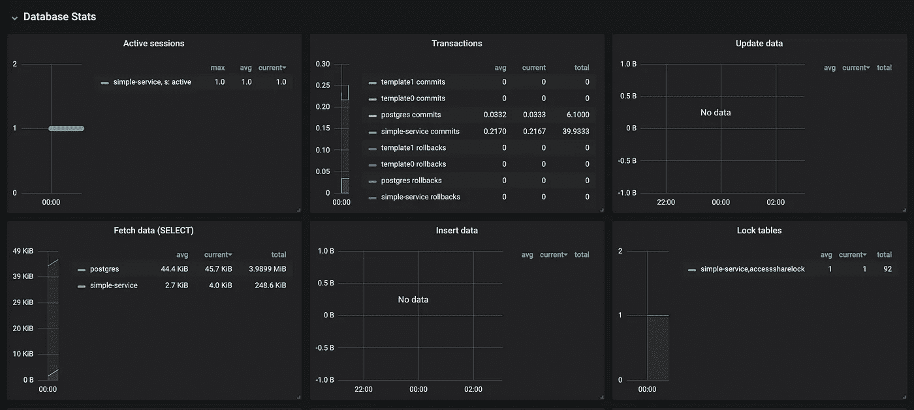
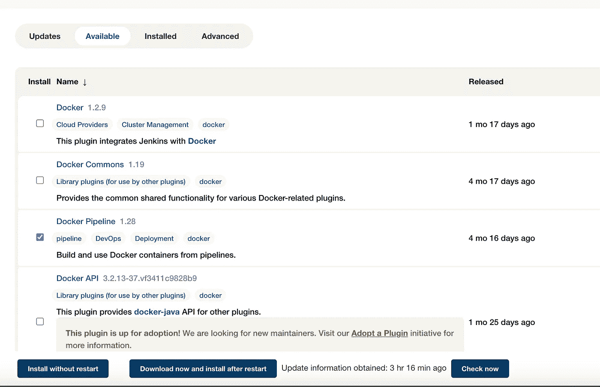
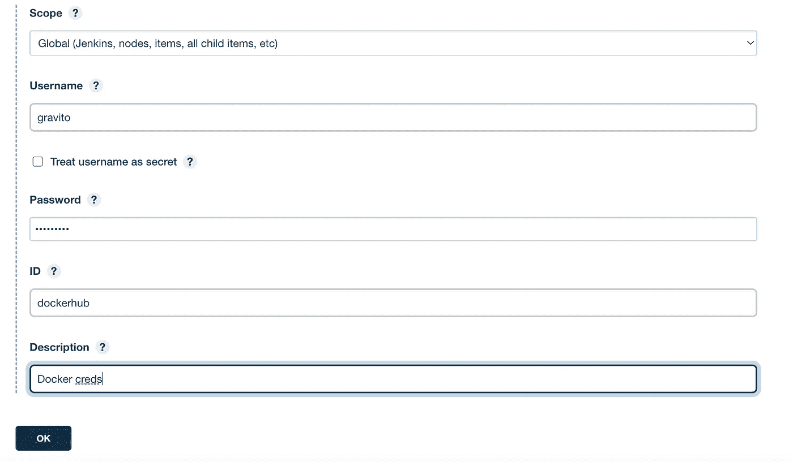
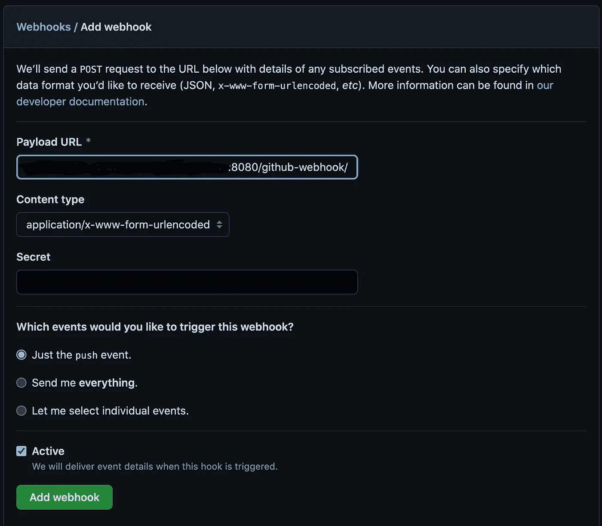
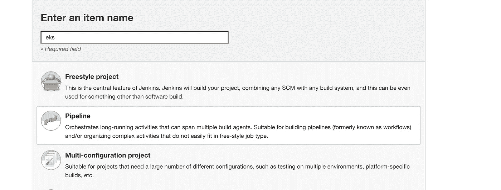
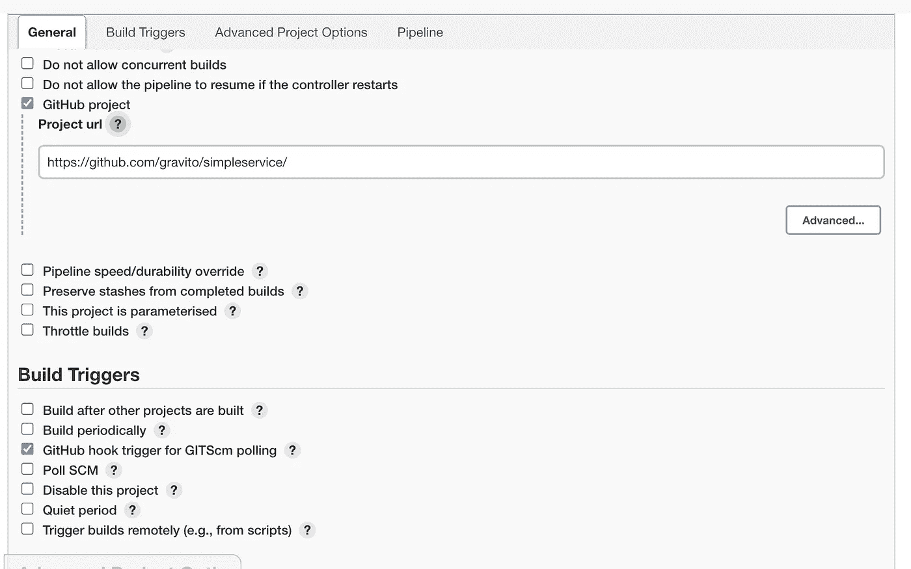
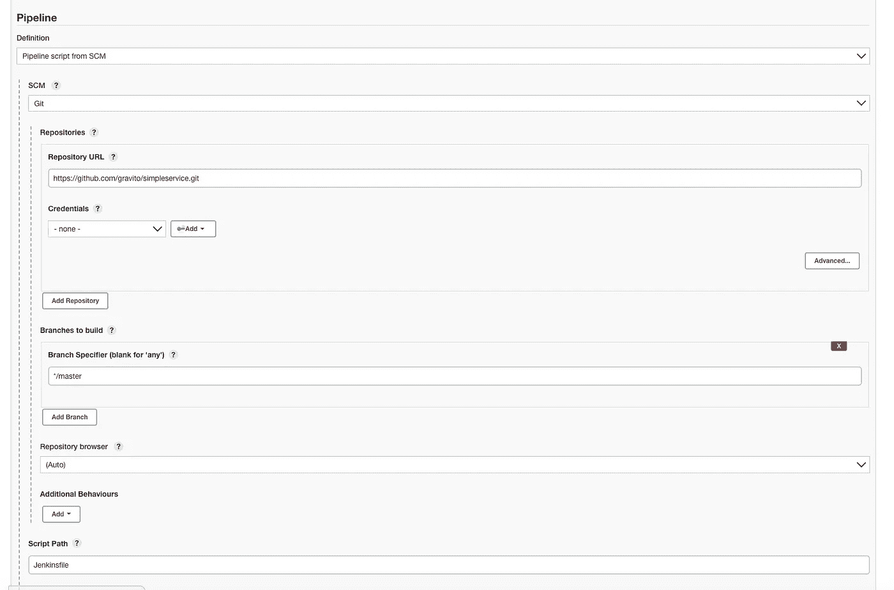

# 在 EKS 法盖特使用 Prometheus + Grafana 记录 Kubernetes 状态集，并使用 Jenkins 启用 CI/CD

> 原文：<https://levelup.gitconnected.com/how-to-monitor-your-database-statefulsets-using-prometheus-grafana-and-enable-ci-cd-using-1b8a1447529a>

在我们的[上一篇文章](https://medium.com/@shrut_terminator/how-to-deploy-a-multi-container-two-tier-go-application-in-eks-fargate-6266494f5bcf)中，我们探索了在 EKS 法盖特上部署一个 2 层多容器应用程序。我们探索了部署 statefulsets，并通过 AWS ALB 控制器公开了我们的应用程序。

在本文中，我们通过使用 Prometheus 启用日志记录，将我们的应用程序功能扩展到一个更加以生产为中心的环境。我们将探索使用 Prometheus 操作符启用 Postgres 数据库日志记录的步骤。由于 [daemonsets 在 EKS 法盖特](https://docs.aws.amazon.com/eks/latest/userguide/fargate.html#:~:text=Daemonsets%20aren't%20supported%20on,HostNetwork%20in%20the%20pod%20manifest.)不被支持，我们将为 statefulsets 创建我们自己的 side car 容器，并使用 Prometheus 和 Grafana 收集度量。最后，我们将创建一个 CI/CD 解决方案，以便在几分钟内交付！

不幸的是，Fargate 上的 EKS 不支持 Prometheus，因为 Fargate 只在 EFS 上运行，而 Prometheus 在 EBS 卷上运行。因此，在本教程中，我们将为 Prometheus 和 Kube 系统创建一个带有 worker 节点的新集群。本质上，我们将只为部署应用程序的默认名称空间创建 fargate 概要文件。然后，我们将扩展我们以前的应用程序，为有状态集合度量抓取部署一个 sidecar 容器。

总体而言，主要步骤将是:

*   使用选定命名空间中的工作节点创建 EKS Fargate 集群。
*   扩展 statefulset 并部署 postgres 操作符作为 sidecar 来收集数据库指标。
*   安装和配置普罗米修斯刮我们的自定义边车。
*   配置 Grafana dashboard 以显示我们的数据库指标。
*   使用 Jenkins 创建 CI/CD 解决方案。

# 步骤 1:创建 EKS 法盖特集群

大部分步骤来自[这个 AWS 博客](https://aws.amazon.com/blogs/containers/monitoring-amazon-eks-on-aws-fargate-using-prometheus-and-grafana/)。使用下面的 YAML 文件创建集群，并进行相应的修改:

```
eksctl create cluster -f cluster.yaml
```

由于我们将为普罗米修斯使用 EBS 块存储，我们需要安装和配置 EBS 驱动程序，并获得普罗米修斯和格拉夫纳的舵图表。遵循以下步骤:

```
helm repo add aws-ebs-csi-driver https://kubernetes-sigs.github.io/aws-ebs-csi-driver
helm repo add kube-state-metrics https://kubernetes.github.io/kube-state-metrics
helm repo add prometheus-community https://prometheus-community.github.io/helm-charts
helm repo add grafana https://grafana.github.io/helm-charts
helm repo updatehelm upgrade --install aws-ebs-csi-driver \
    --namespace kube-system \
    --set enableVolumeScheduling=true \
    --set enableVolumeResizing=true \
    --set enableVolumeSnapshot=true \
    aws-ebs-csi-driver/aws-ebs-csi-driver
```

此外，对于我们的应用程序，我们需要 AWS 负载平衡器控制器作为入口。从下面的步骤安装它，或者[跟随这个博客](https://aws.amazon.com/premiumsupport/knowledge-center/eks-alb-ingress-controller-fargate/):

```
eksctl utils associate-iam-oidc-provider --cluster fargate-prometheus --approvecurl -o iam_policy.json https://raw.githubusercontent.com/kubernetes-sigs/aws-load-balancer-controller/v2.2.0/docs/install/iam_policy.jsonaws iam create-policy \
   --policy-name AWSLoadBalancerControllerIAMPolicy \
   --policy-document file://iam_policy.jsoneksctl create iamserviceaccount \
  --cluster=fargate-prometheus \
  --namespace=kube-system \
  --name=aws-load-balancer-controller \
  --attach-policy-arn=arn:aws:iam::<AWS_ACCOUNT_ID>:policy/AWSLoadBalancerControllerIAMPolicy \
  --override-existing-serviceaccounts \
  --approvehelm repo add eks https://aws.github.io/eks-chartskubectl apply -k "github.com/aws/eks-charts/stable/aws-load-balancer-controller//crds?ref=master"helm install aws-load-balancer-controller eks/aws-load-balancer-controller \
    --set clusterName=fargate-prometheus \
    --set serviceAccount.create=false \
    --set region=us-west-2 \
    --set vpcId=[<](https://us-west-2.console.aws.amazon.com/vpc/home?region=us-west-2#VpcDetails:VpcId=vpc-0db04b6b1abeb9ddc)VPC-ID> \
    --set serviceAccount.name=aws-load-balancer-controller \
    -n kube-system
```

最后，我们需要为应用程序存储创建 EFS。使用以下步骤或[关注此博客](https://docs.aws.amazon.com/eks/latest/userguide/efs-csi.html#efs-create-filesystem):

```
vpc_id=$(aws eks describe-cluster \
    --name fargate-prometheus \
    --query "cluster.resourcesVpcConfig.vpcId" \
    --output text)cidr_range=$(aws ec2 describe-vpcs \
    --vpc-ids $vpc_id \
    --query "Vpcs[].CidrBlock" \
    --output text)security_group_id=$(aws ec2 create-security-group \
    --group-name MyEfsSecurityGroup \
    --description "My EFS security group" \
    --vpc-id $vpc_id \
    --output text)aws ec2 authorize-security-group-ingress \
    --group-id $security_group_id \
    --protocol tcp \
    --port 2049 \
    --cidr $cidr_rangefile_system_id=$(aws efs create-file-system \
    --region us-west-2 \
    --performance-mode generalPurpose \
    --query 'FileSystemId' \
    --output text)*#Get IP address of Nodes and match it with the subnets*
kubectl get nodesNAME                                         STATUS   ROLES    AGE   VERSION
ip-192-168-56-0.region-code.compute.internal   Ready    <none>   19m   v1.19.6-eks-49a6c0aws ec2 describe-subnets \
    --filters "Name=vpc-id,Values=$vpc_id" \
    --query 'Subnets[*].{SubnetId: SubnetId,AvailabilityZone: AvailabilityZone,CidrBlock: CidrBlock}' \
    --output table*#Match the subnets given by output of above command in the IP range of "kubectl get nodes" command. Save that subnet ID and supply it in the below command for mounting to EFS:*aws efs create-mount-target \
    --file-system-id $file_system_id \
    --subnet-id subnet-*EXAMPLEe2ba886490* \
    --security-groups $security_group_id*#Repeat the above command for all subnets.*
```

# 步骤 2:扩展 statefulset 并将 postgres 操作符部署为 sidecar。

我们将使用从这个 [repo](https://github.com/gravito/simpleservice/tree/main/kubernetes) 部署的以前应用程序的大部分 YAMLs。

部署所有 YAMLs，除了 statefulset，我们将扩展它以包括 side car。由于我们使用的数据库是 postgres，我们将使用的 sidecar 是 [postgres-exporter](https://github.com/prometheus-community/postgres_exporter) 。我们正在使用它，因为它在普罗米修斯网站上被列为官方 postgres 出口商。从官方页面可以看到， **postgres-exporter 使用 DATA_SOURCE_NAME 作为抓取**的数据库 URL。因此，我们将在 statefulset secret 中提供这个变量。

在下面找到我们将用于监控的更新的 YAMLs。

正如您所看到的，在上面的第 10 行，我们添加了 DATA_SOURCE_NAME 变量，使我们的 sidecar 能够抓取 postgres 数据库。

我们现在更新我们的 statefulset 本身，以包括 sidecar 容器:

第 33 行到第 39 行定义了我们用于监控的边车。**确保将其暴露在端口 9187** (线路#39)上，以确保 Prometheus 获取公制。

最后，为了确保 Prometheus 获得我们的 sidecar 指标，我们需要为 Prometheus 定义一个内部服务来与我们的 sidecar 交互。我们定义如下:

请注意**我们再次公开了端口 9187** 上的服务，让 Prometheus 从边车上获取指标。

完成这些扩展后，我们需要做的就是应用所有的东西。确保创建 PV、PVC、存储类、机密等。在应用部署之前。

最后，设置 Ingress 并(可选)[通过使用 ACM 将其升级为使用 TLS](https://aws.amazon.com/premiumsupport/knowledge-center/terminate-https-traffic-eks-acm/) 。所有这些步骤都可以参考我之前的部分[这里的](https://medium.com/@shrut_terminator/how-to-deploy-a-multi-container-two-tier-go-application-in-eks-fargate-6266494f5bcf)。

最后的健全性检查:

```
kubectl get allNAME                                         READY   STATUS    RESTARTS   AGE
pod/fullstack-app-postgres-bf57ff694-bjhgh   1/1     Running   0          12m
pod/fullstack-postgres-0                     2/2     Running   0          14mNAME                                     TYPE        CLUSTER-IP       EXTERNAL-IP   PORT(S)          AGE
service/fullstack-app-postgres           ClusterIP   10.100.124.112   <none>        8080/TCP         12m
service/fullstack-app-postgres-sidecar   NodePort    10.100.189.130   <none>        9187:31360/TCP   23m
service/fullstack-postgres               ClusterIP   10.100.80.163    <none>        5432/TCP         23m
service/kubernetes                       ClusterIP   10.100.0.1       <none>        443/TCP          3h20mNAME                                     READY   UP-TO-DATE   AVAILABLE   AGE
deployment.apps/fullstack-app-postgres   1/1     1            1           12mNAME                                               DESIRED   CURRENT   READY   AGE
replicaset.apps/fullstack-app-postgres-bf57ff694   1         1         1       12mNAME                                  READY   AGE
statefulset.apps/fullstack-postgres   1/1     14m
```

# 第三步:安装和配置 Prometheus 刮 postgres 边车集装箱。

我们将配置 Prometheus 的先决条件，例如创建命名空间和存储类。然而，在我们最终安装之前，我们将编辑配置文件(values.yaml)以允许 Prometheus 抓取我们的定制目标，这是我们部署的 side car 服务。

创建命名空间并获取工作节点的 AZ:

```
kubectl create namespace prometheusEBS_AZ=$(kubectl get nodes \
  -o=jsonpath="{.items[0].metadata.labels['topology\.kubernetes\.io\/zone']}")
```

正在创建存储类:

```
echo "
kind: StorageClass
apiVersion: storage.k8s.io/v1
metadata:
  name: prometheus
  namespace: prometheus
provisioner: ebs.csi.aws.com
parameters:
  type: gp2
reclaimPolicy: Retain
allowedTopologies:
- matchLabelExpressions:
  - key: topology.ebs.csi.aws.com/zone
    values:
    - $EBS_AZ
" | kubectl apply -f -
```

要安装普罗米修斯，我们将首先拉动图表，并修改值指向我们的边车。拉图表如下:

```
wget https://github.com/aws-samples/containers-blog-maelstrom/raw/main/fargate-monitoring/prometheus_values.yml
```

打开这个文件，并转到最底部，或者任何您可以找到值:" **extraScrapeConfigs** "的地方。我们要做的是编辑这个文件，使普罗米修斯刮我们的边车。编辑文件并将此配置放入 extraScrapeConfigs:

```
extraScrapeConfigs: |
  - job_name: 'fullstack-app-postgres-sidecar'
  static_configs:
    - targets:
      - "fullstack-app-postgres-sidecar.default.svc:9187"
```

**确保将管道操作符:" |"** 放在 extraScrapeConfigs 之后，以使 YAML 能够识别字符串。此外，确保**缩进是新行**的两个空格(否则你会面临奇怪的错误)。最后，“full stack-app-postgres-sidecar . default . SVC”表示<服务名>。< namespacename > .svc. **这是访问不同名称空间服务的模式**。服务名与访问我们的 sidecar 容器的服务名相同。

使用以下命令保存文件并安装舵图。确保位于保存该文件的同一目录中(或提供该文件路径):

```
helm install prometheus -f prometheus_values.yml \
  prometheus-community/prometheus --namespace prometheus
```

安装图表后，您可以验证是否安装了 Prometheus:

```
kubectl get pods --namespace prometheusNAME                                             READY   STATUS    RESTARTS   AGEprometheus-alertmanager-bccd5ffc9-l6hw5          2/2     Running   0          3d4hprometheus-kube-state-metrics-5fd8648d78-d2kv6   1/1     Running   0          3d4hprometheus-node-exporter-96v92                   1/1     Running   0          3d4hprometheus-node-exporter-j57tt                   1/1     Running   0          3d4hprometheus-pushgateway-5d7ff8d7f-94wcr           1/1     Running   0          3d4hprometheus-server-95ffc4b78-dj6pj                2/2     Running   0          3d4h
```

# 步骤 4:配置 Grafana dashboard 以显示数据库指标。

这一步非常简单，因为我们将按照下面的命令来设置 Grafana 仪表板。首先，我们需要验证我们的普罗米修斯是否正确地刮擦了我们的边车容器。

在 pods 列表中， **prometheus-server 是允许我们通过 GUI 访问 Prometheus** 内部目标的服务器。我们将端口转发 prometheus 服务器以在本地访问它:

```
kubectl port-forward -n prometheus svc/prometheus-server 9090:80
```

为什么 9090:80？9090 是我们要在本地公开的端口。80 是在 EKS 运行的 prometheus 服务器服务的端口。一旦上面的命令运行，在本地访问它: [http://127.0.0.1:9090/](http://127.0.0.1:9090/)

在 GUI 窗口中，选择状态->目标。您会看到边车状态为“UP ”:



验证这一点的另一种方法是手动登录 prometheus 服务器容器，并使用 telnet 检查您是否能够访问该服务。

运行以下命令手动进入 prometheus-server 容器:

```
kubectl exec prometheus-server-95ffc4b78-dj6pj -c prometheus-server -n prometheus -it sh
```

我们在“exec”后面输入 POD 名称，在“-c”后面输入容器名称。在描述了 prometheus-server pod 之后，我们可以获得容器的详细信息。

进入 prometheus-server 容器后，运行 telnet 到服务以检查连接性:

```
/prometheus $ telnet fullstack-app-postgres-sidecar.default.svc:9187Connected to fullstack-app-postgres-sidecar.default.svc:9187
```

现在，我们已经验证了边车工作正常，Prometheus 能够访问它，我们只需部署 Grafana 仪表板，并在丰富多彩的 GUI 中查看我们的指标！

遵循以下简单的步骤:

```
wget [https://raw.githubusercontent.com/aws-samples/containers-blog-maelstrom/main/fargate-monitoring/grafana-values.yaml](https://raw.githubusercontent.com/aws-samples/containers-blog-maelstrom/main/fargate-monitoring/grafana-values.yaml)helm install grafana -f grafana-values.yaml \
  grafana/grafana --namespace prometheus
```

安装 Grafana 后，获取负载平衡器 URL 以访问仪表板:

```
printf $(kubectl get service grafana \
  --namespace prometheus \
  -o jsonpath="{.status.loadBalancer.ingress[].hostname}");echo
```

在浏览器中打开 URL。登录用户名是“admin”。您可以从以下秘密中获得密码:

```
kubectl get secret --namespace prometheus grafana \
 -o jsonpath="{.data.admin-password}" | \
 base64 --decode ; echo
```

进入仪表板后，单击左侧的+,然后单击“Import”。然后输入仪表板编号:“9628”。选择数据集作为普罗米修斯:



导入后，您将开始看到指标在如下时间填充:



因此，您可以使用 Prometheus 和 Grafana 有效地监控您在 EKS 法盖特的 statefulsets 数据库！

# 步骤 5:使用 Jenkins 创建 CI/CD 解决方案

我们最终使用 Jenkins 创建了一个最先进的(不是真的:P) CI/CD 解决方案来结束我们的应用程序！步骤很简单，我们将首先在 EC2 实例上安装 Jenkins，然后启用 Docker 插件和凭证，连接我们的 EKS 集群，最后创建一个 Jenkinsfile，它将依次构建映像并将映像部署到集群。

## a)安装 Jenkins 服务器:

这里没有什么，但是命令让 Jenkins 服务器启动并运行。遵循任何指南，或以下命令(我用的是 t2.medium Ubuntu box):

```
sudo apt update 
sudo apt install openjdk-8-jdk -y
wget -q -O - [https://pkg.jenkins.io/debian-stable/jenkins.io.key](https://pkg.jenkins.io/debian-stable/jenkins.io.key) | sudo apt-key add 
sudo sh -c 'echo deb [http://pkg.jenkins.io/debian-stable](http://pkg.jenkins.io/debian-stable) binary/ > /etc/apt/sources.list.d/jenkins.list' 
sudo apt update
sudo apt install jenkins -y
sudo systemctl start jenkins
sudo systemctl status jenkins
```

登录到 Jenkins 服务器并创建您的管理员用户。然后按照以下步骤添加 Jenkins 用户作为管理员。切换到该用户。

```
sudo vim /etc/sudoers## Add below at end of file
jenkins ALL=(ALL) NOPASSWD: ALL## Switch to Jenkins user
sudo su - jenkins
```

## b)安装 Docker 和 Kubernetes:

(**重要提示** : *确保以 Jenkins 用户的身份执行以下所有步骤*

安装 Docker:

```
sudo apt install docker.io -y## Adding Jenkins user to docker group.
sudo usermod -aG docker jenkins
```

配置 [AWS CLI](https://docs.aws.amazon.com/cli/latest/userguide/getting-started-install.html) 和 Git:

```
curl "[https://awscli.amazonaws.com/awscli-exe-linux-x86_64.zip](https://awscli.amazonaws.com/awscli-exe-linux-x86_64.zip)" -o "awscliv2.zip"
unzip awscliv2.zip
sudo ./aws/installaws configure
// Enter your credentials in the prompt.sudo apt-get install git -y
```

安装 Kubectl。使用适当版本的集群。

```
curl -LO "https://dl.k8s.io/release/**$(**curl -L -s https://dl.k8s.io/release/stable.txt**)**/bin/linux/amd64/kubectl"sudo install -o root -g root -m 0755 kubectl /usr/local/bin/kubectl
```

安装 [eksctl](https://docs.aws.amazon.com/eks/latest/userguide/eksctl.html) :

```
curl --silent --location "[https://github.com/weaveworks/eksctl/releases/latest/download/eksctl_$(uname](https://github.com/weaveworks/eksctl/releases/latest/download/eksctl_$(uname) -s)_amd64.tar.gz" | tar xz -C /tmpsudo mv /tmp/eksctl /usr/local/bin
```

最后，尝试使用 Jenkins 用户名访问我们创建的 EKS 集群:

```
 aws eks update-kubeconfig --name fargate-prometheuskubectl get podsNAME                                     READY   STATUS    RESTARTS   AGEfullstack-app-postgres-bf57ff694-7nwxw   1/1     Running   0          3d1hfullstack-postgres-0                     2/2     Running   0          3d1h
```

## c)添加凭据

安装 Docker 管道插件，我们将使用它来创建和推送图像。



存储 Docker 凭证用户名和密码。进入凭证->系统->全局凭证，存储 Docker HUB 密码和**记下使用的变量 ID**。这将在以后的管道中使用。

注意:出于安全考虑，建议使用 Dockerhub 个人访问令牌。此外，出于某种原因，如果您得到登录错误，请确保密码中没有任何特殊字符。



## **d)创建 CI/CD 管道**

最后，我们使用管道脚本创建管道。找到以下步骤:

首先，我们激活 Github 仓库的 webhook。进入你的 github repo，在那里你可以找到设置选项。点击左侧的“添加 Webhook”，输入 Jenkins DNS URL 以及后缀: **/github-webhook/** 。选择“仅推送事件”。



然后，点击新项目，并选择管道。



选择 Github 项目并输入 Github 项目 URL。选择 Build trigger 作为 GITScm 轮询的 Github hook 触发器。



最后，在 Jenkinsfile(包含我们的 groovy 管道脚本的文件)中，输入以下详细信息:



我们实际上是从相同(或不同)的回购协议中获取构建文件。确保指定回购名称。我们也可以在本地存储文件(在 Jenkins GUI 中)。

最后，看看下面的 Jenkinsfile:

正如您可以推断的那样，我们首先使用 Docker 插件来构建我们的图像，并用我们的构建 ID 来标记它。然后，我们使用之前创建的 dockerhub credentials 变量(第 15 行)将这个标记的图像推送到 Dockerhub 注册表中(确保使用与在 Jenkins credentials 中创建的变量名相同的变量名)。最后，我们用标记的构建映像(带有构建 ID)替换部署文件中的现有映像。然后，我们部署文件并重新启动部署，以使更改生效。

为了测试这一点，我在 handlers.go 的第 35 行进行了修改(在 http 文件夹内)。我将输出从干得好:)更改为棒极了:):

```
34         fmt.Printf("%s - request with database\n", time.Now().Format(time.ANSIC))35         w.Write([]byte("Awesome! :)"))
```

在执行标准 git 提交时:

```
git add .
git commit -m "code changes"
git push origin master
```

我可以看到构建是自动触发的，所有的更改都部署在 Jenkins 输出中:

```
Started by GitHub push by gravito
Obtained Jenkinsfile from git [https://github.com/gravito/simpleservice.git](https://github.com/gravito/simpleservice.git)
[Pipeline] Start of Pipeline
[Pipeline] node
Running on [Jenkins](http://ec2-34-227-11-17.compute-1.amazonaws.com:8080/computer/(built-in)/) in /var/lib/jenkins/workspace/eks
[Pipeline] {
[Pipeline] stage
[Pipeline] { (Declarative: Checkout SCM)
[Pipeline] checkout
Selected Git installation does not exist. Using Default
The recommended git tool is: NONE
No credentials specified
 > git rev-parse --resolve-git-dir /var/lib/jenkins/workspace/eks/.git # timeout=10
Fetching changes from the remote Git repository
 > git config remote.origin.url [https://github.com/gravito/simpleservice.git](https://github.com/gravito/simpleservice.git) # timeout=10
Fetching upstream changes from [https://github.com/gravito/simpleservice.git](https://github.com/gravito/simpleservice.git)
 > git --version # timeout=10
 > git --version # 'git version 2.34.1'
 > git fetch --tags --force --progress -- [https://github.com/gravito/simpleservice.git](https://github.com/gravito/simpleservice.git) +refs/heads/*:refs/remotes/origin/* # timeout=10
 > git rev-parse refs/remotes/origin/master^{commit} # timeout=10
Checking out Revision 554bdcbcd0960880cd619f883b2ba1e551465f99 (refs/remotes/origin/master)
 > git config core.sparsecheckout # timeout=10
 > git checkout -f 554bdcbcd0960880cd619f883b2ba1e551465f99 # timeout=10
Commit message: "changed message"
 > git rev-list --no-walk ed91a24a14f52d0556d6ce321ab3bbe47ccbb459 # timeout=10
[Pipeline] }
[Pipeline] // stage
[Pipeline] withEnv
[Pipeline] {
[Pipeline] stage
[Pipeline] { (Build image)
[Pipeline] script
[Pipeline] {
[Pipeline] isUnix
[Pipeline] withEnv
[Pipeline] {
[Pipeline] sh
+ docker build -t gravito/simple-service:7 .
Sending build context to Docker daemon  11.95MB

Step 1/13 : FROM golang:alpine as builder
 ---> 155ead2e66ca
Step 2/13 : LABEL maintainer="Aayush Shrut <aayush.shrut@gmail.com>"
 ---> Using cache
 ---> 9eff72ae46ad
Step 3/13 : WORKDIR /app
 ---> Using cache
 ---> b6af9e060344
Step 4/13 : COPY go.mod go.sum ./
 ---> Using cache
 ---> 1c0cca91de31
Step 5/13 : RUN go mod download
 ---> Using cache
 ---> 1f6703e534fa
Step 6/13 : COPY . .
 ---> 53f6366f93c2
Step 7/13 : RUN GO111MODULE=on CGO_ENABLED=0 GOOS=linux go build -a -installsuffix cgo
 ---> Running in 7ac4680b5895
Removing intermediate container 7ac4680b5895
 ---> 0ce4e8196254
Step 8/13 : FROM alpine:latest
 ---> e66264b98777
Step 9/13 : WORKDIR /root/
 ---> Using cache
 ---> 57ec9916b0f4
Step 10/13 : COPY --from=builder /app/simple-service .
 ---> 16f7592e1b4b
Step 11/13 : COPY --from=builder /app/.env .
 ---> 8878612aa0ba
Step 12/13 : EXPOSE 8080
 ---> Running in 0dfc93aa8033
Removing intermediate container 0dfc93aa8033
 ---> 8cc961070056
Step 13/13 : CMD ["./simple-service"]
 ---> Running in 7c877e5b7a27
Removing intermediate container 7c877e5b7a27
 ---> 5e0a9130ab72
Successfully built 5e0a9130ab72
Successfully tagged gravito/simple-service:7
[Pipeline] }
[Pipeline] // withEnv
[Pipeline] }
[Pipeline] // script
[Pipeline] }
[Pipeline] // stage
[Pipeline] stage
[Pipeline] { (Push image)
[Pipeline] script
[Pipeline] {
[Pipeline] withEnv
[Pipeline] {
[Pipeline] withDockerRegistry
$ docker login -u gravito -p ******** [https://registry.hub.docker.com](https://registry.hub.docker.com/)

Login Succeeded
[Pipeline] {
[Pipeline] isUnix
[Pipeline] withEnv
[Pipeline] {
[Pipeline] sh
+ docker tag gravito/simple-service:7 registry.hub.docker.com/gravito/simple-service:7
[Pipeline] }
[Pipeline] // withEnv
[Pipeline] isUnix
[Pipeline] withEnv
[Pipeline] {
[Pipeline] sh
+ docker push registry.hub.docker.com/gravito/simple-service:7
The push refers to repository [registry.hub.docker.com/gravito/simple-service]
ed84bb285891: Preparing
8110c973ca20: Preparing
24302eb7d908: Preparing
24302eb7d908: Layer already exists
ed84bb285891: Pushed
8110c973ca20: Pushed
7: digest: sha256:8036cd9a88874e175356a97ed51e2c99c0b82b254b88cc481110bc4e5799441e size: 946
[Pipeline] }
[Pipeline] // withEnv
[Pipeline] }
[Pipeline] // withDockerRegistry
[Pipeline] }
[Pipeline] // withEnv
[Pipeline] }
[Pipeline] // script
[Pipeline] }
[Pipeline] // stage
[Pipeline] stage
[Pipeline] { (Deploy to EKS)
[Pipeline] sh
+ sed -i s/simple-service:latest/simple-service:7/g kubernetes/app-postgres-deployment.yaml
[Pipeline] sh
+ kubectl apply -f kubernetes/app-postgres-deployment.yaml
deployment.apps/fullstack-app-postgres configured
[Pipeline] sh
+ kubectl rollout restart deployment fullstack-app-postgres
deployment.apps/fullstack-app-postgres restarted
[Pipeline] }
[Pipeline] // stage
[Pipeline] }
[Pipeline] // withEnv
[Pipeline] }
[Pipeline] // node
[Pipeline] End of Pipeline
Finished: SUCCESS
```

最后，当我们尝试访问入口时，我们得到了令人敬畏的:)消息:

```
kubectl get ingressNAME          CLASS    HOSTS   ADDRESS                                                                 PORTS   AGEingress-app   <none>   *       k8s-default-ingressa-1234567890.us-east-1.elb.amazonaws.com   80      2d15h## Use the Ingress URL to access the changed output:Awesome :)
```

# 结论

关于 EKS·法盖特的两篇文章到此结束。在第一部分中，我们探索了使用 statefulsets 在 EKS Fargate 部署一个简单的两层前端数据库 Go 应用程序的方法，并使用 Ingress 创建自定义 URL，进一步使用 TLS 保护它。

在这一部分中，我们扩展了我们的应用程序，增加了监控和 CI/CD。我们首先创建了一个 Prometheus 和 Grafana 解决方案，通过创建一个 sidecar 代理来使用 Postgres 操作符收集我们的 statefulset 或数据库指标。然后，我们部署了我们的普罗米修斯解决方案来清理我们的定制边车。然后，我们使用 Grafana dashboard 显示这些指标。

我们最终通过安装 Jenkins 服务器和 Docker 插件创建了一个 CI/CD 解决方案。然后，我们从 repo 中创建了 webhooks，并创建了适当的 Jenkinsfile 来构建映像并将其推送到 Docker repo 中，还在我们的 EKS 集群中部署了新的部署。我们使用一个简单的代码变化来测试这些。

EKS·法盖特是一个很棒的集装箱无服务器解决方案，我可以预见在未来几年它会越来越多地被企业采用。我希望你喜欢两部分系列。欢迎对任何建议或疑问发表评论。你的鼓掌和分享会创造奇迹！