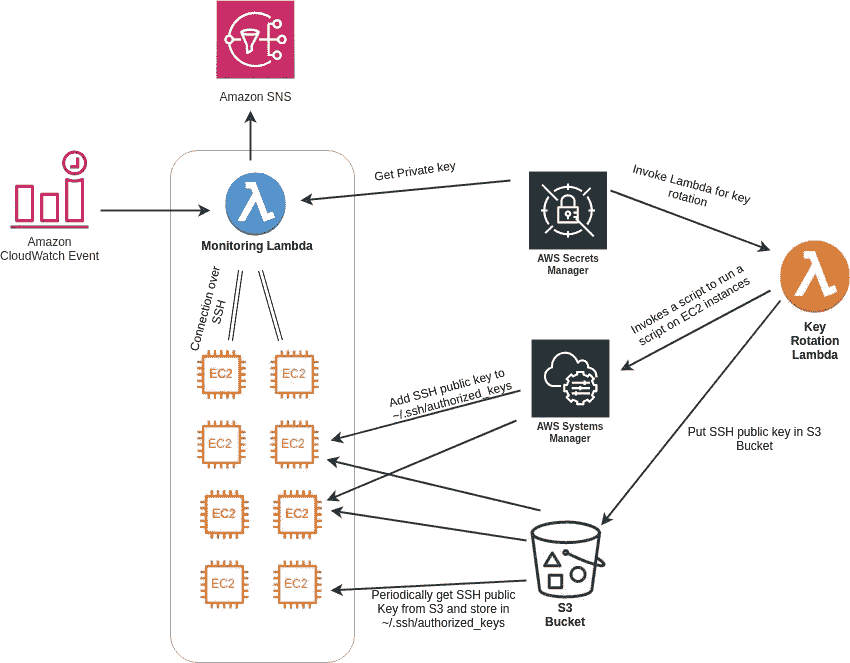
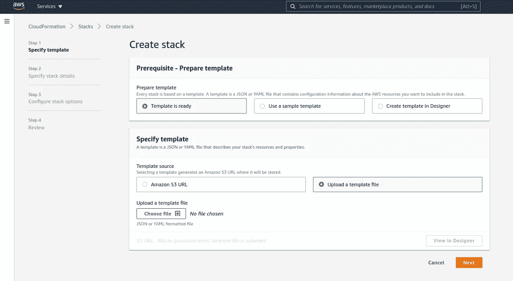
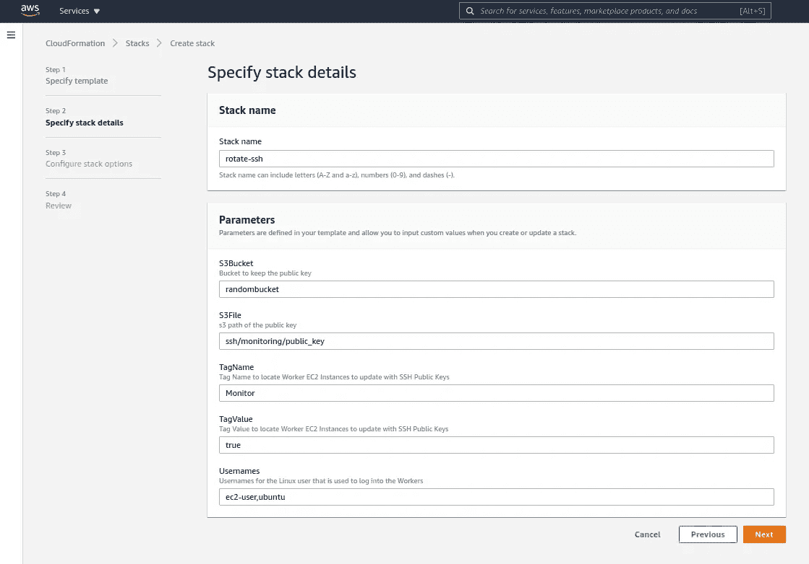
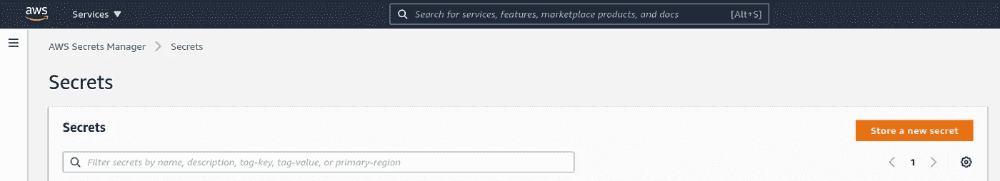
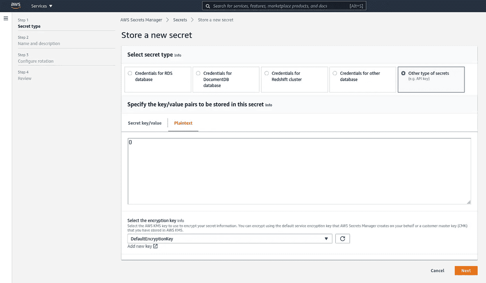
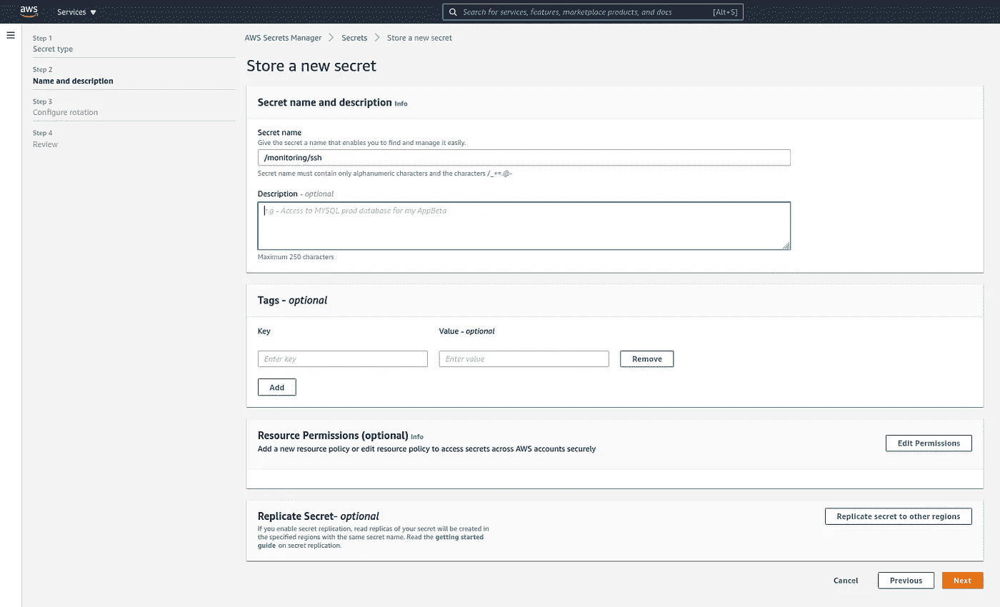
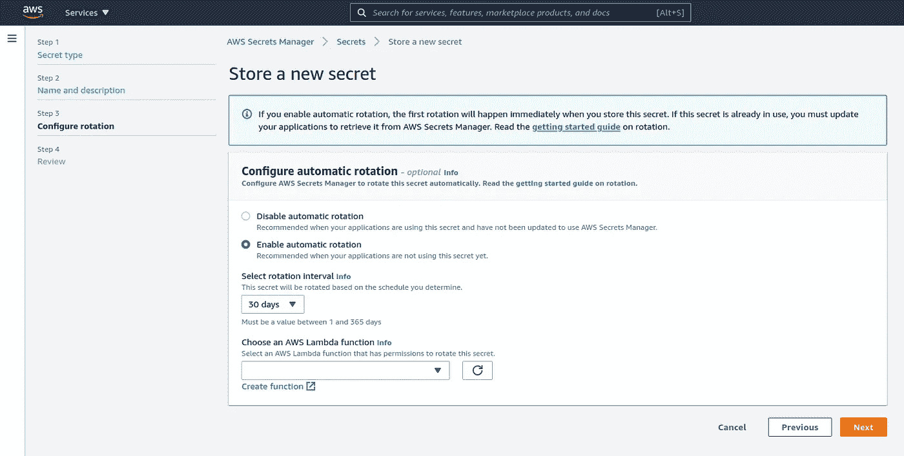

# 如何监控 AWS EC2 实例上托管的服务

> 原文：<https://levelup.gitconnected.com/how-to-monitor-your-services-hosted-on-aws-ec2-instances-4abbc460332>

## 一种实现 Lambda 函数的安全方法，该函数使用 Secrets Manager 监控 EC2 实例上托管的所有服务


图片来自 Unsplash 上的[克里斯蒂娜@ wocintechchat.com](https://unsplash.com/@wocintechchat)

# 问题

AWS 提供了许多工具来监控自己的服务。您可以在各种 CloudWatch 事件上添加警报。随着您在 AWS 上托管越来越多的服务，确保这些服务正在运行变得非常困难和重要。您可以使用 CloudWatch 通过创建新的指标来发现服务的状态。这一过程在某一点之后变得昂贵且难以管理。

# 解决办法

Lambda 函数安全地监控 EC2 实例上运行的所有服务。以下是建议的架构:

# **建筑**



这个架构背后的主要思想是通过 SSH 安全地访问 EC2 实例并监控服务。SSH 密钥会定期轮换。

设置中涉及的实体:

*   **EC2 实例**:这些是运行服务的实例。
*   **监控 Lambda** :这个 Lambda 函数负责使用 SSH 安全地登录到各种实例，发现服务的状态，并在出现问题时发出警报。
*   AWS 安全管理器:用于存储 SSH 密钥(私有和公共)的 AWS 服务。密钥由密钥轮换λ函数定期轮换。
*   **密钥旋转 Lambda** : Lambda 函数旋转 SSH 密钥，并在*中添加公钥。具有特定标记的实例中的 ssh/authorized_keys* 文件。它还在 AWS S3 的对象中添加了公钥。
*   **AWS 系统管理器** : Rotation Lambda 函数使用系统管理器运行脚本将 ssh 公钥添加到 *~。ssh/authorized _ key。*

# **步骤**

## C

在这一步，我们使用 CloudFormation 创建一个 Lambda 函数，该函数旋转 SSH 密钥并在*中添加公钥。实例中的 ssh/authorized_keys* 文件。公钥放在 AWS S3 中的一个对象上。

从这个[库](https://github.com/amritsingh/rotate-ssh-aws)下载 Lambda 代码

```
**$** wget [https://github.com/amritsingh/rotate-ssh-aws/archive/master.zip](https://github.com/amritsingh/rotate-ssh-aws/archive/master.zip) -O rotate_ssh.zip
**$** unzip rotate_ssh.zip
```

压缩存储库的内容

```
**$** cd rotate-ssh-aws-master/
**$** zip -r rotate-ssh-lambda.zip ./*
```

上传 rotate-ssh-lambda.zip 到 S3。

`cloudformation.yaml`是在 AWS 中创建 Lambda 函数的云形成脚本。在这个文件中，在将脚本提供给 AWS Cloud Formation 之前，根据您的设置更改一些参数(查找 ***FIXME*** )。

`cloudformation.yaml`需要配置

*   *存储公钥的 S3 桶*
*   *存储公钥的 S3 对象*
*   *用于登录 EC2 实例的 Linux 用户的用户名*
*   *你上传的 Lambda 代码的 S3·URI*
*   *存储公钥、安全组 id 和子集 id 的 S3 桶的 ARN。*

转到 AWS 控制台中的 CloudFormation。点击“**创建堆栈**”。


选择“**上传模板文件**选项，从您的机器上选择`cloudformation.yaml`，点击**下一步**。



输入“**堆栈名称**并根据需要更改参数，点击“**下一步**



在步骤 3 和步骤 4 中，使用默认选项并创建堆栈。

等待一段时间，直到堆栈创建完成。

## 在 **AWS 秘密管理器**中创建一个秘密

在 **AWS 机密管理器控制台**上选择“**存储新的机密**”。



选择**其他类型的秘密**，选择**明文**页签，输入 **{}** 。将默认加密密钥更改为**客户主密钥**。



在**步骤 2:名称和描述:**输入钥匙的名称和描述。名字会像 **/monitoring/ssh** 。添加描述后，点击下一个的**。**



在**第三步:配置旋转**中，选择**启用自动旋转。**根据您的要求更改轮换间隔，并选择我们为轮换 SSH 密钥创建的 lambda。选择下一个的**。**



在**步骤 4** 中，查看并选择**存储**。

## 将访问 SSH 公钥所在的 S3 存储桶的权限授予您用于 EC2 实例的 IAM 角色

## 更改 EC2 实例的部署，定期从 S3 桶中提取公钥

我们创建了一个 cron 作业，以 15 分钟的时间从 S3 获取 SSH 公钥。

crontab 运行的 Bash 脚本如下所示

## 设置一个 Lambda 函数，通过 SSH 连接到 EC2 实例并监控服务

这是完整设置的最后一部分。每当您想要监视一个新的服务时，都必须修改这个代码。

为此，我推荐使用 Python。Lambda 函数应该可以访问 Secrets Manager 中的私钥。它执行以下任务:

*   从 Secrets Manager 下载私钥。
*   使用 [Paramiko](https://github.com/paramiko/paramiko) 登录 EC2 机器。
*   监控服务的状态，并在需要时发送 AWS SNS 警报。

# 包装它

最后，完成所有这些步骤后，您就有了自己的定制显示器设置。该显示器可轻松扩展至您的所有服务。每次向后端添加服务时，您都需要将服务添加到监控 Lambda 中。设置的所有其他部分保持不变。