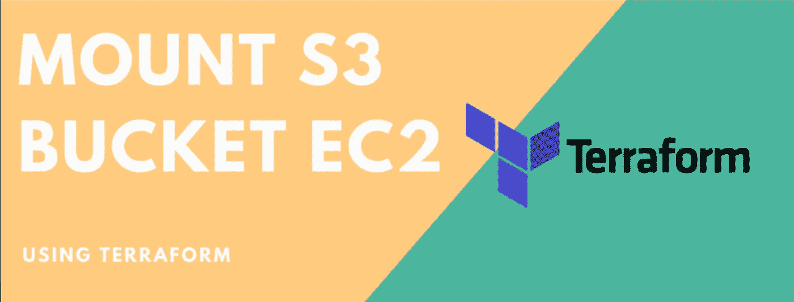

# 如何在 EC2 Linux 实例上挂载 S3 Bucket

> 原文：<https://levelup.gitconnected.com/how-to-mount-s3-bucket-on-an-ec2-linux-instance-df44c7885aae>



我们将挂载 S3 作为 EC2 实例的文件系统。

S3 存储桶可以挂载在 AWS 实例中，作为一个称为 S3fs 的文件系统。S3fs 是一个 FUSE 文件系统，允许您挂载一个 Amazon S3 bucket 作为本地文件系统。它的行为就像一个网络连接驱动器，因为它不在 Amazon EC2 上存储任何东西，但是用户可以从 EC2 实例访问 S3 上的数据。

用户空间中的文件系统( **FUSE** )是用户空间程序将虚拟文件系统导出到 Linux 内核的简单接口。它还旨在为非特权用户创建和安装他们自己的文件系统实现提供一种安全的方法。

S3fs-fuse 项目是用 python 编写的，由 Amazon 的简单存储服务提供支持。亚马逊提供了一个开放的 API 来在这项服务的基础上构建应用程序，几家公司已经这样做了，使用各种接口(web，sync，fuse 等。).

按照下面的步骤将您的 S3 存储桶挂载到您的 Linux 实例上。

本教程假设您在 AWS 上有一个正在运行的 Linux EC2 实例，具有 root 访问权限，并且在 S3 创建了一个 bucket，它将被挂载到您的 Linux 实例上。您还需要一个具有足够权限的 S3 或 IAM 访问权限的访问和密钥对来生成或创建它。

我们将以 root 用户的身份执行这些步骤。如果您是拥有 sudo 访问权限的普通用户，也可以使用 sudo 命令。所以让我们开始吧。

把一切都安排好

```
export LANG=en_US.UTF-8
export LANGUAGE=en_US.UTF-8
export LC_COLLATE=C
export LC_CTYPE=en_US.UTF-8
```

运行这个来确认。

**第一步**

对于 CentOS 或 Red Hat

```
yum update all
```

对于 Ubuntu

```
apt-get update
```

**步骤 2:-** 安装依赖项。

以 CentOS 或 Red Hat 为单位

```
sudo yum install automake fuse fuse-devel gcc-c++ git libcurl-devel libxml2-devel make openssl-devel
```

在 Ubuntu 或 Debian 中

```
sudo apt-get install automake autotools-dev fuse g++ git libcurl4-gnutls-dev libfuse-dev libssl-dev libxml2-dev make pkg-config
```

**步骤 3:-** 从 git 克隆 s3fs 源代码。

```
git clone [https://github.com/s3fs-fuse/s3fs-fuse.git](https://github.com/s3fs-fuse/s3fs-fuse.git)
```

**步骤 4:-** 现在转到源代码目录，用以下命令编译并安装代码:

```
cd s3fs-fuse./autogen.sh./configure -prefix=/usr -with-opensslmakesudo make install
```

**步骤 5:-** 使用下面的命令检查 s3fs 命令在操作系统中的位置。它还会告诉你安装是正确的。

```
which s3fs
```

**步骤 6:-** 获取访问密钥和秘密密钥。

您将需要一个具有适当权限的 AWS 访问密钥和秘密密钥，以便从 EC2 实例访问 s3 bucket。您可以通过 AWS 提供的 IAM(身份和访问管理)服务轻松管理您的用户权限。创建具有 S3 完全访问权限的 IAM 用户(或具有足够权限的角色),或者使用您的帐户的根凭据。为了简单起见，这里我们将使用根凭证。

转到 AWS 菜单->您的 AWS 帐户名->我的安全凭证。您的 IAM 控制台将出现在这里。你必须转到用户>你的帐户名称，在权限选项卡下，检查你是否有足够的权限访问 S3 桶。否则，您可以手动分配现有的“S3 完全访问”策略，或者创建具有足够权限的新策略。

现在转到安全凭证选项卡并创建访问密钥。将生成新的访问密钥和秘密密钥对。您可以看到访问密钥和秘密密钥(当您单击 show 选项卡时可以看到秘密密钥)，您也可以下载它们。分别复制这两把钥匙。

请注意，您始终可以使用现有的访问和秘密密钥对。或者，您也可以创建一个新的 IAM 用户，并为其分配足够的权限来生成访问和密钥。

**第 7 步:-** 在/etc 中新建一个文件。名为 passwd-s3fs，并按以下格式粘贴访问密钥和秘密密钥。

```
sudo touch /etc/passwd-s3fssudo vim /etc/passwd-s3fs
```

> *Your _ access key:Your _ secret key*

这将是文件的内容

**步骤 8:-** 更改文件的权限。

```
sudo chmod 640 /etc/passwd-s3fs
```

**步骤 9:-** 现在创建一个目录或提供一个现有的目录路径，并在其中挂载 S3bucket。

如果你有一个不带点的简单桶(。)在存储桶名称中，使用点“a”中使用的命令，或者使用带点(.)在存储桶名称中，遵循步骤“b”:

**a)桶名不带点号(。):**

```
mkdir /mys3buckets3fs your_bucketname -o use_cache=/tmp -o allow_other -o uid=1000 -o mp_umask=002 -o multireq_max=5 /mys3bucket
```

其中，"您的存储桶名称" =您在 AWS S3 上创建的 S3 存储桶的名称，use_cache =将目录用于缓存目的，allow_other=允许其他用户写入装载点，uid=装载点的用户/所有者的 uid(也可以为组添加"-o gid=1001 ")，mp_umask=删除其他用户权限。multireq_max=向 s3 bucket 发送请求的参数，/mys3bucket=将要装载 bucket 的装载点。

您可以在/etc/rc.local 中创建一个条目，以便在重新引导后自动重新挂载。通过“which”命令找到 s3fs 二进制文件，并在“exit 0”行之前输入条目，如下所示。

```
which s3fs--(output)--> /usr/local/bin/s3fsnano /etc/rc.local--(output)--> /usr/local/bin/s3fs your_bucketname -o use_cache=/tmp -o allow_other -o uid=1001 -o mp_umask=002 -o multireq_max=5 /mys3bucket
```

**b)桶名带点号(。):**

```
mkdir /mys3buckets3fs your_bucketname /mys3bucket -o use_cache=/tmp -o allow_other -o uid=1001 -o mp_umask=002 -o multireq_max=5 -o use_path_request_style -o url=https://s3-{{aws_region}}.amazonaws.com
```

其中，"您的存储桶名称" =您在 AWS S3 上创建的 S3 存储桶的名称，use_cache =将目录用于缓存目的，allow_other=允许其他用户写入装载点，uid=装载点的用户/所有者的 uid(也可以为组添加"-o gid=1001 ")，mp_umask=删除其他用户权限。multireq_max=向 s3 bucket 发送请求的参数，/mys3bucket=将要装载 bucket 的装载点。

请记住将“{{aws_region}}”替换为您的存储桶区域(例如:EU-西部-1)。

您可以在/etc/rc.local 中创建一个条目，以便在重新引导后自动重新挂载。通过“which”命令找到 s3fs 二进制文件，并在“exit 0”行之前输入条目，如下所示。

```
which s3fs /usr/local/bin/s3fsnano /etc/rc.locals3fs your_bucketname /mys3bucket -o use_cache=/tmp -o allow_other -o uid=1001 -o mp_umask=002 -o multireq_max=5 -o use_path_request_style -o url=https://s3-{{aws_region}}.amazonaws.com
```

要在任何时候进行调试，请在 s3fs mount 命令中添加“**-o dbg level = info-f-o curldbg**”。

**步骤 10:-** 检查已安装的 s3 铲斗。输出将是相似的，如下所示，但是使用的大小可能不同。

```
df -Th
```

"或者"

```
df -Th /mys3bucket
```

已使用的文件系统类型大小可用百分比装载于

s3fs fuse . s3fs 256t 0 256t 0%/my S3 bucket

如果它显示了挂载的文件系统，那么您已经在 EC2 实例上成功地挂载了 S3 bucket。您还可以通过创建测试文件来进一步测试它。

```
cd /mys3bucketecho “this is a test file to check s3fs” >> test.txtls
```

这种变化也应该反映在 S3 水桶上。因此，登录到您的 S3 存储桶来验证测试文件是否存在。

**注意:**如果您已经在 s3bucket 中有一些数据，并且它是不可见的，您必须在 S3 AWS 管理控制台的 ACL 中为该 s3 bucket 设置权限。

如果您得到任何 s3fs 错误，比如“传输端点未连接”，您必须卸载并重新装载文件系统。您也可以通过自定义脚本来自动检测和执行重新装载。

恭喜你。！您已经成功地将 S3 存储桶挂载到 EC2 实例。写入/mys3bucket 的任何文件都将复制到您的亚马逊 s3bucket。

现在我们需要从 Jupyter 笔记本上访问它。因此，我们必须确保以管理员身份运行 jupyter 笔记本

导航到

> */首页/用户名/。jupyter/jupyter _ notebook _ config . py*

和改变

```
#c.Application.allow_admin = False
```

# 到

```
c.Application.allow_admin = True
```

如果你太懒😴为了遵循这一切，我为你创建了一个地形模板