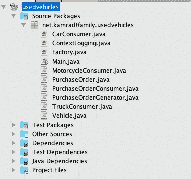
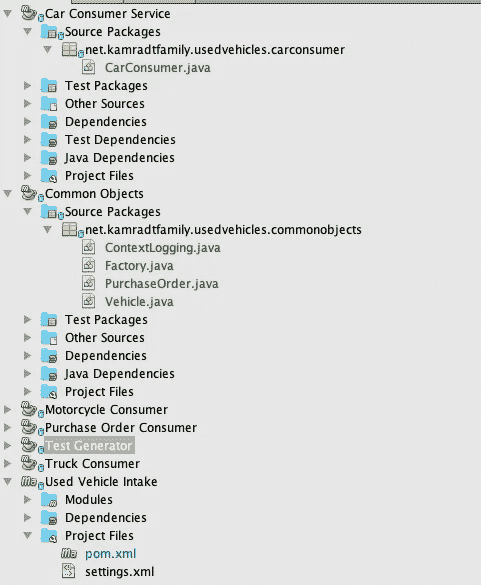
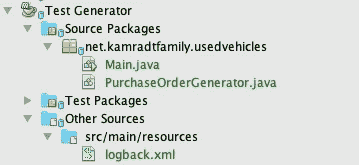

# 如何从整体服务转向微服务

> 原文：<https://levelup.gitconnected.com/how-to-move-from-monolith-to-microservices-74f2f996964b>

## 分解岩石。


格雷格·罗森克在 [Unsplash](https://unsplash.com/s/photos/rock-pile?utm_source=unsplash&utm_medium=referral&utm_content=creditCopyText) 上的照片

在我的上一系列文章中，我已经创建了一组完整的 Java 类，它们都使用一个 main 函数运行。在本文和以后的文章中，我将把它们分成不同的服务，并在 Kubernetes 的 Docker 桌面风格上运行它们。最终，他们应该能够在任何云提供商上运行任何风格的 Kubernetes。我将尽量坚持标准部署，因为如果我想迁移到云，这将给我带来灵活性。

我一直在做的代码是一个二手车进气系统的简单模拟。我有一个好的开端，因为当我构建和设计我的 monolith 时，我确保所有的类都是无状态的，并且只通过消息队列和数据库相互交流。大多数你可能不得不拆开的巨石不会有如此干净的分离。因此，在大多数情况下，你的第一个任务就是识别服务，并确保它们只通过 API 相互通信。然后，您可以将 API 切换到一个代理 API，该代理 API 通过消息队列或 REST 服务等外部方式进行对话。

对我来说，这主要是一次重组。我希望从每个服务构建的图像，以及指示每个服务如何部署的部署文件。最终，输入和输出将通过测试服务或通过[邮递员](https://www.postman.com/)，尽管在某些时候我可能想建立一个 UI 层。

我喜欢每个实体都有一个存储库，这样每个图像在一个存储库中就有了生成它的所有来源，而没有其他的了。这使得基于它生成的图像和存储库中的代码对每一个进行版本控制变得容易，因为 Git 在存储库中对标签进行了条带化。然而，我将会更灵活一点，允许所有的服务存在于同一个存储库的不同模块中。尽管我不喜欢多模块 Maven 构建，因为他们从来没有解决所有的问题，但我可能不会使用多模块这种古怪的东西。

我的服务如下:`PurchaseOrderConsumer`、`CarConsumer`、`TruckConsumer`、`MotorcycleConsumer`。我也有一辆`PurchaseOrderGenerator`用于测试。我将创建六个模块，一个用于每个服务，一个用于服务用来通信的 POJOs 库。这些模块将以其各自的服务命名。这是我的出发点:



这是我最后得到的结果:



现在每个服务都有了自己的模块。由于每个服务只有一个文件，这看起来有点过了，但是随着每个服务变得越来越复杂，它将会有增长的空间。目前，就服务而言，一切仍然非常简单。

我还必须创建一个列出模块的父 pom，有一个依赖项管理部分以确保所有模块都有相同版本的依赖项，并添加 CI 系统 [Appveyor](https://ci.appveyor.com/project/rkamradt/usedvehicles) 将使用的一些其他项目。以下是父 pom 的样子:

```
<?xml version="1.0" encoding="UTF-8"?>
<project ae ky" href="http://maven.apache.org/POM/4.0.0" rel="noopener ugc nofollow" target="_blank">http://maven.apache.org/POM/4.0.0" xmlns:xsi="[http://www.w3.org/2001/XMLSchema-instance](http://www.w3.org/2001/XMLSchema-instance)" xsi:schemaLocation="[http://maven.apache.org/POM/4.0.0](http://maven.apache.org/POM/4.0.0) [http://maven.apache.org/xsd/maven-4.0.0.xsd](http://maven.apache.org/xsd/maven-4.0.0.xsd)">
    <modelVersion>4.0.0</modelVersion>
    <groupId>net.kamradtfamily</groupId>
    <artifactId>usedvehicles</artifactId>
    <version>1.0-SNAPSHOT</version>
    <packaging>pom</packaging>
    <name>Used Vehicle Intake</name>
    <description>
        A small system of services for intaking used vehicles
    </description>
    <modules>
        <module>carconsumer</module>
        <module>commonobjects</module>
        <module>motorcycleconsumer</module>
        <module>purchaseorderconsumer</module>
        <module>truckconsumer</module>
        <module>testgenerator</module>
    </modules>
    <url>[https://ci.appveyor.com/project/rkamradt/usedvehicles](https://ci.appveyor.com/project/rkamradt/usedvehicles)</url>
    <inceptionYear>2021</inceptionYear>
    <scm>
        <connection>
            scm:git:https:/github.com:rkamradt/usedvehicles.git
        </connection>
        <developerConnection>
            scm:[git@github.com](mailto:git@github.com):rkamradt/usedvehicles.git
        </developerConnection>
        <url>https:/github.com:rkamradt/usedvehicles</url>
    </scm>
    <ciManagement>
        <system>AppVeyor</system>
        <url>
           [https://ci.appveyor.com/project/rkamradt/usedvehicles](https://ci.appveyor.com/project/rkamradt/usedvehicles)
        </url>
    </ciManagement>
    <developers>
        <developer>
            <name>Randal Kamradt</name>
            <id>rkamradt</id>
            <email>[randysr@kamradtfamily.net](mailto:randysr@kamradtfamily.net)</email>
            <organization>Kamradtfamily.net</organization>
            <roles>
                <role>Java Developer</role>
            </roles>
        </developer>
    </developers>
    <licenses>
        <license>
            <name>MIT</name>
        </license>
    </licenses>
   <properties>
        <project.build.sourceEncoding>
            UTF-8
        </project.build.sourceEncoding>
        <maven.compiler.source>13</maven.compiler.source>
        <maven.compiler.target>13</maven.compiler.target>
    </properties>

    <dependencyManagement>
        <dependencies>
            <dependency>
                <groupId>io.projectreactor</groupId>
                <artifactId>reactor-bom</artifactId>
                <version>2020.0.2</version>
                <type>pom</type>
                <scope>import</scope>
            </dependency>
            <dependency>
                <groupId>com.couchbase.client</groupId>
                <artifactId>java-client</artifactId>
                <version>3.1.0</version>
            </dependency>
            <dependency>
                <groupId>io.projectreactor.rabbitmq</groupId>
                <artifactId>reactor-rabbitmq</artifactId>
                <version>1.5.1</version>
            </dependency>
            <dependency>
                <groupId>com.fasterxml.jackson.core</groupId>
                <artifactId>jackson-databind</artifactId>
                <version>2.9.1</version>
            </dependency>
            <dependency>
                <groupId>com.fasterxml.jackson.datatype</groupId>
                <artifactId>jackson-datatype-jsr310</artifactId>
                <version>2.12.0</version>
            </dependency>
            <dependency>
                <groupId>ch.qos.logback</groupId>
                <artifactId>logback-classic</artifactId>
                <version>1.2.3</version>
            </dependency>
            <dependency>
              <groupId>org.projectlombok</groupId>
              <artifactId>lombok</artifactId>
              <version>1.18.16</version>
            </dependency>
            <dependency>
                <groupId>io.projectreactor</groupId>
                <artifactId>reactor-core</artifactId>
                <version>3.4.3</version>
                <type>jar</type>
            </dependency>
            <dependency>
                <groupId>io.github.rkamradt</groupId>
                <artifactId>possibly</artifactId>
                <version>1.0.1</version>
            </dependency>
            <dependency>
                <groupId>ch.qos.logback</groupId>
                <artifactId>logback-classic</artifactId>
                <version>1.2.3</version>
            </dependency>
            <dependency>
                <groupId>io.projectreactor</groupId>
                <artifactId>reactor-test</artifactId>
                <version>3.4.3</version>
                <scope>test</scope>
            </dependency>
            <dependency>
                <groupId>org.junit.jupiter</groupId>
                <artifactId>junit-jupiter-api</artifactId>
                <version>5.6.0</version>
                <scope>test</scope>
            </dependency>
            <dependency>
                <groupId>org.junit.jupiter</groupId>
                <artifactId>junit-jupiter-params</artifactId>
                <version>5.6.0</version>
                <scope>test</scope>
            </dependency>
            <dependency>
                <groupId>org.junit.jupiter</groupId>
                <artifactId>junit-jupiter-engine</artifactId>
                <version>5.6.0</version>
                <scope>test</scope>
            </dependency>
        </dependencies>
    </dependencyManagement>
</project>
```

每个模块中的`pom.xml`文件是原始 pom.xml 文件的副本，只是它引用了父 pom，我从所有依赖项中删除了这个版本，因为它们都是由父 pom 指定的。

您还会注意到，我用两个文件和日志配置创建了一个`testgenerator`模块:



`Main.main`函数应该仍然工作，因为我们没有改变任何代码，只是把它移到了不同的模块中。运行它将产生与原始配置相同的输出。

这里我们应该注意，单个服务被设计为在 10 秒钟不活动后自动关闭，这是这个 main 函数所做的测试的一部分。因此，我们需要改变这种情况，必须想出其他方法来进行集成测试。最终，这个模块将消失或被取代，10 秒钟的超时将需要消失。

## 创建图像

接下来，我们将希望为每个服务创建单独的映像。我们将使用谷歌的一个名为 [Jib](https://github.com/GoogleContainerTools/jib) 的 Maven 插件。要创建一个映像，我们不需要制作一个可执行的 jar。Jib 将把你的图像放在不同的层中，包括资源、类文件和其他需要在类路径中的 jar。它会自动找到主函数，你需要做的就是给它图像名称和标签。

需要对父 pom 进行的更改是将插件添加到插件管理部分，并添加它将用于图像名称和标记的属性。该属性应该如下所示:

```
<image>[repo-user]/${project.artifactId}:${project.version}</image>
```

用图像库和您的用户名替换`[repo-user]`。如果你使用 [Docker Hub](https://hub.docker.com/repository/docker/rlkamradt/purchaseorderconsumer/general) ，只要你的用户名就可以了。在`PurchaseOrderConsumer`模块的情况下，它为我生成了一个图像`rlkamradt/purchaseorderconsumer:1.0-SNAPSHOT`。请注意，因为它指定了一个标记，所以它不会为您创建一个最新的标记，所以您在运行它时必须记住这一点(或者在 image name 属性中将`${project.version}`更改为‘latest’)。

插件管理部分将如下所示:

```
<pluginManagement>
    <plugins>
        <plugin>
            <groupId>com.google.cloud.tools</groupId>
            <artifactId>jib-maven-plugin</artifactId>
            <version>2.7.1</version>
            <configuration>
            <from>
                <image>openjdk:13.0.2</image>
            </from>
            </configuration>
        </plugin>
    </plugins>
</pluginManagement>
```

默认图像是 Java 11 图像，所以我必须覆盖它以使用 OpenJDK 版本 13.0.2。除此之外，我可以对其他所有东西都采用默认值。

您不必向服务模块的 pom 文件添加任何东西，但是您需要向任何库文件和其他您不想转换成映像的模块添加一个。所以在`TestGenerator`和`CommonObject`模块中，我给`pom.xml`添加了以下内容:

```
<build>
    <plugins>
      <plugin>
        <groupId>com.google.cloud.tools</groupId>
        <artifactId>jib-maven-plugin</artifactId>
        <configuration>
          <!-- we don't want jib to execute on this module -->
          <skip>true</skip>
        </configuration>
      </plugin>
    </plugins>
  </build>
```

剩下的工作就是为每个服务模块创建一个`main` Java 类。比如在`CarConsumer`里我加了这个`Main.java`:

```
package net.kamradtfamily.usedvehicles.carconsumer;/**
 *
 * [@author](http://twitter.com/author) randalkamradt
 */
public class Main {
    public static void main(String [] argv) {
        CarConsumer.consume();
    }

}
```

现在我们可以构建图像:

```
mvn clean install
mvn package jib:build
```

确保您已登录到要上传到的存储库，或者您的存储库凭据可用。请参见 [Jib](https://github.com/GoogleContainerTools/jib) 文档，了解特定容器存储库的详细信息。

一旦构建完成，我们可以通过在 Docker 中运行它来进行测试:

```
docker run rlkamradt/purchaseorderconsumer:1.0-SNAPSHOT
...
2021-03-06T18:29:44.624209Z [rabbitmq-receiver-connection-subscription-1] msg: Purchace Order Consumer in finally for signal cancel
18:29:44.767 [rabbitmq-receiver-connection-subscription-1] ERROR reactor.core.publisher.Operators - Operator called default onErrorDropped
18:29:44.787 [rabbitmq-receiver-connection-subscription-1] ERROR reactor.core.publisher.Operators - Operator called default onErrorDropped
reactor.core.Exceptions$ErrorCallbackNotImplemented: java.net.ConnectException: Connection refused
Caused by: java.net.ConnectException: Connection refused
```

哎呀！当我们在 Docker(或 Kubernetes)中运行时，我们不能使用 localhost 来查找 Couchbase 或 RabbitMQ 我们将不得不做一些配置。但是我将把这个问题留给下一篇文章。

敏锐的眼睛会注意到，我们没有使用 Spring(或其任何膨胀)来提供这些服务。许多事情凑在一起，使得 Spring 有点多余。谁需要二十几秒的启动时间呢？Spring 非常适合连接你的整体的所有部分，但是我将避免使用它，因为我们的部分可以通过一个编排服务来连接。

在我关于这个主题的下一篇文章中，我将通过 Kubernetes 使用配置来连接所有部分，并且我将添加一个简单的 REST 服务来输入新的采购订单并查看结果。谢谢你坚持到最后，我希望你学会了一个新的技巧。

以下是 GitHub 上的所有代码:

[](https://github.com/rkamradt/usedvehicles/tree/v0.6) [## rkamradt/二手车辆

### Permalink 无法加载最新的提交信息。整个第一阶段使用电抗组件的微服务系统示例…

github.com](https://github.com/rkamradt/usedvehicles/tree/v0.6) 

本系列的其他文章:

[](/understanding-reactive-java-e8aaee9a204b) [## 理解反应式 Java

### 因为你的线程阻碍了我的表现。

levelup.gitconnected.com](/understanding-reactive-java-e8aaee9a204b) [](/creating-a-flux-of-fluxes-with-project-reactors-group-by-method-37200bfc2a) [## 用 Project Reactor 的 Group By 方法创建通量通量

### 什么通量？

levelup.gitconnected.com](/creating-a-flux-of-fluxes-with-project-reactors-group-by-method-37200bfc2a) [](/parallel-tasks-in-a-non-blocking-system-66c195aba56d) [## 非阻塞系统中的并行任务

### 利用 Project Reactor 的线程/非阻塞混合模型。

levelup.gitconnected.com](/parallel-tasks-in-a-non-blocking-system-66c195aba56d) [](/log-with-context-in-a-concurrent-java-system-b647a1ba70f3) [## 并发 Java 系统中的上下文日志

### 确保多线程之间的一致日志记录。

levelup.gitconnected.com](/log-with-context-in-a-concurrent-java-system-b647a1ba70f3) [](/how-to-eliminate-try-catch-blocks-in-java-lambdas-72c1c9f878f5) [## 如何消除 Java Lambdas 中的 Try-catch 块

### 并将库部署到 Maven Central 来完成它。

levelup.gitconnected.com](/how-to-eliminate-try-catch-blocks-in-java-lambdas-72c1c9f878f5)