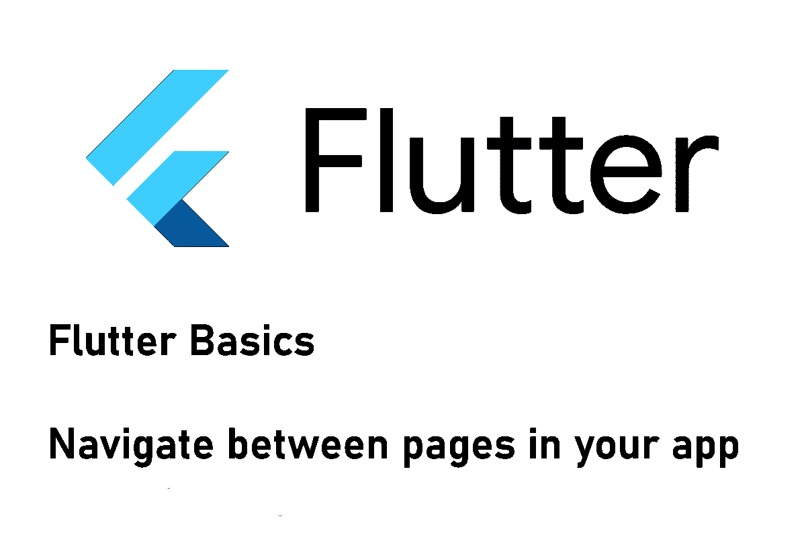
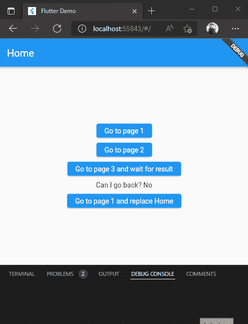
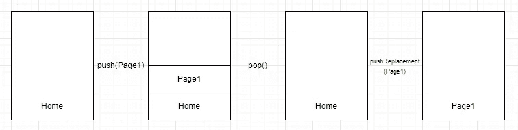

# 如何在你的 Flutter 应用程序中导航页面

> 原文：<https://levelup.gitconnected.com/how-to-navigate-between-pages-in-your-flutter-application-ed54558dbae4>

## 为您的应用导航！

## 在本文中，我们将实现页面之间的导航逻辑，这样您就可以引导您的用户朝着目标前进。



如果您不想开发单页面应用程序，您将需要一个导航模式来从一个页面转到另一个页面。在颤振应用中，有 3 种不同的方法来处理这个问题。我将在接下来的部分中向您展示它们。



页面间应用导航示例

## 导航器对象

`Navigator`对象公开了在 Flutter 应用程序中从一个页面过渡到另一个页面的方法。它的行为类似于堆栈数据结构，这意味着最后添加的元素将是第一个删除的元素。要访问`Navigator`，您可以调用`Navigator.of(context)`，其中上下文代表当前的`BuildContext`。我将在接下来的部分中演示它。

## 最基本的方式——推动和弹出

导航器的行为就像一个堆栈，所以最简单的方法是当你想导航到一个新的页面时，就把它推到上面，如果你想返回，就弹出一个页面。下面的代码演示如何导航到新页面。

要返回，你只需调用`Navigator.of(context).pop()`就能回到上一页。为了检查向后导航是否可行，有一个方法`canPop()`，如果堆栈中没有更多要弹出的页面，该方法将返回 false。如果可能，移动设备的硬件或软件后退按钮也会触发`pop()`方法。

❗如果你调用`pop()`并且堆栈中只有当前页面，应用程序将会关闭。

要完全跳过页面历史，您也可以使用`pushReplacement()`方法。它会用给定的页面替换当前页面，这样堆栈中就只有给定的页面了。但是用户将无法使用后退按钮。

该图再次显示了堆栈行为:



## 高级方式—预定义的路线

如果您有少量不需要传入任何参数的页面，那么预定义的路由是一个不错的选择。要配置路由，您需要在`MaterialApp`对象中填充`routes`属性。下面是一个简单的例子:

在这种情况下，您需要使用`Navigator`对象的`pushNamed()`或`pushReplacementNamed()`方法。例如，当导航到具有预定义路线`/login`的登录页面时，您调用`Navigator.of(context).pushNamed(”/login”)`。建议为路由定义常量，以减少可能的拼写错误。

❗不要忘记`initialRoute`属性或者添加一个`onUnknownRoute`处理程序。否则 app 启动不了。

## 专家方式——路线生成

如果您不使用 routes 表，但是想使用命名路由，那么您可以在`MaterialApp`对象的`onGenerateRoute`函数中添加一个处理程序。你可以在下面看到一个例子:

每次通过导航器推送一条路线时，都会执行这个处理函数来查找要导航到的正确页面。`name`属性包含传递的路线。最大的好处是您可以用这种方法处理导航参数。它们是通过`arguments`属性传递的。与使用预定义路由表的静态方法相比，它可以为您提供更多的控制。

## 将数据发送到另一页

向页面传递数据非常简单。当使用没有命名路由的 push-pop 方法时，只需将数据作为构造函数参数添加即可。

`Navigator.of(context).push(MaterialPageRoute(builder: (context) => Login(data: "dummy")));`

当使用命名路由方法时，您可以使用`pushNamed`方法的`arguments`参数来传递您想要的任何数据。

`Navigator.of(context).pushNamed(”/login”, “dummy”);`

该参数的类型是`Object`，因此您可以将任何想要的东西从简单的字符串传递到自定义对象的地图上。目标页面负责解析或转换数据。看一下上面关于路线生成的段落。如果使用预定义的路由表，则不能在运行时传递任何数据。

`pop()`方法也可以传递数据。因此，调用方需要等待返回导航，并读取传递的信息。只需调用`Navigator.of(context).pop(”dummy”);`向调用者传递一个字符串。调用者应该等待数据的返回。

```
var res = await Navigator.of(context).pushNamed("/login"); // <-- wait for pop()
print(res as string); // prints "dummy"
```

## 进一步阅读

如果你想知道更多关于 Flutter 中导航的细节，可以查看下面的链接。

[](https://docs.flutter.dev/cookbook/navigation) [## 航行

### 编辑描述

docs.flutter.dev](https://docs.flutter.dev/cookbook/navigation) [](https://medium.com/flutter/learning-flutters-new-navigation-and-routing-system-7c9068155ade) [## 学习 Flutter 的新导航和路由系统

### 本文解释了 Flutter 的新导航器和路由器 API 是如何工作的。如果你遵循 Flutter 的开放设计文档，你…

medium.com](https://medium.com/flutter/learning-flutters-new-navigation-and-routing-system-7c9068155ade) 

## 结论

在本文中，我们看了一下 Flutter 应用程序中的导航。无论是使用 push 和 pop，使用命名路由，还是使用动态路由生成，都有许多可能的方法来完成此任务。如果你有更多的问题，欢迎在评论中提问。

你可以在 [GitHub](https://github.com/xeladu/flutter_basic_navigation) 上找到源代码。

如果你喜欢这篇文章，我会很高兴得到掌声👏(你知道可以拍几次吗？😎)另外，如果你还没有跟上我，我也很感激。

🌲 [linktr.ee](https://linktr.ee/xeladu) |☕ [咖啡](https://www.buymeacoffee.com/xeladu)🎁[捐赠](https://www.paypal.com/donate/?hosted_button_id=JPWK39GGPAAFQ) |💻GitHub |🔔[订阅](https://xeladu.medium.com/subscribe)

顺便说一句:如果你还没有 Medium 会员，我推荐你使用[│我的推荐链接◀](https://medium.com/@xeladu/membership) ，因为它会让你访问 Medium 上的所有内容，并以一小部分费用支持我，而不会为你带来任何额外费用。谢谢大家！✨

## 相关故事

[](https://medium.com/codex/how-to-use-the-flutter-command-line-interface-8c43f3bb8425) [## 如何使用 Flutter 命令行界面

### 在本文中，我们将关注 Flutter CLI 及其最常见的构建、测试、部署和…

medium.com](https://medium.com/codex/how-to-use-the-flutter-command-line-interface-8c43f3bb8425) [](/send-push-notifications-from-a-flutter-app-to-devices-with-firebase-9c84ce58fe30) [## 从 Flutter 应用程序向安装了 Firebase 的设备发送推送通知

### 以下是向具有 Firebase Cloud 功能和 Firebase Cloud 的设备发送自定义推送通知的指南…

levelup.gitconnected.com](/send-push-notifications-from-a-flutter-app-to-devices-with-firebase-9c84ce58fe30) [](https://xeladu.medium.com/flutter-unit-test-basics-a8c6815f7712) [## 颤振单元测试基础

### 我们涵盖了一个基本的例子，单元测试在一个颤振项目中会是什么样子。包括解释的代码示例。

xeladu.medium.com](https://xeladu.medium.com/flutter-unit-test-basics-a8c6815f7712)