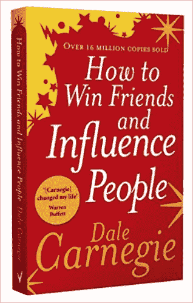

# 如何在下一次 NFT 聚会上有效地建立关系网

> 原文：<https://levelup.gitconnected.com/how-to-network-effectively-at-your-next-nft-meetup-b1ded87b915f>

## 即使你害怕得要死。

[常见网络恐惧的治疗方法](https://www.inc.com/kelly-hoey/cures-for-the-very-common-networking-fears.html)

实话实说吧。去参加你的第一次 NFT 见面会是令人畏惧的，也是相当怪异的。

作为一个成年人，你已经决定结识其他有着共同兴趣的成年人，他们都喜欢收集卡通图片。

那个尴尬的时刻，你走进酒吧，意识到你认不出任何人，因为你已经与 Twitter 头像和 Clubhouse 上的缩略图互动了 3 个月。

“嗨，是易激动的鸸鹋俱乐部的我”。听得见的酒吧员工显然很关心你的健康。

这让我对 90 年代的网络约会有了深入的了解。现在很标准，但在当时很不寻常。你在期待猫鱼克莱夫的出现。一个 50 岁的人一直住在他妈妈的地下室里。

让你惊讶的是，你遇到的那个人或一群人和你一模一样。非常典型，有灵感，有抱负，并寻求更多。

在那一刻，你的生活完全改变了，因为你意识到你已经拥有了一个不同的朋友圈。我以为改变你的友谊群会很复杂。

对话的级别会发生变化。人会变的。随着时间的推移，你的思维也是如此。

我从未如此敏锐地阅读和交流过有关 SEC 监管措施或利率和通胀如何影响股市、加密和非金融交易的战争故事。

现在我知道了。这是一场灾难。

参加会议是另一回事。你可以随波逐流。那是你的安全之地，因为你的人数是正常人的 500 倍。打扮成一只粉红色的移情大象或纸板“热狗屎大黄蜂”是他妈的阿尔法。

你排在队伍的前面，混在一起，人们和你一起乘车。

***向我的朋友们点头***

我们都在分享这个早期的经历。我只经历过一次站在我们坚信的事物的最前沿。追求成为板球运动员的激情有一个暂时的保质期。

NFTs 可能是我的第二件事。

如果 ETH 继续放弃日常工作可能是我的第三份工作。

[回去工作迷因](https://sayingimages.com/back-to-work-meme/)

老实说，我不喜欢 NFTs 的唯一一点是我的正常朋友对我收集习惯的孩子般本质的冷静的左领域评论。这对他们来说是一个玩笑，让你很快回到现实。

这就像和你的学校恋人度过一天的“高潮”后回家。你妈妈会因为你离开卧室时的样子而责备你。

对我们大多数人来说，这是一次可以理解的迫降。

人脉是我的强项。我有时在认识新朋友时会有不安全感，尤其是如果他们被认为在事业上做得很好，或者对自己了如指掌。

很正常。

我越来越不在乎，意识到在某种程度上，我们都会对某些事情感到紧张或焦虑。

这需要练习，而不是评判自己。

当你第一次见人的时候，建立关系网并不是为了得到一份工作或者为你的生意找到线索。与你无关。

疫情让我们所有人都有点神经质。当我说所有的时候，我完全代表我自己。由于封锁，有限的社会交往使我们缺乏实践。

即使你不缺乏自信，我还是会补充一些实用的小技巧，并恬不知耻地引用戴尔·卡内基的经典著作《如何赢得朋友和影响他人》。

作为一个已经读过这本书三遍的人，我强烈推荐你去读它。别担心。这里没有附属链接。

戴尔·卡内基

# 准备好。

如果你要去参加一个聚会，就要对参加聚会的人做足功课。你不需要了解他们的家谱，但是知道他们的名字，他们做什么，他们喜欢什么是你能给别人最好的赞美。

> **“一个人的名字对那个人来说是任何语言中最甜美、最重要的声音。”**
> 
> **“一般人对她自己的名字比对地球上所有其他名字的总和更感兴趣。”**

如果你对认识新朋友有点紧张，想几个开场白，你可以问他们关于他们的问题。人们喜欢谈论自己，所以请饶有兴趣地听。

# 变得有趣。感兴趣。

如果你期待与某人见面，提前想好你要对他们说什么。这将有助于保持对话流畅，不会出现尴尬的沉默。

不要只说不做，仔细听。

> 通过对别人感兴趣，你可以在两个月内交到更多的朋友，而不是在两年内让别人对你感兴趣

# **找个理由跟进。**

Veecon 创造了一个令人兴奋的动态，与会者可以使用他们的官方应用程序通过简短的二维码扫描来联系和分享联系信息。

我认为这是天才。

不管有没有这款应用，都要确保获得人们的详细信息。最大化每一次互动。请不要给他们名片或传单。

当你在接收端的时候太正式了，真他妈烦人。我是说，我拿着陌生人的名片有什么动机。

没什么。

这也不能保证他们会花时间把你的号码输入他们的手机。

在社交媒体上关注彼此，在 LinkedIn 上联系或交换号码。

别再要求什么了。

第一次约会后，你没有向你的伴侣求婚，所以如果你认为你交往的那个人有你想要的东西，就不要伤害他的感情。现在不是勾搭的时候。

找个理由跟进，让关系持续下去。如果有共同感兴趣的事情，重温你们的谈话。

> **“要想采蜜，不要踢翻蜂巢”**

# ***请关注我并订阅我的媒体页面***

*以上都不是理财建议。我不是一个合格的财务顾问，尽管我尽了最大努力，我也无法预测未来。*

*NFT 空间是有风险的。*

专家称当前 99%的项目都将走向 0。