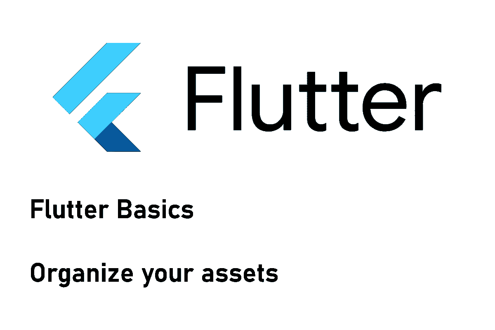

# 如何组织你的 Flutter 应用资产，风格，颜色，图片

> 原文：<https://levelup.gitconnected.com/how-to-organize-your-flutter-app-assets-styles-colors-images-f27e1aa2cacc>

## 收拾残局

## 一个成长中的应用程序包含了很多资源，可以在不同的地方使用。使用这种方法，您将知道将东西放在哪里以及如何引用它们。



在这篇文章中，我们来看看 Flutter 应用程序中的资源管理。这种情况下的资源是指，例如，将在您的应用程序中使用的样式、图像、常量、实用程序或颜色。我将向您展示如何在您的应用程序中组织它们，以便尽管代码库很大，它仍然是可管理的。这样做的好处是你没有多余的代码部分，如果你想改变什么，你只需要查看源代码中的一个地方。让我们从如何管理您的资源的一些想法开始吧！

> 📣这些例子将主要使用颜色，但这只是为了演示这些想法。您可以将它用于任何东西，比如常量、实用程序、资源等等。

## 💡想法 1:全球宣言

最基本的方法。**只需将所有内容放入一个文件**作为一个全局定义，并从任何地方访问它。这将很快变得混乱，所以考虑把它分成几个文件。此外，为了区分脚手架的背景颜色和按钮的背景颜色，描述可能会很长。在这种情况下，良好的工具是必不可少的(使用像 VS Code 这样的编辑器进行正确的代码导航)！

## 💡想法 2:每个资源类型一个类

这个想法还是很简单的。我们有一个包含所有颜色的类，一个包含所有文本样式的类，等等。所以如果你想在代码中访问一种颜色，你只需要做`AppColors.background`。命名约定总是:**资源点描述的类型**。

🔸我需要什么类型的资源？
我需要一个颜色→ `AppColors`类

🔸资源应该用来做什么？
这将是一个脚手架的背景→ `background`地产

这是简单易懂的，但是会导致在一个文件中有许多颜色定义和相似的描述。您还需要为每个资源导入一个文件，这可能会导致更长的导入列表。我只对较小的应用程序选择这种方法。

该示例利用私有类和静态引用来创建所需的关系。

## 💡想法 3:每个资源类型一个类，并进行分组

**下一个想法引入了另一个层级，但总体上与前一个想法类似**。然而，您将需要调用`AppColors.scaffold.background`来获取上一个示例中的颜色。这种方法将一个小部件级别添加到层次结构中，以便您可以按小部件对颜色进行聚类。**如果你不喜欢小部件层次结构的想法，尝试用视图、用例或状态层次结构来代替**。您仍然需要导入多个文件来访问所有资源，但是组织比以前更加结构化了。

## 💡想法 4:分组资源层次结构

最后，**我们还可以将所有资源整合到一个单一的结构中，以进一步简化访问。**这减少了必要的导入语句，并定义了一致的访问逻辑，可在应用程序的任何地方使用。现在，一个示例调用将如下所示:`Resources.colors.scaffold.background`。

## 提示:如何减少导入语句

您可以使用`export`关键字将多个导入合并成一个。请注意，如果使用不当，这可能会让一些开发人员感到困惑，因为很难看到实际代码的位置。下面是一个如何做到这一点的例子:

## 使用资源和字体

**资产(或资源)是包含在应用程序二进制文件中并在运行时加载的文件**。常见的例子是图像和 JSON 文件。资源和字体存储在自定义项目文件夹中，并在`pubspec.yaml`中引用，因此应用程序知道从哪里加载数据。`pubspec.yaml`包含了如何包含它们的例子。有关进一步的详细信息，请查看[资产](https://docs.flutter.dev/development/ui/assets-and-images)和[字体](https://docs.flutter.dev/cookbook/design/fonts)的官方文档。

在这一节中，我想展示一些方法来防止硬编码字符串出现在应用程序代码的多个位置。一个简单的输入错误可能会在运行时产生一个您可能会忽略的异常。因此，这里有两种方法来防止这种行为。

**💡为您的资产和字体创建一个类**

在前面的章节中，我提供了一些例子，您也可以在这里使用。任何东西都比在整个应用程序中使用字符串要好。如果你需要改变什么，你只有一个地方可以做。举个小例子:

```
class Assets {
	static String splashImage = "assets/splash.png";
	static String saveIcon = "assets/save.png";
}
```

为了确保您的文件存在，您可以编写一个单元测试。这里有一个小例子:

```
import 'dart:io';void main(){
    test("Verify all used images exist", () async {
        expect(await File("assets/splash.png").exists(), isTrue,
            reason: "no image for splash");
        expect(await File("assets/save.jpg").exists(), isTrue,
	    reason: "no image for save");
	});
}
```

如果这太麻烦，查看下一个技巧。😉

**💡使用 flutter_gen 包为您创建包装类**

[flutter_gen 包](https://pub.dev/packages/flutter_gen)包含一个构建运行器，它扫描你的`pubspec.yaml`的资产并自动创建包装类。您可以使用这些包装器来访问小部件中的资产。最大的好处是软件包将跳过硬盘上找不到的文件。因此，如果您的资产定义中有一个错别字，那么该资产将没有类。当您想在代码中引用它时，您会立即注意到它。

## 源代码

你可以在 [GitHub](https://github.com/xeladu/flutter_asset_management) 上找到源代码。

## 结论

有了这些提示，你应该很容易组织你的应用程序。选择这些想法中的一个或结合它们来满足您的特定需求。正确的方法总是取决于多种因素。没有适用于所有用例的通用规则。

[***用我的推荐链接加入成千上万的中会员，想看多少文章就看多少***](https://medium.com/@xeladu/membership) ！

[](https://medium.com/@xeladu/membership) [## 通过我的推荐链接加入 Medium-xela du

### 只需点击一下，就可以通过会员资格访问数千篇文章！您的会员资格只需 5 美元一张…

medium.com](https://medium.com/@xeladu/membership) 

点击 [**这里**](https://xeladu.medium.com/subscribe) 把我所有的新文章都发到你的邮箱里🔔如果你浏览[我的口香糖商店](https://xeladu.gumroad.com/)，你可能会找到你喜欢的东西([甚至是免费的](https://xeladu.gumroad.com/l/scratch)🏬


[赛拉杜](https://xeladu.medium.com/?source=post_page-----f27e1aa2cacc--------------------------------)

## 适合初学者的颤振文章

[View list](https://xeladu.medium.com/list/flutter-articles-for-beginners-a040ea777956?source=post_page-----f27e1aa2cacc--------------------------------)24 stories

[赛拉杜](https://xeladu.medium.com/?source=post_page-----f27e1aa2cacc--------------------------------)

## 软件工程师的高级颤振文章

[View list](https://xeladu.medium.com/list/advanced-flutter-articles-for-software-engineers-f074879fdef3?source=post_page-----f27e1aa2cacc--------------------------------)9 stories

# 分级编码

感谢您成为我们社区的一员！在你离开之前:

*   👏为故事鼓掌，跟着作者走👉
*   📰查看[升级编码出版物](https://levelup.gitconnected.com/?utm_source=pub&utm_medium=post)中的更多内容
*   🔔关注我们:[Twitter](https://twitter.com/gitconnected)|[LinkedIn](https://www.linkedin.com/company/gitconnected)|[时事通讯](https://newsletter.levelup.dev)

🚀👉 [**加入升级达人集体，找到一份惊艳的工作**](https://jobs.levelup.dev/talent/welcome?referral=true)