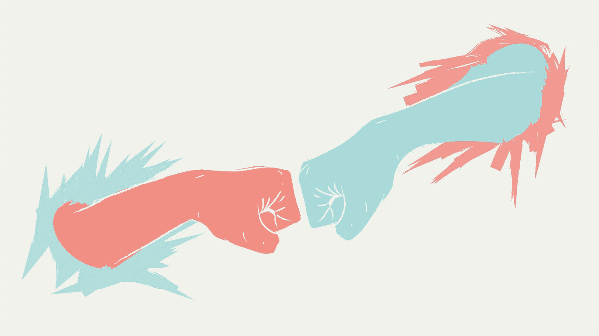
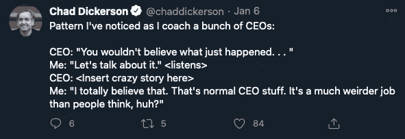

# 如何克服冒名顶替综合症，踢更多的屁股

> 原文：<https://levelup.gitconnected.com/how-to-overcome-imposter-syndrome-and-kick-more-ass-26fd52bf9012>

## 克服对自己不够的恐惧的实用步骤

**原贴于**[**mattmunson . me**](https://www.mattmunson.me/overcome-imposter-syndrome)**。订阅** [**这里**](https://www.mattmunson.me/#subscribe) **定期更新。**

# 决定性的一步

我试图隐藏我眼中涌出的泪水。这是艰难的一周、一月和一年中艰难的一天。

我们去年准备的 B 系列并没有像我们希望的那样进行。

我们生活在债务中。

我们一年多来一直稳步增长的收入突然大幅下降。当我们的域名遭到破坏，我们的电子邮件投递率降到最低点时，我们最好的获取渠道也崩溃了。

即使是现在，在那次经历多年后，我坐在加利福尼亚山区的一个小木屋里，回想起那些日子，我仍能感到肩膀紧绷，口干舌燥。

我拉着我的联合创始人托德去散步。我需要释放一些焦虑。

“我不认为我是做这件事的合适人选，”我说着泪水夺眶而出。

“去做什么？”他问。

“把这个搞清楚。领导这家公司。我觉得我一直在失败。我觉得我们要失败了，这都是我的错，”我说。

一向体贴的托德给了我一点时间。他让我的话挂在沉默中，邀请我听自己在说什么。

“有更好的人选吗？”他问。

“有空”这个词出现的方式让我在焦虑中露出微笑。

“我不知道，”我承认，“可能不会。”

如果托德作为联合创始人有一个主要的才华领域，那就是用一个简单的问题、陈述或面部表情来打破我的大脑迷雾。他在那一刻做得很对。

“我不知道现在是否还有更好的人来担任这家公司的首席执行官。我想你也不知道。我不确定这有什么关系。现在，你是首席执行官。我们需要你。”

托德后来成为了一名创始人教练，如果那天他对我的天才教练有任何暗示的话，他是一个非常好的教练。

通过这些温和而坚定的话语，托德邀请我担任首席执行官。承认但要克服“冒名顶替综合症”,在那艰难的一年里，我害怕自己只是在假装，不知道自己在做什么，这种恐惧一直困扰着我。

那天标志着我的一个转折点。这种变化不是立竿见影的；又过了一年，我才发现自己完全能够承认自己是一名优秀的 CEO。承认这一点，尽管有缺陷且容易出错，但我可能是当时我们公司最好的 CEO。

当我回顾我在上一家公司担任首席执行官的 7 年多时间时，我最大的遗憾之一是没有尽可能快地发挥我作为首席执行官的优势和能力。不是因为这能让我免于痛苦和焦虑(尽管这也有好处)，而是因为我相信，如果我让自己早点做出转变，我会成为一个更好、更现实、更有爱心、更成功的 CEO。

如果这些经历让你产生了共鸣，我会邀请你一起来探索作为一名领导者，你如何能比我更快地发挥自己的优势。我的朋友，你不必等待。

# 几乎是普遍的问题

我邀请你来体验一下教练的经历可能会有帮助。

我最喜欢辅导领导者的一点是，我可以看到幕后的情况。每个人的“外部”，他们的“最好的一步”，都在 TechCrunch 上分享。我可以看到和听到那些没人愿意谈论的经历。这是一个很好的礼物。

从一个教练的角度来看，我很幸运地观察到对足够的恐惧几乎是普遍的。

几乎所有步入这些重要角色的 A 型、有动力、创始人/领导者/成功者都想知道我们是否真的具备所需条件。几乎我们所有人都面临着一个巨大的恐惧，那就是我们可能不会。

冒名顶替综合症。

他们称之为综合症是有原因的。

如果只是偶尔发生一次，他们会称之为事故。

但事实并非如此。这是一种综合症。它几乎是普遍的。

# 创始人/首席执行官角色的特殊挑战

虽然冒名顶替综合征在各种各样的领导人、运动员、学者和高成就者中很常见，但我认为创始人/首席执行官角色中的一些元素使一个人在这些角色中拥有足够能力的挑战尤其具有挑战性。

首先，如果你是创始人兼首席执行官，你很可能从未做过这种事。从数字上看，大多数创始人/首席执行官都是第一次工作。所以是新的。

这不是你爷爷的首席执行官的角色。你不是从销售层的一名职员做起，在公司的阶梯上一步步往上爬，边走边学习业务。这个公司，这个角色，也许甚至这个市场几年前都他妈的不存在一个恐惧。

然而，我们告诉自己，我们必须完美。我们必须成为角色、经验、业务和市场的主人。

如上所述，我们花时间将自己的内心与他人的外表进行比较，这对我们没有任何好处。我们在报纸和推特上读到其他人的成就。很少有创始人和领导者会花时间在推特上谈论他们的恐惧和失败。然而，我们大多数人把大部分时间花在与恐惧和失败的搏斗上，而不是沉浸在成功的喜悦中。

因此，我们在 Twitter 和 Techcrunch 上阅读他人的成功和“啊哈”时刻，同时非常清楚我们自己与自我怀疑的角力。

创始人/首席执行官的角色实际上是定制的，以诱发骗子综合症。

我们总是试图让别人相信我们比内心感觉的更好，更自信，对未来更有信心。

无论是筹集资金、雇用高级员工，还是说服潜在的联合创始人加入我们的疯狂旅程，承认我们在凌晨 3 点醒来时充满恐惧从来都不是一个好时机。

此外，首席执行官的角色本身也在不断变化。

在我担任创始人兼首席执行官的那些年里，每当我觉得自己掌握了角色时，工作就在我脚下发生了变化。员工数量变了，公司阶段变了，竞争对手变了，资本市场变了，中国股市崩溃了。这就像试图同时在三块棋盘上下棋，对手和规则在每块棋盘上都不断变化。

我，也许和你一样，喜欢掌握一份工作的那种深深的满足感。对某件事有独特的感觉。创始人/首席执行官的角色没有这种满足感。

我确信，即使是那些我们敬仰并认为是这门手艺的大师的人，也从来不会觉得自己真正擅长这个角色。

如果你运气好，努力工作，就会有突破的时刻。有大的胜利。你活得够久了，可以在这一行干出一番事业。但是这些成功是短暂的，并不是工作中大多数日子的定义。

大多数日子都充满了挣扎。

我喜欢我的好朋友兼助理教练查德·迪克森的这条推文:

如果没有人能够掌握这个角色，那我们走来走去，感觉像是在装样子，这有什么好奇怪的呢？

# 神话

我认为，作为一名教练，骗子综合症的一个常见原因是我所谓的“神话般的完美 CEO”。

> 我不知道这家伙从哪里来，但他无处不在。

通常，在辅导电话中，客户会将他们对特定挑战的态度或感受与“伟大的 CEO”对挑战的态度或感受进行比较。

我他妈的不知道这个虚构的 CEO 是谁。

所以，我经常问。

“你把自己和谁相比？这位神秘的独角兽领袖是谁？他不为困惑或自我怀疑所动，能以神秘的洞察力看穿复杂的挑战，并能一跃跳过巨大的情绪。”

我的问题通常会被一笑置之，或者承认，是的，也许，只是也许，他们正在把自己比作一个不存在的领导人。

让我们来破除神话。

相反，让我们考虑数据。

[数据](https://hbr.org/2016/03/founder-led-companies-outperform-the-rest-heres-why)告诉我们，创始人领导的公司比非创始人领导的公司更容易成功，创造更多的股东价值。

鉴于创始人往往不如雇佣的 CEO 有经验，这是为什么呢？

当 Twitter 在增长和创新方面步履蹒跚时，它为什么要把杰克·多西带回来？毫无疑问，迪克·科斯特罗有能力成为一名“更好”、“更专业”、“更有经验”的首席执行官。

是什么原因让苹果在当时世界上最著名的约翰·斯卡利无法激励苹果通过创新走出眼前的挑战后，重新拉拢史蒂夫·乔布斯呢？

在你自己的领导角色中，会不会有一些需要的东西，比如多尔西和乔布斯，是你最适合给予的？

如果你想象一下，就一会儿，也许你是这个世界上最适合做手头工作的人，你会看到什么？

如果没有做好**该怎么办**？

我并不是说每个 CEO 都是他们当前职位的合适人选。但是，如果创始人/首席执行官能带来更好的结果，如果 90%以上的创始人/首席执行官都背负着“冒名顶替综合症”的重担，那么就会有一大批人恰恰是这份工作的最佳人选，但却怀疑自己的能力。

我的朋友们，这听起来在情感上、心理上和经济上都很昂贵。

# 利害攸关的是什么？

那么，不完全“坐上自己的位子”(我以前的教练杰里·科隆纳曾这样称呼它)做首席执行官，不完全发挥自己的优势、专注于手头的工作，代价是什么？

对我来说，作为一名首席执行官，坚持认为有更好的人在那里，我只是在假装我的角色，这阻止了我完全进入手边的学习。

我不能完全相信我的直觉或判断，因为我认为自己是一个有缺陷的工具。

就像试图用有缺陷的仪器来衡量任何实验的结果一样，我发现很难相信手头的结果，也很难做出必要的快速决策来帮助公司内化学习、调整和前进。

冒名顶替综合症也让我无法拥有和利用自己的优势。

我就像 Neo 在黑客帝国里被揍了一顿。

我有超能力和独特的能力，但我不相信他们，因为我没有充分行使和测试他们。

我们都有这样或那样的超能力。但是，如果我们把所有的时间都花在盯着自己的缺点上，试图希望它们消失，我们就无法了解它们。

吃红色药丸

我没有依靠自己的直觉，而是浪费了大量的时间试图“了解”一个更好的 CEO 会如何处理手头的问题。

我不停地阅读和开会。

现在，我完全赞成阅读、学习和寻求外界有益的专业知识。这很关键。一个伟大的创立者或领导者首先应该是手边许多手艺的伟大学生。毫无疑问。但我做得太过分了。我没有意识到我和我的团队对我们面临的挑战有独特的了解，也没有独特的能力来应对这些挑战，而是发现自己总是向组织外部寻求帮助。

那浪费了很多时间。创业公司不能浪费时间。

# 我要放弃什么才能拥有我想要的？

如果完全担任首席执行官会有这么多好处，我们为什么犹豫不决？

作为人类，我们倾向于重复模式或坚持以某种方式为我们服务的信念。如果我们想要的是改变，那么首先承认，甚至尊重旧的模式或信念对我们的帮助是有帮助的。

对我来说，当我回顾我试图通过抓住我的冒名顶替综合症来保护的东西时，我看到我拒绝相信我是这份工作的合适人选减轻了我对失败的恐惧。

如果我不是这份工作的合适人选，即使我失败了也没什么关系。至少我认为我的潜意识是这样认为的。我害怕失败。

在成长的过程中，我感到在我的家庭和小学里格格不入。好成绩，后来演变成完美主义，成了我获得积极关注和归属感的一种方式。

失败或平庸的风险威胁着我在这个世界上的归属感。

经营一家初创公司，同时相信自己的归属与“完美”紧密相连，这是一个艰难的过程。

大多数创业公司都会失败。那些成功的人一路上经历了成千上万次的失败。

我的冒名顶替综合症使我能够承担一项任务，开一家公司，这有很大的失败机会。这让我每天都能走进办公室。

然而，最终，不接替我的 CEO 职位的代价变得太高了。

我在自己的生活中观察到的，以及我在许多辅导客户的生活中见证的是，当我们直面这样一种意识，即不改变的代价超过了我们对放弃旧生活方式的恐惧时，持续的改变是最容易实现的。

这是对我们每个人的邀请。

# 等待的邀请

这个世界现在比以往任何时候都更需要自信、听从领导的现任领导人。

你的团队可能也是如此。

如果你的经历和我一样，你是唯一一个阻碍你成为你的团队和这个世界所需要的领导者的人。

那么我们如何从这里到那里呢？

再说战术。

# 担任首席执行官(或领导者)的策略

## 策略 1:尊重和传播恐惧

我发现在我的生活中，我的恐惧往往在我将它们公之于众、命名它们或检查它们之前就已经对我产生了最大的影响。

这是我内心深处隐约的焦虑，或者是我感觉到但没有讨论到的对一些新闻或事件的极端情绪反应，感觉最虚弱。

我喜欢西藏传统中关于瑜伽士密勒日巴的故事。我既不是佛教徒，也不是藏族人，但这个例子很有力。

> 一天，密勒日巴离开他的洞穴去拾柴火，当他回来时，他发现他的洞穴已经被恶魔占领了。到处都是恶魔！他看到他们的第一个想法是，“我必须摆脱他们！”他冲向他们，追赶他们，试图强行把他们赶出洞穴。但是恶魔们完全不为所动。事实上，他越是追逐他们，他们似乎就越是舒适和安定。意识到他赶走他们的努力已经悲惨地失败了，密勒日巴选择了一种新的方法，并决定向他们传授佛法。如果把他们赶出去不起作用，那么也许听到教导会改变他们的想法，让他们去。所以他坐在座位上，开始讲授存在与不存在，同情与善良，无常的本质。过了一会儿，他环顾四周，意识到所有的恶魔还在那里。他们只是用凸出的大眼睛盯着他；没有一个人离开。
> 
> *此时，密勒日巴深深地呼出一口气，表示投降，他现在知道这些恶魔不会被操纵离开，也许他可以从他们身上学到一些东西。他深深地看着每一个恶魔的眼睛，鞠躬道:“看来我们要一起在这里了。无论你教我什么，我都会敞开心扉。”在那一刻，所有的恶魔都消失了，只有一个除外。一个巨大的，特别凶猛的恶魔，张开的鼻孔和滴下的尖牙，还在那里。所以密勒日巴让我们走得更远。走向最大的恶魔，他完全奉献自己，毫无保留。“如果你愿意，就吃了我吧。”他把头伸进恶魔的嘴里，就在这时，最大的恶魔深深鞠躬，消失在太空中。*

今天早上，我和一位勇敢的首席执行官呆在一起，他正在为他认为可能是艰难的 B 轮融资做准备。在电话的最初时刻，我可以看出他对这一轮比赛有相当多的焦虑和恐惧。

当我们解开他的恐惧时，我看着他把头放进了恶魔的嘴里。

“这里的恐惧是什么？”我问。

“如果我让大家失望了怎么办。如果这一轮我们筹不到钱怎么办？”他问。

我让这个问题悬在我们之间。

“然后呢，”我问。

“嗯。我们将不得不从我们的内部投资者那里筹集一轮规模较小的融资，并等到明年再进行 B 轮融资，”他反思道。

“说这话是什么感觉？”

“感觉很好。”我可以看到他的肩膀放松，他的笑容回来了。“感觉我们有选择。”

有时简单地向教练、治疗师、共同创始人或朋友描述恐惧会有很大的帮助。就像我和托德散步时一样。

写日记是另一个很好的发泄方式。

我以前写过关于“压力板”的文章，这是我早晨例行公事的一部分。我喜欢在早上花一点时间来记录我内心的恐惧和焦虑。它帮助我确保我注意到并邀请我所携带的任何东西。(你可以在这里了解更多关于今天早上的练习[。)](https://www.mattmunson.me/morning-routine/)

如果你带着不知名的恐惧，你会如何邀请他们公开？你把自己的头伸进恶魔的嘴里会是什么？

## 策略 2:举办一个点火仪式(没错，就是一个仪式)

在我们历史的大部分时间里，人类利用仪式来帮助从一种存在状态过渡到另一种存在状态。在我们的现代生活中，至少在西方，我们经常忘记仪式的力量。

我最初是从我自己的长期教练兼朋友吉姆·马斯登那里了解到点火仪式的。在研究了当地文化的实践以及这些实践的好处之后，Jim 经常参加点火仪式。通过他的模式，他们已经成为我自己生活中最喜欢的实践。

机制很简单:

1.  生火(可以是垃圾桶里的小火，也可以是简单的一根火柴)。
2.  准备一些你想放下的东西(可以是实际的物品，象征物品的东西，或者一张写有物品的纸)。
3.  欢迎你喜欢的火。我喜欢感谢它在我的生活中所扮演的温暖的角色。
4.  分享几句即将结束的事情。你可以分享这件事如何对你有帮助，然后分享你如何知道现在是这件事结束的时候了。
5.  当你准备好了，就把它放到火里。

一些澄清性的评论可能会有所帮助。一个是释放任何你实际上不准备释放的东西到火中是没有帮助的。只把你真正准备释放的东西带进火里。火将象征性地和物理性地帮助移除，但是是你必须释放你所放弃的一切。

你可以独自做到这一点，这可能是美妙的。然而，如果你有一个值得信任的朋友或盟友，一个邀请每个在场的人带着她已经准备好放下的东西到火上的火仪式会是一个强大的共享体验。

## 策略 3:以朋友而非敌人的身份拥抱超级英雄 CEO

我们可能采用的第三种策略是利用我上面提到的“超级英雄 CEO”作为盟友。

考虑一下手头的挑战或任务。问问你自己，“她会怎么做。”给自己一些空间来写日志，或者简单地思考一下接下来会发生什么。也许你能够很快看出，你想象中摆脱了困境的某个人会如何应对眼前的挑战。

我喜欢在辅导课程中利用这个工具。我一直感到惊讶的是，客户往往能够如此迅速地从完全不知道如何处理一种情况，转变为片刻之后就能如此清晰地看到一位“伟大”的首席执行官将如何行事。

当我问“是什么阻碍了你以你想象的伟大 CEO 的方式应对挑战”时，答案通常是“没有”这是一个很大的转变。

这里到底发生了什么？

对我来说，我能看到发生的事情是，我允许自己放下恐惧，简单地步入并活出我的信念。我想象中的“超级英雄”实际上是我自己的力量和思想的投影，反映出我没有被自我怀疑所混淆。卡尔·荣格可能会称之为挖掘我们以前放弃的力量(关于这一点的更多信息，请查看我与 Doist 创始人阿米尔·萨利哈芬迪克的讨论)。

# 祝你一路顺风

我希望当你在自己的生活中使用这些策略时，其中的一些策略会对你有所帮助。

我知道这里没有快速解决的方法，但是邀请你去发现和拥抱你自己的优势。这个座位是你的。

你的团队，以及你周围的世界，已经准备好让你在一个充满活力、完全可用、完全属于你的地方生活和领导。

欢迎来到你作为领导者的旅程中最重要的转折点之一。

把爱和祝福从我的小木屋送到你所在的任何地方。

马特