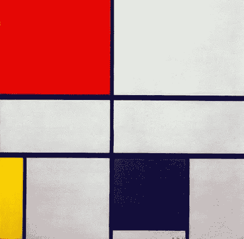
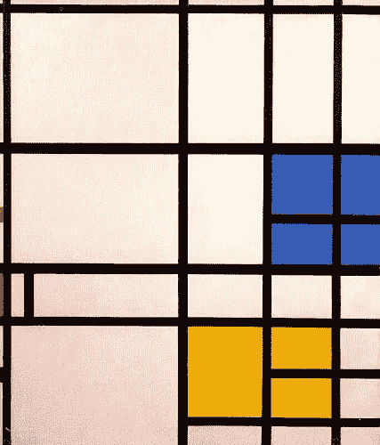
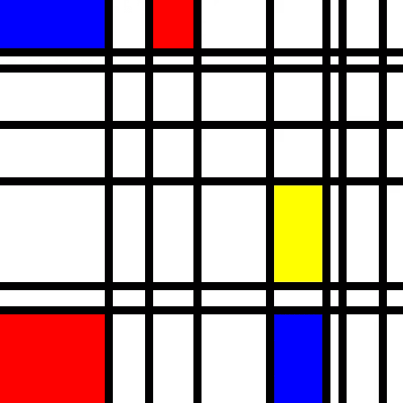
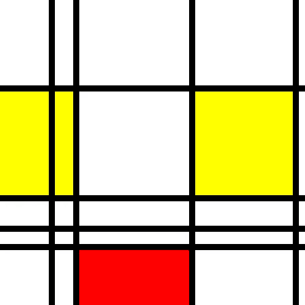

# 如何用 Python 画出皮耶·蒙德里安的样子

> 原文：<https://levelup.gitconnected.com/how-to-paint-like-piet-mondrian-with-python-fb74d7b5ae2e>

像艺术家一样编程。



彼得·蒙德里安于 1935 年创作的《C 号作品》

皮特·蒙德里安是 20 世纪最有影响力的艺术家之一。这位荷兰画家以其引人注目的抽象艺术而闻名，是“风格派”运动的创始人，这是一种崇尚经济和象征主义的风格。

德·斯蒂格尔和蒙德里安通过德国包豪斯获得了国际认可，这是一所以其设计原则而闻名的艺术学校。

像*百老汇布吉伍吉*和*构图 C* 这样的画是蒙德里安风格的典型例子。他经常使用最小的调色板，并依赖于网格的概念。



彼得·蒙德里安创作于 1940 年至 1942 年的伦敦

蒙德里安是一位专心致志的艺术家。他会在工作室里花上几个小时一丝不苟地画画，直到他的手指起了水泡，或者累得生病。

有了 Python 和一点数学知识，我们可以生成自己的几何抽象艺术。

通过观察蒙德里安作品中的一些规则，我们可以创造出无限多的绘画作品。不需要水泡！



计算机生成的皮耶·蒙德里安。2021

# 用 Python 绘制图形

为了用 Python 绘画，我们需要安装一个图形库。在这个演示中，我们将使用 PyCairo。

PyCairo 是一个免费的图形库，您可以使用 Python 代码来绘制图形。希望您的计算机上已经安装了 Python 3。

从命令行安装 PyCairo 最简单，如下所示:

```
pip install pycairo
```

一旦安装了这个库，我们就可以在我们的 Python 程序中使用它。

# 绘画的规则

在我们写任何代码之前，我们需要为我们的绘画程序定义一些规则。我们需要把皮耶·蒙德里安的画分解成基本规则。

首先，蒙德里安只使用像红色、黄色和蓝色这样的原色。这些集中在正方形和长方形。

连接这些形状的是黑色直线。这些线条从矩形的边缘延伸出来，形成了它们的边框。

背景画布总是白色的。

有了这些规则，我们可以开始想象生成皮耶·蒙德里安画作的算法:

1.  从白色画布开始。
2.  绘制从画布边缘延伸的随机线条。
3.  用随机的原色填充一些线条创建的白色矩形。

现在我们已经有了具体的想法，可以开始写代码了。

# 生成艺术

先从导入 PyCario 开始，画一张白色画布。使用 *import* 关键字导入 Python 中的库。我们总是在文件的顶部导入库。

我们还需要导入随机库。这是 Python 的标准配置，所以不需要像我们在 PyCairo 中那样安装它。

让我们先画一块 500 像素宽、500 像素高的白色画布。

```
import random
import cairoIMAGE_WIDTH = 500
IMAGE_HEIGHT = 500surface = cairo.ImageSurface(cairo.FORMAT_RGB24, IMAGE_WIDTH, IMAGE_HEIGHT)ctx = cairo.Context(surface)
ctx.rectangle(0,0,IMAGE_WIDTH,IMAGE_HEIGHT)
ctx.set_source_rgb(1,1,1)
ctx.fill()surface.write_to_png('painting.png')
```

皮耶·蒙德里安依赖于网格的概念，我们也一样。通过在网格上构建我们的绘画，我们可以确保一切都像蒙德里安的作品一样排列整齐。

我们如何在 Python 中做到这一点？嗯，我们可以试着用 PyCario 在画布上画一些随机的线条和矩形，但是那不会给我们想要的结果。

为了得到类似蒙德里安绘画的东西，我们将使用瓷砖网格。每个图块将是网格中的一个单元。

通过改变这些瓷砖的颜色，我们可以画出线条和矩形。

## 创建切片

我们的图块信息将存储在字典中。我们将使用 x 和 y 坐标作为每个图块的颜色信息的关键字。

```
# mondrian.pyimport cairo
import random# the size of the image
IMAGE_WIDTH = 500
IMAGE_HEIGHT = 500# the size of the tile grid
MAP_WIDTH = 50
MAP_HEIGHT = 50# the size of each tile
TILE_SIZE = 10MAX_LINES = 15
MIN_LINES = 6
MAX_RECTS = 5
MIN_RECTS = 1tiles = {}#colors (0,white),(1,black),(2,red),(3,yellow)(4,blue)
def generate_tiles():
    # build tile map
    for x in range(MAP_WIDTH):
        for y in range(MAP_HEIGHT):
            # set every tile to white
            tiles[x,y] = 0
    draw_lines()
```

## 绘制地图

我们的每个瓷砖将是一个 10x10 像素宽的正方形。颜色信息将是一个整数。一旦完成生成，我们将需要一个函数来将瓷砖绘制到画布上。

```
def draw_map():
    # draw tile map using pycairo
    surface = cairo.ImageSurface(cairo.FORMAT_RGB24, IMAGE_WIDTH, IMAGE_HEIGHT)
    ctx = cairo.Context(surface)
    for x in range(MAP_WIDTH):
        for y in range(MAP_HEIGHT):
            size = TILE_SIZE
            ctx.rectangle(x*size,y*size,x+size,y+size)
            if tiles[x,y] == 0:
                ctx.set_source_rgb(1,1,1)
            elif tiles[x,y] == 1:
                ctx.set_source_rgb(0,0,0)
            elif tiles[x,y] == 2:
                ctx.set_source_rgb(1,0,0)
            elif tiles[x,y] == 3:
                ctx.set_source_rgb(1,1,0)
            else:
                ctx.set_source_rgb(0,0,1) ctx.fill() surface.write_to_png('mondrian.png')
```

## 画线

我们需要水平线和垂直线来达到我们想要的效果。我们可以通过沿着网格边缘随机选择像素来做到这一点。

如果我们想要一条水平线，我们需要沿着 x 轴填充网格。对于垂直方向，我们需要 y 轴。

```
def draw_lines():
    total_lines = random.randint(MIN_LINES,MAX_LINES)
    print(total_lines)
    for h in range(int(total_lines/2)):
        y = random.randint(0,MAP_HEIGHT)
        for x in range(MAP_WIDTH):
            tiles[x,y] = 1
    for v in range(int(total_lines/2)):
        x = random.randint(0,MAP_WIDTH)
        for y in range(MAP_HEIGHT):
            tiles[x,y] = 1
    fill_rects()
```

## 填充矩形

填充矩形是本教程中最复杂的部分。我们将分两部分处理它。

首先，我们将处理我们的 **fill_rect()** 方法。该方法将在地图中搜索白色像素。如果它找到一个，它会用一个随机的原色填充它。

```
def fill_rects():
    total_rects = random.randint(MIN_RECTS,MAX_RECTS)
    max_iters = 5
    for i in range(max_iters):
        for r in range(total_rects):
            x = random.randint(0,MAP_WIDTH-1)
            y = random.randint(0,MAP_HEIGHT-1)
            if tiles[x,y] == 0:
                color = random.randint(2,4)
                flood_recursion(x,y,0,color)
```

# 使用整体填充

整体填充算法的工作原理类似于任何绘画应用中的“桶”工具。在我们的例子中，它将使用颜色填充由 **draw_lines()** 方法创建的一些白色方块。

泛洪递归将从起始像素开始扩散，并将遇到的任何白色像素更改为新的颜色。

flood fill 方法是递归的，这意味着它在从一个图块移动到另一个图块时会调用自身。这允许它检查它遇到的每个瓦片的每个邻居。当洪水填充进入地图的边界或黑色瓷砖时，它会停止。

```
def flood_recursion(x,y,start_color,update_color):
    width = MAP_WIDTH
    height = MAP_HEIGHT
    if tiles[x,y] != start_color:
        return
    elif tiles[x,y] == update_color:
        return
    else:
        tiles[x,y] = update_color
        neighbors = [(x-1,y),(x+1,y),(x-1,y-1),(x+1,y+1),(x-1,y+1),(x+1,y-1),(x,y-1),(x,y+1)]
        for n in neighbors:
            if 0 <= n[0] <= width-1 and 0 <= n[1] <= height-1:
                flood_recursion(n[0],n[1],start_color,update_color)
```

随着洪水填充的完成，我们有了生成蒙德里安风格绘画所需的一切。

你会在下面找到程序的最终版本。

# 摘要

我已经加入了一些变量，我们可以利用它们来改变结果。通过改变程序允许的线条和矩形的数量，我们可以很容易地改变最终的结果。

希望你已经喜欢上了关于 Piet Mondrian 的这一课，并在这个过程中学到了一些关于 Python 的知识。



通过改变变量，我们可以改变结果。

# 代码

```
# mondrian.pyimport cairo
import random# the size of the image
IMAGE_WIDTH = 500
IMAGE_HEIGHT = 500# the size of the tile grid
MAP_WIDTH = 50
MAP_HEIGHT = 50# the size of each tile
TILE_SIZE = 10MAX_LINES = 15
MIN_LINES = 6
MAX_RECTS = 5
MIN_RECTS = 1tiles = {}
#colors (0,white),(1,black),(2,red),(3,yellow)(4,blue)
def generate_tiles():
    # build tile map
    for x in range(MAP_WIDTH):
        for y in range(MAP_HEIGHT):
            # set every tile to white
            tiles[x,y] = 0
    draw_lines()
def draw_lines():
    total_lines = random.randint(MIN_LINES,MAX_LINES)
    # print(total_lines)
    for h in range(int(total_lines/2)):
        y = random.randint(0,MAP_HEIGHT)
        for x in range(MAP_WIDTH):
            tiles[x,y] = 1
    for v in range(int(total_lines/2)):
        x = random.randint(0,MAP_WIDTH)
        for y in range(MAP_HEIGHT):
            tiles[x,y] = 1
    fill_rects()
def fill_rects():
    total_rects = random.randint(MIN_RECTS,MAX_RECTS)
    max_iters = 5
    for i in range(max_iters):
        for r in range(total_rects):
            x = random.randint(0,MAP_WIDTH-1)
            y = random.randint(0,MAP_HEIGHT-1)
            if tiles[x,y] == 0:
                color = random.randint(2,4)
                flood_recursion(x,y,0,color)
def flood_recursion(x,y,start_color,update_color):
    width = MAP_WIDTH
    height = MAP_HEIGHT
    if tiles[x,y] != start_color:
        return
    elif tiles[x,y] == update_color:
        return
    else:
        tiles[x,y] = update_color
        neighbors = [(x-1,y),(x+1,y),(x-1,y-1),(x+1,y+1),(x-1,y+1),(x+1,y-1),(x,y-1),(x,y+1)]
        for n in neighbors:
            if 0 <= n[0] <= width-1 and 0 <= n[1] <= height-1:
                flood_recursion(n[0],n[1],start_color,update_color)
def draw_map():
    # draw tile map using pycairo
    surface = cairo.ImageSurface(cairo.FORMAT_RGB24, IMAGE_WIDTH, IMAGE_HEIGHT)
    ctx = cairo.Context(surface)
    for x in range(MAP_WIDTH):
        for y in range(MAP_HEIGHT):
            size = TILE_SIZE
            ctx.rectangle(x*size,y*size,x+size,y+size)
            if tiles[x,y] == 0:
                ctx.set_source_rgb(1,1,1)
            elif tiles[x,y] == 1:
                ctx.set_source_rgb(0,0,0)
            elif tiles[x,y] == 2:
                ctx.set_source_rgb(1,0,0)
            elif tiles[x,y] == 3:
                ctx.set_source_rgb(1,1,0)
            else:
                ctx.set_source_rgb(0,0,1) ctx.fill() surface.write_to_png('mondrian.png')
generate_tiles()
draw_map()
```

如果你喜欢我的作品，并愿意支持我和媒体上的其他作家，使用[这个链接](https://harold-j-petty.medium.com/membership)成为会员。你的会员费直接支持我和你看的其他作家。你也可以在媒体上看到所有的故事。