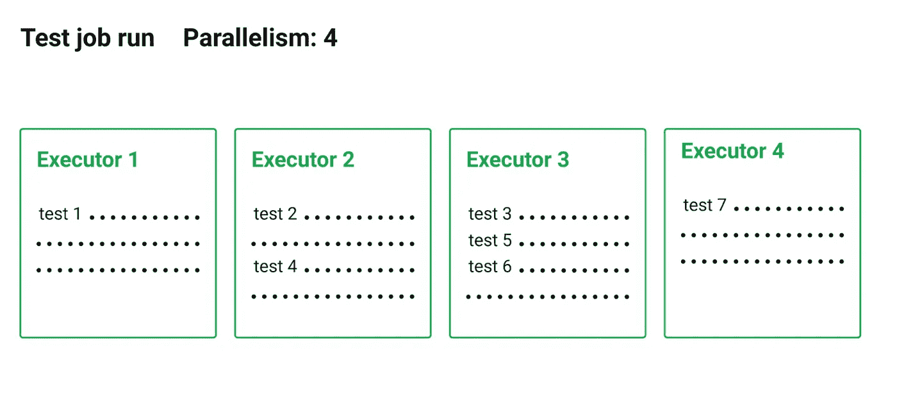

# 如何使用 CircleCI 轻松并行化您的 Python 测试

> 原文：<https://levelup.gitconnected.com/how-to-parallelize-your-python-tests-easily-with-circleci-473bd79eba98>

## 不要让考试拖你的后腿！

# 连续累计

持续集成(CI)是软件社区中非常广泛的实践，尤其是在多个开发人员在同一个代码库中工作的公司中。CI 允许开发人员频繁地将代码变更合并到一个存储库中，在那里运行构建和测试。CircleCI 等自动化工具用于断言新代码的正确性，并在集成前确保高质量的代码。

使用大型代码库或机器学习模型的公司通常会发现他们的测试需要很长时间才能运行。作为一个标准过程，对于每个 Pull 请求，整个测试套件被配置为针对每个新的提交运行。长时间的测试构建会减慢特性的部署，引发超时错误，甚至会影响团队士气(因为没有人愿意等待 40 分钟的测试通过来合并一个小的输入错误)。


另一个 40 分钟的测试版本！——图片由[蒂姆·高](https://unsplash.com/@punttim?utm_source=unsplash&utm_medium=referral&utm_content=creditCopyText)在 [Unsplash](/s/photos/developer?utm_source=unsplash&utm_medium=referral&utm_content=creditCopyText) 上拍摄

幸运的是，集群并行化拯救了数百万开发人员的生命！

项目中的测试越多，在单台机器上完成测试所需的时间就越长。为了减少运行时间，我们可以通过将测试分布在多个独立的集群中来并行运行测试。CircleCI 提供了一个支持该功能的内置解决方案(【https://circleci.com/docs/2.0/parallelism-faster-jobs/】T4)。



平行分割—来自 [CircleCI](https://circleci.com/docs/2.0/parallelism-faster-jobs/) 的图像

但是，为了使其正常工作，在实施过程中需要考虑一些注意事项…

# 使用 CircleCI 可以轻松实现并行化

CircleCI 提供了三种并行化测试的方法:

1.  使用文件名:将按字母顺序分割测试。
2.  使用文件大小:将根据文件的大小分割测试。
3.  使用计时数据:将基于先前测试计算的运行时间来分割测试。

可以想象，减少时间的最佳方式是第三种选择，因为文件大小和文件名都没有考虑测试运行时。实施时间分割将是最终目标，所以…让我们开始吧！

您的典型配置文件可能如下所示:

首先，我们将使用`parallelism`键指定不同集群的数量。它设置将创建多少个独立的执行者来运行作业的步骤，并且在作业级别实现。

接下来，一旦我们选择了机器的数量，我们需要告诉 CircleCI 我们想要拆分哪些测试以及如何拆分。CircleCI 提供了`circleci tests glob`和`circleci tests split`命令分别用于选择和分割。

对于四台机器的并行化，如果我们按照 CircleCI 的说明更新配置文件，它将如下所示:

# 但没那么容易！

只有这些修改，构建将无法正常工作。

CircleCI 要求我们存储以前构建的运行时。我们必须添加一个额外的步骤`store_test_results`，让 CircleCI 在指定的目录中保存计时数据。计时数据由一个文件组成，该文件说明了测试文件名(或者类名)以及对于特定的构建完成每个测试需要多长时间。

也就是说，对我来说，做出这样的改变还不足以创建一个正确的并行化版本。为了开始探索发生了什么，我在配置文件中添加了`store_test_artifacts`步骤。这让我可以下载和查看保存的测试文件。我保存的测试文件不是 CircleCI 期望读取和正确分割的格式。

根据与 CircleCI 支持团队的一些对话，以及我自己的调查，我对配置文件做了以下补充:

*   创建了一个文件`.circleci/resources/pytest_build_config.ini`来改变默认的测试框架:

```
[pytest]junit_family=xunit1
```

*   添加了一个命令，在测试时将上面的文件复制为`pytest.ini`:`cp -f .circleci/resources/pytest_build_config.ini pytest.ini`。
*   添加了`shopt -s globstar`命令，使[能够从子文件夹](https://support.circleci.com/hc/en-us/articles/360007178074-Why-isn-t-my-glob-pattern-recursing-all-folders-)中获取所有测试路径。
*   将我的测试文件保存在一个文件夹中，将`-junitxml=test-results/junit.xml`选项添加到`pytest`命令中。

所以我的最终配置文件看起来像这样:

在做了所有这些改变之后，我终于让并行化为我的 Python 测试工作了。

# 结论

CircleCI 提供了一种简单而强大的方法来将测试分散到几台机器上。然而，写一个配置文件并不总是那么简单。上面的例子包含一个工作配置文件，供您开始并行化 Python 测试套件。

在这个高度竞争的时代，测试并行化减少了工程师和开发人员等待的时间，加快了新特性的发布，从而提供了竞争优势。

不要让考试拖了你的后腿！

感谢阅读。