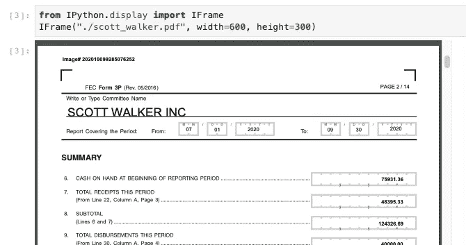

# 如何使用谷歌云文档 AI 解析表单

> 原文：<https://levelup.gitconnected.com/how-to-parse-forms-using-google-cloud-document-ai-68ad47e1c0ed>

## 从纸质表单中提取结构化数据的分步指南

许多业务流程，尤其是涉及与客户和合作伙伴交互的业务流程，都涉及到纸质表单。作为消费者，我们习惯于填写表格来申请保险、进行保险索赔、指定医疗保健偏好、申请就业、扣缴税款等。这些交易的另一方的企业得到一个表单，他们需要解析该表单，从中提取特定的数据片段，并使用该表单填充数据库。

## 输入表单

Google Cloud Document AI 自带表单解析功能。让我们用它来解析一个活动披露表单。这些是美国每场政治竞选都需要向联邦选举委员会提交的表格。这种形式的一个例子:



## 上传到云存储

需要将表单加载到云存储中，以便文档 AI 能够访问它。完整的代码可以在 GitHub 的这个笔记本上找到。

```
gsutil cp scott_walker.pdf \
          gs://{BUCKET}/formparsing/scott_walker.pdf
```

## 创建请求

要调用文档 AI，我们需要创建一个请求 JSON 结构，如下所示:

```
{
   "inputConfig":{
      "gcsSource":{
         "uri":"${PDF}"
      },
      "mimeType":"application/pdf"
   },
   "documentType":"general",
   "formExtractionParams":{
      "enabled":true
   }
}
```

然后，我们将它发送给服务:

```
curl -X POST \
  -H "Authorization: Bearer "$(gcloud auth application-default print-access-token) \
  -H "Content-Type: application/json; charset=utf-8" \
  -d [@request](http://twitter.com/request).json \
  [https://${REGION}-documentai.googleapis.com/v1beta2/projects/${PROJECT}/locations/us/documents:process](https://${REGION}-documentai.googleapis.com/v1beta2/projects/${PROJECT}/locations/us/documents:process)
```

## 解析响应

响应是一个 JSON 文档，我们可以解析它以提取我们想要的数据。响应有一个包含所有提取文本的文本字段。您可以通过以下方式获得:

```
allText = response['text']
```

例如，该文本包含“库存现金”字样，因为它出现在以下形式中:


比方说，我们想找到该活动目前手头的实际金额($75，931.36)。该信息可在表格的第二页找到。因此，我们可以查找 page=1(从 page=0 开始)并查看文本块或提取表单字段。

文本块更低级；表单字段是一个更高层次的抽象。让我们两个都看看。

## 方法 1:从文本块

例如，如何在 page=1 上获得 block=5:

```
response['pages'][1]['blocks'][5]
```

该块本身是一个 JSON 结构:

```
{'layout': {'textAnchor': {'textSegments': [{'startIndex': '1716',
     'endIndex': '1827'}]},
  'confidence': 1,
  'boundingPoly': {'normalizedVertices': [{'x': 0.068627454, 'y': 0.24873738},
    {'x': 0.6764706, 'y': 0.24873738},
    {'x': 0.6764706, 'y': 0.25757575},
    {'x': 0.068627454, 'y': 0.25757575}]},
  'orientation': 'PAGE_UP'}}
```

我们可以依次解析它以获得 textSegment 的开始和结束索引:

```
startIndex = int(response['pages'][1]['blocks'][5]['layout']['textAnchor']['textSegments'][0]['startIndex'])
endIndex = int(response['pages'][1]['blocks'][5]['layout']['textAnchor']['textSegments'][0]['endIndex'])
```

在全文中使用开始和结束索引:

```
allText[startIndex:endIndex]
```

给了我们:

```
'6\. CASH ON HAND AT BEGINNING OF REPORTING PERIOD .............................................................\n'
```

嗯，那是 block=5。什么是 block=6？


是的，75931.36 美元。

## 方法 2:表单域

文档 AI 理解这种形式由名称-值对组成。因此，我们可以在这个层次上解析 JSON 响应。让我们先写一个助手函数:

```
def extractText(allText, elem):
    startIndex = int(elem['textAnchor']['textSegments'][0]['startIndex'])
    endIndex = int(elem['textAnchor']['textSegments'][0]['endIndex'])
    return allText[startIndex:endIndex].strip()
```

要获得第二页上的第三个表单字段，我们需要:

```
response['pages'][1]['formFields'][2]
```

这为我们提供了以下结构:

```
{'fieldName': {'textAnchor': {'textSegments': [{'startIndex': '1719',
     'endIndex': '1765'}]},
  'confidence': 0.9962783,
  'boundingPoly': {'normalizedVertices': [{'x': 0.0922335, 'y': 0.24873738},
    {'x': 0.4584429, 'y': 0.24873738},
    {'x': 0.4584429, 'y': 0.2587827},
    {'x': 0.0922335, 'y': 0.2587827}]},
  'orientation': 'PAGE_UP'},
 'fieldValue': {'textAnchor': {'textSegments': [{'startIndex': '1716',
     'endIndex': '1842'}]},
  'confidence': 0.9962783,
  'boundingPoly': {'normalizedVertices': [{'x': 0.068627454, 'y': 0.24873738},
    {'x': 0.90849674, 'y': 0.24873738},
    {'x': 0.90849674, 'y': 0.26767677},
    {'x': 0.068627454, 'y': 0.26767677}]},
  'orientation': 'PAGE_UP'}}
```

因此，我们可以使用以下方法提取字段名和字段值:

```
fieldName = extractText(allText, response['pages'][1]['formFields'][2]['fieldName'])
fieldValue = extractText(allText, response['pages'][1]['formFields'][2]['fieldValue'])
```

尽情享受吧！

## 后续步骤:

1.  试试看:[https://github . com/Google cloud platform/training-data-analyst/blob/master/blogs/form _ parser/form parsing . ipynb](https://github.com/GoogleCloudPlatform/training-data-analyst/blob/master/blogs/form_parser/formparsing.ipynb)
2.  阅读文件:[https://cloud.google.com/document-ai/docs/process-forms](https://cloud.google.com/document-ai/docs/process-forms)
3.  阅读关于返回结构的参考:[https://cloud . Google . com/document-ai/docs/reference/RPC/Google . cloud . documentai . v1 beta](https://cloud.google.com/document-ai/docs/reference/rpc/google.cloud.documentai.v1beta2#formfield)2