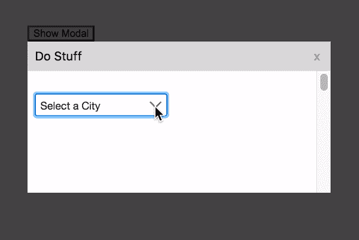
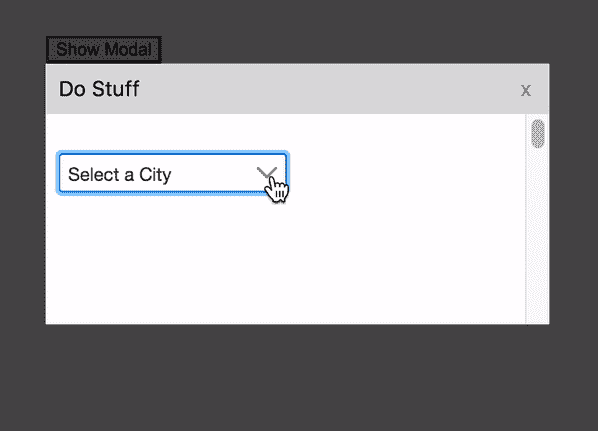
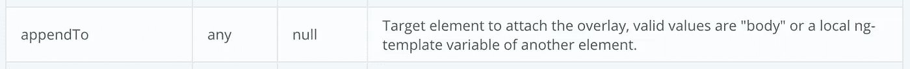
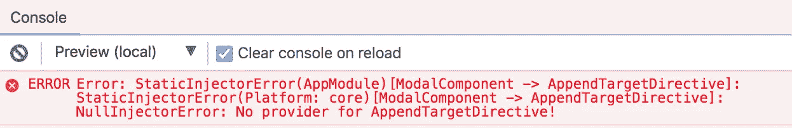

# 如何在 Angular 中通过组件树向下传递元素引用

> 原文：<https://levelup.gitconnected.com/how-to-pass-an-element-reference-down-through-a-component-tree-in-angular-86b495a2ce57>

## 使用指令和依赖注入来避免不必要的组件输入


照片由[安妮特·沙夫](https://www.shutterstock.com/g/graphicphoto)在[快门架](https://www.shutterstock.com/image-photo/dog-looking-down-hole-ground-sun-180754802)上拍摄

我最近有一个需求，要确保一个带有滚动内容的模态中的 [PrimeNG](https://www.primefaces.org/primeng/) Dropdown panel 不被约束在模态中，而是可以被看到，并且不需要滚动就可以交互。

这就是我所说的…

# 场景

这是默认的，也是我们*不*想要的(或者说，是我们*不*交付的):



约束在模式内的下拉面板

这是我们想要的:



下拉面板在模式边界外可见

# 方法

查看 [PrimeNG 下拉文档](https://www.primefaces.org/primeng/v8.2.6-lts/#/dropdown)，我们可以看到组件公开了一个`appendTo`输入:



准备下拉 API 参考:appendTo

这允许我们告诉 dropdown 要将面板附加到什么元素，而不是让它将面板附加到 dropdown 元素本身。这样，我们可以将面板附加到模态之外的元素上，这样它就可以避开模态边界。

我们只需要为目标元素传入一个角度模板引用，就可以看到奇迹发生了。(我们也可以只传入字符串`'body'`让它将面板附加到文档主体上，但是这很容易也很无聊，不是本文要讨论的内容。它也不太适合我的布局，但我不记得确切的原因。)

# 简单的场景

很简单，对吧？

是的，如果目标`appendTo`元素和下拉菜单在同一个模板中，应该是这样的:

您可以看到我们的`p-dropdown`跨越了第 7–11 行，而我们的`.append-target`元素方便地位于同一个模板的第 1 行。

通过将`#myTarget`模板引用变量添加到目标元素中，我们可以简单地将输入`[appendTo]=”myTarget”`添加到`p-dropdown`中，然后就到此为止。

但是事情很少那么简单，当然，我的情况更复杂。否则我现在不会写这篇文章。

# 困难在于

一个更现实的场景(碰巧也是我的场景)是`p-dropdown`嵌套在组件树的几层深处，从你需要面板附加到的目标元素开始。

这就是我所说的组件树的类型:

在第 3 行，在我们的 app-component 的模板中，您可以看到我们的`.append-target`的辉煌。

在我们的 app-component 内部是我们模糊命名的(出于演示目的)子组件`app-child`，它忠实地包含了我们的孙组件`app-grandchild`(第 9 行)。

我们的孙儿组件，反过来，包含我们的模态组件，`app-modal`(第 15 行)。

最后，我们的模态组件是我们的`p-dropdown`所在的地方(第 24 行)。

那么，我们如何通过这些层将模板引用传递给急切等待的`p-dropdown`？

# 脆弱的解决方案

一种解决方案是通过组件`Input()` s 在树中向下传递模板引用，就像这样(留意`[dropdownAppendTarget]` s):

每个组件都有一个崭新的`dropdownAppendTarget` `Input()`，允许它将模板引用从其父组件向下传递到下一层。

这工作得很好……直到有一天某个不知情的新开发人员出现，他对这个[地下铁路](https://en.wikipedia.org/wiki/Underground_Railroad)一无所知，把模板引用通过组件树的每一层传送下去。

不知情的 Dev 无意中在中间插入了一个额外的组件层，而没有意识到他正在破坏电路，我们微妙的解决方案被毁了。

# 更好的解决方案

由于我们都是出色的开发人员，对明显是定时炸弹的解决方案有敏锐的眼光，我们将让不知情的开发人员免受一些压力和痛苦，并提出一个更健壮的解决方案。

像所有好心的 Angular 开发人员一样，我们将依赖注入！

## 获取模板引用的指令！

一种更干净、更简单的方法是在我们的目标元素上附加一个获取该元素的模板引用的属性指令，然后依赖关系将该指令注入到需要模板引用的下游组件中。

这样，就不需要通过组件树来构建(和维护)网络，毫无戒心的开发人员可以随心所欲地插入多个中间层，而不会破坏任何东西。

不错！！


让我们开始吧…

# 目标

因此，这就是我们想要达到的基本目标:

在第 3 行，我们将一个名为`appendTarget`的属性指令附加到目标元素上，我们将元素的模板引用`myTarget`传递到这个属性指令中。漂亮又干净！

这里是`AppendTargetDirective`的样子:

超级简单！

# 尝试

有了这些，我们就可以依赖地将指令注入到我们的下游模态组件中，并在组件类上创建一个名为`appendTarget`的属性，该属性指向传入指令实例的模板 ref:

模态组件的模板如下所示:

在第 8 行，我们在`p-dropdown`中添加了`[appendTo]="appendTarget"`。

让我们看看奇迹的发生吧！



# 失败

我在这里描述我的调试工作，因为我在这个过程中学到了一些关于 Angular 的有趣和有价值的东西，所以我认为值得包括进来。

但是，如果您只想看到最终的工作解决方案，可以直接跳到[工作解决方案](#95ec)。

## (被误导的)修复尝试

看到`No provider for…`错误(我非常熟悉的一个)时，我的想法是:

> 当然了，笨蛋！只需将您的指令添加到 app-component 的`providers`数组中，这样 DI 系统就会知道它，就像您对服务所做的那样！

所以我是这样做的:

我将`AppendTargetDirective`添加到 app.component.ts 中的`providers`数组中(第 8 行)。

熟悉 Angular 的 DI 系统的人现在可能要么在笑，要么在失望和厌恶中摇头。

这是一个让我陷入痛苦世界的大错误。痛苦的世界。

它消除了`No provider for…`错误，但它没有让我的场景工作，并让我陷入了几天令人沮丧的故障排除。

## 调查

经过大量调试后，我发现我的指令被实例化了两次:一个实例获得了我的 append-target，而另一个没有。

被注入到我的模态组件中的那个是*而不是*获得追加目标，所以它的`appendTarget`属性是`undefined`。

## 寻求帮助

挣扎了一段时间后，我终于在 StackOverflow 上发布了一个问题，问“什么给出了？”

幸运的是，无处不在、超级有用的棱角宗师阿列克谢·祖耶夫(yurzui) 几乎立即贴出了这个答案:

[](https://stackoverflow.com/a/63084199/4192097) [## 如何在 Angular 中使用依赖注入将属性指令实例传递给嵌套组件

### 我试图使用一个属性指令将一个元素的模板引用从一个父组件传递到一个…

stackoverflow.com](https://stackoverflow.com/a/63084199/4192097) 

他的主要观点是:

> 你**永远不要**【应该】给`providers`数组添加角度指令。Angular 将把它们视为服务，它们是指令类的独立实例，与模板结构完全无关。

所以 Angular 创建了我的指令的两个实例:

*   实例#1:因为它在 app-component 的`providers`数组中，Angular 将其实例化，就好像它是一个服务，所以只是另一个与模板结构没有联系的类。
*   实例#2:因为它作为一个属性指令附加到 append-target 元素，Angular 将其实例化为一个连接到模板的正确指令，因此获得了 append-target。

注入模态组件的实例当然是没有 DOM 连接的实例#1，而不是我需要的实例#2。

## 解释

在 DI 解析过程中没有找到我的指令的原因(我得到`No provider for…`错误的原因)是它不是模态组件的 DOM 树分支的一部分。

回顾我的指令放置:

你可以看到我把它放在了`app-child`的兄弟元素上。

这使得它位于 Angular DI 从模态组件开始沿着 DOM 树向上走的路径之外，如下所示:

```
4\. app-root
      ^
3\. app-child
      ^
2\. app-grandchild
      ^
1\. app-modal
```

寻找关于这些元素的指令。

`app-child`是在迪决议的道路上；同级元素`div.append-target`不是。

# 工作解决方案

事实证明，修复非常简单:只需将指令从`div.append-target`移到`app-child`:

(再次非常感谢阿列克谢，他提供了解决方案，结束了我几天的沮丧。)

它仍然在 app-component 模板中，因此它仍然可以访问`myTarget`，但是这将它放置在 Angular DI resolution 路径中，并修复了一切。

太好了。！


下面是完整工作实现的 StackBlitz:

# 经验教训

在这个过程中，我学到了一些有价值的东西，使我成为一个更好的角度开发者:

1.  确保您的指令位于 DI 解析路径中。
2.  如果你用它来和 DOM 交互，不要把你的指令添加到一个数组中，因为 Angular 会把它实例化为另一个类，和 DOM 没有任何联系。

感谢分享我的旅程！我希望有一天这至少能拯救一个人的痛苦和挫折。