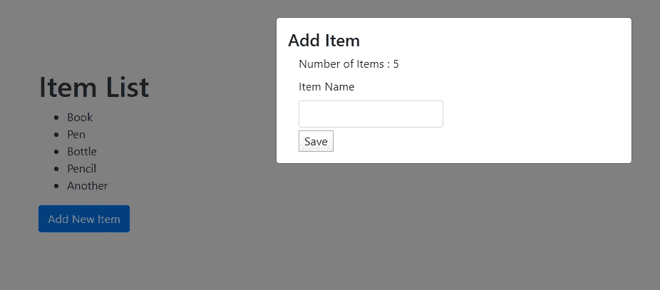
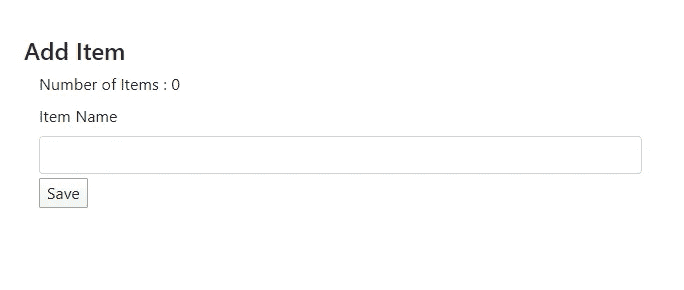
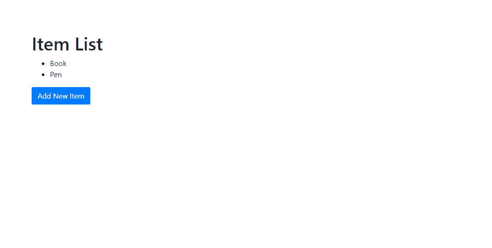

# 如何在 NGX 引导模式和父模式之间传递数据

> 原文：<https://levelup.gitconnected.com/how-to-pass-data-between-ngx-bootstrap-modal-and-parent-e348cd596cf7>

将数据从父模型传递到模型，并从模型获得对父模型的响应，这是我们在开发时经常遇到的情况。这篇文章给出了一个初级的演示，但是在它变得令人厌烦之前，你可以自由地直接跳过主题🤠。

*   如何将数据从父节点传递到模态节点
*   如何将数据从模态传递到父代

在这个例子中，我使用一个*项目列表组件*作为父组件，使用*添加项目表单*作为模态组件😉。



## 启动项目

首先建立一个新的 angular 项目，安装*ngx-bootstrap model*。

`ng add ngx-bootstrap — component modals`

创建一个简单的组件 *ItemList* 来显示添加到数组中的项目列表。
`ng g c itemList`

*item-list.component.html*

*item-list.component.ts*


完成的项目列表

让我们创建另一个组件作为模态。

`ng g c itemAdd`

*的第二个组件添加了一个新项目*，它将在将来用作模态。此外，我写了一个简单的函数叫做`saveToList()`，它也将在未来实现。现在，我已经放了一个简单的控制台日志，只是为了显示输入字段中的值。

*numberOfItems* 将是现有数组中的项目数。

*item-add.component.html*

*项目-添加组件. ts*



已完成添加项目组件

## 添加一个模态

让我们修改代码，当点击*添加新项目*按钮时，打开*添加项目表单*作为模态。

*item-list.component.ts*

不要忘记将 *ItemAddComponent* 添加到 *app.module.ts* 中的 *entryComponents* 列表中

```
providers: [],
entryComponents: [ItemAddComponent],
```

## 将值从父级传递到模态

我们可以简单地使用 initialState 将初始值传递给模态😊

*item-list.component.ts*

要从添加项目模式中读取该值，

初始化 modal 中的列表， *item-add.component.ts*

`list: any[] = [];`

然后 *initialState* 列表可以作为“*list[]”*访问。

我们正在发送一个样本数据“测试”,它可以作为列表[0]从*item-add.component.html*访问

`<label>Number of Items : </label> {{list[0]}}`

想想看，我们想要**将一个对象**从*项列表*中传递到模态中。

*item-list.component.ts*

`<label>Number of Items : </label> {{list[0].value}}`



将值从父级传递到模态

## 将值从模态传递给子级

让我们看看如何从*添加项目表单*向*项目列表*传递一个值。在 *item-add.component.ts* 中声明一个`EventEmitter`

`public event: EventEmitter<any> = new EventEmitter();`

保存项目时发出事件。

```
triggerEvent(item: string) {
    this.event.emit({ data: item , res:200 });
}
```

*项目-添加组件. ts*

在 *item-list.component.ts* 中，我们可以*订阅*到*事件发射器*。

*item-list.component.ts*


在父级和模态之间传递数据

完整代码可以在这里找到。