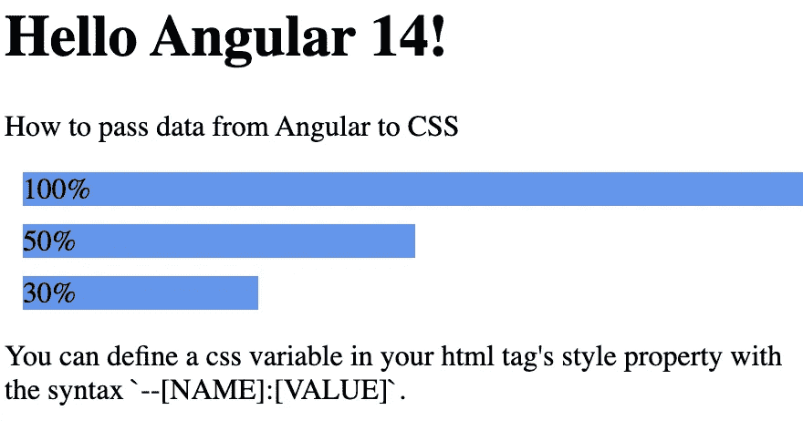
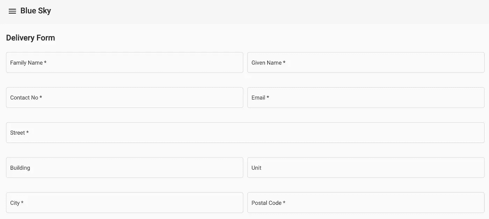

# 如何将数据从 Angular 传递到 CSS

> 原文：<https://levelup.gitconnected.com/how-to-pass-data-from-angular-to-css-7e1143414e85>



我正在创建一个 angular 模板，通过它我可以从一个数据文件自动创建表单，比如 json 或 yaml。为了在监视器屏幕上显示，根据字段的主题，字段应该具有不同的大小。



就像上面的例子一样，与街道字段等其他字段相比，建筑物和单位字段将占用更少的屏幕空间。由于表单是按需生成的，所以字段在高级中是未知的，我的 css 也不知道哪些字段比其他字段需要更少的空间。所以我想在我的数据文件中有字段长度。不是像素，而是屏幕宽度的百分比。为此，我需要将数据从我的 Angular 传递到我的 css，这有点棘手，但我已经找到了一种方法。

css 变量就像普通变量一样，你可以在你的 CSS 文件或者 html 标签的样式属性中定义。定义变量的语法是`--[NAME]:[VALUE]`。因此，要在我的样式属性中定义一个值为 50%的名为`size`的 css 变量，我可以这样做:

```
<div style="--size:50%">hello</div>
```

由于这是在 html 中，我可以使用角度数据绑定来设置值— `--size:{{rect}}`。

下面是一个例子，我在名为`rects`的属性中定义了一个百分比宽度数组。

```
export class AppComponent {
  name = 'Angular ' + VERSION.major;
  rects = ['100%', '50%', '30%'];
}
```

然后，在我的 html 模板中，我用我的`rects`属性的迭代值定义了名为`size`的 css 变量。

```
<div *ngFor="let rect of rects" style="--size:{{ rect }}">
  {{ rect }}
</div>
```

最后，我可以用语法`--var([NAME])`获得 css 变量的值。

在我的例子中，我用变量设置了我的`div`的 width css 属性的值，根据我的角度数据中的值产生不同长度的 div。

```
div {
  background-color: cornflowerblue;
  display: block;
  width: var(--size);
  margin: 10px;
}
```

我的 [Stackblitz](https://stackblitz.com/edit/thecodinganalyst-pass-data-from-angular-to-css) 上有一个工作示例。

# 分级编码

感谢您成为我们社区的一员！在你离开之前:

*   👏为故事鼓掌，跟着作者走👉
*   📰查看[升级编码出版物](https://levelup.gitconnected.com/?utm_source=pub&utm_medium=post)中的更多内容
*   🔔关注我们:[Twitter](https://twitter.com/gitconnected)|[LinkedIn](https://www.linkedin.com/company/gitconnected)|[时事通讯](https://newsletter.levelup.dev)

🚀👉 [**将像你这样的开发人员安置在顶级创业公司和科技公司**](https://jobs.levelup.dev/talent/welcome?referral=true)